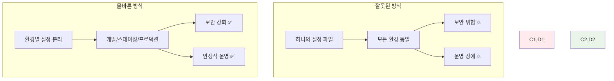
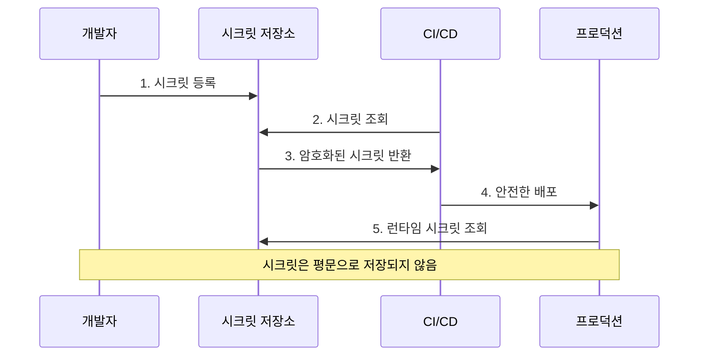

# Week 2 Day 1 Session 2: 환경별 설정 관리와 시크릿

<div align="center">

**🔧 환경 분리** • **🔐 보안 관리**

*개발부터 프로덕션까지 안전하고 효율적인 설정 관리 완전 마스터*

</div>

---

## 🕘 세션 정보

**시간**: 10:00-10:50 (50분)  
**목표**: 환경별 설정 관리와 시크릿 보안 완전 습득  
**방식**: 실무 시나리오 + 보안 패턴 + 실시간 구현

---

## 🎯 세션 목표

### 📚 학습 목표
- **이해 목표**: 환경별 설정 분리와 시크릿 관리 메커니즘 완전 이해
- **적용 목표**: 개발/스테이징/프로덕션 환경의 안전한 설정 관리 구현
- **협업 목표**: 팀 프로젝트에서 보안을 고려한 설정 관리 전략 수립

### 🤔 왜 환경별 설정 관리인가? (5분)

**현실 문제 상황**:
- 💼 **실무 시나리오**: 개발 환경의 설정이 프로덕션에 그대로 노출되는 보안 사고
- 🏠 **일상 비유**: 집 열쇠를 상황별로 다르게 관리하는 것과 같음
- 📊 **시장 동향**: 클라우드 네이티브 환경에서 설정 관리는 보안의 핵심

**환경별 설정의 중요성**:


---

## 📖 핵심 개념 (35분)

### 🔍 개념 1: 환경 변수와 .env 파일 활용 (12분)

> **정의**: 환경별로 다른 설정값을 안전하게 관리하는 메커니즘

**환경 변수 우선순위**:
```bash
# 1. 시스템 환경 변수 (최고 우선순위)
export DATABASE_URL="postgresql://prod-server/db"

# 2. docker-compose.yml의 environment
# 3. .env 파일
# 4. Dockerfile의 ENV (최저 우선순위)
```

**기본 .env 파일 구조**:
```bash
# .env (기본 개발 환경)
NODE_ENV=development
DATABASE_URL=postgresql://localhost:5432/myapp_dev
REDIS_URL=redis://localhost:6379
API_SECRET_KEY=dev-secret-key-not-for-production
LOG_LEVEL=debug
ENABLE_DEBUG=true

# 외부 서비스 설정
STRIPE_PUBLISHABLE_KEY=pk_test_...
STRIPE_SECRET_KEY=sk_test_...
AWS_ACCESS_KEY_ID=AKIA...
AWS_SECRET_ACCESS_KEY=...

# 포트 설정
WEB_PORT=3000
API_PORT=3001
DB_PORT=5432
```

**환경별 .env 파일 분리**:
```bash
# .env.development
NODE_ENV=development
DATABASE_URL=postgresql://dev-db:5432/myapp_dev
API_SECRET_KEY=dev-secret-123
LOG_LEVEL=debug
CORS_ORIGIN=http://localhost:3000

# .env.staging
NODE_ENV=staging
DATABASE_URL=postgresql://staging-db:5432/myapp_staging
API_SECRET_KEY=staging-secret-456
LOG_LEVEL=info
CORS_ORIGIN=https://staging.myapp.com

# .env.production
NODE_ENV=production
DATABASE_URL=postgresql://prod-db:5432/myapp_prod
API_SECRET_KEY=prod-secret-789
LOG_LEVEL=warn
CORS_ORIGIN=https://myapp.com
```

**Compose에서 환경 파일 사용**:
```yaml
# docker-compose.yml
version: '3.8'

services:
  app:
    build: .
    env_file:
      - .env                    # 기본 환경 파일
      - .env.${ENV:-development}  # 환경별 파일
    environment:
      # 직접 환경 변수 설정 (우선순위 높음)
      - NODE_ENV=${NODE_ENV}
      - DATABASE_URL=${DATABASE_URL}
      - API_SECRET_KEY=${API_SECRET_KEY}
    ports:
      - "${WEB_PORT:-3000}:3000"
```

**환경별 실행 방법**:
```bash
# 개발 환경 (기본)
docker-compose up

# 스테이징 환경
ENV=staging docker-compose up

# 프로덕션 환경
ENV=production docker-compose -f docker-compose.yml -f docker-compose.prod.yml up -d
```

### 🔍 개념 2: Docker Compose Override 패턴 (12분)

> **정의**: 환경별로 다른 Compose 설정을 체계적으로 관리하는 패턴

**기본 Compose 파일 (공통 설정)**:
```yaml
# docker-compose.yml
version: '3.8'

services:
  web:
    build: .
    networks:
      - app-network
    volumes:
      - app-data:/app/data
    depends_on:
      - database
      - redis
  
  api:
    build:
      context: ./api
    networks:
      - app-network
      - db-network
    depends_on:
      database:
        condition: service_healthy
  
  database:
    image: postgres:13
    networks:
      - db-network
    volumes:
      - db-data:/var/lib/postgresql/data
    healthcheck:
      test: ["CMD-SHELL", "pg_isready -U ${POSTGRES_USER}"]
      interval: 30s
      timeout: 10s
      retries: 5
  
  redis:
    image: redis:7-alpine
    networks:
      - app-network
    volumes:
      - redis-data:/data

networks:
  app-network:
  db-network:
    internal: true

volumes:
  app-data:
  db-data:
  redis-data:
```

**개발 환경 오버라이드 (자동 적용)**:
```yaml
# docker-compose.override.yml
version: '3.8'

services:
  web:
    build:
      target: development
    ports:
      - "3000:3000"
    volumes:
      - .:/app:cached          # 소스 코드 실시간 반영
      - /app/node_modules      # node_modules 제외
    environment:
      - NODE_ENV=development
      - HOT_RELOAD=true
    command: npm run dev
  
  api:
    ports:
      - "3001:3001"
    volumes:
      - ./api:/app:cached
    environment:
      - NODE_ENV=development
      - DEBUG=api:*
    command: npm run dev
  
  database:
    ports:
      - "5432:5432"            # 개발용 포트 노출
    environment:
      - POSTGRES_DB=myapp_dev
      - POSTGRES_USER=dev_user
      - POSTGRES_PASSWORD=dev_password
  
  redis:
    ports:
      - "6379:6379"            # 개발용 포트 노출
```

**스테이징 환경 설정**:
```yaml
# docker-compose.staging.yml
version: '3.8'

services:
  web:
    build:
      target: production
    environment:
      - NODE_ENV=staging
      - API_URL=https://api-staging.myapp.com
    deploy:
      replicas: 2
    labels:
      - "traefik.enable=true"
      - "traefik.http.routers.web-staging.rule=Host(`staging.myapp.com`)"
  
  api:
    environment:
      - NODE_ENV=staging
      - LOG_LEVEL=info
    deploy:
      replicas: 2
    labels:
      - "traefik.enable=true"
      - "traefik.http.routers.api-staging.rule=Host(`api-staging.myapp.com`)"
  
  database:
    environment:
      - POSTGRES_DB=myapp_staging
      - POSTGRES_USER=staging_user
      - POSTGRES_PASSWORD_FILE=/run/secrets/db_password_staging
    secrets:
      - db_password_staging
    deploy:
      resources:
        limits:
          memory: 1G
        reservations:
          memory: 512M

secrets:
  db_password_staging:
    external: true
```

**프로덕션 환경 설정**:
```yaml
# docker-compose.prod.yml
version: '3.8'

services:
  web:
    build:
      target: production
    restart: unless-stopped
    environment:
      - NODE_ENV=production
      - API_URL=https://api.myapp.com
    deploy:
      replicas: 3
      resources:
        limits:
          cpus: '1.0'
          memory: 1G
        reservations:
          cpus: '0.5'
          memory: 512M
      restart_policy:
        condition: on-failure
        delay: 5s
        max_attempts: 3
    labels:
      - "traefik.enable=true"
      - "traefik.http.routers.web.rule=Host(`myapp.com`)"
      - "traefik.http.routers.web.tls=true"
  
  api:
    restart: unless-stopped
    environment:
      - NODE_ENV=production
      - LOG_LEVEL=warn
    deploy:
      replicas: 3
      resources:
        limits:
          cpus: '2.0'
          memory: 2G
        reservations:
          cpus: '1.0'
          memory: 1G
    secrets:
      - api_secret_key
      - jwt_secret
    labels:
      - "traefik.enable=true"
      - "traefik.http.routers.api.rule=Host(`api.myapp.com`)"
      - "traefik.http.routers.api.tls=true"
  
  database:
    restart: unless-stopped
    environment:
      - POSTGRES_DB=myapp_prod
      - POSTGRES_USER=prod_user
      - POSTGRES_PASSWORD_FILE=/run/secrets/db_password_prod
    secrets:
      - db_password_prod
    deploy:
      resources:
        limits:
          cpus: '2.0'
          memory: 4G
        reservations:
          cpus: '1.0'
          memory: 2G
    volumes:
      - /opt/backups:/backups  # 백업 디렉토리

secrets:
  api_secret_key:
    external: true
  jwt_secret:
    external: true
  db_password_prod:
    external: true
```

### 🔍 개념 3: 시크릿과 설정 파일 보안 관리 (11분)

> **정의**: 민감한 정보를 안전하게 관리하고 전달하는 메커니즘

**시크릿 관리 전략**:
```yaml
# docker-compose.yml
version: '3.8'

services:
  app:
    image: myapp:latest
    secrets:
      - source: app_secret_key
        target: /run/secrets/app_secret
        mode: 0400  # 읽기 전용
      - source: db_password
        target: /run/secrets/db_password
        mode: 0400
    environment:
      # 시크릿 파일 경로 참조
      - SECRET_KEY_FILE=/run/secrets/app_secret
      - DB_PASSWORD_FILE=/run/secrets/db_password
    
  database:
    image: postgres:13
    secrets:
      - db_password
    environment:
      - POSTGRES_PASSWORD_FILE=/run/secrets/db_password

secrets:
  app_secret_key:
    file: ./secrets/app_secret.txt
  db_password:
    external: true  # 외부에서 미리 생성된 시크릿
```

**외부 시크릿 생성 및 관리**:
```bash
# Docker Swarm 모드에서 시크릿 생성
echo "super-secret-password" | docker secret create db_password -

# 파일에서 시크릿 생성
docker secret create app_secret_key ./secrets/app_secret.txt

# 시크릿 목록 확인
docker secret ls

# 시크릿 상세 정보 (내용은 보이지 않음)
docker secret inspect db_password
```

**설정 파일 관리**:
```yaml
# docker-compose.yml
version: '3.8'

services:
  nginx:
    image: nginx:alpine
    configs:
      - source: nginx_config
        target: /etc/nginx/nginx.conf
        mode: 0644
    ports:
      - "80:80"
  
  app:
    image: myapp:latest
    configs:
      - source: app_config
        target: /app/config/app.json
        mode: 0644

configs:
  nginx_config:
    file: ./config/nginx.conf
  app_config:
    external: true  # 외부에서 관리되는 설정
```

**환경별 시크릿 분리**:
```bash
# 개발 환경 시크릿 (로컬 파일)
# secrets/dev/
├── api_secret.txt
├── db_password.txt
└── jwt_secret.txt

# 스테이징 환경 시크릿 (외부 관리)
docker secret create staging_api_secret ./secrets/staging/api_secret.txt
docker secret create staging_db_password ./secrets/staging/db_password.txt

# 프로덕션 환경 시크릿 (외부 시크릿 관리 시스템)
# AWS Secrets Manager, HashiCorp Vault 등 사용
```

**보안 베스트 프랙티스**:
```yaml
services:
  app:
    # 시크릿 파일 권한 설정
    secrets:
      - source: api_key
        target: /run/secrets/api_key
        uid: '1000'
        gid: '1000'
        mode: 0400
    
    # 환경 변수에 직접 시크릿 노출 금지
    environment:
      # ❌ 잘못된 방식
      # - API_KEY=super-secret-key
      
      # ✅ 올바른 방식
      - API_KEY_FILE=/run/secrets/api_key
    
    # 로그에 시크릿 노출 방지
    logging:
      options:
        # 민감한 환경 변수 로그에서 제외
        labels: "logging=true"
        env-regex: "^((?!.*SECRET|.*PASSWORD|.*KEY).)*$"
```

**실무 시크릿 관리 워크플로우**:


---

## 💭 함께 생각해보기 (10분)

### 🤝 페어 토론 (5분)

**토론 주제**:
1. **보안 전략**: "개발팀이 프로덕션 시크릿에 접근하지 않으면서도 효율적으로 개발하려면?"
2. **환경 관리**: "마이크로서비스가 많아질 때 환경별 설정을 어떻게 체계적으로 관리할까요?"
3. **자동화**: "환경별 배포를 자동화하면서도 보안을 유지하는 방법은?"

**페어 활동 가이드**:
- 👥 **보안 시나리오**: 실제 보안 사고 사례를 바탕으로 대응 방안 토론
- 🔄 **설정 관리**: 복잡한 마이크로서비스 환경의 설정 관리 전략 수립
- 📝 **자동화 설계**: CI/CD 파이프라인에서의 안전한 시크릿 관리 방법

### 🎯 전체 공유 (5분)

**인사이트 공유**:
- 페어 토론에서 나온 창의적인 보안 관리 아이디어
- 실무에서 겪을 수 있는 설정 관리 문제와 해결책
- 오후 챌린지에서 적용할 환경별 설정 전략

**💡 이해도 체크 질문**:
- ✅ "환경별 .env 파일과 오버라이드 패턴을 활용할 수 있나요?"
- ✅ "시크릿을 안전하게 관리하고 전달할 수 있나요?"
- ✅ "프로덕션 환경의 보안 요구사항을 이해했나요?"

---

## 🔑 핵심 키워드

### 🆕 새로운 용어
- **Environment Variables**: 환경 변수 - 런타임 설정값 전달
- **Override Pattern**: 오버라이드 패턴 - 환경별 설정 덮어쓰기
- **Secrets Management**: 시크릿 관리 - 민감 정보 보안 관리
- **Configuration as Code**: 설정의 코드화 - 설정을 코드로 관리
- **External Secrets**: 외부 시크릿 - 외부 시스템에서 관리되는 비밀 정보

### 🔤 기술 용어
- **.env Files**: 환경 파일 - 환경 변수 정의 파일
- **Docker Secrets**: Docker 시크릿 - Docker의 내장 시크릿 관리
- **Config Files**: 설정 파일 - 애플리케이션 구성 파일
- **File Permissions**: 파일 권한 - 시크릿 파일 접근 권한
- **Environment Separation**: 환경 분리 - 개발/운영 환경 격리

### 🔤 실무 용어
- **Secrets Rotation**: 시크릿 로테이션 - 주기적 비밀번호 변경
- **Least Privilege**: 최소 권한 원칙 - 필요한 최소한의 권한만 부여
- **Zero Trust**: 제로 트러스트 - 모든 접근을 검증하는 보안 모델
- **Vault Integration**: 볼트 통합 - 전문 시크릿 관리 도구 연계
- **Compliance**: 컴플라이언스 - 보안 규정 준수

---

## 📝 세션 마무리

### ✅ 오늘 세션 성과
- [ ] 환경별 설정 분리와 .env 파일 활용법 완전 습득 ✅
- [ ] Docker Compose 오버라이드 패턴 마스터 ✅
- [ ] 시크릿과 설정 파일의 보안 관리 방법 이해 ✅
- [ ] 프로덕션 환경의 보안 요구사항 파악 ✅

### 🎯 다음 세션 준비
- **주제**: 서비스 의존성과 헬스체크 - 안정성 확보
- **연결**: 환경별 설정을 바탕으로 한 안정적인 서비스 운영
- **준비**: 서비스 간 의존성과 장애 상황에 대해 생각해보기

### 🔮 오후 챌린지 미리보기
**E-Commerce 플랫폼 Compose 구축**에서 활용할 내용:
- 개발/스테이징/프로덕션 환경별 설정 완전 분리
- 데이터베이스 비밀번호, API 키 등 시크릿 안전 관리
- 환경별 오버라이드 패턴을 활용한 체계적 구성

---

<div align="center">

**🔧 환경별 설정 관리를 완전히 마스터했습니다!**

*개발부터 프로덕션까지 안전하고 체계적인 설정 관리 완성*

**이전**: [Session 1 - 고급 Compose 패턴과 베스트 프랙티스](./session_1.md) | **다음**: [Session 3 - 서비스 의존성과 헬스체크](./session_3.md)

</div>