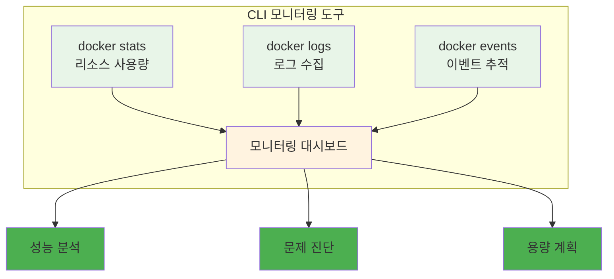

# Week 2 Day 1 Session 3: CLI 기반 모니터링과 로깅

<div align="center">

**📊 모니터링** • **📝 로깅**

*CLI 도구를 활용한 컨테이너 모니터링과 로그 분석*

</div>

---

## 🕘 세션 정보

**시간**: 11:00-11:50 (50분)  
**목표**: CLI 도구를 활용한 컨테이너 모니터링과 로그 분석 방법 이해  
**방식**: CLI 도구 실습 + 모니터링 전략 + 로그 분석

---

## 🎯 세션 목표

### 📚 학습 목표
- **이해 목표**: CLI 도구를 활용한 컨테이너 모니터링과 로그 분석 방법 이해
- **적용 목표**: 실시간 모니터링과 문제 진단 능력 습득
- **협업 목표**: 팀원들과 모니터링 전략 수립 및 장애 대응 방안 토론

---

## 📖 핵심 개념 (35분)

### 🔍 개념 1: Docker 모니터링 명령어 (12분)

> **정의**: Docker CLI를 활용한 컨테이너 상태 모니터링과 리소스 사용량 추적

**핵심 모니터링 명령어**:
```bash
# 컨테이너 상태 확인
docker ps -a
docker stats --no-stream

# 리소스 사용량 실시간 모니터링
docker stats

# 컨테이너 상세 정보
docker inspect <container-name>

# 프로세스 확인
docker top <container-name>

# 포트 매핑 확인
docker port <container-name>
```

**모니터링 대시보드 구성**:


### 🔍 개념 2: 로그 관리와 분석 (12분)

> **정의**: 컨테이너 로그를 효과적으로 수집, 저장, 분석하는 방법

**로그 수집 전략**:
```bash
# 로그 확인
docker logs <container-name>
docker logs -f --tail 100 <container-name>

# 로그 드라이버 설정
docker run --log-driver=json-file --log-opt max-size=10m myapp

# 로그 로테이션
docker run --log-opt max-size=10m --log-opt max-file=3 myapp
```

### 🔍 개념 3: 시스템 모니터링 도구 (11분)

> **정의**: 컨테이너 호스트 시스템의 전반적인 상태를 모니터링하는 도구들

**시스템 모니터링 도구**:
```bash
# 시스템 리소스 모니터링
htop
iotop
nethogs

# Docker 시스템 정보
docker system df
docker system events
docker system prune

# 네트워크 모니터링
docker network ls
docker network inspect bridge
```

**모니터링 스크립트 예시**:
```bash
#!/bin/bash
# container-monitor.sh

echo "=== Container Resource Usage ==="
docker stats --no-stream --format "table {{.Container}}\t{{.CPUPerc}}\t{{.MemUsage}}\t{{.NetIO}}"

echo -e "\n=== Disk Usage ==="
docker system df

echo -e "\n=== Container Health ==="
docker ps --format "table {{.Names}}\t{{.Status}}\t{{.Ports}}"

echo -e "\n=== Recent Events ==="
docker events --since 1h --until now
```

---

## 💭 함께 생각해보기 (15분)

### 🤝 페어 토론 (10분)

**토론 주제**:
1. **모니터링 경험**: "시스템이나 애플리케이션을 모니터링해본 경험이 있나요?"
2. **문제 진단**: "성능 문제나 장애가 발생했을 때 어떻게 원인을 찾나요?"
3. **알림 전략**: "어떤 상황에서 알림을 받고 싶으신가요?"

### 🎯 전체 공유 (5분)

- **모니터링 전략**: 효과적인 컨테이너 모니터링 방안
- **문제 해결**: 일반적인 문제 상황과 해결 방법

---

## 🔑 핵심 키워드

- **Docker Stats**: 컨테이너 리소스 사용량 모니터링
- **Log Driver**: 로그 드라이버 설정
- **Log Rotation**: 로그 로테이션
- **System Events**: 시스템 이벤트 추적
- **Health Check**: 헬스 체크

---

## 📝 세션 마무리

### ✅ 오늘 세션 성과
- [ ] CLI 모니터링 도구 활용법 습득
- [ ] 로그 관리 전략 이해
- [ ] 시스템 모니터링 방법 학습

### 🎯 실습 챌린지 준비
- **주제**: 보안-최적화-모니터링 통합 실습
- **연결**: 오늘 배운 모든 내용의 종합 적용

---

<div align="center">

**📊 CLI 기반 모니터링을 완전히 마스터했습니다!**

**다음**: [실습 챌린지 - 보안-최적화-모니터링 통합](../README.md#실습-챌린지)

</div>