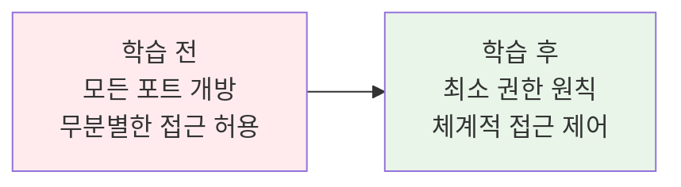
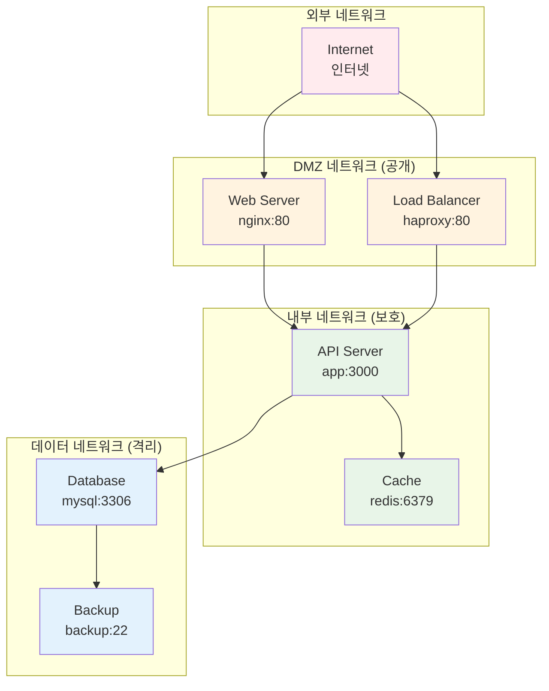
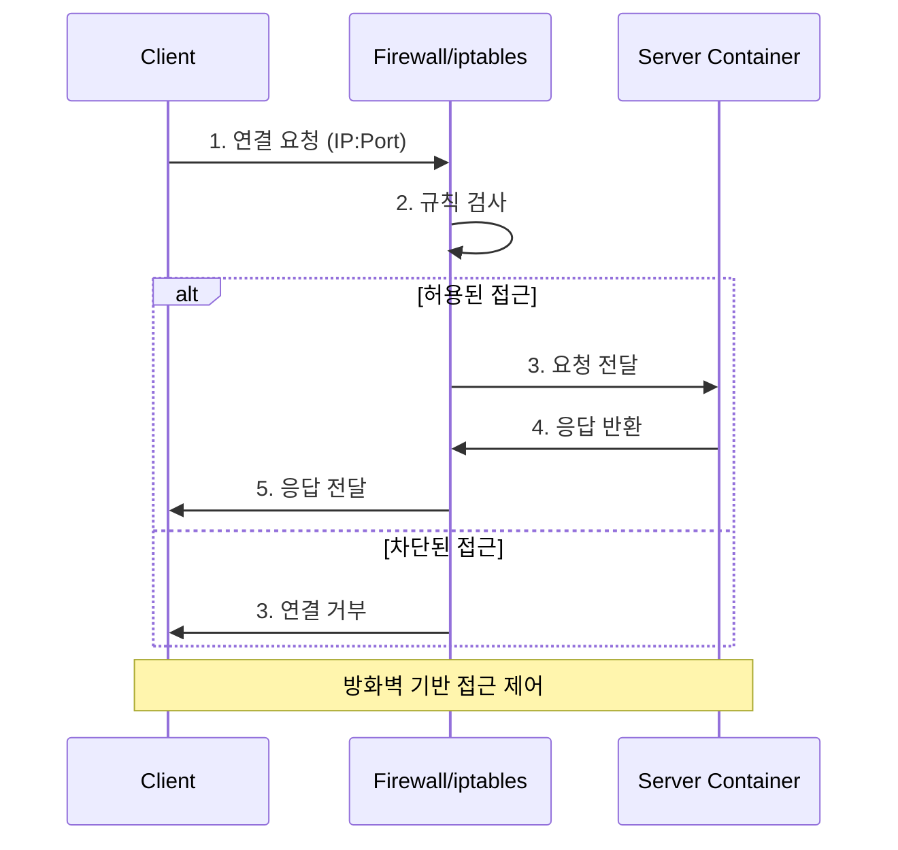
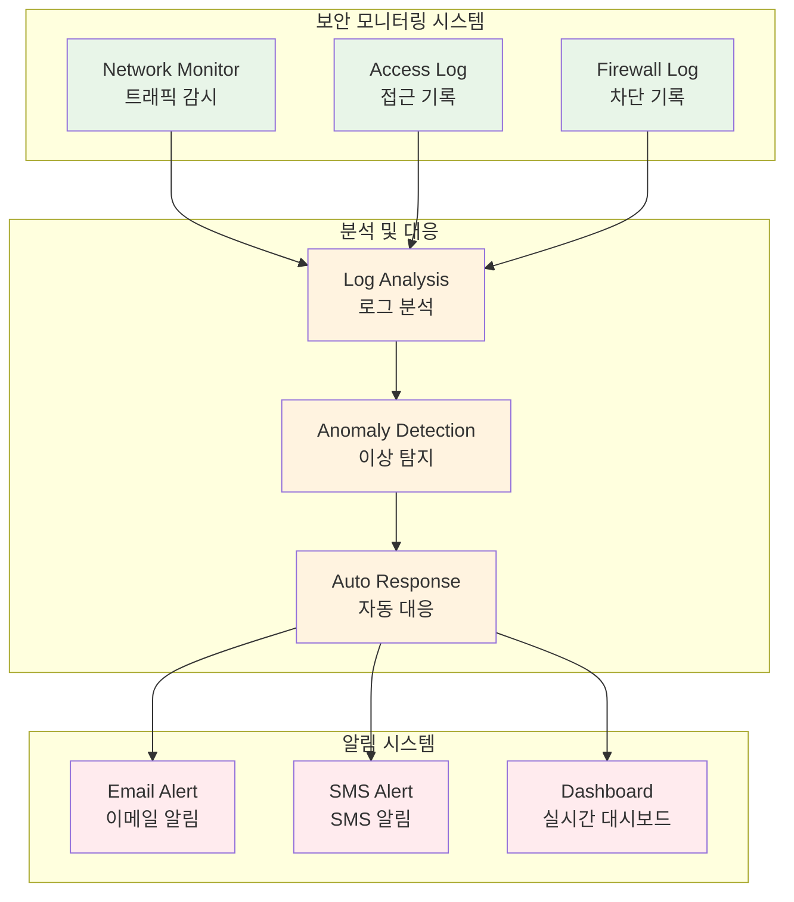
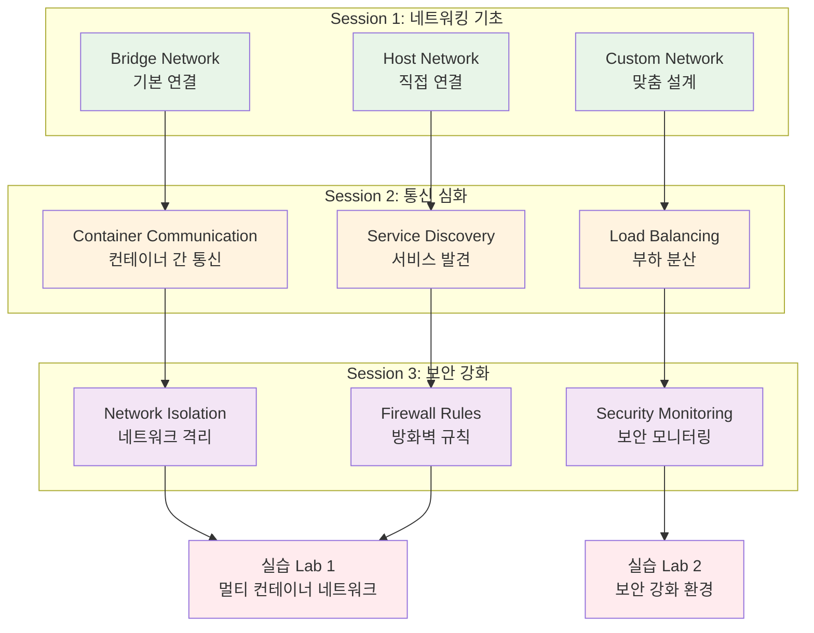

# Week 2 Day 1 Session 3: 네트워크 보안 & 방화벽 설정

<div align="center">

**🛡️ 네트워크 보안** • **🚪 접근 제어** • **🔒 방화벽 설정**

*보안 강화된 컨테이너 네트워크 환경 구축*

</div>

---

## 🕘 세션 정보

**시간**: 11:00-11:50 (50분)  
**목표**: 보안 강화된 컨테이너 네트워크 환경 구축  
**방식**: 보안 개념 + 실제 위협 사례 + 방어 실습

---

## 🎯 학습 목표

### 📚 학습 목표 (명확하고 측정 가능한 목표)
- **이해 목표**: 컨테이너 네트워크 보안 위협과 방어 메커니즘 완전 이해
- **적용 목표**: 방화벽 규칙과 네트워크 분리를 실제 구현할 수 있는 능력
- **협업 목표**: 보안 정책을 팀과 함께 설계하고 적용할 수 있는 역량

### 🤔 왜 필요한가? (5분 - 동기부여 및 맥락 제공)

**현실 문제 상황**:
- 💼 **실무 시나리오**: "해커가 웹 서버를 통해 데이터베이스에 무단 접근했어요!"
- 🏠 **일상 비유**: 집에 현관문, 방문, 금고까지 여러 단계의 보안 장치가 있는 것처럼, 컨테이너도 다층 보안이 필요합니다
- 📊 **시장 동향**: 컨테이너 보안 사고가 매년 30% 증가, 네트워크 보안은 필수

**학습 전후 비교**:


---

## 📖 핵심 개념 (35분 - 체계적 지식 구축)

### 🔍 개념 1: 네트워크 분리와 격리 전략 (12분)

> **정의**: 서로 다른 보안 수준의 서비스를 별도 네트워크로 분리하여 보안 위험을 최소화하는 전략

**상세 설명**:
- **핵심 원리**: 네트워크 세그멘테이션을 통한 공격 범위 제한
- **주요 특징**: 
  - DMZ(비무장지대) 개념 적용
  - 프론트엔드, 백엔드, 데이터베이스 계층 분리
  - 최소 권한 원칙 (Principle of Least Privilege)
- **사용 목적**: 보안 침해 시 피해 범위 최소화

**네트워크 분리 아키텍처**:


**실생활 비유**: 
은행에서 고객 상담 공간, 직원 업무 공간, 금고실을 분리하는 것처럼, 컨테이너도 보안 수준에 따라 네트워크를 분리합니다.

**네트워크 분리 실습**:
```bash
# 보안 수준별 네트워크 생성
docker network create --driver bridge \
  --subnet=10.1.0.0/24 \
  dmz-network

docker network create --driver bridge \
  --subnet=10.2.0.0/24 \
  --internal \
  backend-network

docker network create --driver bridge \
  --subnet=10.3.0.0/24 \
  --internal \
  database-network

# 각 계층별 컨테이너 배치
docker run -d --name web-server \
  --network dmz-network \
  -p 80:80 nginx

docker run -d --name api-server \
  --network backend-network \
  node:alpine

docker run -d --name database \
  --network database-network \
  mysql:8.0

# 네트워크 간 연결 (필요한 경우만)
docker network connect backend-network web-server
docker network connect database-network api-server
```

### 🔍 개념 2: 방화벽 규칙과 포트 제한 (12분)

> **정의**: iptables와 Docker의 방화벽 기능을 활용하여 불필요한 네트워크 접근을 차단하는 보안 메커니즘

**단계별 이해**:
1. **1단계 (기본)**: Docker의 기본 방화벽 규칙 이해
2. **2단계 (중급)**: 커스텀 iptables 규칙 적용
3. **3단계 (고급)**: 애플리케이션 레벨 방화벽 구현

**실무 연결**:
- **사용 사례**: 
  - 데이터베이스 포트를 특정 서버에서만 접근 허용
  - 관리 포트(SSH, 모니터링)를 내부 네트워크에서만 접근
  - 외부 API 호출을 화이트리스트 기반으로 제한
- **장단점**: 
  - ✅ 장점: 강력한 접근 제어, 세밀한 규칙 설정
  - ❌ 단점: 설정 복잡성, 성능 오버헤드
- **대안 기술**: 클라우드 보안 그룹, 네트워크 ACL, 서비스 메시

**방화벽 규칙 구조**:


**실제 방화벽 설정**:
```bash
# Docker 컨테이너 방화벽 설정
# 1. 기본 정책: 모든 접근 차단
docker run -d --name secure-db \
  --network database-network \
  mysql:8.0

# 2. 특정 IP에서만 접근 허용
iptables -A DOCKER-USER -s 10.2.0.0/24 -d 10.3.0.2 -p tcp --dport 3306 -j ACCEPT
iptables -A DOCKER-USER -d 10.3.0.2 -p tcp --dport 3306 -j DROP

# 3. 포트 스캔 방지
iptables -A DOCKER-USER -p tcp --tcp-flags ALL NONE -j DROP
iptables -A DOCKER-USER -p tcp --tcp-flags SYN,FIN SYN,FIN -j DROP

# 4. DDoS 방지 (연결 수 제한)
iptables -A DOCKER-USER -p tcp --dport 80 -m connlimit --connlimit-above 20 -j DROP

# 5. 규칙 확인
iptables -L DOCKER-USER -n -v
```

### 🔍 개념 3: 보안 모니터링과 로그 관리 (11분)

> **정의**: 네트워크 트래픽과 접근 시도를 실시간으로 모니터링하고 로그를 분석하여 보안 위협을 조기 발견하는 시스템

**개념 간 관계**:


**보안 모니터링 도구**:
- **네트워크 모니터링**: tcpdump, Wireshark, ntopng
- **로그 수집**: Fluentd, Logstash, Filebeat
- **이상 탐지**: Fail2ban, OSSEC, Suricata
- **시각화**: Grafana, Kibana, Splunk

**종합 비교표**:
| 구분 | 네트워크 분리 | 방화벽 규칙 | 보안 모니터링 |
|------|---------------|-------------|---------------|
| **목적** | 공격 범위 제한 | 접근 차단 | 위협 탐지 |
| **특징** | 물리적 격리 | 규칙 기반 차단 | 실시간 감시 |
| **사용 시기** | 아키텍처 설계 | 서비스 배포 | 운영 단계 |
| **장점** | 근본적 보안 | 세밀한 제어 | 조기 발견 |
| **주의사항** | 복잡성 증가 | 성능 영향 | 오탐 관리 |

**실제 보안 모니터링 구현**:
```bash
# 1. 네트워크 트래픽 모니터링
docker run -d --name network-monitor \
  --network host \
  --cap-add NET_ADMIN \
  -v /var/log:/var/log \
  nicolaka/netshoot tcpdump -i any -w /var/log/network.pcap

# 2. 접근 로그 수집 (nginx 예시)
docker run -d --name web-server \
  --network dmz-network \
  -v /var/log/nginx:/var/log/nginx \
  -p 80:80 nginx

# 3. 실시간 로그 분석
docker run -d --name log-analyzer \
  --network backend-network \
  -v /var/log:/var/log \
  elastic/filebeat:7.15.0

# 4. 이상 접근 탐지 스크립트
cat > security_monitor.sh << 'EOF'
#!/bin/bash
# 비정상적인 접근 패턴 탐지
tail -f /var/log/nginx/access.log | while read line; do
    # 1분에 100회 이상 접근 시 차단
    ip=$(echo $line | awk '{print $1}')
    count=$(grep $ip /var/log/nginx/access.log | grep $(date +"%d/%b/%Y:%H:%M") | wc -l)
    
    if [ $count -gt 100 ]; then
        echo "Blocking suspicious IP: $ip"
        iptables -A DOCKER-USER -s $ip -j DROP
        echo "$(date): Blocked $ip for excessive requests" >> /var/log/security.log
    fi
done
EOF

chmod +x security_monitor.sh
./security_monitor.sh &
```

**🔑 핵심 키워드 정리**:
- **Network Segmentation (네트워크 세그멘테이션)**: 네트워크 분할 - 보안 수준별 네트워크 분리
- **DMZ (Demilitarized Zone)**: 비무장지대 - 내외부 네트워크 사이의 완충 구역
- **Firewall Rules (방화벽 규칙)**: 접근 제어 규칙 - 트래픽 허용/차단 정책
- **Intrusion Detection (침입 탐지)**: 보안 위협 탐지 - 비정상 접근 패턴 발견
- **Log Analysis (로그 분석)**: 기록 분석 - 보안 이벤트 패턴 분석

---

## 🔗 전체 연결 및 정리 (15분 - 학습 통합)

### 📚 3개 세션 통합 맵


### 🎯 실습 챌린지 준비
- **Lab 1 연결**: 네트워킹 기초 + 통신 설정 → 3-tier 아키텍처 구현
- **Lab 2 연결**: 보안 강화 + 모니터링 → 프로덕션급 보안 환경 구축

### 📋 학습 점검 체크리스트
- [ ] **기본 개념 이해**: Bridge, Host, Custom 네트워크와 통신 방법을 설명할 수 있다
- [ ] **실무 연계 파악**: 언제 어떤 보안 설정을 적용해야 하는지 안다
- [ ] **문제 해결 준비**: 네트워크 보안 문제 상황에 대응할 수 있다
- [ ] **실습 준비 완료**: 오후 실습에 필요한 모든 지식을 갖췄다

### 🔮 다음 학습 예고
- **내일 연결**: 네트워킹 보안 → 데이터 보안 (스토리지 & 백업)
- **주간 목표**: Docker 심화 기술 완성 → Kubernetes 준비
- **장기 비전**: 클라우드 네이티브 아키텍처의 네트워크 보안 전문가

---

## 💭 함께 생각해보기 (10분 - 상호작용 및 이해도 확인)

### 🤝 페어 토론 (5분)

**토론 주제**:
1. **개념 적용**: "우리 프로젝트에서 어떤 보안 위협이 있고, 어떻게 방어하시겠어요?"
2. **문제 해결**: "해킹 시도가 발견되었을 때 어떤 순서로 대응하시겠어요?"
3. **경험 공유**: "보안 사고나 네트워크 보안 관련 경험이 있다면 공유해주세요"

**페어 활동 가이드**:
- 👥 **자유 페어링**: 관심사나 이해도가 비슷한 사람끼리
- 🔄 **역할 교대**: 5분씩 설명자/질문자 역할 바꾸기
- 📝 **핵심 정리**: 대화 내용 중 중요한 점 메모하기

### 🎯 전체 공유 (5분)

- **인사이트 공유**: 페어 토론에서 나온 좋은 아이디어
- **질문 수집**: 아직 이해가 어려운 부분
- **다음 연결**: 오후 실습 "보안 강화된 네트워크 환경 구축"과의 연결고리 확인

**💡 이해도 체크 질문**:
- ✅ "네트워크 분리가 왜 중요한지 설명할 수 있나요?"
- ✅ "방화벽 규칙을 어떻게 설정해야 하는지 아시나요?"
- ✅ "보안 모니터링에서 어떤 것들을 확인해야 하는지 아시나요?"

---

## 🔑 핵심 키워드

- **Network Segmentation (네트워크 세그멘테이션)**: 보안 수준별 네트워크 분리
- **DMZ (Demilitarized Zone)**: 내외부 네트워크 사이의 완충 구역
- **Firewall Rules (방화벽 규칙)**: 트래픽 허용/차단 정책
- **iptables**: Linux 방화벽 관리 도구
- **Security Monitoring (보안 모니터링)**: 실시간 보안 위협 탐지

---

## 📝 세션 마무리

### ✅ 오늘 세션 성과
- [ ] 네트워크 분리와 격리 전략 완전 이해
- [ ] 방화벽 규칙과 포트 제한 설정 방법 습득
- [ ] 보안 모니터링과 로그 관리 개념 파악

### 🎯 다음 세션 준비
- **주제**: Lab 1 - 멀티 컨테이너 네트워크 구성
- **연결**: 오늘 배운 모든 네트워킹 지식을 실제로 구현

---

<div align="center">

**🛡️ 네트워크 보안의 모든 것을 마스터했습니다!**

**다음**: [Lab 1 - 멀티 컨테이너 네트워크 구성](./lab_1.md)

</div>