# Week 2 Day 1 Session 3: CLI 기반 모니터링과 로깅

<div align="center">

**📊 모니터링** • **📝 로깅**

*CLI 도구를 활용한 컨테이너 모니터링과 로그 분석*

</div>

---

## 🕘 세션 정보

**시간**: 11:00-11:50 (50분)  
**목표**: CLI 도구를 활용한 컨테이너 모니터링과 로그 분석 방법 이해  
**방식**: CLI 도구 실습 + 모니터링 전략 + 로그 분석

---

## 🎯 세션 목표

### 📚 학습 목표
- **이해 목표**: CLI 도구를 활용한 컨테이너 모니터링과 로그 분석 방법 이해
- **적용 목표**: 실시간 모니터링과 문제 진단 능력 습득
- **협업 목표**: 개별 학습 후 경험 공유 및 질의응답

---

## 📖 핵심 개념 (35분)

### 🔍 개념 1: Docker 모니터링 명령어 (12분)

> **정의**: Docker CLI를 활용한 컨테이너 상태 모니터링과 리소스 사용량 추적

**핵심 모니터링 명령어**:
```bash
# 컨테이너 상태 확인
docker ps -a
docker stats --no-stream

# 리소스 사용량 실시간 모니터링
docker stats

# 컨테이너 상세 정보
docker inspect <container-name>

# 프로세스 확인
docker top <container-name>

# 포트 매핑 확인
docker port <container-name>
```

**모니터링 대시보드 구성**:

```mermaid
graph TB
    subgraph "CLI 모니터링 도구"
        A[docker stats<br/>리소스 사용량] --> D[모니터링 대시보드]
        B[docker logs<br/>로그 수집] --> D
        C[docker events<br/>이벤트 추적] --> D
    end
    
    D --> E[성능 분석]
    D --> F[문제 진단]
    D --> G[용량 계획]
    
    style A fill:#e8f5e8
    style B fill:#e8f5e8
    style C fill:#e8f5e8
    style D fill:#fff3e0
    style E fill:#4caf50
    style F fill:#4caf50
    style G fill:#4caf50
```


### 🔍 개념 2: 로그 관리와 분석 (12분)

> **정의**: 컨테이너 로그를 효과적으로 수집, 저장, 분석하는 방법

**로그 수집 전략**:
```bash
# 로그 확인
docker logs <container-name>
docker logs -f --tail 100 <container-name>

# 로그 드라이버 설정
docker run --log-driver=json-file --log-opt max-size=10m myapp

# 로그 로테이션
docker run --log-opt max-size=10m --log-opt max-file=3 myapp
```

### 🔍 개념 3: 시스템 모니터링 도구 (11분)

> **정의**: 컨테이너 호스트 시스템의 전반적인 상태를 모니터링하는 도구들

**시스템 모니터링 도구**:
```bash
# 시스템 리소스 모니터링
htop
iotop
nethogs

# Docker 시스템 정보
docker system df
docker system events
docker system prune

# 네트워크 모니터링
docker network ls
docker network inspect bridge
```

**모니터링 스크립트 예시**:
```bash
#!/bin/bash
# container-monitor.sh

echo "=== Container Resource Usage ==="
docker stats --no-stream --format "table {{.Container}}\t{{.CPUPerc}}\t{{.MemUsage}}\t{{.NetIO}}"

echo -e "\n=== Disk Usage ==="
docker system df

echo -e "\n=== Container Health ==="
docker ps --format "table {{.Names}}\t{{.Status}}\t{{.Ports}}"

echo -e "\n=== Recent Events ==="
docker events --since 1h --until now
```

**고급 모니터링 기법**:

**1. 실시간 대시보드**:
```bash
#!/bin/bash
# real-time-dashboard.sh

while true; do
    clear
    echo "=================== Docker Monitoring Dashboard ==================="
    echo "Time: $(date)"
    echo
    
    echo "=== Top 5 CPU Consumers ==="
    docker stats --no-stream --format "table {{.Container}}\t{{.CPUPerc}}" | \
        sort -k2 -nr | head -6
    echo
    
    echo "=== Top 5 Memory Consumers ==="
    docker stats --no-stream --format "table {{.Container}}\t{{.MemUsage}}\t{{.MemPerc}}" | \
        sort -k3 -nr | head -6
    echo
    
    echo "=== Container Status ==="
    docker ps --format "table {{.Names}}\t{{.Status}}\t{{.RunningFor}}" | head -10
    echo
    
    echo "=== System Resources ==="
    echo "Load: $(uptime | awk -F'load average:' '{print $2}')"
    echo "Disk: $(df -h / | awk 'NR==2{print $5" used"}')"
    echo "Memory: $(free -h | awk 'NR==2{print $3"/"$2}')"
    
    sleep 5
done
```

**2. 로그 분석 도구**:
```bash
# 로그 수집 및 분석
#!/bin/bash
# log-analyzer.sh

CONTAINER_NAME=$1
LOG_FILE="/tmp/${CONTAINER_NAME}_analysis.log"

if [ -z "$CONTAINER_NAME" ]; then
    echo "Usage: $0 <container_name>"
    exit 1
fi

echo "Analyzing logs for container: $CONTAINER_NAME"
echo "Results will be saved to: $LOG_FILE"

# 로그 수집
docker logs --since 1h $CONTAINER_NAME > $LOG_FILE 2>&1

# 에러 분석
echo "=== Error Analysis ===" >> $LOG_FILE
grep -i "error\|exception\|fail" $LOG_FILE | wc -l >> $LOG_FILE
echo "Error patterns:" >> $LOG_FILE
grep -i "error\|exception\|fail" $LOG_FILE | sort | uniq -c | sort -nr >> $LOG_FILE

# 성능 지표 추출
echo "=== Performance Metrics ===" >> $LOG_FILE
grep -i "response time\|latency\|duration" $LOG_FILE | \
    awk '{print $NF}' | sort -n | \
    awk 'BEGIN{sum=0; count=0} {sum+=$1; count++} END{if(count>0) print "Average:", sum/count}' >> $LOG_FILE

echo "Analysis complete. Check $LOG_FILE for results."
```

**3. 알림 시스템**:
```bash
#!/bin/bash
# alert-system.sh

# 임계값 설정
CPU_THRESHOLD=80
MEMORY_THRESHOLD=85
DISK_THRESHOLD=90

# Slack 웹훅 URL (예시)
SLACK_WEBHOOK="https://hooks.slack.com/services/YOUR/WEBHOOK/URL"

function send_alert() {
    local message="$1"
    local severity="$2"
    
    # 로그 기록
    echo "$(date): [$severity] $message" >> /var/log/docker-alerts.log
    
    # Slack 알림 (옵션)
    if [ ! -z "$SLACK_WEBHOOK" ]; then
        curl -X POST -H 'Content-type: application/json' \
            --data "{\"text\":\"[$severity] Docker Alert: $message\"}" \
            $SLACK_WEBHOOK
    fi
    
    # 이메일 알림 (옵션)
    echo "$message" | mail -s "Docker Alert: $severity" admin@company.com
}

# CPU 사용률 체크
for container in $(docker ps --format "{{.Names}}"); do
    cpu_usage=$(docker stats --no-stream --format "{{.CPUPerc}}" $container | sed 's/%//')
    if (( $(echo "$cpu_usage > $CPU_THRESHOLD" | bc -l) )); then
        send_alert "Container $container CPU usage: ${cpu_usage}%" "WARNING"
    fi
done

# 메모리 사용률 체크
for container in $(docker ps --format "{{.Names}}"); do
    mem_usage=$(docker stats --no-stream --format "{{.MemPerc}}" $container | sed 's/%//')
    if (( $(echo "$mem_usage > $MEMORY_THRESHOLD" | bc -l) )); then
        send_alert "Container $container Memory usage: ${mem_usage}%" "WARNING"
    fi
done

# 디스크 사용률 체크
disk_usage=$(df / | awk 'NR==2{print $5}' | sed 's/%//')
if [ $disk_usage -gt $DISK_THRESHOLD ]; then
    send_alert "Disk usage: ${disk_usage}%" "CRITICAL"
fi
```

---

## 💭 함께 생각해보기 (15분)

### 🤝 페어 토론 (10분)

**토론 주제**:
1. **모니터링 경험**: "시스템이나 애플리케이션을 모니터링해본 경험이 있나요?"
2. **문제 진단**: "성능 문제나 장애가 발생했을 때 어떻게 원인을 찾나요?"
3. **알림 전략**: "어떤 상황에서 알림을 받고 싶으신가요?"

### 🎯 전체 공유 (5분)

- **모니터링 전략**: 효과적인 컨테이너 모니터링 방안
- **문제 해결**: 일반적인 문제 상황과 해결 방법

---

## 🔑 핵심 키워드

- **Docker Stats**: 컨테이너 리소스 사용량 모니터링
- **Log Driver**: 로그 드라이버 설정
- **Log Rotation**: 로그 로테이션
- **System Events**: 시스템 이벤트 추적
- **Health Check**: 헬스 체크

---

## 📝 세션 마무리

### ✅ 오늘 세션 성과
- [ ] CLI 모니터링 도구 활용법 습득
- [ ] 로그 관리 전략 이해
- [ ] 시스템 모니터링 방법 학습

### 🎯 실습 챌린지 준비
- **주제**: 보안-최적화-모니터링 통합 실습
- **연결**: 오늘 배운 모든 내용의 종합 적용

---

<div align="center">

**📊 CLI 기반 모니터링을 완전히 마스터했습니다!**

**다음**: [실습 챌린지 - 보안-최적화-모니터링 통합](../README.md#실습-챌린지)

</div>