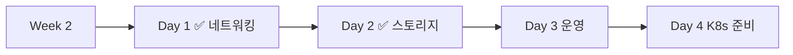

# Week 2 Day 2: Docker 스토리지 & 데이터 관리

<div align="center">

**💾 Volume 완전 이해** • **📊 데이터 영속성** • **🛡️ 백업 전략**

*데이터 영속성과 관리 전략 완전 습득*

</div>

---

## 🕘 일일 스케줄

### 📊 시간 배분
```
📚 이론 강의: 2.5시간 (50분×3세션) - 스토리지 중심 학습
🛠️ 실습 세션: 2.5시간 (50분×2세션) - 데이터 관리 및 백업
👥 학생 케어: 개별 맞춤 지원 (필요시)
```

### 🗓️ 상세 스케줄
| 시간 | 구분 | 내용 | 목적 |
|------|------|------|------|
| **09:00-09:50** | 📚 이론 1 | Volume, Bind Mount, tmpfs 완전 이해 (50분) | 스토리지 유형별 특징과 활용법 |
| **09:50-10:00** | ☕ 휴식 | 10분 휴식 | |
| **10:00-10:50** | 📚 이론 2 | 데이터 영속성 & 백업 전략 (50분) | 데이터 생명주기 관리와 복구 전략 |
| **10:50-11:00** | ☕ 휴식 | 10분 휴식 | |
| **11:00-11:50** | 📚 이론 3 | 데이터베이스 컨테이너 운영 실무 (50분) | Stateful 애플리케이션 운영 노하우 |
| **11:50-12:00** | ☕ 휴식 | 10분 휴식 | |
| **12:00-12:50** | 🛠️ 실습 1 | Stateful 애플리케이션 구축 (50분) | 데이터베이스와 웹 애플리케이션 통합 |
| **12:50-13:00** | ☕ 휴식 | 10분 휴식 | |
| **13:00-14:00** | 🍽️ 점심 | 점심시간 (60분) | |
| **14:00-14:50** | 🛠️ 실습 2 | 데이터 백업 및 복구 시스템 (50분) | 자동화된 백업과 재해 복구 시스템 |

---

## 📚 이론 강의 (2.5시간 - 50분×3세션)

### 🎯 이론 세션 구성 원칙
- **Session 1**: 스토리지 기초부터 고급 활용까지 (기초 다지기)
- **Session 2**: 데이터 생명주기와 백업 전략 (응용 확장)
- **Session 3**: 데이터베이스 컨테이너 실무 운영 (실무 연계)
- **연결성**: 스토리지 → 영속성 → 실무 운영의 논리적 흐름

### Session 1: [Volume, Bind Mount, tmpfs 완전 이해](./session_1.md)
**시간**: 09:00-09:50 (50분)  
**목표**: Docker 스토리지의 모든 유형과 활용 시나리오 완전 마스터

**핵심 내용**:
- Volume의 동작 원리와 라이프사이클 관리
- Bind Mount의 특징과 개발 환경 활용법
- tmpfs의 성능 장점과 사용 사례
- 스토리지 드라이버별 성능 비교와 선택 기준

### Session 2: [데이터 영속성 & 백업 전략](./session_2.md)
**시간**: 10:00-10:50 (50분)  
**목표**: 데이터 생명주기 관리와 안전한 백업 전략 수립

**핵심 내용**:
- 데이터 영속성 전략과 설계 원칙
- 자동화된 백업 시스템 구축
- 재해 복구(Disaster Recovery) 계획
- 데이터 암호화와 보안 고려사항

### Session 3: [데이터베이스 컨테이너 운영 실무](./session_3.md)
**시간**: 11:00-11:50 (50분)  
**목표**: Stateful 애플리케이션의 컨테이너 운영 노하우 습득

**핵심 내용**:
- MySQL, PostgreSQL, MongoDB 컨테이너 운영
- 데이터베이스 클러스터링과 레플리케이션
- 성능 모니터링과 튜닝
- 데이터 마이그레이션과 업그레이드 전략

---

## 🛠️ 실습 세션 (2.5시간)

### 🎯 실습 세션 구성
- **Lab 1**: Stateful 애플리케이션 구축 (50분)
- **Lab 2**: 데이터 백업 및 복구 시스템 (50분)
- **즉시 적용**: 오전 학습 내용을 바로 실습으로 연결
- **단계적 심화**: 기본 스토리지 → 고급 데이터 관리 순서로 진행

### 🛠️ Lab 1: [Stateful 애플리케이션 구축](./lab_1.md)
**시간**: 12:00-12:50 (50분)  
**목표**: 데이터베이스와 웹 애플리케이션이 통합된 완전한 시스템 구축

**실습 내용**:
- WordPress + MySQL 스택 구축
- 데이터 영속성 보장과 볼륨 관리
- 환경별 설정 분리와 시크릿 관리
- 성능 최적화와 리소스 제한 설정

### 🛠️ Lab 2: [데이터 백업 및 복구 시스템](./lab_2.md)
**시간**: 14:00-14:50 (50분)  
**목표**: 자동화된 백업과 재해 복구 시스템 구축

**실습 내용**:
- 자동 백업 스케줄링 및 로테이션
- 원격 스토리지에 백업 데이터 저장
- 데이터 무결성 검증과 복구 테스트
- 재해 상황 시뮤레이션과 복구 절차

---

## 📝 일일 마무리

### ✅ 오늘의 성과
- [ ] Docker 스토리지 유형 완전 이해 (Volume, Bind Mount, tmpfs)
- [ ] 데이터 영속성과 백업 전략 수립
- [ ] Stateful 애플리케이션 운영 노하우 습득
- [ ] 자동화된 백업 시스템 구축 완료

### 🎯 내일 준비사항
- **Day 3 주제**: Docker 운영 & 모니터링
- **연결점**: 데이터 관리 → 운영 모니터링으로 자연스러운 확장
- **준비사항**: 컨테이너 로그와 메트릭 개념 예습

### 📊 학습 진도 체크


---

<div align="center">

**💾 Docker 데이터 관리 마스터 완료!**

**다음**: [Day 3 - Docker 운영 & 모니터링](../day3/README.md)

</div>