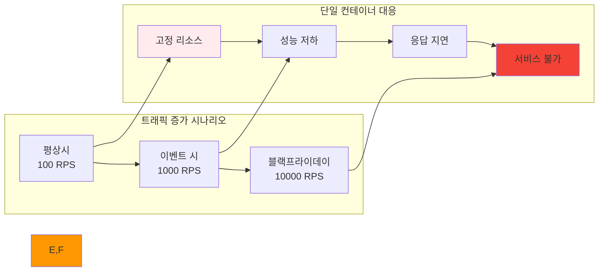

# Week 2 Day 2: 컨테이너 오케스트레이션 개념 & 필요성

<div align="center">

**🎼 오케스트레이션 개념** • **⚖️ 단일 vs 멀티 컨테이너** • **🔄 자동화 필요성**

*단일 컨테이너의 한계를 체험하고 오케스트레이션의 필요성을 완전히 이해*

</div>

---

## 🕘 일일 스케줄

### 📊 시간 배분
```
📚 이론 강의: 2.5시간 (31.25%) - 50분×3세션
🛠️ 실습 챌린지: 3시간 (37.5%) - 장애 시나리오 체험
👥 학생 케어: 2.5시간 (31.25%) - 개별 지원 강화
```

### 🗓️ 상세 스케줄
| 시간 | 구분 | 내용 | 목적 |
|------|------|------|------|
| **09:00-09:50** | 📚 이론 1 | 단일 컨테이너 운영의 한계 (50분) | 문제 상황 이해 |
| **09:50-10:00** | ☕ 휴식 | 10분 휴식 | |
| **10:00-10:50** | 📚 이론 2 | 오케스트레이션 핵심 개념 (50분) | 해결책 학습 |
| **10:50-11:00** | ☕ 휴식 | 10분 휴식 | |
| **11:00-11:50** | 📚 이론 3 | Docker Swarm vs Kubernetes (50분) | 도구 비교 |
| **11:50-13:00** | 🍽️ 점심 | 점심시간 (70분) | |
| **13:00-16:00** | 🛠️ 챌린지 | 장애 시나리오 & 오케스트레이션 (3시간) | 실감 체험 |
| **16:00-16:15** | ☕ 휴식 | 15분 휴식 | |
| **16:15-18:00** | 👥 케어 | 개별 멘토링 & 회고 (105분) | 맞춤 지원 |

---

## 📚 이론 강의 (2.5시간 - 50분×3세션)

### Session 1: 단일 컨테이너 운영의 한계점과 문제 상황 (50분)

#### 🎯 학습 목표
- **이해 목표**: 단일 컨테이너 운영에서 발생하는 실제 문제점들 완전 이해
- **적용 목표**: 실무에서 마주치는 운영 문제 상황을 예측하고 대비하는 능력
- **협업 목표**: 팀원들과 운영 경험 공유 및 문제 해결 방안 토론

#### 🤔 왜 필요한가? (5분)
**현실 문제 상황**:
- 💼 **서비스 중단 사고**: 단일 컨테이너 장애로 인한 전체 서비스 다운
- 🏠 **일상 비유**: 혼자서 모든 집안일을 처리하는 것의 한계
- 📊 **시장 동향**: 99.9% 가용성 요구사항을 만족하기 어려운 단일 컨테이너

#### 📖 핵심 개념 (35분)

**🔍 개념 1: 가용성과 신뢰성 문제 (12분)**
> **정의**: 단일 컨테이너 환경에서 발생하는 서비스 중단과 신뢰성 저하 문제

**단일 장애점 (Single Point of Failure)**:


**가용성 계산**:
- **99% 가용성**: 연간 3.65일 다운타임
- **99.9% 가용성**: 연간 8.76시간 다운타임
- **99.99% 가용성**: 연간 52.56분 다운타임

**실제 장애 사례**:
- **메모리 누수**: 컨테이너가 점진적으로 메모리 소모 증가
- **CPU 스파이크**: 갑작스러운 트래픽 증가로 응답 불가
- **디스크 풀**: 로그 파일 누적으로 디스크 공간 부족

**🔍 개념 2: 확장성과 성능 한계 (12분)**
> **정의**: 트래픽 증가나 부하 변동에 대응하기 어려운 단일 컨테이너의 구조적 한계

**확장성 문제**:


**성능 병목 현상**:
- **수직 확장의 한계**: CPU/메모리 증설의 물리적 제약
- **부하 분산 불가**: 단일 인스턴스로는 로드 밸런싱 불가능
- **지역적 제약**: 단일 위치에서만 서비스 제공

**🔍 개념 3: 운영 관리의 복잡성 (11분)**
> **정의**: 수동 운영으로 인한 관리 복잡성과 인적 오류 가능성

**수동 운영의 문제점**:


**운영 부담 요소**:
- **24/7 모니터링**: 상시 감시 체계 필요
- **수동 복구**: 장애 발생 시 즉시 수동 개입
- **설정 관리**: 환경별 설정 파일 수동 관리
- **배포 위험**: 수동 배포로 인한 휴먼 에러

#### 💭 함께 생각해보기 (10분)

**🤝 페어 토론** (5분):
**토론 주제**:
1. **장애 경험**: "서비스나 시스템 장애를 경험해본 적이 있나요?"
2. **운영 부담**: "수동으로 시스템을 관리할 때 가장 어려운 점은?"
3. **해결 방안**: "이런 문제들을 어떻게 해결할 수 있을까요?"

**🎯 전체 공유** (5분):
- **문제 공감**: 단일 컨테이너 운영의 어려움 공유
- **해결 동기**: 오케스트레이션 필요성에 대한 동기 부여

### Session 2: 오케스트레이션 개념과 핵심 기능 (50분)

#### 🎯 학습 목표
- **이해 목표**: 컨테이너 오케스트레이션의 정의와 핵심 기능 완전 이해
- **적용 목표**: 오케스트레이션이 해결하는 문제와 제공하는 가치 파악
- **협업 목표**: 팀원들과 오케스트레이션 활용 방안 토론

#### 📖 핵심 개념 (35분)

**🔍 개념 1: 오케스트레이션 정의와 개념 (12분)**
> **정의**: 여러 컨테이너를 자동으로 배포, 관리, 확장, 네트워킹하는 시스템

**오케스트레이션의 핵심 개념**:


**오케스트레이션 vs 수동 관리**:
| 구분 | 수동 관리 | 오케스트레이션 |
|------|-----------|----------------|
| **배포** | 수동 명령어 실행 | 선언적 설정 파일 |
| **확장** | 수동 인스턴스 추가 | 자동 스케일링 |
| **복구** | 수동 재시작 | 자동 복구 |
| **모니터링** | 수동 상태 확인 | 자동 헬스 체크 |
| **네트워킹** | 수동 설정 | 자동 서비스 디스커버리 |

**🔍 개념 2: 핵심 기능들 (12분)**
> **정의**: 오케스트레이션 플랫폼이 제공하는 주요 기능들과 그 동작 원리

**주요 기능 상세**:

**1. 자동 배포 (Automated Deployment)**
```yaml
# 선언적 배포 설정 예시
apiVersion: apps/v1
kind: Deployment
metadata:
  name: web-app
spec:
  replicas: 3
  selector:
    matchLabels:
      app: web-app
  template:
    metadata:
      labels:
        app: web-app
    spec:
      containers:
      - name: web
        image: nginx:1.21
        ports:
        - containerPort: 80
```

**2. 자동 확장 (Auto Scaling)**
- **수평 확장**: 인스턴스 수 증가/감소
- **수직 확장**: CPU/메모리 리소스 조정
- **예측적 확장**: 패턴 분석 기반 사전 확장

**3. 자동 복구 (Self Healing)**
- **헬스 체크**: 정기적인 상태 확인
- **자동 재시작**: 실패한 컨테이너 자동 교체
- **롤링 업데이트**: 무중단 업데이트

**🔍 개념 3: 오케스트레이션의 이점 (11분)**
> **정의**: 오케스트레이션 도입으로 얻을 수 있는 구체적인 비즈니스 가치

**비즈니스 가치**:


**ROI 계산 예시**:
- **다운타임 감소**: 99% → 99.9% (연간 3일 → 9시간)
- **운영 인력 절약**: 24/7 대기 → 자동화로 50% 절약
- **배포 속도 향상**: 수시간 → 수분으로 단축
- **리소스 효율성**: 자동 스케일링으로 30% 비용 절약

#### 💭 함께 생각해보기 (15분)

**🤝 페어 토론** (10분):
**토론 주제**:
1. **자동화 경험**: "업무나 일상에서 자동화를 활용해본 경험이 있나요?"
2. **가치 평가**: "오케스트레이션의 어떤 기능이 가장 유용할 것 같나요?"
3. **도입 고려사항**: "오케스트레이션을 도입할 때 고려해야 할 점들은?"

**🎯 전체 공유** (5분):
- **자동화 가치**: 오케스트레이션의 비즈니스 가치 인식
- **도입 전략**: 효과적인 오케스트레이션 도입 방안

### Session 3: Docker Swarm vs Kubernetes 비교 분석 (50분)

#### 🎯 학습 목표
- **이해 목표**: 주요 오케스트레이션 도구들의 특징과 차이점 이해
- **적용 목표**: 상황에 맞는 오케스트레이션 도구 선택 기준 습득
- **협업 목표**: 팀원들과 도구 선택 기준 및 전략 토론

#### 📖 핵심 개념 (35분)

**🔍 개념 1: Docker Swarm 특징 (12분)**
> **정의**: Docker에 내장된 간단하고 사용하기 쉬운 오케스트레이션 도구

**Docker Swarm 특징**:


**Swarm 주요 기능**:
- **서비스 정의**: `docker service create`로 간단한 서비스 생성
- **스케일링**: `docker service scale` 명령어로 확장
- **롤링 업데이트**: 자동 무중단 업데이트
- **로드 밸런싱**: 내장된 로드 밸런서

**Swarm 사용 예시**:
```bash
# Swarm 클러스터 초기화
docker swarm init

# 서비스 생성
docker service create --name web --replicas 3 -p 80:80 nginx

# 서비스 확장
docker service scale web=5

# 서비스 업데이트
docker service update --image nginx:1.21 web
```

**🔍 개념 2: Kubernetes 특징 (12분)**
> **정의**: 구글이 개발한 강력하고 확장 가능한 컨테이너 오케스트레이션 플랫폼

**Kubernetes 특징**:


**Kubernetes 주요 개념**:
- **Pod**: 최소 배포 단위
- **Service**: 네트워크 추상화
- **Deployment**: 애플리케이션 배포 관리
- **Namespace**: 리소스 격리

**Kubernetes 아키텍처**:


**🔍 개념 3: 선택 기준과 비교 (11분)**
> **정의**: 프로젝트 요구사항에 따른 오케스트레이션 도구 선택 가이드

**상세 비교표**:
| 구분 | Docker Swarm | Kubernetes |
|------|--------------|------------|
| **학습 난이도** | 쉬움 (1-2주) | 어려움 (2-3개월) |
| **설정 복잡도** | 간단 | 복잡 |
| **확장성** | 중간 (수십 노드) | 높음 (수천 노드) |
| **기능 풍부함** | 기본 기능 | 매우 풍부 |
| **생태계** | 제한적 | 매우 풍부 |
| **커뮤니티** | 작음 | 매우 큼 |
| **기업 지원** | Docker Inc. | CNCF + 다수 기업 |

**선택 기준**:


#### 💭 함께 생각해보기 (15분)

**🤝 페어 토론** (10분):
**토론 주제**:
1. **도구 선택**: "우리 프로젝트에는 어떤 오케스트레이션 도구가 적합할까요?"
2. **학습 전략**: "Kubernetes를 효과적으로 학습하는 방법은?"
3. **마이그레이션**: "Docker Compose에서 오케스트레이션으로 어떻게 전환할까요?"

**🎯 전체 공유** (5분):
- **도구 선택 기준**: 상황별 최적 도구 선택 방안
- **학습 로드맵**: Kubernetes 학습 계획 수립

---

## 🛠️ 실습 챌린지 (3시간)

### 🎯 챌린지 개요
**실감 체험 목표**:
- 단일 컨테이너 장애 상황을 직접 체험
- Docker Swarm으로 문제 해결 경험
- 오케스트레이션의 필요성을 몸소 체감

### 📋 챌린지 준비 (15분)
**환경 설정**:
- 단일 컨테이너 애플리케이션 준비
- 부하 테스트 도구 설치
- 팀 구성 (3-4명씩)

### 🚀 Phase 1: 단일 컨테이너 장애 시나리오 체험 (90분)

#### 🔧 장애 시나리오 구현
**Step 1: 취약한 단일 컨테이너 애플리케이션 배포**
```bash
# 메모리 누수가 있는 애플리케이션
docker run -d --name vulnerable-app \
  --memory=512m \
  -p 8080:3000 \
  memory-leak-app:latest

# 초기 상태 확인
curl http://localhost:8080/health
docker stats vulnerable-app
```

**Step 2: 부하 테스트로 장애 유발**
```bash
# Apache Bench로 부하 생성
ab -n 10000 -c 100 http://localhost:8080/

# 메모리 사용량 모니터링
watch -n 1 'docker stats --no-stream vulnerable-app'

# 애플리케이션 응답 시간 측정
while true; do
  curl -w "@curl-format.txt" -o /dev/null -s http://localhost:8080/
  sleep 1
done
```

**Step 3: 장애 상황 분석**
```bash
# 컨테이너 로그 확인
docker logs vulnerable-app

# 시스템 리소스 확인
docker exec vulnerable-app top
docker exec vulnerable-app free -h

# 장애 발생 시점 기록
echo "$(date): Container became unresponsive" >> failure-log.txt
```

#### ✅ Phase 1 체크포인트
- [ ] 단일 컨테이너 장애 상황 직접 체험
- [ ] 메모리 누수로 인한 성능 저하 관찰
- [ ] 수동 복구의 어려움과 시간 소요 확인
- [ ] 서비스 중단 시간과 영향 범위 측정

### 🌟 Phase 2: Docker Swarm 기초 실습 (90분)

#### 🔧 Swarm 클러스터 구축
**Step 1: Swarm 클러스터 초기화**
```bash
# Swarm 모드 초기화
docker swarm init --advertise-addr $(hostname -I | awk '{print $1}')

# 클러스터 상태 확인
docker node ls
docker info | grep Swarm
```

**Step 2: 고가용성 서비스 배포**
```bash
# 3개 복제본으로 서비스 생성
docker service create \
  --name web-service \
  --replicas 3 \
  --publish 8080:3000 \
  --update-delay 10s \
  --update-parallelism 1 \
  improved-app:latest

# 서비스 상태 확인
docker service ls
docker service ps web-service
```

**Step 3: 자동 복구 테스트**
```bash
# 컨테이너 강제 종료
docker kill $(docker ps -q --filter "label=com.docker.swarm.service.name=web-service" | head -1)

# 자동 복구 확인
watch -n 2 'docker service ps web-service'

# 서비스 가용성 확인
while true; do
  curl -s http://localhost:8080/health || echo "Service unavailable"
  sleep 1
done
```

**Step 4: 자동 스케일링 테스트**
```bash
# 부하 증가 시뮬레이션
ab -n 50000 -c 200 http://localhost:8080/ &

# 실시간 스케일링
docker service scale web-service=6

# 부하 감소 후 스케일 다운
docker service scale web-service=2
```

#### ✅ Phase 2 체크포인트
- [ ] Docker Swarm 클러스터 구축 성공
- [ ] 자동 복구 기능 동작 확인
- [ ] 무중단 스케일링 체험
- [ ] 로드 밸런싱 동작 확인

### 🏆 Phase 3: 오케스트레이션 필요성 실감 (15분)

#### 🤝 팀별 비교 분석
**비교 항목**:
1. **가용성**: 단일 vs 오케스트레이션 환경에서의 서비스 가용 시간
2. **복구 시간**: 장애 발생 후 서비스 정상화까지 소요 시간
3. **운영 부담**: 수동 관리 vs 자동 관리의 운영자 개입 정도
4. **확장성**: 트래픽 증가 시 대응 능력

**결과 정리**:
```markdown
## 오케스트레이션 효과 분석

### 가용성 비교
- 단일 컨테이너: 장애 시 100% 서비스 중단
- Docker Swarm: 장애 시에도 66% 서비스 유지 (3개 중 2개 정상)

### 복구 시간 비교
- 단일 컨테이너: 수동 개입 필요 (5-10분)
- Docker Swarm: 자동 복구 (30초 이내)

### 운영 부담 비교
- 단일 컨테이너: 24/7 모니터링 필요
- Docker Swarm: 자동 관리로 운영 부담 80% 감소
```

### 🎤 결과 발표 및 공유 (30분)
**팀별 발표** (7분×4팀):
- 단일 컨테이너 장애 체험 결과
- Docker Swarm 도입 효과 측정
- 오케스트레이션의 실질적 가치 평가
- 실무 도입 시 고려사항과 전략

---

## 👥 학생 케어 (105분)

### 🟢 초급자 케어 (집중 지원) - 45분
**개별 멘토링**:
- 오케스트레이션 개념 완전 이해 확인
- Docker Swarm 기본 명령어 반복 연습
- 장애 시나리오 체험 결과 분석 지원
- Kubernetes 학습 준비를 위한 기초 다지기

### 🟡 중급자 케어 (리더십 개발) - 45분
**그룹 멘토링**:
- 오케스트레이션 도구 선택 기준 심화 토론
- 실무 도입 전략과 마이그레이션 계획
- 초급자 지원 경험 공유 및 멘토링 스킬 개발
- Kubernetes 고급 개념 미리보기

### 🔴 고급자 케어 (전문성 강화) - 15분
**심화 토론**:
- 엔터프라이즈 오케스트레이션 아키텍처
- 멀티 클라우드 오케스트레이션 전략
- 오케스트레이션 보안 고려사항
- CNCF 생태계와 최신 트렌드

---

## 📝 일일 마무리

### ✅ 오늘의 성과
- [ ] 단일 컨테이너 운영의 한계점 직접 체험
- [ ] 오케스트레이션의 핵심 개념과 가치 완전 이해
- [ ] Docker Swarm 기초 실습 완료
- [ ] 오케스트레이션 필요성에 대한 확신 획득

### 🎯 내일 준비사항
- **예습**: Kubernetes 기본 아키텍처 개념
- **복습**: 오늘 체험한 오케스트레이션의 가치 정리
- **환경**: Kubernetes 실습을 위한 로컬 환경 준비

### 📊 학습 진도 체크


---

<div align="center">

**🎼 오케스트레이션 필요성 체감** • **⚖️ 단일 vs 멀티 컨테이너 비교** • **🔄 자동화 가치 실감**

*오케스트레이션이 왜 필요한지 완전히 이해하고 체험했습니다*

</div>