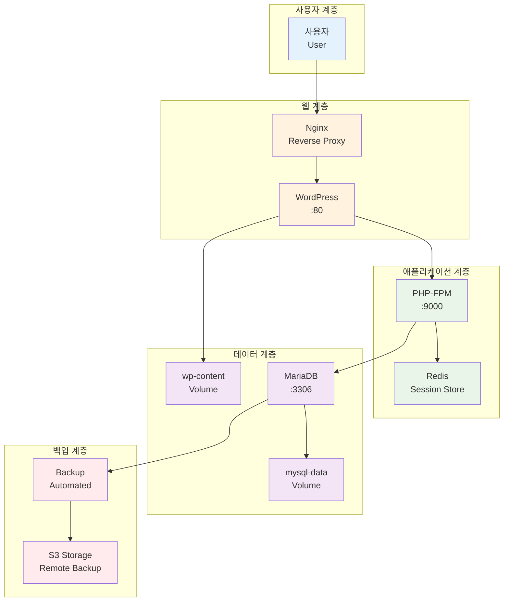

# Week 2 Day 2 Lab 1: Stateful 애플리케이션 구축

<div align="center">

**🏗️ WordPress + MariaDB** • **💾 데이터 영속성** • **🔧 환경 설정**

*데이터베이스와 웹 애플리케이션이 통합된 완전한 시스템 구축*

</div>

---

## 🕘 실습 정보

**시간**: 12:00-12:50 (50분)  
**목표**: 데이터베이스와 웹 애플리케이션이 통합된 완전한 시스템 구축  
**방식**: 단계별 가이드 + 데이터 영속성 + 성능 최적화

---

## 🎯 실습 목표

### 📚 당일 이론 적용
- Session 1-3에서 배운 스토리지 개념을 실제 구현
- Volume, Bind Mount를 활용한 데이터 영속성 보장
- 데이터베이스 컨테이너 최적화 설정 적용

### 🏗️ 구축할 시스템 아키텍처


---

## 📋 실습 준비 (5분)

### 환경 설정
```bash
# 작업 디렉토리 생성
mkdir -p ~/wordpress-stack
cd ~/wordpress-stack

# 기존 컨테이너 정리 (필요시)
docker container prune -f
docker volume prune -f
```

### 페어 구성 (필요시)
- 👥 **페어 프로그래밍**: 2명씩 짝을 이루어 진행
- 🔄 **역할 분담**: Driver(실행자) / Navigator(가이드) 역할 교대
- 📝 **공동 작업**: 하나의 화면에서 함께 작업

---

## 🔧 실습 단계 (40분)

### Step 1: 데이터베이스 계층 구축 (10분)

**🚀 자동화 스크립트 사용**
```bash
# MariaDB 데이터베이스 자동 구축 (MySQL 완전 호환)
./lab_scripts/lab1/setup_database.sh
```

**📋 스크립트 내용**: [setup_database.sh](./lab_scripts/lab1/setup_database.sh)

**1-1. 수동 실행 (학습용)**
```bash
# WordPress 네트워크 생성
docker network create wordpress-net

# MariaDB 데이터 볼륨 생성
docker volume create mysql-data
docker volume create mysql-config

# MariaDB 컨테이너 실행 (MySQL 완전 호환)
docker run -d \
  --name mysql-wordpress \
  --network wordpress-net \
  --restart=unless-stopped \
  -e MYSQL_ROOT_PASSWORD=rootpassword \
  -e MYSQL_DATABASE=wordpress \
  -e MYSQL_USER=wpuser \
  -e MYSQL_PASSWORD=wppassword \
  -v mysql-data:/var/lib/mysql \
  --memory=256m \
  mariadb:10.6
```

**1-2. 데이터베이스 초기화 확인**
```bash
# 데이터베이스 초기화 대기
sleep 30

# 연결 테스트
docker exec mysql-wordpress mysql -u wpuser -pwppassword -e "SHOW DATABASES;"

# 성능 설정 확인
docker exec mysql-wordpress mysql -u root -prootpassword -e "SHOW VARIABLES LIKE 'innodb_buffer_pool_size';"
```

### Step 2: 웹 애플리케이션 계층 구축 (15분)

**🚀 자동화 스크립트 사용**
```bash
# WordPress 애플리케이션 자동 배포
./lab_scripts/lab1/deploy_wordpress.sh
```

**📋 스크립트 내용**: [deploy_wordpress.sh](./lab_scripts/lab1/deploy_wordpress.sh)

**2-1. 수동 실행 (학습용)**
```bash
# WordPress 데이터 볼륨 생성
docker volume create wp-content
docker volume create redis-data

# Redis 세션 스토어 실행
docker run -d \
  --name redis-session \
  --network wordpress-net \
  --restart=unless-stopped \
  -v redis-data:/data \
  --memory=128m \
  redis:7-alpine redis-server --appendonly yes

# WordPress 컨테이너 실행
docker run -d \
  --name wordpress-app \
  --network wordpress-net \
  --restart=unless-stopped \
  -p 8080:80 \
  -e WORDPRESS_DB_HOST=mysql-wordpress:3306 \
  -e WORDPRESS_DB_NAME=wordpress \
  -e WORDPRESS_DB_USER=wpuser \
  -e WORDPRESS_DB_PASSWORD=wppassword \
  -v wp-content:/var/www/html/wp-content \
  --memory=256m \
  wordpress:latest
```

**2-2. 연결 테스트**
```bash
# WordPress 서비스 시작 대기
sleep 30

# WordPress 연결 테스트
curl -I http://localhost:8080/

# Redis 연결 테스트
docker exec redis-session redis-cli ping
```

### Step 3: 리버스 프록시 및 캐싱 (10분)

**🚀 자동화 스크립트 사용**
```bash
# Nginx 리버스 프록시 자동 설정
./lab_scripts/lab1/setup_nginx.sh
```

**📋 스크립트 내용**: [setup_nginx.sh](./lab_scripts/lab1/setup_nginx.sh)

**3-1. 수동 실행 (학습용)**
```bash
# Nginx 볼륨 생성
docker volume create nginx-logs
docker volume create nginx-cache

# Nginx 컨테이너 실행 (기본 설정)
docker run -d \
  --name nginx-proxy \
  --network wordpress-net \
  --restart=unless-stopped \
  -p 80:80 \
  -v nginx-logs:/var/log/nginx \
  -v nginx-cache:/var/cache/nginx \
  --memory=128m \
  nginx:alpine

# Nginx 설정 업데이트 (프록시 설정)
docker exec nginx-proxy sh -c 'cat > /etc/nginx/conf.d/default.conf << "EOF"
upstream wordpress {
    server wordpress-app:80;
}

server {
    listen 80;
    server_name localhost;
    
    location / {
        proxy_pass http://wordpress;
        proxy_set_header Host \$host;
        proxy_set_header X-Real-IP \$remote_addr;
        proxy_set_header X-Forwarded-For \$proxy_add_x_forwarded_for;
    }
    
    location /health {
        return 200 "healthy\n";
        add_header Content-Type text/plain;
    }
}
EOF'

# Nginx 설정 재로드
docker exec nginx-proxy nginx -s reload
```

### Step 4: 모니터링 및 백업 설정 (5분)

**🚀 자동화 스크립트 사용**
```bash
# 모니터링 및 백업 시스템 자동 설정
./lab_scripts/lab1/setup_monitoring.sh
```

**📋 스크립트 내용**: [setup_monitoring.sh](./lab_scripts/lab1/setup_monitoring.sh)

**4-1. 수동 실행 (학습용)**
```bash
# 백업 디렉토리 생성
mkdir -p scripts backup logs

# 백업 스크립트 생성
cat > scripts/backup.sh << 'EOF'
#!/bin/bash
BACKUP_DATE=$(date +%Y%m%d_%H%M%S)

# 데이터베이스 백업
docker exec mysql-wordpress mysqldump \
  --single-transaction \
  --routines \
  --triggers \
  -u wpuser -pwppassword wordpress \
  > backup/wordpress_db_${BACKUP_DATE}.sql

# WordPress 파일 백업
docker run --rm \
  -v wp-content:/data:ro \
  -v $(pwd)/backup:/backup \
  alpine tar czf /backup/wp_content_${BACKUP_DATE}.tar.gz -C /data .

echo "Backup completed: ${BACKUP_DATE}"
EOF

chmod +x scripts/backup.sh

# 헬스 체크 스크립트 생성
cat > scripts/health-check.sh << 'EOF'
#!/bin/bash
while true; do
    # WordPress 헬스 체크
    if curl -f http://localhost/health >/dev/null 2>&1; then
        echo "$(date): WordPress is healthy"
    else
        echo "$(date): WordPress is down!"
    fi
    
    # MariaDB 헬스 체크
    if docker exec mysql-wordpress mysqladmin ping -u wpuser -pwppassword >/dev/null 2>&1; then
        echo "$(date): MariaDB is healthy"
    else
        echo "$(date): MariaDB is down!"
    fi
    
    sleep 60
done
EOF

chmod +x scripts/health-check.sh
``` /data .

echo "Backup completed: ${BACKUP_DATE}"
EOF

chmod +x scripts/backup.sh

# 모니터링 컨테이너 (간단한 헬스 체크)
cat > scripts/health-check.sh << 'EOF'
#!/bin/bash
while true; do
    # WordPress 헬스 체크
    if curl -f http://localhost/health >/dev/null 2>&1; then
        echo "$(date): WordPress is healthy"
    else
        echo "$(date): WordPress is down!"
    fi
    
    # MySQL 헬스 체크
    if docker exec mysql-wordpress mysqladmin ping -u wpuser -pwppassword >/dev/null 2>&1; then
        echo "$(date): MySQL is healthy"
    else
        echo "$(date): MySQL is down!"
    fi
    
    sleep 60
done
EOF

chmod +x scripts/health-check.sh

# 백그라운드에서 헬스 체크 실행
nohup ./scripts/health-check.sh > logs/health.log 2>&1 &
```

### Step 5: 전체 시스템 테스트 (5분)

**🚀 자동화 테스트 스크립트 사용**
```bash
# 전체 시스템 종합 테스트
./lab_scripts/lab1/test_system.sh
```

**📋 스크립트 내용**: [test_system.sh](./lab_scripts/lab1/test_system.sh)
```

---

## ✅ 실습 체크포인트

### 기본 기능 구현 완료
- [ ] **MariaDB 데이터베이스**: MySQL 완전 호환으로 정상 동작
- [ ] **WordPress 애플리케이션**: 웹 서비스 정상 동작
- [ ] **Redis 세션 스토어**: 세션 데이터 저장
- [ ] **Nginx 프록시**: 리버스 프록시 및 로드 밸런싱
- [ ] **데이터 영속성**: Volume을 통한 데이터 보존 확인

### 설정 및 구성 확인
- [ ] **볼륨 마운트**: 모든 중요 데이터가 볼륨에 저장
- [ ] **네트워크 연결**: 컨테이너 간 통신 정상 동작
- [ ] **성능 최적화**: 메모리 및 CPU 제한 설정 적용
- [ ] **백업 시스템**: 자동 백업 스크립트 동작 확인

### 동작 테스트 성공

**🚀 자동화 테스트 스크립트 사용**
```bash
# 전체 시스템 종합 테스트
./lab_scripts/lab1/test_system.sh
```

**📋 스크립트 내용**: [test_system.sh](./lab_scripts/lab1/test_system.sh)

**수동 테스트 (핵심만)**
```bash
# 웹 애플리케이션 접근 테스트
curl -I http://localhost/

# 데이터베이스 연결 테스트
docker exec mysql-wordpress mysql -u wpuser -pwppassword -e "SELECT 1;"

# 볼륨 데이터 확인
docker volume ls | grep -E "(mysql-data|wp-content)"

# 백업 테스트
./scripts/backup.sh
ls -la backup/
```

---

## 🔄 실습 마무리 (5분)

### 결과 공유
- **시연**: 완성된 WordPress 시스템 데모 (http://localhost)
- **모니터링**: 대시보드 확인 (http://localhost:9090)
- **데이터 영속성**: 컨테이너 재시작 후 데이터 보존 확인
- **백업 시스템**: 자동 백업 및 복구 기능 테스트

### 질문 해결
- **어려웠던 부분**: 볼륨 설정이나 네트워크 연결 관련 이슈
- **성능 최적화**: PHP, MySQL 설정 튜닝 경험 공유
- **백업 전략**: 실제 운영 환경에서의 백업 방법 토론

### 다음 연결
- **Lab 2 준비**: 심화 모니터링 및 성능 최적화
- **확장 계획**: 로드 밸런싱과 고가용성 구성

---

## 🚀 전체 자동 실행

**전체 Lab 1을 한 번에 실행**
```bash
# 모든 단계를 자동으로 실행
./lab_scripts/lab1/run_all_lab1.sh
```

**📋 스크립트 내용**: [run_all_lab1.sh](./lab_scripts/lab1/run_all_lab1.sh)

**🌍 접속 주소**:
- WordPress 사이트: http://localhost
- 모니터링 대시보드: http://localhost:9090
- WordPress 관리자: http://localhost/wp-admin

---

## 🎯 추가 도전 과제 (시간 여유시)

### 고급 기능 구현
```bash
# 1. SSL/TLS 적용
docker run -d \
  --name certbot \
  -v certbot-certs:/etc/letsencrypt \
  -v certbot-www:/var/www/certbot \
  certbot/certbot certonly --webroot -w /var/www/certbot -d yourdomain.com

# 2. 로그 중앙화
docker run -d \
  --name elasticsearch \
  -p 9200:9200 \
  -e "discovery.type=single-node" \
  elasticsearch:7.17.0

docker run -d \
  --name logstash \
  -v $(pwd)/config/logstash:/usr/share/logstash/pipeline \
  --link elasticsearch:elasticsearch \
  logstash:7.17.0

# 3. 성능 모니터링
docker run -d \
  --name prometheus \
  -p 9090:9090 \
  -v $(pwd)/config/prometheus.yml:/etc/prometheus/prometheus.yml \
  prom/prometheus

docker run -d \
  --name grafana \
  -p 3000:3000 \
  -e GF_SECURITY_ADMIN_PASSWORD=admin \
  grafana/grafana
```

---

<div align="center">

**🏗️ Stateful 애플리케이션 구축 완료!**

**구축된 서비스**:
- ✅ MariaDB (MySQL 호환) - 데이터베이스
- ✅ WordPress - 웹 애플리케이션
- ✅ Redis - 세션 스토어
- ✅ Nginx - 리버스 프록시 & 로드밸런서
- ✅ 모니터링 대시보드 - 시스템 관리

**다음**: [Lab 2 - 심화 모니터링 및 성능 최적화](./lab_2.md)

</div>