# Week 2 Day 2 Lab 1: Stateful 애플리케이션 구축

<div align="center">

**🏗️ WordPress + MySQL** • **💾 데이터 영속성** • **🔧 환경 설정**

*데이터베이스와 웹 애플리케이션이 통합된 완전한 시스템 구축*

</div>

---

## 🕘 실습 정보

**시간**: 12:00-12:50 (50분)  
**목표**: 데이터베이스와 웹 애플리케이션이 통합된 완전한 시스템 구축  
**방식**: 단계별 가이드 + 데이터 영속성 + 성능 최적화

---

## 🎯 실습 목표

### 📚 당일 이론 적용
- Session 1-3에서 배운 스토리지 개념을 실제 구현
- Volume, Bind Mount를 활용한 데이터 영속성 보장
- 데이터베이스 컨테이너 최적화 설정 적용

### 🏗️ 구축할 시스템 아키텍처

```mermaid
graph TB
    subgraph "사용자 계층"
        U[사용자<br/>User]
    end
    
    subgraph "웹 계층"
        W[WordPress<br/>:80]
        N[Nginx<br/>Reverse Proxy]
    end
    
    subgraph "애플리케이션 계층"
        P[PHP-FPM<br/>:9000]
        R[Redis<br/>Session Store]
    end
    
    subgraph "데이터 계층"
        M[MySQL<br/>:3306]
        V1[wp-content<br/>Volume]
        V2[mysql-data<br/>Volume]
    end
    
    subgraph "백업 계층"
        B[Backup<br/>Automated]
        S[S3 Storage<br/>Remote Backup]
    end
    
    U --> N
    N --> W
    W --> P
    P --> R
    P --> M
    W --> V1
    M --> V2
    M --> B
    B --> S
    
    style U fill:#e3f2fd
    style W fill:#fff3e0
    style N fill:#fff3e0
    style P fill:#e8f5e8
    style R fill:#e8f5e8
    style M fill:#f3e5f5
    style V1 fill:#f3e5f5
    style V2 fill:#f3e5f5
    style B fill:#ffebee
    style S fill:#ffebee
```


---

## 📋 실습 준비 (5분)

### 환경 설정
```bash
# 작업 디렉토리 생성
mkdir -p ~/wordpress-stack
cd ~/wordpress-stack

# 기존 컨테이너 정리 (필요시)
docker container prune -f
docker volume prune -f
```

### 페어 구성 (필요시)
- 👥 **페어 프로그래밍**: 2명씩 짝을 이루어 진행
- 🔄 **역할 분담**: Driver(실행자) / Navigator(가이드) 역할 교대
- 📝 **공동 작업**: 하나의 화면에서 함께 작업

---

## 🔧 실습 단계 (40분)

### Step 1: 데이터베이스 계층 구축 (10분)

**🚀 자동화 스크립트 사용**
```bash
# MySQL 데이터베이스 자동 구축
./lab_scripts/lab1/setup_database.sh
```

**📋 스크립트 내용**: [setup_database.sh](./lab_scripts/lab1/setup_database.sh)

**1-1. 수동 실행 (학습용)**
```bash
# MySQL 데이터 볼륨 생성
docker volume create mysql-data
docker volume create mysql-config

# MySQL 설정 파일 생성
mkdir -p config/mysql
cat > config/mysql/my.cnf << 'EOF'
[mysqld]
# 기본 설정
bind-address = 0.0.0.0
port = 3306

# 문자셋
character-set-server = utf8mb4
collation-server = utf8mb4_unicode_ci

# InnoDB 최적화
innodb_buffer_pool_size = 512M
innodb_log_file_size = 128M
innodb_flush_log_at_trx_commit = 2

# 연결 설정
max_connections = 100
wait_timeout = 600

# 로깅
slow_query_log = 1
slow_query_log_file = /var/log/mysql/slow.log
long_query_time = 2
EOF

# MySQL 컨테이너 실행
docker run -d \
  --name mysql-wordpress \
  --restart=unless-stopped \
  -e MYSQL_ROOT_PASSWORD=rootpassword \
  -e MYSQL_DATABASE=wordpress \
  -e MYSQL_USER=wpuser \
  -e MYSQL_PASSWORD=wppassword \
  -v mysql-data:/var/lib/mysql \
  -v mysql-config:/etc/mysql/conf.d \
  -v $(pwd)/config/mysql/my.cnf:/etc/mysql/conf.d/custom.cnf \
  --memory=1g \
  --cpus=1.0 \
  mysql:8.0
```

**1-2. 데이터베이스 초기화 확인**
```bash
# 데이터베이스 초기화 대기
sleep 30

# 연결 테스트
docker exec mysql-wordpress mysql -u wpuser -pwppassword -e "SHOW DATABASES;"

# 성능 설정 확인
docker exec mysql-wordpress mysql -u root -prootpassword -e "SHOW VARIABLES LIKE 'innodb_buffer_pool_size';"
```

### Step 2: 웹 애플리케이션 계층 구축 (15분)

**🚀 자동화 스크립트 사용**
```bash
# WordPress 애플리케이션 자동 배포
./lab_scripts/lab1/deploy_wordpress.sh
```

**📋 스크립트 내용**: [deploy_wordpress.sh](./lab_scripts/lab1/deploy_wordpress.sh)

**2-1. 수동 실행 (학습용)**
```bash
# WordPress 데이터 볼륨 생성
docker volume create wp-content
docker volume create wp-config

# WordPress 설정 파일 생성
mkdir -p config/wordpress
cat > config/wordpress/wp-config.php << 'EOF'
<?php
define('DB_NAME', 'wordpress');
define('DB_USER', 'wpuser');
define('DB_PASSWORD', 'wppassword');
define('DB_HOST', 'mysql-wordpress:3306');
define('DB_CHARSET', 'utf8mb4');
define('DB_COLLATE', '');

// 보안 키 설정
define('AUTH_KEY',         'your-unique-auth-key');
define('SECURE_AUTH_KEY',  'your-unique-secure-auth-key');
define('LOGGED_IN_KEY',    'your-unique-logged-in-key');
define('NONCE_KEY',        'your-unique-nonce-key');

// Redis 세션 설정
define('WP_REDIS_HOST', 'redis-session');
define('WP_REDIS_PORT', 6379);
define('WP_REDIS_DATABASE', 0);

// 디버그 설정
define('WP_DEBUG', false);
define('WP_DEBUG_LOG', false);

// 테이블 접두사
$table_prefix = 'wp_';

if ( !defined('ABSPATH') )
    define('ABSPATH', dirname(__FILE__) . '/');

require_once(ABSPATH . 'wp-settings.php');
EOF

# Redis 세션 스토어 실행
docker run -d \
  --name redis-session \
  --restart=unless-stopped \
  -v redis-data:/data \
  --memory=256m \
  redis:7-alpine redis-server --appendonly yes

# WordPress 컨테이너 실행
docker run -d \
  --name wordpress-app \
  --restart=unless-stopped \
  -p 8080:80 \
  -e WORDPRESS_DB_HOST=mysql-wordpress:3306 \
  -e WORDPRESS_DB_NAME=wordpress \
  -e WORDPRESS_DB_USER=wpuser \
  -e WORDPRESS_DB_PASSWORD=wppassword \
  -v wp-content:/var/www/html/wp-content \
  -v $(pwd)/config/wordpress/wp-config.php:/var/www/html/wp-config.php \
  --link mysql-wordpress:mysql \
  --link redis-session:redis \
  --memory=512m \
  --cpus=1.0 \
  wordpress:latest
```

**2-2. PHP 최적화 설정**
```bash
# PHP 설정 파일 생성
mkdir -p config/php
cat > config/php/php.ini << 'EOF'
; 메모리 설정
memory_limit = 256M
max_execution_time = 300
max_input_time = 300

; 파일 업로드
upload_max_filesize = 64M
post_max_size = 64M
max_file_uploads = 20

; 세션 설정
session.save_handler = redis
session.save_path = "tcp://redis-session:6379"

; OPcache 설정
opcache.enable = 1
opcache.memory_consumption = 128
opcache.max_accelerated_files = 4000
opcache.revalidate_freq = 60
EOF

# PHP 설정 적용을 위한 컨테이너 재시작
docker stop wordpress-app
docker rm wordpress-app

docker run -d \
  --name wordpress-app \
  --restart=unless-stopped \
  -p 8080:80 \
  -e WORDPRESS_DB_HOST=mysql-wordpress:3306 \
  -e WORDPRESS_DB_NAME=wordpress \
  -e WORDPRESS_DB_USER=wpuser \
  -e WORDPRESS_DB_PASSWORD=wppassword \
  -v wp-content:/var/www/html/wp-content \
  -v $(pwd)/config/wordpress/wp-config.php:/var/www/html/wp-config.php \
  -v $(pwd)/config/php/php.ini:/usr/local/etc/php/conf.d/custom.ini \
  --link mysql-wordpress:mysql \
  --link redis-session:redis \
  --memory=512m \
  --cpus=1.0 \
  wordpress:latest
```

### Step 3: 리버스 프록시 및 캐싱 (10분)

**🚀 자동화 스크립트 사용**
```bash
# Nginx 리버스 프록시 자동 설정
./lab_scripts/lab1/setup_nginx.sh
```

**📋 스크립트 내용**: [setup_nginx.sh](./lab_scripts/lab1/setup_nginx.sh)

**3-1. 수동 실행 (학습용)**
```bash
# Nginx 설정 파일 생성
mkdir -p config/nginx
cat > config/nginx/nginx.conf << 'EOF'
upstream wordpress {
    server wordpress-app:80;
}

server {
    listen 80;
    server_name localhost;
    
    # 로그 설정
    access_log /var/log/nginx/wordpress.access.log;
    error_log /var/log/nginx/wordpress.error.log;
    
    # 정적 파일 캐싱
    location ~* \.(jpg|jpeg|png|gif|ico|css|js)$ {
        expires 1y;
        add_header Cache-Control "public, immutable";
        proxy_pass http://wordpress;
        proxy_set_header Host $host;
        proxy_set_header X-Real-IP $remote_addr;
        proxy_set_header X-Forwarded-For $proxy_add_x_forwarded_for;
    }
    
    # 동적 콘텐츠
    location / {
        proxy_pass http://wordpress;
        proxy_set_header Host $host;
        proxy_set_header X-Real-IP $remote_addr;
        proxy_set_header X-Forwarded-For $proxy_add_x_forwarded_for;
        proxy_set_header X-Forwarded-Proto $scheme;
        
        # 버퍼링 설정
        proxy_buffering on;
        proxy_buffer_size 4k;
        proxy_buffers 8 4k;
        
        # 타임아웃 설정
        proxy_connect_timeout 30s;
        proxy_send_timeout 30s;
        proxy_read_timeout 30s;
    }
    
    # 헬스 체크
    location /health {
        access_log off;
        return 200 "healthy\n";
        add_header Content-Type text/plain;
    }
}
EOF

# Nginx 컨테이너 실행
docker run -d \
  --name nginx-proxy \
  --restart=unless-stopped \
  -p 80:80 \
  -v $(pwd)/config/nginx/nginx.conf:/etc/nginx/conf.d/default.conf \
  -v nginx-logs:/var/log/nginx \
  --link wordpress-app:wordpress-app \
  --memory=128m \
  nginx:alpine
```

### Step 4: 모니터링 및 백업 설정 (5분)

**🚀 자동화 스크립트 사용**
```bash
# 모니터링 및 백업 시스템 자동 설정
./lab_scripts/lab1/setup_monitoring.sh
```

**📋 스크립트 내용**: [setup_monitoring.sh](./lab_scripts/lab1/setup_monitoring.sh)

**4-1. 수동 실행 (학습용)**
```bash
# 백업 스크립트 생성
mkdir -p scripts
cat > scripts/backup.sh << 'EOF'
#!/bin/bash
BACKUP_DATE=$(date +%Y%m%d_%H%M%S)
BACKUP_DIR="/backup"

# 데이터베이스 백업
docker exec mysql-wordpress mysqldump \
  --single-transaction \
  --routines \
  --triggers \
  -u wpuser -pwppassword wordpress \
  > ${BACKUP_DIR}/wordpress_db_${BACKUP_DATE}.sql

# WordPress 파일 백업
docker run --rm \
  -v wp-content:/data:ro \
  -v $(pwd)/backup:/backup \
  alpine tar czf /backup/wp_content_${BACKUP_DATE}.tar.gz -C /data .

echo "Backup completed: ${BACKUP_DATE}"
EOF

chmod +x scripts/backup.sh

# 모니터링 컨테이너 (간단한 헬스 체크)
cat > scripts/health-check.sh << 'EOF'
#!/bin/bash
while true; do
    # WordPress 헬스 체크
    if curl -f http://localhost/health >/dev/null 2>&1; then
        echo "$(date): WordPress is healthy"
    else
        echo "$(date): WordPress is down!"
    fi
    
    # MySQL 헬스 체크
    if docker exec mysql-wordpress mysqladmin ping -u wpuser -pwppassword >/dev/null 2>&1; then
        echo "$(date): MySQL is healthy"
    else
        echo "$(date): MySQL is down!"
    fi
    
    sleep 60
done
EOF

chmod +x scripts/health-check.sh

# 백그라운드에서 헬스 체크 실행
nohup ./scripts/health-check.sh > health.log 2>&1 &
```

---

## ✅ 실습 체크포인트

### 기본 기능 구현 완료
- [ ] **MySQL 데이터베이스**: 최적화된 설정으로 정상 동작
- [ ] **WordPress 애플리케이션**: PHP 최적화 및 Redis 세션 연동
- [ ] **Nginx 프록시**: 정적 파일 캐싱 및 로드 밸런싱
- [ ] **데이터 영속성**: Volume을 통한 데이터 보존 확인

### 설정 및 구성 확인
- [ ] **볼륨 마운트**: 모든 중요 데이터가 볼륨에 저장
- [ ] **네트워크 연결**: 컨테이너 간 통신 정상 동작
- [ ] **성능 최적화**: 메모리 및 CPU 제한 설정 적용
- [ ] **백업 시스템**: 자동 백업 스크립트 동작 확인

### 동작 테스트 성공

**🚀 자동화 테스트 스크립트 사용**
```bash
# 전체 시스템 종합 테스트
./lab_scripts/lab1/test_system.sh
```

**📋 스크립트 내용**: [test_system.sh](./lab_scripts/lab1/test_system.sh)

**수동 테스트 (핵심만)**
```bash
# 웹 애플리케이션 접근 테스트
curl -I http://localhost/

# 데이터베이스 연결 테스트
docker exec mysql-wordpress mysql -u wpuser -pwppassword -e "SELECT 1;"

# 볼륨 데이터 확인
docker volume ls | grep -E "(mysql-data|wp-content)"

# 백업 테스트
./scripts/backup.sh
ls -la backup/
```

---

## 🔄 실습 마무리 (5분)

### 결과 공유
- **시연**: 완성된 WordPress 시스템 데모
- **성능 확인**: 페이지 로딩 속도와 응답성 테스트
- **데이터 영속성**: 컨테이너 재시작 후 데이터 보존 확인

### 질문 해결
- **어려웠던 부분**: 볼륨 설정이나 네트워크 연결 관련 이슈
- **성능 최적화**: PHP, MySQL 설정 튜닝 경험 공유
- **백업 전략**: 실제 운영 환경에서의 백업 방법 토론

### 다음 연결
- **Lab 2 준비**: 자동화된 백업 및 복구 시스템 구축
- **확장 계획**: 현재 시스템의 확장성과 개선 방향

---

## 🎯 추가 도전 과제 (시간 여유시)

### 고급 기능 구현
```bash
# 1. SSL/TLS 적용
docker run -d \
  --name certbot \
  -v certbot-certs:/etc/letsencrypt \
  -v certbot-www:/var/www/certbot \
  certbot/certbot certonly --webroot -w /var/www/certbot -d yourdomain.com

# 2. 로그 중앙화
docker run -d \
  --name elasticsearch \
  -p 9200:9200 \
  -e "discovery.type=single-node" \
  elasticsearch:7.17.0

docker run -d \
  --name logstash \
  -v $(pwd)/config/logstash:/usr/share/logstash/pipeline \
  --link elasticsearch:elasticsearch \
  logstash:7.17.0

# 3. 성능 모니터링
docker run -d \
  --name prometheus \
  -p 9090:9090 \
  -v $(pwd)/config/prometheus.yml:/etc/prometheus/prometheus.yml \
  prom/prometheus

docker run -d \
  --name grafana \
  -p 3000:3000 \
  -e GF_SECURITY_ADMIN_PASSWORD=admin \
  grafana/grafana
```

---

<div align="center">

**🏗️ Stateful 애플리케이션 구축 완료!**

**다음**: [Lab 2 - 데이터 백업 및 복구 시스템](./lab_2.md)

</div>