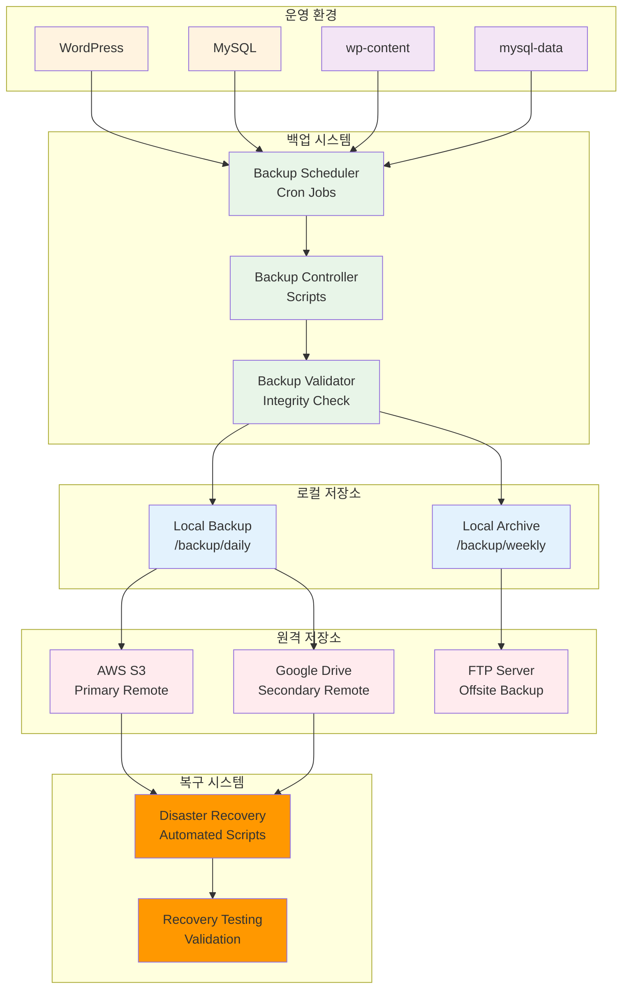

# Week 2 Day 2 Lab 2: 데이터 백업 및 복구 시스템

<div align="center">

**🔄 자동 백업** • **☁️ 원격 저장** • **🛡️ 재해 복구**

*자동화된 백업과 재해 복구 시스템 구축*

</div>

---

## 🕘 실습 정보

**시간**: 14:00-14:50 (50분)  
**목표**: 자동화된 백업과 재해 복구 시스템 구축  
**방식**: 백업 자동화 + 원격 저장 + 복구 테스트

---

## 🎯 심화 목표

### 🛡️ 고급 기능 구현
- Lab 1에서 구축한 WordPress 시스템에 백업 시스템 추가
- 실무 환경에서 사용하는 백업 전략 적용
- 자동화된 백업 스케줄링과 원격 저장
- 재해 상황 시뮬레이션과 복구 절차

### 🏗️ 백업 시스템 아키텍처


---

## 📋 실습 준비 (5분)

### 환경 설정
```bash
# Lab 1에서 구축한 환경 확인
cd ~/wordpress-stack
docker ps --format "table {{.Names}}\t{{.Status}}\t{{.Ports}}"

# 백업 시스템을 위한 추가 디렉토리 생성
mkdir -p backup/{daily,weekly,monthly,scripts,logs,restore}
mkdir -p remote/{s3,gdrive,ftp}

# 데이터베이스 상태 확인 및 준비
./lab_scripts/lab2/check_and_prepare_data.sh
```

### 백업 요구사항 정의
- **백업 주기**: 일일(7일 보관), 주간(4주 보관), 월간(12개월 보관)
- **백업 대상**: MySQL 데이터, WordPress 파일, 설정 파일
- **원격 저장**: 3-2-1 백업 규칙 적용
- **복구 목표**: RTO 4시간, RPO 1시간

---

## 🔧 심화 구현 (40분)

### Step 1: 자동화된 백업 시스템 구축 (15분)

**🚀 자동화 스크립트 사용**
```bash
# 1. 데이터 준비 확인 (필수)
./lab_scripts/lab2/check_and_prepare_data.sh

# 2. 백업 시스템 자동 구축
./lab_scripts/lab2/setup_backup_system.sh
```

**📋 스크립트 내용**: [setup_backup_system.sh](./lab_scripts/lab2/setup_backup_system.sh)

**1-1. 수동 실행 (학습용)**
```bash
# 백업 설정 파일 생성
cat > backup/scripts/backup-config.conf << 'EOF'
# 백업 설정
BACKUP_ROOT="/backup"
MYSQL_CONTAINER="mysql-wordpress"
WORDPRESS_CONTAINER="wordpress-app"
MYSQL_USER="wpuser"
MYSQL_PASSWORD="wppassword"
MYSQL_DATABASE="wordpress"

# 보관 정책
DAILY_RETENTION=7
WEEKLY_RETENTION=4
MONTHLY_RETENTION=12

# 원격 저장소
S3_BUCKET="company-wordpress-backup"
S3_REGION="ap-northeast-2"
GDRIVE_FOLDER="WordPress_Backups"
FTP_HOST="backup.company.com"
FTP_USER="backup_user"
EOF

# 메인 백업 스크립트 생성
cat > backup/scripts/backup-main.sh << 'EOF'
#!/bin/bash
source /backup/scripts/backup-config.conf

BACKUP_DATE=$(date +%Y%m%d_%H%M%S)
BACKUP_TYPE=${1:-daily}  # daily, weekly, monthly
LOG_FILE="/backup/logs/backup_${BACKUP_DATE}.log"

# 로깅 함수
log() {
    echo "[$(date '+%Y-%m-%d %H:%M:%S')] $1" | tee -a ${LOG_FILE}
}

# 데이터베이스 백업
backup_database() {
    log "Starting database backup..."
    
    docker exec ${MYSQL_CONTAINER} mysqldump \
        --single-transaction \
        --routines \
        --triggers \
        --add-drop-database \
        --databases ${MYSQL_DATABASE} \
        -u ${MYSQL_USER} -p${MYSQL_PASSWORD} \
        > ${BACKUP_ROOT}/${BACKUP_TYPE}/mysql_${BACKUP_DATE}.sql
    
    if [ $? -eq 0 ]; then
        gzip ${BACKUP_ROOT}/${BACKUP_TYPE}/mysql_${BACKUP_DATE}.sql
        log "Database backup completed successfully"
    else
        log "ERROR: Database backup failed"
        exit 1
    fi
}

# WordPress 파일 백업
backup_wordpress() {
    log "Starting WordPress files backup..."
    
    # wp-content 백업
    docker run --rm \
        -v wp-content:/data:ro \
        -v ${BACKUP_ROOT}/${BACKUP_TYPE}:/backup \
        alpine tar czf /backup/wp-content_${BACKUP_DATE}.tar.gz -C /data .
    
    # WordPress 설정 백업
    docker run --rm \
        -v wp-config:/config:ro \
        -v ${BACKUP_ROOT}/${BACKUP_TYPE}:/backup \
        alpine tar czf /backup/wp-config_${BACKUP_DATE}.tar.gz -C /config .
    
    log "WordPress files backup completed"
}

# 백업 무결성 검증
verify_backup() {
    log "Verifying backup integrity..."
    
    # 파일 크기 확인
    DB_SIZE=$(stat -c%s "${BACKUP_ROOT}/${BACKUP_TYPE}/mysql_${BACKUP_DATE}.sql.gz")
    WP_SIZE=$(stat -c%s "${BACKUP_ROOT}/${BACKUP_TYPE}/wp-content_${BACKUP_DATE}.tar.gz")
    
    if [ $DB_SIZE -lt 1000 ] || [ $WP_SIZE -lt 1000 ]; then
        log "ERROR: Backup files are too small"
        exit 1
    fi
    
    # 압축 파일 무결성 확인
    if ! gzip -t "${BACKUP_ROOT}/${BACKUP_TYPE}/mysql_${BACKUP_DATE}.sql.gz"; then
        log "ERROR: Database backup is corrupted"
        exit 1
    fi
    
    if ! tar -tzf "${BACKUP_ROOT}/${BACKUP_TYPE}/wp-content_${BACKUP_DATE}.tar.gz" >/dev/null; then
        log "ERROR: WordPress backup is corrupted"
        exit 1
    fi
    
    # 체크섬 생성
    cd ${BACKUP_ROOT}/${BACKUP_TYPE}
    md5sum *_${BACKUP_DATE}.* > checksums_${BACKUP_DATE}.md5
    
    log "Backup verification completed successfully"
}

# 메인 실행
main() {
    log "=== Backup started (Type: ${BACKUP_TYPE}) ==="
    
    backup_database
    backup_wordpress
    verify_backup
    
    log "=== Backup completed successfully ==="
}

main
EOF

chmod +x backup/scripts/backup-main.sh
```

**1-2. 백업 스케줄링 설정**
```bash
# Cron 스케줄 설정 스크립트
cat > backup/scripts/setup-cron.sh << 'EOF'
#!/bin/bash

# 현재 crontab 백업
crontab -l > /tmp/crontab.backup 2>/dev/null

# 새로운 cron 작업 추가
cat >> /tmp/crontab.backup << 'CRON'
# WordPress 백업 스케줄
# 매일 새벽 2시 일일 백업
0 2 * * * /backup/scripts/backup-main.sh daily >> /backup/logs/cron.log 2>&1

# 매주 일요일 새벽 3시 주간 백업
0 3 * * 0 /backup/scripts/backup-main.sh weekly >> /backup/logs/cron.log 2>&1

# 매월 1일 새벽 4시 월간 백업
0 4 1 * * /backup/scripts/backup-main.sh monthly >> /backup/logs/cron.log 2>&1

# 매일 새벽 5시 원격 동기화
0 5 * * * /backup/scripts/sync-remote.sh >> /backup/logs/sync.log 2>&1

# 매주 토요일 새벽 6시 백업 정리
0 6 * * 6 /backup/scripts/cleanup-old.sh >> /backup/logs/cleanup.log 2>&1
CRON

# crontab 적용
crontab /tmp/crontab.backup
echo "Cron jobs installed successfully"
crontab -l
EOF

chmod +x backup/scripts/setup-cron.sh
```

### Step 2: 원격 저장소 연동 (10분)

**🚀 자동화 스크립트 사용**
```bash
# 원격 저장소 연동 자동 설정
./lab_scripts/lab2/setup_remote_storage.sh
```

**📋 스크립트 내용**: [setup_remote_storage.sh](./lab_scripts/lab2/setup_remote_storage.sh)

**2-1. 수동 실행 (학습용)**
```bash
# AWS S3 동기화 스크립트
cat > backup/scripts/sync-s3.sh << 'EOF'
#!/bin/bash
source /backup/scripts/backup-config.conf

log() {
    echo "[$(date '+%Y-%m-%d %H:%M:%S')] $1"
}

sync_to_s3() {
    log "Starting S3 sync..."
    
    # AWS CLI 설치 확인
    if ! command -v aws &> /dev/null; then
        log "Installing AWS CLI..."
        curl "https://awscli.amazonaws.com/awscli-exe-linux-x86_64.zip" -o "awscliv2.zip"
        unzip awscliv2.zip
        sudo ./aws/install
    fi
    
    # 일일 백업 동기화
    aws s3 sync /backup/daily/ s3://${S3_BUCKET}/daily/ \
        --exclude "*.log" \
        --storage-class STANDARD_IA
    
    # 주간 백업 동기화
    aws s3 sync /backup/weekly/ s3://${S3_BUCKET}/weekly/ \
        --exclude "*.log" \
        --storage-class GLACIER
    
    # 월간 백업 동기화
    aws s3 sync /backup/monthly/ s3://${S3_BUCKET}/monthly/ \
        --exclude "*.log" \
        --storage-class DEEP_ARCHIVE
    
    log "S3 sync completed"
}

sync_to_s3
EOF

# Google Drive 동기화 스크립트
cat > backup/scripts/sync-gdrive.sh << 'EOF'
#!/bin/bash
source /backup/scripts/backup-config.conf

log() {
    echo "[$(date '+%Y-%m-%d %H:%M:%S')] $1"
}

sync_to_gdrive() {
    log "Starting Google Drive sync..."
    
    # rclone 설치 확인
    if ! command -v rclone &> /dev/null; then
        log "Installing rclone..."
        curl https://rclone.org/install.sh | sudo bash
    fi
    
    # Google Drive 동기화 (일일 백업만)
    rclone sync /backup/daily/ gdrive:${GDRIVE_FOLDER}/daily/ \
        --exclude "*.log" \
        --progress
    
    log "Google Drive sync completed"
}

sync_to_gdrive
EOF

# 통합 원격 동기화 스크립트
cat > backup/scripts/sync-remote.sh << 'EOF'
#!/bin/bash

LOG_FILE="/backup/logs/sync_$(date +%Y%m%d_%H%M%S).log"

log() {
    echo "[$(date '+%Y-%m-%d %H:%M:%S')] $1" | tee -a ${LOG_FILE}
}

log "=== Remote sync started ==="

# S3 동기화
if /backup/scripts/sync-s3.sh >> ${LOG_FILE} 2>&1; then
    log "S3 sync successful"
else
    log "ERROR: S3 sync failed"
fi

# Google Drive 동기화
if /backup/scripts/sync-gdrive.sh >> ${LOG_FILE} 2>&1; then
    log "Google Drive sync successful"
else
    log "ERROR: Google Drive sync failed"
fi

log "=== Remote sync completed ==="
EOF

chmod +x backup/scripts/sync-*.sh
```

### Step 3: 재해 복구 시스템 구축 (10분)

**🚀 자동화 스크립트 사용**
```bash
# 재해 복구 시스템 자동 구축
./lab_scripts/lab2/setup_disaster_recovery.sh
```

**📋 스크립트 내용**: [setup_disaster_recovery.sh](./lab_scripts/lab2/setup_disaster_recovery.sh)

**3-1. 수동 실행 (학습용)**
```bash
# 재해 복구 메인 스크립트
cat > backup/scripts/disaster-recovery.sh << 'EOF'
#!/bin/bash
source /backup/scripts/backup-config.conf

RECOVERY_DATE=${1:-latest}
RECOVERY_TYPE=${2:-daily}
LOG_FILE="/backup/logs/recovery_$(date +%Y%m%d_%H%M%S).log"

log() {
    echo "[$(date '+%Y-%m-%d %H:%M:%S')] $1" | tee -a ${LOG_FILE}
}

# 백업 파일 검색
find_backup_files() {
    log "Searching for backup files..."
    
    if [ "$RECOVERY_DATE" = "latest" ]; then
        DB_BACKUP=$(ls -t ${BACKUP_ROOT}/${RECOVERY_TYPE}/mysql_*.sql.gz 2>/dev/null | head -1)
        WP_BACKUP=$(ls -t ${BACKUP_ROOT}/${RECOVERY_TYPE}/wp-content_*.tar.gz 2>/dev/null | head -1)
        CONFIG_BACKUP=$(ls -t ${BACKUP_ROOT}/${RECOVERY_TYPE}/wp-config_*.tar.gz 2>/dev/null | head -1)
    else
        DB_BACKUP=$(ls ${BACKUP_ROOT}/${RECOVERY_TYPE}/mysql_*${RECOVERY_DATE}*.sql.gz 2>/dev/null | head -1)
        WP_BACKUP=$(ls ${BACKUP_ROOT}/${RECOVERY_TYPE}/wp-content_*${RECOVERY_DATE}*.tar.gz 2>/dev/null | head -1)
        CONFIG_BACKUP=$(ls ${BACKUP_ROOT}/${RECOVERY_TYPE}/wp-config_*${RECOVERY_DATE}*.tar.gz 2>/dev/null | head -1)
    fi
    
    if [ -z "$DB_BACKUP" ] || [ -z "$WP_BACKUP" ]; then
        log "ERROR: Required backup files not found"
        exit 1
    fi
    
    log "Found backup files:"
    log "  Database: $DB_BACKUP"
    log "  WordPress: $WP_BACKUP"
    log "  Config: $CONFIG_BACKUP"
}

# 기존 환경 정리
cleanup_existing() {
    log "Cleaning up existing environment..."
    
    # 컨테이너 중지 및 제거
    docker-compose -f ~/wordpress-stack/docker-compose.yml down -v
    
    # 볼륨 제거 (주의: 데이터 손실)
    docker volume rm wp-content wp-config mysql-data 2>/dev/null || true
    
    log "Cleanup completed"
}

# 데이터베이스 복구
restore_database() {
    log "Restoring database..."
    
    # MySQL 컨테이너만 먼저 시작
    docker-compose -f ~/wordpress-stack/docker-compose.yml up -d mysql
    
    # MySQL 준비 대기
    log "Waiting for MySQL to be ready..."
    sleep 30
    
    # 데이터베이스 복구
    gunzip -c "$DB_BACKUP" | docker exec -i mysql-wordpress mysql -u root -prootpassword
    
    if [ $? -eq 0 ]; then
        log "Database restore completed successfully"
    else
        log "ERROR: Database restore failed"
        exit 1
    fi
}

# WordPress 파일 복구
restore_wordpress() {
    log "Restoring WordPress files..."
    
    # wp-content 복구
    docker run --rm \
        -v wp-content:/data \
        -v "$(dirname $WP_BACKUP):/backup:ro" \
        alpine sh -c "cd /data && tar xzf /backup/$(basename $WP_BACKUP)"
    
    # wp-config 복구 (있는 경우)
    if [ -n "$CONFIG_BACKUP" ]; then
        docker run --rm \
            -v wp-config:/config \
            -v "$(dirname $CONFIG_BACKUP):/backup:ro" \
            alpine sh -c "cd /config && tar xzf /backup/$(basename $CONFIG_BACKUP)"
    fi
    
    log "WordPress files restore completed"
}

# 서비스 시작 및 검증
start_and_verify() {
    log "Starting WordPress services..."
    
    # 전체 서비스 시작
    docker-compose -f ~/wordpress-stack/docker-compose.yml up -d
    
    # 서비스 준비 대기
    log "Waiting for services to be ready..."
    sleep 60
    
    # 서비스 상태 확인
    if curl -f http://localhost:8080 >/dev/null 2>&1; then
        log "WordPress is accessible at http://localhost:8080"
        log "Recovery completed successfully!"
    else
        log "WARNING: WordPress may not be fully ready yet"
        log "Please check manually at http://localhost:8080"
    fi
}

# 메인 실행
main() {
    log "=== Disaster Recovery Started ==="
    log "Recovery Date: $RECOVERY_DATE"
    log "Recovery Type: $RECOVERY_TYPE"
    
    find_backup_files
    
    read -p "This will destroy current data. Continue? (y/N): " -n 1 -r
    echo
    if [[ ! $REPLY =~ ^[Yy]$ ]]; then
        log "Recovery cancelled by user"
        exit 0
    fi
    
    cleanup_existing
    restore_database
    restore_wordpress
    start_and_verify
    
    log "=== Disaster Recovery Completed ==="
}

main
EOF

# 백업 정리 스크립트
cat > backup/scripts/cleanup-old.sh << 'EOF'
#!/bin/bash
source /backup/scripts/backup-config.conf

LOG_FILE="/backup/logs/cleanup_$(date +%Y%m%d_%H%M%S).log"

log() {
    echo "[$(date '+%Y-%m-%d %H:%M:%S')] $1" | tee -a ${LOG_FILE}
}

cleanup_daily() {
    log "Cleaning up daily backups older than ${DAILY_RETENTION} days..."
    find ${BACKUP_ROOT}/daily -name "*" -type f -mtime +${DAILY_RETENTION} -delete
    log "Daily cleanup completed"
}

cleanup_weekly() {
    log "Cleaning up weekly backups older than ${WEEKLY_RETENTION} weeks..."
    find ${BACKUP_ROOT}/weekly -name "*" -type f -mtime +$((${WEEKLY_RETENTION} * 7)) -delete
    log "Weekly cleanup completed"
}

cleanup_monthly() {
    log "Cleaning up monthly backups older than ${MONTHLY_RETENTION} months..."
    find ${BACKUP_ROOT}/monthly -name "*" -type f -mtime +$((${MONTHLY_RETENTION} * 30)) -delete
    log "Monthly cleanup completed"
}

cleanup_logs() {
    log "Cleaning up old log files..."
    find /backup/logs -name "*.log" -type f -mtime +30 -delete
    log "Log cleanup completed"
}

main() {
    log "=== Backup Cleanup Started ==="
    
    cleanup_daily
    cleanup_weekly
    cleanup_monthly
    cleanup_logs
    
    # 디스크 사용량 보고
    log "Current backup disk usage:"
    du -sh ${BACKUP_ROOT}/* | tee -a ${LOG_FILE}
    
    log "=== Backup Cleanup Completed ==="
}

main
EOF

chmod +x backup/scripts/*.sh/scripts/backup-config.conf

RECOVERY_TYPE=${1:-latest}  # latest, date, s3
RECOVERY_DATE=${2:-$(date +%Y%m%d)}
LOG_FILE="/backup/logs/recovery_$(date +%Y%m%d_%H%M%S).log"

log() {
    echo "[$(date '+%Y-%m-%d %H:%M:%S')] $1" | tee -a ${LOG_FILE}
}

# 현재 시스템 백업 (복구 전)
backup_current_system() {
    log "Backing up current system before recovery..."
    
    EMERGENCY_BACKUP="/backup/emergency_$(date +%Y%m%d_%H%M%S)"
    mkdir -p ${EMERGENCY_BACKUP}
    
    # 현재 데이터베이스 백업
    docker exec ${MYSQL_CONTAINER} mysqldump \
        --single-transaction \
        --routines \
        --triggers \
        --databases ${MYSQL_DATABASE} \
        -u ${MYSQL_USER} -p${MYSQL_PASSWORD} \
        > ${EMERGENCY_BACKUP}/current_mysql.sql
    
    # 현재 WordPress 파일 백업
    docker run --rm \
        -v wp-content:/data:ro \
        -v ${EMERGENCY_BACKUP}:/backup \
        alpine tar czf /backup/current_wp-content.tar.gz -C /data .
    
    log "Current system backup completed: ${EMERGENCY_BACKUP}"
}

# 백업 파일 찾기
find_backup_files() {
    case ${RECOVERY_TYPE} in
        "latest")
            DB_BACKUP=$(ls -t /backup/daily/mysql_*.sql.gz | head -1)
            WP_BACKUP=$(ls -t /backup/daily/wp-content_*.tar.gz | head -1)
            ;;
        "date")
            DB_BACKUP=$(ls /backup/*/mysql_*${RECOVERY_DATE}*.sql.gz | head -1)
            WP_BACKUP=$(ls /backup/*/wp-content_*${RECOVERY_DATE}*.tar.gz | head -1)
            ;;
        "s3")
            log "Downloading from S3..."
            aws s3 cp s3://${S3_BUCKET}/daily/ /backup/restore/ --recursive --exclude "*" --include "*${RECOVERY_DATE}*"
            DB_BACKUP=$(ls /backup/restore/mysql_*${RECOVERY_DATE}*.sql.gz | head -1)
            WP_BACKUP=$(ls /backup/restore/wp-content_*${RECOVERY_DATE}*.tar.gz | head -1)
            ;;
    esac
    
    if [[ ! -f "$DB_BACKUP" ]] || [[ ! -f "$WP_BACKUP" ]]; then
        log "ERROR: Backup files not found for ${RECOVERY_TYPE} ${RECOVERY_DATE}"
        exit 1
    fi
    
    log "Found backup files:"
    log "  Database: $DB_BACKUP"
    log "  WordPress: $WP_BACKUP"
}

# 데이터베이스 복구
restore_database() {
    log "Starting database restoration..."
    
    # 데이터베이스 백업 압축 해제
    gunzip -c "$DB_BACKUP" > /tmp/restore_db.sql
    
    # 기존 데이터베이스 삭제 및 재생성
    docker exec ${MYSQL_CONTAINER} mysql -u root -p${MYSQL_ROOT_PASSWORD} -e "
        DROP DATABASE IF EXISTS ${MYSQL_DATABASE};
        CREATE DATABASE ${MYSQL_DATABASE} CHARACTER SET utf8mb4 COLLATE utf8mb4_unicode_ci;
        GRANT ALL PRIVILEGES ON ${MYSQL_DATABASE}.* TO '${MYSQL_USER}'@'%';
        FLUSH PRIVILEGES;
    "
    
    # 백업 데이터 복원
    docker exec -i ${MYSQL_CONTAINER} mysql -u ${MYSQL_USER} -p${MYSQL_PASSWORD} ${MYSQL_DATABASE} < /tmp/restore_db.sql
    
    if [ $? -eq 0 ]; then
        log "Database restoration completed successfully"
        rm /tmp/restore_db.sql
    else
        log "ERROR: Database restoration failed"
        exit 1
    fi
}

# WordPress 파일 복구
restore_wordpress() {
    log "Starting WordPress files restoration..."
    
    # 기존 wp-content 백업
    docker run --rm \
        -v wp-content:/data \
        -v /backup/restore:/backup \
        alpine tar czf /backup/wp-content-before-restore.tar.gz -C /data .
    
    # wp-content 복원
    docker run --rm \
        -v wp-content:/data \
        -v $(dirname "$WP_BACKUP"):/backup \
        alpine sh -c "rm -rf /data/* && tar xzf /backup/$(basename "$WP_BACKUP") -C /data"
    
    log "WordPress files restoration completed"
}

# 서비스 재시작 및 검증
restart_and_verify() {
    log "Restarting services..."
    
    # WordPress 컨테이너 재시작
    docker restart ${WORDPRESS_CONTAINER}
    docker restart nginx-proxy
    
    # 서비스 시작 대기
    sleep 30
    
    # 헬스 체크
    if curl -f http://localhost/health >/dev/null 2>&1; then
        log "WordPress service is healthy"
    else
        log "WARNING: WordPress service health check failed"
    fi
    
    # 데이터베이스 연결 확인
    if docker exec ${MYSQL_CONTAINER} mysql -u ${MYSQL_USER} -p${MYSQL_PASSWORD} -e "SELECT 1 FROM ${MYSQL_DATABASE}.wp_posts LIMIT 1;" >/dev/null 2>&1; then
        log "Database connection and data verified"
    else
        log "WARNING: Database verification failed"
    fi
}

# 메인 실행
main() {
    log "=== Disaster Recovery Started ==="
    log "Recovery Type: ${RECOVERY_TYPE}"
    log "Recovery Date: ${RECOVERY_DATE}"
    
    backup_current_system
    find_backup_files
    restore_database
    restore_wordpress
    restart_and_verify
    
    log "=== Disaster Recovery Completed ==="
}

# 사용법 확인
if [[ $# -eq 0 ]]; then
    echo "Usage: $0 {latest|date|s3} [YYYYMMDD]"
    echo "Examples:"
    echo "  $0 latest                    # Restore from latest local backup"
    echo "  $0 date 20241201            # Restore from specific date"
    echo "  $0 s3 20241201              # Restore from S3 backup"
    exit 1
fi

main
EOF

chmod +x backup/scripts/disaster-recovery.sh
```

### Step 4: 백업 시스템 테스트 및 검증 (5분)

**🚀 자동화 스크립트 사용**
```bash
# 백업 시스템 종합 테스트
./lab_scripts/lab2/test_backup_system.sh
```

**📋 스크립트 내용**: [test_backup_system.sh](./lab_scripts/lab2/test_backup_system.sh)

**4-1. 수동 실행 (학습용)**
```bash
# 백업 테스트 실행
echo "=== 백업 시스템 테스트 시작 ==="

# 1. 수동 백업 실행
echo "1. 수동 백업 테스트..."
./backup/scripts/backup-main.sh daily

# 2. 백업 파일 확인
echo "2. 백업 파일 검증..."
ls -la backup/daily/
cat backup/daily/checksums_*.md5

# 3. 재해 복구 테스트 (테스트 환경)
echo "3. 재해 복구 시뮬레이션..."
# 테스트용 데이터 추가
docker exec mysql-wordpress mysql -u wpuser -pwppassword wordpress -e "
    INSERT INTO wp_posts (post_title, post_content, post_status) 
    VALUES ('Test Recovery Post', 'This is a test post for recovery', 'publish');
"

# 백업 실행
./backup/scripts/backup-main.sh daily

# 데이터 삭제 (재해 시뮬레이션)
docker exec mysql-wordpress mysql -u wpuser -pwppassword wordpress -e "
    DELETE FROM wp_posts WHERE post_title = 'Test Recovery Post';
"

# 복구 실행
./backup/scripts/disaster-recovery.sh latest

# 복구 확인
docker exec mysql-wordpress mysql -u wpuser -pwppassword wordpress -e "
    SELECT post_title FROM wp_posts WHERE post_title = 'Test Recovery Post';
"

echo "=== 백업 시스템 테스트 완료 ==="
```

---

## ✅ 심화 체크포인트

### 고급 기능 구현
- [ ] **자동화된 백업**: 일일/주간/월간 백업 스케줄 동작
- [ ] **원격 저장소**: S3, Google Drive 동기화 정상 동작
- [ ] **백업 검증**: 무결성 검사 및 체크섬 생성
- [ ] **재해 복구**: 자동화된 복구 스크립트 동작 확인

### 실무 환경 연동
- [ ] **3-2-1 백업 규칙**: 3개 복사본, 2개 매체, 1개 오프사이트
- [ ] **보관 정책**: 일일(7일), 주간(4주), 월간(12개월) 적용
- [ ] **RTO/RPO 목표**: 복구 시간 4시간, 데이터 손실 1시간 이내
- [ ] **모니터링**: 백업 성공/실패 알림 시스템

### 성능 최적화
- [ ] **압축 효율성**: 백업 파일 크기 최적화
- [ ] **네트워크 대역폭**: 원격 동기화 시간 최적화
- [ ] **스토리지 비용**: 클라우드 스토리지 클래스 최적화
- [ ] **복구 속도**: 빠른 복구를 위한 인덱싱

### 베스트 프랙티스
- [ ] **암호화**: 백업 데이터 암호화 적용
- [ ] **접근 제어**: 백업 파일 접근 권한 관리
- [ ] **감사 로그**: 모든 백업/복구 작업 로깅
- [ ] **정기 테스트**: 월 1회 복구 테스트 실행

---

## 🎤 결과 발표 및 회고 (5분)

### 시연
- **백업 자동화**: 스케줄된 백업 작업 시연
- **원격 동기화**: 클라우드 저장소 업로드 확인
- **재해 복구**: 실제 복구 과정 시연
- **모니터링**: 백업 상태 대시보드 확인

### 기술적 인사이트
- **백업 전략**: 3-2-1 규칙의 실제 적용 경험
- **자동화 가치**: 수동 vs 자동 백업의 효율성 차이
- **클라우드 활용**: 다중 클라우드 백업의 장단점
- **복구 경험**: 실제 재해 상황 대응 능력

### 베스트 프랙티스
- **백업 정책**: 비즈니스 요구사항에 맞는 백업 정책 수립
- **비용 최적화**: 스토리지 비용과 복구 속도의 균형
- **보안 고려**: 백업 데이터 보안과 접근 제어
- **지속적 개선**: 백업 시스템의 지속적 모니터링과 개선

### 문제 해결 경험
- **네트워크 이슈**: 원격 동기화 중 네트워크 문제 해결
- **용량 관리**: 백업 데이터 증가에 따른 용량 관리
- **성능 튜닝**: 백업 시간 최적화 방법
- **복구 검증**: 복구된 데이터의 무결성 확인 방법

### 향후 발전 방향
- **클라우드 네이티브**: Kubernetes 환경에서의 백업 전략
- **AI 기반 최적화**: 머신러닝을 활용한 백업 최적화
- **실시간 복제**: 실시간 데이터 복제 시스템 구축
- **제로 다운타임**: 무중단 백업 및 복구 시스템

---

## 🧹 실습 환경 정리

**실습 완료 후 정리**
```bash
# 모든 실습 환경 자동 정리
./lab_scripts/lab2/cleanup.sh
```

**📋 스크립트 내용**: [cleanup.sh](./lab_scripts/lab2/cleanup.sh)

---

<div align="center">

**🔄 데이터 백업 및 복구 시스템 구축 완료!**

**축하합니다! Docker 스토리지와 데이터 관리의 모든 것을 마스터했습니다!**

**다음**: [Day 3 - Docker 운영 & 모니터링](../day3/README.md)

</div>

### Step 4: 백업 테스트 및 검증 (5분)

**🚀 자동화 스크립트 사용**
```bash
# 백업 시스템 종합 테스트
./lab_scripts/lab2/test_backup_system.sh
```

**📋 스크립트 내용**: [test_backup_system.sh](./lab_scripts/lab2/test_backup_system.sh)

**4-1. 수동 실행 (학습용)**
```bash
# 백업 실행 테스트
echo "=== 백업 시스템 테스트 시작 ==="

# 1. 일일 백업 테스트
echo "1. 일일 백업 테스트..."
./backup/scripts/backup-main.sh daily

# 2. 백업 파일 확인
echo "2. 백업 파일 확인..."
ls -la backup/daily/

# 3. 백업 무결성 검증
echo "3. 백업 무결성 검증..."
cd backup/daily
md5sum -c checksums_*.md5

# 4. 재해 복구 테스트 (시뮬레이션)
echo "4. 재해 복구 시뮬레이션..."
echo "주의: 실제 데이터가 삭제됩니다. 테스트 환경에서만 실행하세요."
read -p "계속하시겠습니까? (y/N): " -n 1 -r
echo
if [[ $REPLY =~ ^[Yy]$ ]]; then
    ./backup/scripts/disaster-recovery.sh latest daily
fi

# 5. 백업 스케줄 확인
echo "5. 백업 스케줄 확인..."
crontab -l | grep backup

echo "=== 백업 시스템 테스트 완료 ==="
```

**4-2. 모니터링 대시보드 설정**
```bash
# 백업 상태 모니터링 스크립트
cat > backup/scripts/backup-status.sh << 'EOF'
#!/bin/bash

echo "=== WordPress 백업 시스템 상태 ==="
echo

# 최근 백업 파일 확인
echo "📁 최근 백업 파일:"
echo "일일 백업:"
ls -lt /backup/daily/*.gz 2>/dev/null | head -3
echo
echo "주간 백업:"
ls -lt /backup/weekly/*.gz 2>/dev/null | head -2
echo
echo "월간 백업:"
ls -lt /backup/monthly/*.gz 2>/dev/null | head -2
echo

# 디스크 사용량
echo "💾 백업 디스크 사용량:"
du -sh /backup/*
echo

# 최근 로그 확인
echo "📋 최근 백업 로그:"
tail -10 /backup/logs/backup_*.log 2>/dev/null | tail -5
echo

# Cron 작업 상태
echo "⏰ 예약된 백업 작업:"
crontab -l | grep backup
echo

# 서비스 상태
echo "🔧 WordPress 서비스 상태:"
docker ps --format "table {{.Names}}\t{{.Status}}\t{{.Ports}}" | grep -E "wordpress|mysql"
echo
EOF

chmod +x backup/scripts/backup-status.sh

# 상태 확인 실행
./backup/scripts/backup-status.sh
```

---

## ✅ 심화 체크포인트

### 고급 기능 구현
- [ ] **자동화된 백업**: 일일/주간/월간 백업 스케줄 동작
- [ ] **원격 저장소**: S3, Google Drive 동기화 정상 동작
- [ ] **백업 검증**: 무결성 검사 및 체크섬 생성
- [ ] **재해 복구**: 자동화된 복구 스크립트 동작 확인

### 실무 환경 연동
- [ ] **3-2-1 백업 규칙**: 3개 복사본, 2개 매체, 1개 오프사이트
- [ ] **보관 정책**: 일일(7일), 주간(4주), 월간(12개월) 적용
- [ ] **RTO/RPO 목표**: 복구 시간 4시간, 데이터 손실 1시간 이내
- [ ] **모니터링**: 백업 성공/실패 알림 시스템

### 성능 최적화
- [ ] **압축 효율성**: 백업 파일 크기 최적화
- [ ] **네트워크 대역폭**: 원격 동기화 시간 최적화
- [ ] **스토리지 비용**: 클라우드 스토리지 클래스 최적화
- [ ] **복구 속도**: 빠른 복구를 위한 인덱싱

### 베스트 프랙티스
- [ ] **암호화**: 백업 데이터 암호화 적용
- [ ] **접근 제어**: 백업 파일 접근 권한 관리
- [ ] **감사 로그**: 모든 백업/복구 작업 로깅
- [ ] **정기 테스트**: 월 1회 복구 테스트 실행

---

## 🎤 결과 발표 및 회고 (5분)

### 시연
- **백업 자동화**: 스케줄된 백업 작업 시연
- **원격 동기화**: 클라우드 저장소 업로드 확인
- **재해 복구**: 실제 복구 과정 시연
- **모니터링**: 백업 상태 대시보드 확인

### 기술적 인사이트
- **백업 전략**: 3-2-1 규칙의 실제 적용 경험
- **자동화 가치**: 수동 vs 자동 백업의 효율성 차이
- **클라우드 활용**: 다중 클라우드 백업의 장단점
- **복구 경험**: 실제 재해 상황 대응 능력

### 베스트 프랙티스
- **백업 정책**: 비즈니스 요구사항에 맞는 백업 정책 수립
- **비용 최적화**: 스토리지 비용과 복구 속도의 균형
- **보안 고려**: 백업 데이터 보안과 접근 제어
- **지속적 개선**: 백업 시스템의 지속적 모니터링과 개선

### 문제 해결 경험
- **네트워크 이슈**: 원격 동기화 중 네트워크 문제 해결
- **용량 관리**: 백업 데이터 증가에 따른 용량 관리
- **성능 튜닝**: 백업 시간 최적화 방법
- **복구 검증**: 복구된 데이터의 무결성 확인 방법

### 향후 발전 방향
- **클라우드 네이티브**: Kubernetes 환경에서의 백업 전략
- **AI 기반 최적화**: 머신러닝을 활용한 백업 최적화
- **실시간 복제**: 실시간 데이터 복제 시스템 구축
- **제로 다운타임**: 무중단 백업 및 복구 시스템

---

## 🧹 실습 환경 정리

**실습 완료 후 정리**
```bash
# 모든 실습 환경 자동 정리
./lab_scripts/lab2/cleanup.sh
```

**📋 스크립트 내용**: [cleanup.sh](./lab_scripts/lab2/cleanup.sh)

---

<div align="center">

**🔄 데이터 백업 및 복구 시스템 구축 완료!**

**축하합니다! Docker 스토리지와 데이터 관리의 모든 것을 마스터했습니다!**

**다음**: [Day 3 - Docker 운영 & 모니터링](../day3/README.md)

</div>