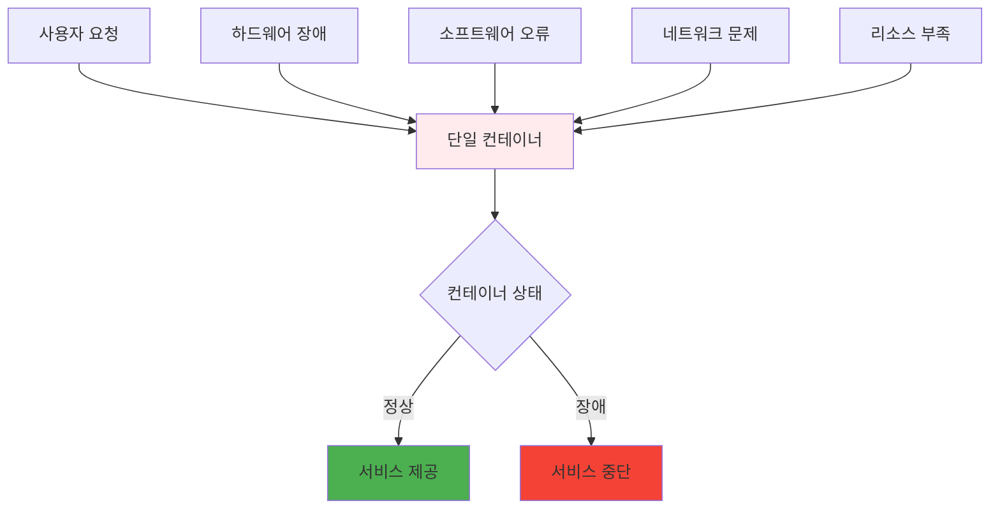
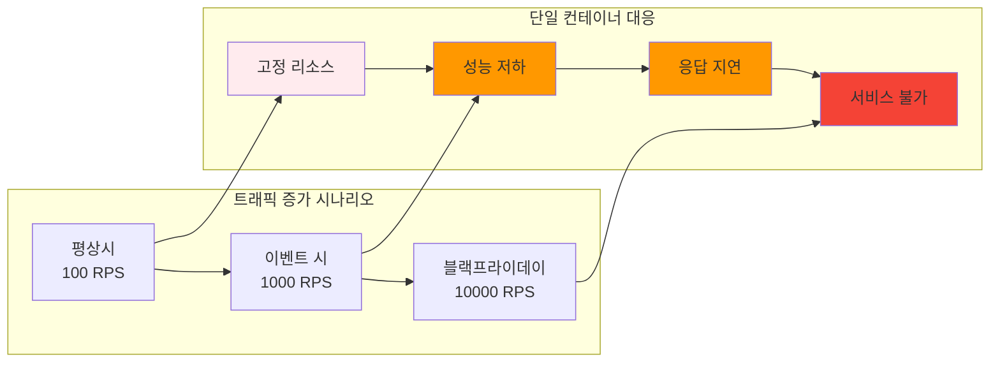

# Week 2 Day 2 Session 1: 단일 컨테이너 운영의 한계점과 문제 상황

**⚠️ 단일 컨테이너 한계** • **🚨 운영 문제점**

*단일 컨테이너 운영에서 발생하는 실제 문제점들 완전 이해*

---

## 🕘 세션 정보

**시간**: 09:00-09:50 (50분)  
**목표**: 단일 컨테이너 운영에서 발생하는 실제 문제점들 완전 이해  
**방식**: 문제 상황 분석 + 실제 사례 + 해결 필요성

---

## 🎯 세션 목표

### 📚 학습 목표
- **이해 목표**: 단일 컨테이너 운영에서 발생하는 실제 문제점들 완전 이해
- **적용 목표**: 실무에서 마주치는 운영 문제 상황을 예측하고 대비하는 능력
- **협업 목표**: 팀원들과 운영 경험 공유 및 문제 해결 방안 토론

### 🤔 왜 필요한가? (5분)

**현실 문제 상황**:
- 💼 **서비스 중단 사고**: 단일 컨테이너 장애로 인한 전체 서비스 다운
- 🏠 **일상 비유**: 혼자서 모든 집안일을 처리하는 것의 한계
- 📊 **시장 동향**: 99.9% 가용성 요구사항을 만족하기 어려운 단일 컨테이너

---

## 📖 핵심 개념 (35분)

### 🔍 개념 1: 가용성과 신뢰성 문제 (12분)

> **정의**: 단일 컨테이너 환경에서 발생하는 서비스 중단과 신뢰성 저하 문제

**단일 장애점 (Single Point of Failure)**:

### 🔍 개념 2: 확장성과 성능 한계 (12분)

> **정의**: 트래픽 증가나 부하 변동에 대응하기 어려운 단일 컨테이너의 구조적 한계

**확장성 문제**:

### 🔍 개념 3: 운영 관리의 복잡성 (11분)

> **정의**: 수동 운영으로 인한 관리 복잡성과 인적 오류 가능성

**수동 운영의 문제점**:
- **24/7 모니터링**: 상시 감시 체계 필요
- **수동 복구**: 장애 발생 시 즉시 수동 개입
- **설정 관리**: 환경별 설정 파일 수동 관리
- **배포 위험**: 수동 배포로 인한 휴먼 에러

---

## 💭 함께 생각해보기 (10분)

### 🤝 페어 토론 (5분)

**토론 주제**:
1. **장애 경험**: "서비스나 시스템 장애를 경험해본 적이 있나요?"
2. **운영 부담**: "수동으로 시스템을 관리할 때 가장 어려운 점은?"
3. **해결 방안**: "이런 문제들을 어떻게 해결할 수 있을까요?"

### 🎯 전체 공유 (5분)

- **문제 공감**: 단일 컨테이너 운영의 어려움 공유
- **해결 동기**: 오케스트레이션 필요성에 대한 동기 부여

---

## 🔑 핵심 키워드

- **Single Point of Failure (SPOF)**: 단일 장애점
- **High Availability (HA)**: 고가용성
- **Scalability**: 확장성
- **Manual Operations**: 수동 운영
- **Human Error**: 인적 오류

---

## 📝 세션 마무리

### ✅ 오늘 세션 성과
- [ ] 단일 컨테이너 운영의 한계점 이해
- [ ] 가용성과 확장성 문제 파악
- [ ] 수동 운영의 위험성 인식

### 🎯 다음 세션 준비
- **주제**: 오케스트레이션 개념과 핵심 기능
- **연결**: 문제 해결책으로서의 오케스트레이션

---

**⚠️ 단일 컨테이너의 한계를 완전히 이해했습니다!**

**다음**: [Session 2 - 오케스트레이션 개념과 핵심 기능](./session_2.md)

