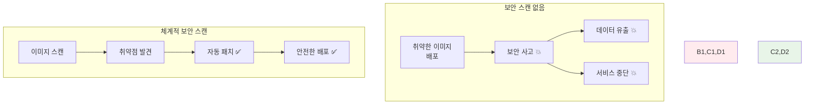
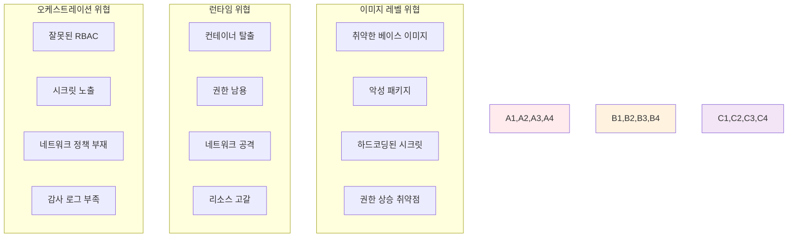

# Week 2 Day 2 Session 1: 컨테이너 보안 스캔과 취약점 관리

<div align="center">

**🔍 보안 스캔** • **🛡️ 취약점 관리**

*컨테이너 이미지부터 런타임까지 완전한 보안 검증 시스템 구축*

</div>

---

## 🕘 세션 정보

**시간**: 09:00-09:50 (50분)  
**목표**: 컨테이너 보안 스캔과 취약점 관리 완전 습득  
**방식**: 보안 도구 실습 + 취약점 분석 + 자동화 구축

---

## 🎯 세션 목표

### 📚 학습 목표
- **이해 목표**: 컨테이너 보안 위협과 스캔 메커니즘 완전 이해
- **적용 목표**: 다양한 보안 스캔 도구를 활용한 취약점 발견과 해결
- **협업 목표**: 팀 프로젝트에서 보안 스캔을 자동화하고 공유하는 문화 구축

### 🤔 왜 컨테이너 보안 스캔인가? (5분)

**현실 보안 위협**:
- 💼 **실무 사고**: 취약한 베이스 이미지로 인한 대규모 보안 사고
- 🏠 **일상 비유**: 집을 짓기 전에 건축 자재의 안전성을 검사하는 것과 같음
- 📊 **시장 현황**: 컨테이너 보안 사고의 80%가 알려진 취약점으로 발생

**보안 스캔의 중요성**:


---

## 📖 핵심 개념 (35분)

### 🔍 개념 1: 컨테이너 보안 위협 모델 (12분)

> **정의**: 컨테이너 환경에서 발생할 수 있는 보안 위협과 공격 벡터

**컨테이너 보안 위협 분류**:


**OWASP Container Top 10 (2021)**:
1. **C01: Insecure User Mapping** - 부적절한 사용자 매핑
2. **C02: Drifted Container** - 드리프트된 컨테이너
3. **C03: Excessive Container Privileges** - 과도한 컨테이너 권한
4. **C04: Insecure Secrets** - 안전하지 않은 시크릿
5. **C05: Insecure Container Images** - 안전하지 않은 컨테이너 이미지
6. **C06: Insecure Container Registries** - 안전하지 않은 컨테이너 레지스트리
7. **C07: Insecure Connections** - 안전하지 않은 연결
8. **C08: Unrestricted Network Traffic** - 제한되지 않은 네트워크 트래픽
9. **C09: Outdated and Vulnerable Images** - 오래되고 취약한 이미지
10. **C10: Insufficient Logging** - 불충분한 로깅

**CVE (Common Vulnerabilities and Exposures) 이해**:
```bash
# CVE 예시: CVE-2021-44228 (Log4Shell)
CVE-2021-44228: Apache Log4j2 Remote Code Execution
- CVSS Score: 10.0 (Critical)
- 영향: 원격 코드 실행 가능
- 해결: Log4j 2.17.0 이상으로 업데이트
```

### 🔍 개념 2: 컨테이너 보안 스캔 도구와 방법 (12분)

> **정의**: 컨테이너 이미지와 런타임의 보안 취약점을 자동으로 검사하는 도구들

**주요 보안 스캔 도구**:

#### 1. Trivy (오픈소스)
```bash
# Trivy 설치
curl -sfL https://raw.githubusercontent.com/aquasecurity/trivy/main/contrib/install.sh | sh -s -- -b /usr/local/bin

# 이미지 스캔
trivy image nginx:latest

# 심각도별 필터링
trivy image --severity HIGH,CRITICAL nginx:latest

# JSON 출력으로 자동화
trivy image --format json --output result.json nginx:latest

# Dockerfile 스캔
trivy config Dockerfile

# 파일시스템 스캔
trivy fs .
```

#### 2. Clair (오픈소스)
```yaml
# docker-compose.yml for Clair
version: '3.8'
services:
  clair:
    image: quay.io/coreos/clair:latest
    ports:
      - "6060:6060"
      - "6061:6061"
    environment:
      - CLAIR_CONF=/config/config.yaml
    volumes:
      - ./clair-config:/config
  
  clair-db:
    image: postgres:13
    environment:
      - POSTGRES_DB=clair
      - POSTGRES_USER=clair
      - POSTGRES_PASSWORD=password
```

#### 3. Snyk (상용)
```bash
# Snyk CLI 설치
npm install -g snyk

# 컨테이너 이미지 스캔
snyk container test nginx:latest

# Dockerfile 스캔
snyk iac test Dockerfile

# 지속적 모니터링
snyk container monitor nginx:latest
```

#### 4. Anchore (오픈소스/상용)
```bash
# Anchore Engine 설치 (Docker Compose)
curl -O https://raw.githubusercontent.com/anchore/anchore-engine/master/scripts/docker-compose/docker-compose.yaml

# 이미지 분석
anchore-cli image add nginx:latest
anchore-cli image wait nginx:latest
anchore-cli image vuln nginx:latest all
```

**스캔 결과 분석**:
```json
{
  "SchemaVersion": 2,
  "ArtifactName": "nginx:latest",
  "ArtifactType": "container_image",
  "Results": [
    {
      "Target": "nginx:latest (debian 11.6)",
      "Class": "os-pkgs",
      "Type": "debian",
      "Vulnerabilities": [
        {
          "VulnerabilityID": "CVE-2022-3715",
          "PkgName": "bash",
          "InstalledVersion": "5.1-2+deb11u1",
          "FixedVersion": "5.1-2+deb11u2",
          "Severity": "HIGH",
          "Description": "A flaw was found in the bash package...",
          "References": [
            "https://cve.mitre.org/cgi-bin/cvename.cgi?name=CVE-2022-3715"
          ]
        }
      ]
    }
  ]
}
```

### 🔍 개념 3: 자동화된 보안 스캔 파이프라인 (11분)

> **정의**: CI/CD 파이프라인에 통합된 자동화된 보안 검사 시스템

**GitHub Actions 보안 스캔**:
```yaml
# .github/workflows/security-scan.yml
name: Container Security Scan

on:
  push:
    branches: [ main, develop ]
  pull_request:
    branches: [ main ]

jobs:
  security-scan:
    runs-on: ubuntu-latest
    
    steps:
    - name: Checkout code
      uses: actions/checkout@v3
    
    - name: Build Docker image
      run: |
        docker build -t myapp:${{ github.sha }} .
    
    - name: Run Trivy vulnerability scanner
      uses: aquasecurity/trivy-action@master
      with:
        image-ref: 'myapp:${{ github.sha }}'
        format: 'sarif'
        output: 'trivy-results.sarif'
    
    - name: Upload Trivy scan results
      uses: github/codeql-action/upload-sarif@v2
      with:
        sarif_file: 'trivy-results.sarif'
    
    - name: Fail on high/critical vulnerabilities
      uses: aquasecurity/trivy-action@master
      with:
        image-ref: 'myapp:${{ github.sha }}'
        format: 'table'
        exit-code: '1'
        severity: 'HIGH,CRITICAL'
```

**Jenkins 파이프라인 통합**:
```groovy
pipeline {
    agent any
    
    stages {
        stage('Build') {
            steps {
                script {
                    docker.build("myapp:${env.BUILD_ID}")
                }
            }
        }
        
        stage('Security Scan') {
            steps {
                script {
                    // Trivy 스캔
                    sh """
                        trivy image --format json --output trivy-report.json myapp:${env.BUILD_ID}
                        trivy image --severity HIGH,CRITICAL --exit-code 1 myapp:${env.BUILD_ID}
                    """
                }
            }
            post {
                always {
                    archiveArtifacts artifacts: 'trivy-report.json'
                    publishHTML([
                        allowMissing: false,
                        alwaysLinkToLastBuild: true,
                        keepAll: true,
                        reportDir: '.',
                        reportFiles: 'trivy-report.json',
                        reportName: 'Trivy Security Report'
                    ])
                }
            }
        }
        
        stage('Deploy') {
            when {
                expression { currentBuild.result == null || currentBuild.result == 'SUCCESS' }
            }
            steps {
                echo 'Deploying secure image...'
            }
        }
    }
}
```

**Docker Compose 통합 스캔**:
```yaml
# docker-compose.security.yml
version: '3.8'

services:
  trivy-scanner:
    image: aquasec/trivy:latest
    volumes:
      - /var/run/docker.sock:/var/run/docker.sock
      - ./reports:/reports
    command: |
      sh -c "
        trivy image --format json --output /reports/web-scan.json web:latest
        trivy image --format json --output /reports/api-scan.json api:latest
        trivy image --format json --output /reports/db-scan.json postgres:13
      "
    depends_on:
      - web
      - api
      - database
  
  security-dashboard:
    image: defectdojo/defectdojo-django:latest
    ports:
      - "8080:8080"
    volumes:
      - ./reports:/app/reports
    environment:
      - DD_DATABASE_URL=sqlite:///app/db.sqlite3
```

**보안 정책 자동화**:
```yaml
# security-policy.yml
apiVersion: v1
kind: ConfigMap
metadata:
  name: security-policy
data:
  policy.rego: |
    package container.security
    
    # 높은 심각도 취약점 거부
    deny[msg] {
        input.vulnerabilities[_].severity == "HIGH"
        msg := "High severity vulnerabilities found"
    }
    
    deny[msg] {
        input.vulnerabilities[_].severity == "CRITICAL"
        msg := "Critical vulnerabilities found"
    }
    
    # root 사용자 실행 금지
    deny[msg] {
        input.config.user == "root"
        msg := "Container running as root user"
    }
    
    # 필수 라벨 확인
    deny[msg] {
        not input.config.labels["security.scan"]
        msg := "Security scan label missing"
    }
```

---

## 💭 함께 생각해보기 (10분)

### 🤝 페어 토론 (5분)

**토론 주제**:
1. **스캔 전략**: "개발 속도와 보안 스캔의 균형점을 어떻게 찾을 수 있을까요?"
2. **취약점 우선순위**: "수백 개의 취약점이 발견되었을 때 어떤 순서로 해결해야 할까요?"
3. **자동화 범위**: "어디까지 자동화하고 어디서부터 수동 검토가 필요할까요?"

**페어 활동 가이드**:
- 👥 **보안 시나리오**: 실제 보안 사고 사례를 바탕으로 대응 방안 토론
- 🔄 **도구 비교**: 다양한 스캔 도구의 장단점과 적용 시나리오 분석
- 📝 **정책 수립**: 팀 프로젝트를 위한 보안 스캔 정책 초안 작성

### 🎯 전체 공유 (5분)

**인사이트 공유**:
- 페어 토론에서 나온 실용적인 보안 스캔 전략
- 실무에서 적용 가능한 자동화 아이디어
- 오후 챌린지에서 구현할 보안 스캔 계획

**💡 이해도 체크 질문**:
- ✅ "컨테이너 보안 위협 모델을 이해하고 설명할 수 있나요?"
- ✅ "다양한 보안 스캔 도구를 상황에 맞게 선택할 수 있나요?"
- ✅ "CI/CD 파이프라인에 보안 스캔을 통합할 수 있나요?"

---

## 🔑 핵심 키워드

### 🆕 새로운 용어
- **CVE (Common Vulnerabilities and Exposures)**: 공통 취약점 식별자
- **CVSS (Common Vulnerability Scoring System)**: 취약점 심각도 평가 시스템
- **SAST (Static Application Security Testing)**: 정적 애플리케이션 보안 테스트
- **DAST (Dynamic Application Security Testing)**: 동적 애플리케이션 보안 테스트
- **SCA (Software Composition Analysis)**: 소프트웨어 구성 분석

### 🔤 기술 용어
- **Vulnerability Scanner**: 취약점 스캐너 - 보안 취약점 자동 검사 도구
- **Security Policy**: 보안 정책 - 허용/거부 규칙 정의
- **Threat Model**: 위협 모델 - 보안 위협 분석 프레임워크
- **Attack Vector**: 공격 벡터 - 공격자가 사용하는 경로
- **Zero-day**: 제로데이 - 아직 패치되지 않은 취약점

### 🔤 실무 용어
- **Shift-Left Security**: 시프트 레프트 보안 - 개발 초기 보안 적용
- **DevSecOps**: 개발-보안-운영 통합 - 보안이 통합된 DevOps
- **Compliance**: 컴플라이언스 - 보안 규정 준수
- **Risk Assessment**: 위험 평가 - 보안 위험 분석과 평가
- **Incident Response**: 사고 대응 - 보안 사고 발생 시 대응 절차

---

## 📝 세션 마무리

### ✅ 오늘 세션 성과
- [ ] 컨테이너 보안 위협 모델과 OWASP Top 10 완전 이해 ✅
- [ ] 다양한 보안 스캔 도구 활용법 습득 ✅
- [ ] CI/CD 파이프라인 보안 스캔 자동화 구현 능력 ✅
- [ ] 취약점 분석과 우선순위 결정 방법론 학습 ✅

### 🎯 다음 세션 준비
- **주제**: 이미지 최적화 고급 기법 - 성능과 보안의 균형
- **연결**: 보안 스캔 결과를 바탕으로 한 안전한 이미지 최적화
- **준비**: 이미지 크기와 보안의 트레이드오프에 대해 생각해보기

### 🔮 오후 챌린지 미리보기
**보안 강화 E-Commerce 플랫폼**에서 활용할 내용:
- 모든 서비스 이미지의 보안 스캔과 취약점 해결
- 자동화된 보안 검사 파이프라인 구축
- 보안 정책 기반 배포 승인 시스템 구현

---

<div align="center">

**🔍 컨테이너 보안 스캔을 완전히 마스터했습니다!**

*취약점 발견부터 자동화된 보안 파이프라인까지 완전 정복*

**다음**: [Session 2 - 이미지 최적화 고급 기법](./session_2.md)

</div>