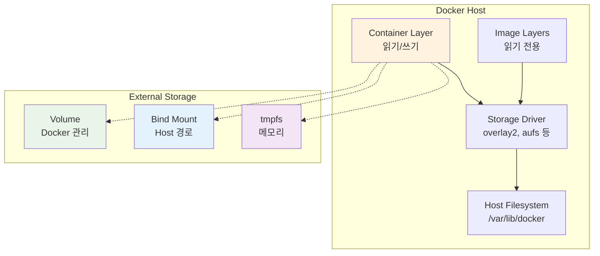
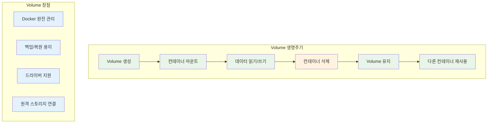
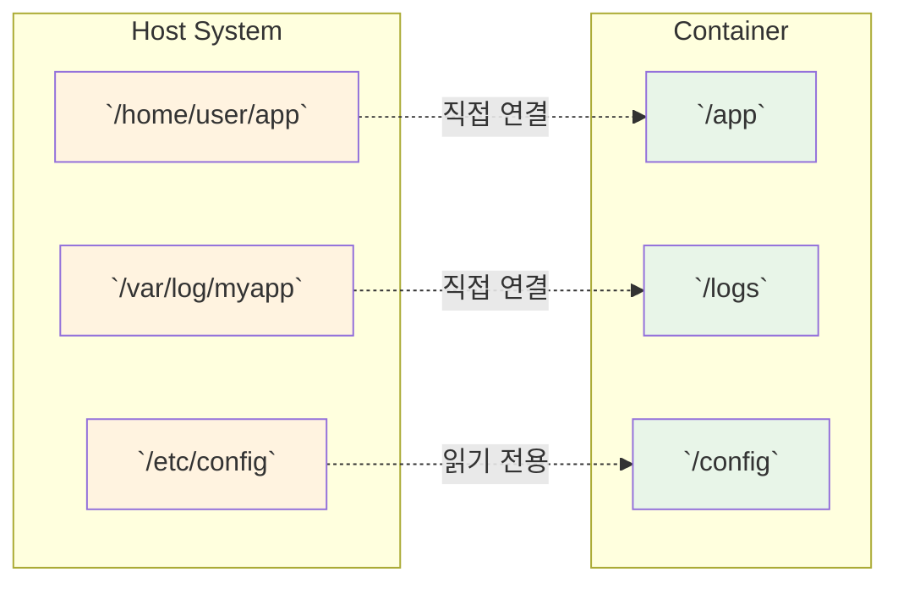
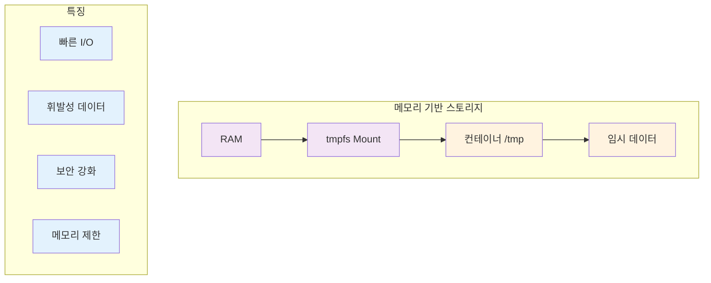

# Week 2 Day 2 Session 1: Volume, Bind Mount, tmpfs 완전 이해

<div align="center">

**💾 Docker 스토리지** • **📁 Volume 관리** • **🔗 Bind Mount**

*Docker 스토리지의 모든 유형과 활용 시나리오 완전 마스터*

</div>

---

## 🕘 세션 정보

**시간**: 09:00-09:50 (50분)  
**목표**: Docker 스토리지의 모든 유형과 활용 시나리오 완전 마스터  
**방식**: 개념 이해 + 실습 예제 + 성능 비교

---

## 🎯 세션 목표

### 📚 학습 목표
- **이해 목표**: Volume, Bind Mount, tmpfs의 동작 원리와 차이점 완전 이해
- **적용 목표**: 상황별 최적의 스토리지 유형 선택 능력 습득
- **협업 목표**: 팀 프로젝트에서 데이터 관리 전략 수립 능력

### 🤔 왜 필요한가? (5분)

**현실 문제 상황**:
- 💼 **데이터 손실 사고**: 컨테이너 재시작 시 중요 데이터 소실
- 🏠 **일상 비유**: 임시 숙소 vs 영구 거주지의 차이
- 📊 **시장 동향**: Stateful 애플리케이션 증가로 데이터 영속성 중요도 상승

**학습 전후 비교**:


---

## 📖 핵심 개념 (35분)

### 🔍 개념 1: Docker 스토리지 아키텍처 (12분)

> **정의**: Docker가 데이터를 저장하고 관리하는 방식과 구조

**Docker 스토리지 계층**:


**스토리지 드라이버별 특징**:
| 드라이버 | 성능 | 안정성 | 사용 사례 |
|----------|------|--------|-----------|
| **overlay2** | 높음 | 높음 | 프로덕션 권장 |
| **aufs** | 중간 | 중간 | 레거시 시스템 |
| **devicemapper** | 낮음 | 높음 | RHEL/CentOS |
| **btrfs** | 중간 | 중간 | 고급 기능 필요시 |

### 🔍 개념 2: Volume - Docker 관리 스토리지 (12분)

> **정의**: Docker가 완전히 관리하는 영속적 데이터 저장소 (AWS EBS와 유사한 블록 스토리지)

**Volume의 특징과 장점**:


**Volume 명령어와 활용**:
```bash
# Volume 생성
docker volume create my-volume

# Volume 정보 확인
docker volume inspect my-volume

# Volume을 사용하는 컨테이너 실행
docker run -d -v my-volume:/data nginx

# Volume 목록 확인
docker volume ls

# 사용하지 않는 Volume 정리
docker volume prune
```

**Volume 고급 활용 (EBS 스타일)**:
```bash
# 라벨을 사용한 Volume 관리 (EBS 태그와 유사)
docker volume create --label environment=production db-volume

# 드라이버 옵션 지정 (EFS 마운트와 유사)
docker volume create --driver local \
  --opt type=nfs \
  --opt o=addr=192.168.1.100,rw \
  --opt device=:/path/to/dir \
  nfs-volume

# Volume 백업 (EBS 스냅샷과 유사)
docker run --rm -v my-volume:/data -v $(pwd):/backup \
  alpine tar czf /backup/backup.tar.gz -C /data .

# Volume 복원 (EBS 복원과 유사)
docker run --rm -v my-volume:/data -v $(pwd):/backup \
  alpine tar xzf /backup/backup.tar.gz -C /data
```

### 🔍 개념 3: Bind Mount와 tmpfs (11분)

> **정의**: 호스트 파일시스템을 직접 마운트하는 방식(AWS EFS와 유사)과 메모리 기반 임시 스토리지(AWS Instance Store와 유사)

**Bind Mount 특징**:


**tmpfs 메모리 스토리지**:


**스토리지 유형별 비교 (AWS 서비스 매핑)**:
| 특성 | Volume | Bind Mount | tmpfs |
|------|--------|------------|-------|
| **AWS 유사 서비스** | **EBS** | **EFS** | **Instance Store** |
| **관리 주체** | Docker | 사용자 | Docker |
| **성능** | 높음 | 높음 | 최고 |
| **영속성** | 영구 | 영구 | 임시 |
| **보안** | 높음 | 중간 | 높음 |
| **백업** | 쉬움 | 복잡 | 불가 |
| **사용 사례** | DB 데이터 | 공유 파일 | 캐시/임시 파일 |
| **확장성** | 제한적 | 높음 | 메모리 크기 |
| **비용** | 중간 | 높음 | 낮음 |

**실제 사용 예제**:
```bash
# 1. Volume 사용 (프로덕션 데이터베이스 - EBS 스타일)
docker run -d \
  --name mysql-prod \
  -v mysql-data:/var/lib/mysql \
  -e MYSQL_ROOT_PASSWORD=secret \
  mysql:8.0

# 2. Bind Mount 사용 (개발 환경 - EFS 스타일)
docker run -d \
  --name web-dev \
  -v $(pwd)/src:/var/www/html \
  -v $(pwd)/logs:/var/log/apache2 \
  -p 8080:80 \
  apache:latest

# 3. tmpfs 사용 (임시 데이터 - Instance Store 스타일)
docker run -d \
  --name app-secure \
  --tmpfs /tmp:rw,noexec,nosuid,size=100m \
  --tmpfs /var/cache:rw,size=50m \
  myapp:latest

# 4. 복합 사용 (실제 운영 환경)
docker run -d \
  --name wordpress \
  -v wp-content:/var/www/html/wp-content \
  -v $(pwd)/config:/etc/apache2/sites-available:ro \
  --tmpfs /tmp:rw,noexec,nosuid,size=200m \
  -p 80:80 \
  wordpress:latest
```

**성능 벤치마크**:
```bash
# I/O 성능 테스트 스크립트
#!/bin/bash

echo "=== Docker 스토리지 성능 테스트 ==="

# Volume 테스트
echo "1. Volume 성능 테스트"
docker run --rm -v test-volume:/data alpine \
  sh -c 'time dd if=/dev/zero of=/data/test bs=1M count=100'

# Bind Mount 테스트
echo "2. Bind Mount 성능 테스트"
mkdir -p /tmp/bind-test
docker run --rm -v /tmp/bind-test:/data alpine \
  sh -c 'time dd if=/dev/zero of=/data/test bs=1M count=100'

# tmpfs 테스트
echo "3. tmpfs 성능 테스트"
docker run --rm --tmpfs /data:rw,size=200m alpine \
  sh -c 'time dd if=/dev/zero of=/data/test bs=1M count=100'

# 정리
docker volume rm test-volume
rm -rf /tmp/bind-test
```

---

## 💭 함께 생각해보기 (10분)

### 🤝 페어 토론 (5분)

**토론 주제**:
1. **스토리지 선택**: "어떤 상황에서 어떤 스토리지 유형을 선택하시겠어요?"
2. **성능 vs 편의성**: "성능과 관리 편의성 중 어느 것이 더 중요할까요?"
3. **실무 경험**: "데이터 손실을 경험해본 적이 있나요? 어떻게 예방할 수 있을까요?"

**페어 활동 가이드**:
- 👥 **자유 페어링**: 경험 수준이 다른 사람끼리 매칭
- 🔄 **역할 교대**: 5분씩 설명자/질문자 역할 바꾸기
- 📝 **핵심 정리**: 스토리지 선택 기준 정리

### 🎯 전체 공유 (5분)

- **베스트 프랙티스**: 각 팀의 스토리지 선택 기준 공유
- **실무 팁**: 성능 최적화와 데이터 보호 방법
- **다음 연결**: 데이터 영속성과 백업 전략으로 연결

### 💡 이해도 체크 질문

- ✅ "각 스토리지 유형의 특징을 설명할 수 있나요?"
- ✅ "상황별로 적절한 스토리지를 선택할 수 있나요?"
- ✅ "성능과 보안을 고려한 설정을 할 수 있나요?"

---

## 🔑 핵심 키워드

- **Volume**: Docker 관리 영속 스토리지 (AWS EBS 유사)
- **Bind Mount**: 호스트 경로 직접 마운트 (AWS EFS 유사)
- **tmpfs**: 메모리 기반 임시 스토리지 (AWS Instance Store 유사)
- **Storage Driver**: 스토리지 계층 관리 드라이버
- **Data Persistence**: 데이터 영속성

---

## 📝 세션 마무리

### ✅ 오늘 세션 성과
- [ ] Docker 스토리지 아키텍처 완전 이해
- [ ] Volume, Bind Mount, tmpfs 특징과 차이점 파악
- [ ] 상황별 최적 스토리지 선택 기준 습득
- [ ] 성능과 보안을 고려한 설정 방법 학습

### 🎯 다음 세션 준비
- **주제**: 데이터 영속성 & 백업 전략
- **연결**: 스토리지 기초 → 데이터 생명주기 관리
- **준비사항**: 백업과 복구 개념 예습

---

<div align="center">

**💾 Docker 스토리지 완전 마스터!**

**다음**: [Session 2 - 데이터 영속성 & 백업 전략](./session_2.md)

</div>