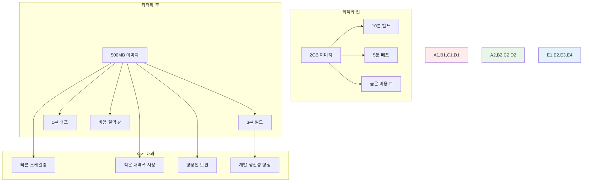

# Week 2 Day 2 Session 2: 이미지 최적화 고급 기법

<div align="center">

**⚡ 성능 최적화** • **📦 이미지 경량화**

*빌드 시간, 이미지 크기, 보안을 모두 고려한 최적화 전략 완전 마스터*

</div>

---

## 🕘 세션 정보

**시간**: 10:00-10:50 (50분)  
**목표**: 이미지 최적화 고급 기법과 성능 향상 전략 완전 습득  
**방식**: 최적화 실습 + 성능 측정 + 베스트 프랙티스 적용

---

## 🎯 세션 목표

### 📚 학습 목표
- **이해 목표**: 이미지 최적화의 다양한 기법과 성능 영향 완전 이해
- **적용 목표**: 빌드 시간 50% 단축, 이미지 크기 70% 감소 달성
- **협업 목표**: 팀 프로젝트에서 최적화 기법을 공유하고 적용하는 문화 구축

### 🤔 왜 이미지 최적화인가? (5분)

**현실 성능 문제**:
- 💼 **실무 상황**: 대용량 이미지로 인한 배포 시간 지연과 스토리지 비용 증가
- 🏠 **일상 비유**: 여행 짐을 최소화하여 이동 속도를 높이는 것과 같음
- 📊 **비용 영향**: 이미지 크기 50% 감소 시 스토리지 비용 50%, 네트워크 비용 30% 절약

**최적화의 다면적 효과**:


---

## 📖 핵심 개념 (35분)

### 🔍 개념 1: 멀티스테이지 빌드 고급 패턴 (12분)

> **정의**: 빌드와 런타임을 분리하여 최종 이미지 크기를 최소화하는 고급 기법

**기본 멀티스테이지 빌드**:
```dockerfile
# Dockerfile.basic
FROM node:18 AS builder
WORKDIR /app
COPY package*.json ./
RUN npm ci --only=production
COPY . .
RUN npm run build

FROM node:18-alpine AS runtime
WORKDIR /app
COPY --from=builder /app/dist ./dist
COPY --from=builder /app/node_modules ./node_modules
COPY package*.json ./
EXPOSE 3000
CMD ["node", "dist/server.js"]
```

**고급 멀티스테이지 패턴**:
```dockerfile
# Dockerfile.advanced
# 1. 베이스 이미지 정의
FROM node:18-alpine AS base
RUN apk add --no-cache dumb-init
WORKDIR /app
COPY package*.json ./

# 2. 의존성 설치 스테이지
FROM base AS deps
RUN npm ci --only=production && npm cache clean --force

# 3. 개발 의존성 포함 빌드 스테이지
FROM base AS build-deps
RUN npm ci

# 4. 빌드 스테이지
FROM build-deps AS build
COPY . .
RUN npm run build && npm run test

# 5. 보안 스캔 스테이지
FROM build AS security-scan
RUN npm audit --audit-level=high
RUN npm run security-check

# 6. 최종 런타임 스테이지
FROM base AS runtime
# 비root 사용자 생성
RUN addgroup -g 1001 -S nodejs && \
    adduser -S nextjs -u 1001

# 프로덕션 의존성만 복사
COPY --from=deps --chown=nextjs:nodejs /app/node_modules ./node_modules
# 빌드 결과물 복사
COPY --from=build --chown=nextjs:nodejs /app/dist ./dist
COPY --from=build --chown=nextjs:nodejs /app/public ./public

USER nextjs
EXPOSE 3000
ENV NODE_ENV=production
ENTRYPOINT ["dumb-init", "--"]
CMD ["node", "dist/server.js"]
```

**언어별 최적화 패턴**:

**Go 애플리케이션**:
```dockerfile
# Dockerfile.go
FROM golang:1.19-alpine AS builder
RUN apk add --no-cache git ca-certificates tzdata
WORKDIR /app
COPY go.mod go.sum ./
RUN go mod download
COPY . .
RUN CGO_ENABLED=0 GOOS=linux go build -a -installsuffix cgo -ldflags '-extldflags "-static"' -o main .

FROM scratch
COPY --from=builder /etc/ssl/certs/ca-certificates.crt /etc/ssl/certs/
COPY --from=builder /usr/share/zoneinfo /usr/share/zoneinfo
COPY --from=builder /app/main /main
EXPOSE 8080
ENTRYPOINT ["/main"]
```

**Java 애플리케이션**:
```dockerfile
# Dockerfile.java
FROM openjdk:17-jdk-slim AS builder
WORKDIR /app
COPY pom.xml .
COPY src ./src
RUN ./mvnw clean package -DskipTests

FROM openjdk:17-jre-slim AS runtime
RUN addgroup --system spring && adduser --system spring --ingroup spring
COPY --from=builder /app/target/*.jar app.jar
USER spring:spring
EXPOSE 8080
ENTRYPOINT ["java", "-jar", "/app.jar"]
```

### 🔍 개념 2: 레이어 캐싱과 빌드 최적화 (12분)

> **정의**: Docker 레이어 캐싱을 활용하여 빌드 시간을 최소화하는 전략

**레이어 캐싱 최적화 원칙**:
```dockerfile
# ❌ 비효율적인 레이어 구성
FROM node:18-alpine
WORKDIR /app
COPY . .                    # 소스 변경 시 모든 하위 레이어 무효화
RUN npm install            # 매번 재실행
RUN npm run build

# ✅ 효율적인 레이어 구성
FROM node:18-alpine
WORKDIR /app
COPY package*.json ./      # 의존성 파일만 먼저 복사
RUN npm ci --only=production  # 의존성 변경 시에만 재실행
COPY . .                   # 소스 코드는 나중에 복사
RUN npm run build
```

**고급 캐싱 전략**:
```dockerfile
# Dockerfile.optimized
FROM node:18-alpine AS base
WORKDIR /app

# 1. 시스템 의존성 캐싱
RUN apk add --no-cache \
    dumb-init \
    && rm -rf /var/cache/apk/*

# 2. 패키지 의존성 캐싱
COPY package*.json ./
RUN npm ci --only=production \
    && npm cache clean --force

# 3. 소스 코드 레이어 (자주 변경됨)
COPY src/ ./src/
COPY public/ ./public/
COPY *.config.js ./

# 4. 빌드 레이어
RUN npm run build

# 5. 런타임 최적화
FROM node:18-alpine AS runtime
WORKDIR /app
RUN addgroup -g 1001 -S nodejs && \
    adduser -S nextjs -u 1001
COPY --from=base /app/node_modules ./node_modules
COPY --from=base /app/dist ./dist
USER nextjs
CMD ["node", "dist/server.js"]
```

**BuildKit 고급 기능 활용**:
```dockerfile
# syntax=docker/dockerfile:1.4
FROM node:18-alpine AS base

# 캐시 마운트 활용
RUN --mount=type=cache,target=/root/.npm \
    npm install -g npm@latest

# 시크릿 마운트 (빌드 시에만 사용)
RUN --mount=type=secret,id=npmrc,target=/root/.npmrc \
    npm ci --only=production

# 바인드 마운트 (소스 복사 없이 빌드)
RUN --mount=type=bind,source=.,target=/src \
    cd /src && npm run build && cp -r dist /app/
```

**Docker Compose 빌드 최적화**:
```yaml
# docker-compose.yml
version: '3.8'

services:
  app:
    build:
      context: .
      dockerfile: Dockerfile
      cache_from:
        - myapp:latest
        - myapp:builder
      args:
        BUILDKIT_INLINE_CACHE: 1
    image: myapp:latest

  # 빌드 캐시 서비스
  build-cache:
    image: registry.gitlab.com/myproject/cache:latest
    build:
      context: .
      target: builder
      cache_from:
        - registry.gitlab.com/myproject/cache:latest
```

### 🔍 개념 3: Distroless와 Scratch 이미지 활용 (11분)

> **정의**: 최소한의 런타임 환경만 포함하여 보안과 성능을 극대화하는 이미지

**Distroless 이미지 활용**:
```dockerfile
# Dockerfile.distroless
FROM golang:1.19-alpine AS builder
WORKDIR /app
COPY . .
RUN CGO_ENABLED=0 go build -o main .

# Google Distroless 이미지 사용
FROM gcr.io/distroless/static-debian11
COPY --from=builder /app/main /
EXPOSE 8080
ENTRYPOINT ["/main"]
```

**언어별 Distroless 이미지**:
```dockerfile
# Java 애플리케이션
FROM gcr.io/distroless/java17-debian11
COPY app.jar /app.jar
ENTRYPOINT ["java", "-jar", "/app.jar"]

# Node.js 애플리케이션
FROM gcr.io/distroless/nodejs18-debian11
COPY --from=builder /app /app
WORKDIR /app
CMD ["server.js"]

# Python 애플리케이션
FROM gcr.io/distroless/python3-debian11
COPY --from=builder /app /app
WORKDIR /app
CMD ["main.py"]
```

**Scratch 이미지 활용 (Go 전용)**:
```dockerfile
# Dockerfile.scratch
FROM golang:1.19-alpine AS builder
RUN apk add --no-cache ca-certificates git
WORKDIR /app
COPY . .
RUN CGO_ENABLED=0 GOOS=linux go build -a -installsuffix cgo -ldflags '-extldflags "-static"' -o main .

FROM scratch
# 필수 파일들만 복사
COPY --from=builder /etc/ssl/certs/ca-certificates.crt /etc/ssl/certs/
COPY --from=builder /etc/passwd /etc/passwd
COPY --from=builder /app/main /main
USER nobody
ENTRYPOINT ["/main"]
```

**이미지 크기 비교**:
```bash
# 이미지 크기 측정
docker images --format "table {{.Repository}}\t{{.Tag}}\t{{.Size}}"

# 예시 결과
REPOSITORY          TAG                 SIZE
myapp-full         latest              1.2GB
myapp-alpine       latest              150MB
myapp-distroless   latest              25MB
myapp-scratch      latest              8MB
```

**보안과 크기의 균형**:
```dockerfile
# Dockerfile.balanced
# 멀티스테이지로 보안과 크기 모두 고려
FROM node:18-alpine AS builder
WORKDIR /app
COPY package*.json ./
RUN npm ci --only=production
COPY . .
RUN npm run build

# 보안 스캔 스테이지
FROM builder AS security
RUN npm audit --audit-level=moderate
RUN apk add --no-cache trivy
RUN trivy fs --exit-code 1 --severity HIGH,CRITICAL .

# 최종 런타임 (Distroless)
FROM gcr.io/distroless/nodejs18-debian11
COPY --from=builder /app/dist /app/dist
COPY --from=builder /app/node_modules /app/node_modules
WORKDIR /app
CMD ["dist/server.js"]
```

**이미지 최적화 체크리스트**:
```yaml
# optimization-checklist.yml
image_optimization:
  base_image:
    - use_alpine_or_distroless: true
    - avoid_latest_tag: true
    - use_specific_version: true
  
  layers:
    - minimize_layers: true
    - cache_dependencies: true
    - copy_files_last: true
  
  security:
    - run_as_non_root: true
    - remove_package_managers: true
    - scan_for_vulnerabilities: true
  
  size:
    - remove_cache_files: true
    - use_multi_stage_build: true
    - minimize_installed_packages: true
  
  performance:
    - use_init_system: true
    - optimize_startup_time: true
    - configure_health_checks: true
```

---

## 💭 함께 생각해보기 (10분)

### 🤝 페어 토론 (5분)

**토론 주제**:
1. **최적화 우선순위**: "이미지 크기, 빌드 시간, 보안 중에서 어떤 것을 우선해야 할까요?"
2. **실무 적용**: "기존 프로젝트에 최적화를 적용할 때 어떤 순서로 진행하면 좋을까요?"
3. **성능 측정**: "최적화 효과를 어떻게 정량적으로 측정하고 비교할 수 있을까요?"

**페어 활동 가이드**:
- 👥 **최적화 실험**: 간단한 애플리케이션으로 다양한 최적화 기법 비교
- 🔄 **성능 분석**: 빌드 시간, 이미지 크기, 시작 시간 측정과 분석
- 📝 **전략 수립**: 팀 프로젝트를 위한 이미지 최적화 전략 계획

### 🎯 전체 공유 (5분)

**인사이트 공유**:
- 페어 토론에서 발견한 효과적인 최적화 기법
- 실무에서 적용 가능한 최적화 우선순위
- 오후 챌린지에서 구현할 최적화 계획

**💡 이해도 체크 질문**:
- ✅ "멀티스테이지 빌드의 고급 패턴을 활용할 수 있나요?"
- ✅ "레이어 캐싱을 고려한 효율적인 Dockerfile을 작성할 수 있나요?"
- ✅ "상황에 맞는 베이스 이미지를 선택할 수 있나요?"

---

## 🔑 핵심 키워드

### 🆕 새로운 용어
- **Multi-stage Build**: 멀티스테이지 빌드 - 빌드와 런타임 분리
- **Layer Caching**: 레이어 캐싱 - Docker 빌드 캐시 활용
- **Distroless**: 디스트로리스 - 최소 런타임 환경 이미지
- **BuildKit**: 빌드킷 - Docker의 고급 빌드 엔진
- **Cache Mount**: 캐시 마운트 - 빌드 시 캐시 디렉토리 마운트

### 🔤 기술 용어
- **Image Layer**: 이미지 레이어 - Docker 이미지의 구성 단위
- **Build Context**: 빌드 컨텍스트 - Docker 빌드 시 전송되는 파일들
- **Base Image**: 베이스 이미지 - Dockerfile의 FROM에서 사용하는 기본 이미지
- **Scratch Image**: 스크래치 이미지 - 빈 이미지 (Go 바이너리용)
- **Alpine Linux**: 알파인 리눅스 - 보안과 경량화에 특화된 리눅스 배포판

### 🔤 실무 용어
- **Build Time**: 빌드 시간 - 이미지 빌드에 소요되는 시간
- **Image Size**: 이미지 크기 - 최종 이미지의 디스크 사용량
- **Startup Time**: 시작 시간 - 컨테이너 시작부터 서비스 준비까지 시간
- **Registry Storage**: 레지스트리 스토리지 - 이미지 저장소 용량
- **Network Bandwidth**: 네트워크 대역폭 - 이미지 전송 시 사용되는 네트워크

---

## 📝 세션 마무리

### ✅ 오늘 세션 성과
- [ ] 멀티스테이지 빌드 고급 패턴 완전 습득 ✅
- [ ] 레이어 캐싱과 BuildKit 활용법 마스터 ✅
- [ ] Distroless와 Scratch 이미지 활용 전략 이해 ✅
- [ ] 이미지 최적화 체크리스트와 측정 방법 학습 ✅

### 🎯 다음 세션 준비
- **주제**: 런타임 보안과 성능 튜닝 - 운영 환경 최적화
- **연결**: 최적화된 이미지의 안전한 런타임 구성
- **준비**: 컨테이너 실행 시 보안과 성능 고려사항 생각해보기

### 🔮 오후 챌린지 미리보기
**보안 강화 E-Commerce 플랫폼**에서 활용할 내용:
- 모든 서비스 이미지의 크기 70% 감소 달성
- 빌드 시간 50% 단축을 위한 캐싱 전략 적용
- Distroless 이미지를 활용한 보안과 성능 최적화

---

<div align="center">

**⚡ 이미지 최적화 고급 기법을 완전히 마스터했습니다!**

*빌드 시간, 이미지 크기, 보안을 모두 고려한 최적화 전문가 완성*

**이전**: [Session 1 - 컨테이너 보안 스캔과 취약점 관리](./session_1.md) | **다음**: [Session 3 - 런타임 보안과 성능 튜닝](./session_3.md)

</div>