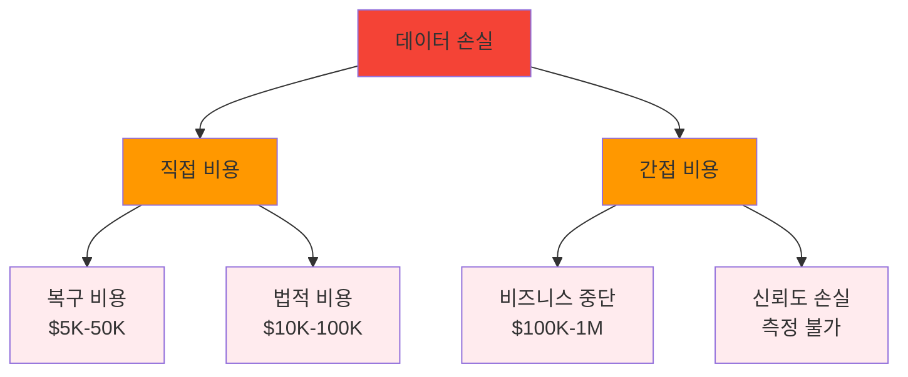
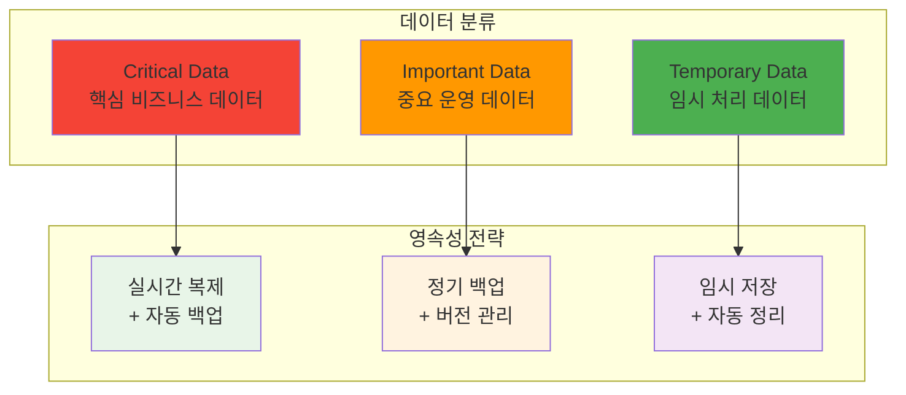
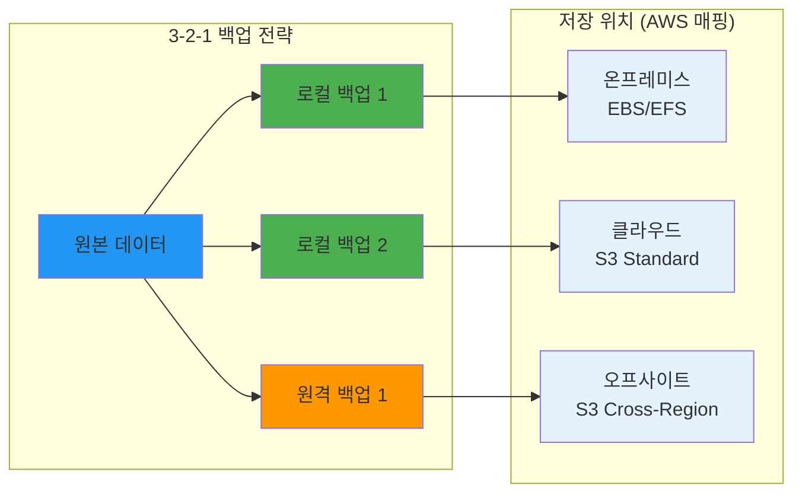
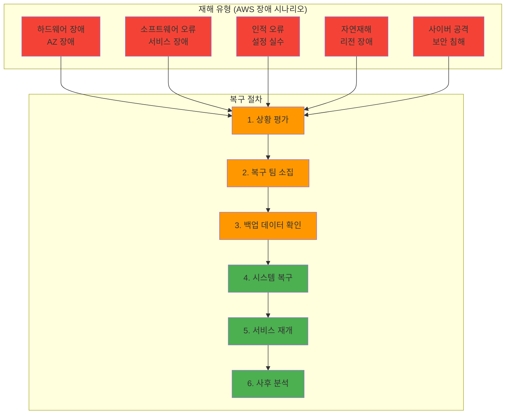

# Week 2 Day 2 Session 2: 데이터 영속성 & 백업 전략

<div align="center">

**🔄 데이터 생명주기** • **💾 백업 전략** • **🛡️ 재해 복구**

*데이터 생명주기 관리와 안전한 백업 전략 수립*

</div>

---

## 🕘 세션 정보

**시간**: 10:00-10:50 (50분)  
**목표**: 데이터 생명주기 관리와 안전한 백업 전략 수립  
**방식**: 전략 수립 + 자동화 구현 + 재해 복구 계획

---

## 🎯 세션 목표

### 📚 학습 목표
- **이해 목표**: 데이터 영속성 전략과 백업 시스템 설계 원칙 이해
- **적용 목표**: 자동화된 백업 시스템 구축과 재해 복구 계획 수립
- **협업 목표**: 팀 단위 데이터 관리 정책 수립과 역할 분담

### 🤔 왜 필요한가? (5분)

**현실 문제 상황**:
- 💼 **데이터 손실 사고**: GitLab 2017년 데이터베이스 삭제 사고 (6시간 데이터 손실)
- 🏠 **일상 비유**: 중요한 사진과 문서를 여러 곳에 백업하는 것
- 📊 **시장 동향**: 데이터 보호 규정 강화 (GDPR, 개인정보보호법)

**데이터 손실 비용**:


---

## 📖 핵심 개념 (35분)

### 🔍 개념 1: 데이터 영속성 전략 (12분)

> **정의**: 컨테이너 생명주기와 독립적으로 데이터를 안전하게 보존하는 전략 (AWS 데이터 생명주기 정책과 유사)

**데이터 분류와 전략**:


**RTO/RPO 목표 설정 (AWS 백업 전략과 매핑)**:
| 데이터 유형 | RTO (복구 시간) | RPO (데이터 손실) | 백업 주기 | AWS 서비스 |
|-------------|-----------------|-------------------|-----------|-------------|
| **핵심 DB** | < 1시간 | < 15분 | 실시간 + 매시간 | **RDS Multi-AZ** |
| **애플리케이션** | < 4시간 | < 1시간 | 매일 | **EBS 스냅샷** |
| **로그 데이터** | < 24시간 | < 24시간 | 주간 | **S3 Glacier** |
| **임시 파일** | 복구 불필요 | 손실 허용 | 백업 없음 | **Instance Store** |

**데이터 생명주기 관리 (AWS S3 Lifecycle과 유사)**:
```bash
# 데이터 분류 라벨링 (S3 태그와 유사)
docker volume create --label tier=critical \
  --label backup=realtime \
  --label retention=7years \
  production-db

docker volume create --label tier=important \
  --label backup=daily \
  --label retention=1year \
  application-data

docker volume create --label tier=temporary \
  --label backup=none \
  --label retention=7days \
  cache-data
```

### 🔍 개념 2: 자동화된 백업 시스템 (12분)

> **정의**: 사람의 개입 없이 정기적으로 데이터를 안전한 위치에 복사하는 시스템 (AWS Backup 서비스와 유사한 자동화)

**3-2-1 백업 규칙**:


**백업 자동화 스크립트**:
```bash
#!/bin/bash
# 자동 백업 스크립트 (backup-automation.sh)

BACKUP_DATE=$(date +%Y%m%d_%H%M%S)
BACKUP_DIR="/backup"
S3_BUCKET="company-backups"

# 1. 데이터베이스 백업
backup_database() {
    echo "Starting database backup..."
    
    # MySQL 백업
    docker exec mysql-prod mysqldump \
        --single-transaction \
        --routines \
        --triggers \
        --all-databases \
        -u root -p${MYSQL_ROOT_PASSWORD} \
        > ${BACKUP_DIR}/mysql_${BACKUP_DATE}.sql
    
    # 압축
    gzip ${BACKUP_DIR}/mysql_${BACKUP_DATE}.sql
    
    echo "Database backup completed"
}

# 2. Volume 백업
backup_volumes() {
    echo "Starting volume backup..."
    
    # 중요 볼륨 목록
    VOLUMES=("app-data" "user-uploads" "config-data")
    
    for volume in "${VOLUMES[@]}"; do
        echo "Backing up volume: $volume"
        
        docker run --rm \
            -v ${volume}:/data:ro \
            -v ${BACKUP_DIR}:/backup \
            alpine tar czf /backup/${volume}_${BACKUP_DATE}.tar.gz -C /data .
    done
    
    echo "Volume backup completed"
}

# 3. 원격 백업 (S3)
upload_to_s3() {
    echo "Uploading to S3..."
    
    aws s3 sync ${BACKUP_DIR} s3://${S3_BUCKET}/$(date +%Y/%m/%d)/ \
        --exclude "*" \
        --include "*${BACKUP_DATE}*" \
        --storage-class STANDARD_IA  # 비용 최적화
    
    echo "S3 upload completed"
}

# 4. 백업 검증
verify_backup() {
    echo "Verifying backups..."
    
    # 파일 무결성 검사
    find ${BACKUP_DIR} -name "*${BACKUP_DATE}*" -type f -exec md5sum {} \; \
        > ${BACKUP_DIR}/checksums_${BACKUP_DATE}.md5
    
    # S3 업로드 확인
    aws s3 ls s3://${S3_BUCKET}/$(date +%Y/%m/%d)/ | grep ${BACKUP_DATE}
    
    echo "Backup verification completed"
}

# 5. 오래된 백업 정리
cleanup_old_backups() {
    echo "Cleaning up old backups..."
    
    # 로컬 백업 (7일 이상 삭제)
    find ${BACKUP_DIR} -name "*.gz" -mtime +7 -delete
    find ${BACKUP_DIR} -name "*.tar.gz" -mtime +7 -delete
    
    # S3 생명주기 정책으로 자동 관리 (AWS Lifecycle Policy)
    # 30일 후 Glacier, 90일 후 Deep Archive로 자동 이동
    echo "Local cleanup completed"
}

# 메인 실행
main() {
    echo "=== Backup started at $(date) ==="
    
    backup_database
    backup_volumes
    upload_to_s3
    verify_backup
    cleanup_old_backups
    
    echo "=== Backup completed at $(date) ==="
}

# 실행
main 2>&1 | tee ${BACKUP_DIR}/backup_${BACKUP_DATE}.log
```

**백업 스케줄링 (Cron)**:
```bash
# /etc/crontab 설정
# 매일 새벽 2시 전체 백업
0 2 * * * root /scripts/backup-automation.sh

# 매시간 데이터베이스 증분 백업
0 * * * * root /scripts/incremental-backup.sh

# 매주 일요일 백업 검증
0 4 * * 0 root /scripts/backup-verification.sh
```

### 🔍 개념 3: 재해 복구 계획 (11분)

> **정의**: 시스템 장애나 재해 상황에서 서비스를 신속하게 복구하는 계획과 절차 (AWS Disaster Recovery 전략과 동일한 접근법)

**재해 복구 시나리오**:


**복구 절차서**:
```bash
#!/bin/bash
# 재해 복구 스크립트 (disaster-recovery.sh)

DR_DATE=$(date +%Y%m%d_%H%M%S)
LOG_FILE="/var/log/disaster-recovery_${DR_DATE}.log"

# 로깅 함수
log() {
    echo "[$(date '+%Y-%m-%d %H:%M:%S')] $1" | tee -a ${LOG_FILE}
}

# 1. 상황 평가
assess_situation() {
    log "=== DISASTER RECOVERY STARTED ==="
    log "Assessing current situation..."
    
    # 시스템 상태 확인
    docker ps -a > /tmp/container_status.txt
    docker volume ls > /tmp/volume_status.txt
    df -h > /tmp/disk_status.txt
    
    log "System assessment completed"
}

# 2. 백업 데이터 확인
verify_backups() {
    log "Verifying available backups..."
    
    # 최신 백업 찾기
    LATEST_DB_BACKUP=$(ls -t /backup/mysql_*.sql.gz | head -1)
    LATEST_VOLUME_BACKUP=$(ls -t /backup/*_*.tar.gz | head -1)
    
    if [[ -f "$LATEST_DB_BACKUP" ]]; then
        log "Latest DB backup found: $LATEST_DB_BACKUP"
    else
        log "ERROR: No database backup found!"
        exit 1
    fi
    
    # 백업 무결성 검사
    if gzip -t "$LATEST_DB_BACKUP"; then
        log "Database backup integrity verified"
    else
        log "ERROR: Database backup is corrupted!"
        exit 1
    fi
}

# 3. 데이터베이스 복구
restore_database() {
    log "Starting database restoration..."
    
    # 기존 컨테이너 정리
    docker stop mysql-prod 2>/dev/null
    docker rm mysql-prod 2>/dev/null
    
    # 새 데이터베이스 컨테이너 시작
    docker run -d \
        --name mysql-prod \
        -v mysql-data:/var/lib/mysql \
        -e MYSQL_ROOT_PASSWORD=${MYSQL_ROOT_PASSWORD} \
        mysql:8.0
    
    # 데이터베이스 초기화 대기
    sleep 30
    
    # 백업 복원
    gunzip -c "$LATEST_DB_BACKUP" | \
        docker exec -i mysql-prod mysql -u root -p${MYSQL_ROOT_PASSWORD}
    
    log "Database restoration completed"
}

# 4. 애플리케이션 복구
restore_application() {
    log "Starting application restoration..."
    
    # Volume 복원
    VOLUMES=("app-data" "user-uploads" "config-data")
    
    for volume in "${VOLUMES[@]}"; do
        log "Restoring volume: $volume"
        
        # 볼륨 재생성
        docker volume rm ${volume} 2>/dev/null
        docker volume create ${volume}
        
        # 백업에서 복원
        BACKUP_FILE=$(ls -t /backup/${volume}_*.tar.gz | head -1)
        if [[ -f "$BACKUP_FILE" ]]; then
            docker run --rm \
                -v ${volume}:/data \
                -v /backup:/backup \
                alpine tar xzf /backup/$(basename $BACKUP_FILE) -C /data
            
            log "Volume $volume restored from $BACKUP_FILE"
        fi
    done
    
    # 애플리케이션 컨테이너 시작
    docker-compose up -d
    
    log "Application restoration completed"
}

# 5. 서비스 검증
verify_service() {
    log "Verifying service functionality..."
    
    # 헬스 체크
    sleep 60  # 서비스 시작 대기
    
    if curl -f http://localhost/health; then
        log "Service health check passed"
    else
        log "WARNING: Service health check failed"
    fi
    
    # 데이터베이스 연결 확인
    if docker exec mysql-prod mysql -u root -p${MYSQL_ROOT_PASSWORD} -e "SELECT 1"; then
        log "Database connection verified"
    else
        log "ERROR: Database connection failed"
    fi
}

# 6. 복구 완료 알림
notify_completion() {
    log "=== DISASTER RECOVERY COMPLETED ==="
    
    # 팀에 알림 (AWS SNS와 유사한 알림 시스템)
    curl -X POST -H 'Content-type: application/json' \
        --data '{"text":"🚨 Disaster Recovery Completed\nSystem restored at '$(date)'"}' \
        $SLACK_WEBHOOK_URL
    
    log "Recovery notification sent"
}

# 메인 실행
main() {
    assess_situation
    verify_backups
    restore_database
    restore_application
    verify_service
    notify_completion
}

# 실행 (인수로 복구 유형 전달)
case "$1" in
    "full")
        log "Starting FULL disaster recovery"
        main
        ;;
    "db-only")
        log "Starting DATABASE-ONLY recovery"
        assess_situation
        verify_backups
        restore_database
        verify_service
        notify_completion
        ;;
    *)
        echo "Usage: $0 {full|db-only}"
        exit 1
        ;;
esac
```

**복구 테스트 계획**:
```bash
# 정기 복구 테스트 (월 1회)
#!/bin/bash
# recovery-test.sh

echo "=== 복구 테스트 시작 ==="

# 1. 테스트 환경 구성
docker-compose -f docker-compose.test.yml up -d

# 2. 백업에서 데이터 복원
./disaster-recovery.sh db-only

# 3. 기능 테스트
pytest tests/integration/

# 4. 성능 테스트
ab -n 1000 -c 10 http://localhost/api/health

# 5. 테스트 환경 정리
docker-compose -f docker-compose.test.yml down -v

echo "=== 복구 테스트 완료 ==="
```

---

## 💭 함께 생각해보기 (10분)

### 🤝 페어 토론 (5분)

**토론 주제**:
1. **백업 전략**: "우리 프로젝트에 적합한 백업 주기와 보관 기간은?"
2. **복구 우선순위**: "재해 상황에서 어떤 데이터를 먼저 복구해야 할까요?"
3. **비용 vs 안전성**: "백업 비용과 데이터 안전성의 균형점은?"

**페어 활동 가이드**:
- 👥 **역할 기반 페어링**: 개발자-운영자 관점으로 토론
- 🔄 **시나리오 기반**: 구체적인 재해 상황 가정하고 토론
- 📝 **계획 수립**: 팀 프로젝트 백업 계획 초안 작성

### 🎯 전체 공유 (5분)

- **백업 전략**: 각 팀의 백업 계획 공유
- **교훈 공유**: 데이터 손실 경험과 예방 방법
- **다음 연결**: 데이터베이스 컨테이너 운영으로 연결

### 💡 이해도 체크 질문

- ✅ "RTO와 RPO의 차이를 설명할 수 있나요?"
- ✅ "3-2-1 백업 규칙을 적용할 수 있나요?"
- ✅ "재해 복구 절차를 수립할 수 있나요?"

---

## 🔑 핵심 키워드

- **RTO (Recovery Time Objective)**: 복구 목표 시간 (AWS RTO 전략과 동일)
- **RPO (Recovery Point Objective)**: 복구 목표 시점 (AWS RPO 전략과 동일)
- **3-2-1 Rule**: 3개 복사본, 2개 매체, 1개 오프사이트 (AWS 멀티 리전 전략)
- **Disaster Recovery**: 재해 복구 (AWS DR 전략)
- **Data Lifecycle**: 데이터 생명주기 (AWS S3 Lifecycle)

---

## 📝 세션 마무리

### ✅ 오늘 세션 성과
- [ ] 데이터 영속성 전략 수립 방법 이해
- [ ] 자동화된 백업 시스템 설계 능력 습득
- [ ] 재해 복구 계획 수립과 테스트 방법 학습
- [ ] RTO/RPO 기반 백업 정책 설계 능력

### 🎯 다음 세션 준비
- **주제**: 데이터베이스 컨테이너 운영 실무
- **연결**: 백업 전략 → 실제 DB 운영 노하우
- **준비사항**: MySQL, PostgreSQL 기본 개념 복습

---

<div align="center">

**🔄 데이터 생명주기 관리 마스터!**

**다음**: [Session 3 - 데이터베이스 컨테이너 운영 실무](./session_3.md)

</div>