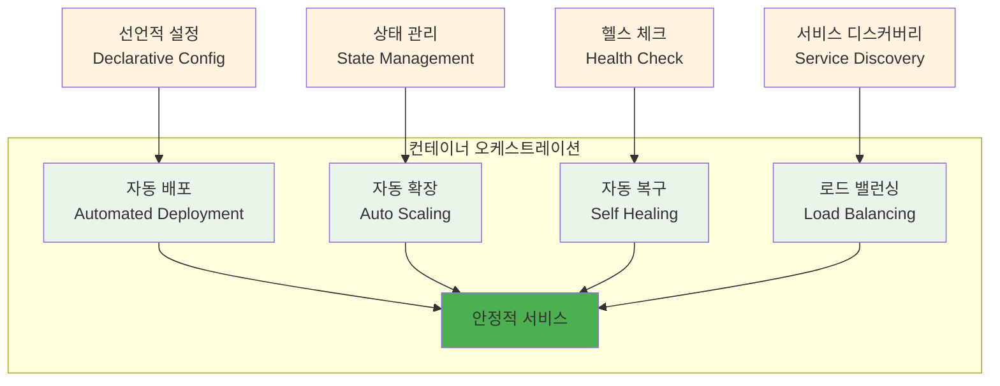
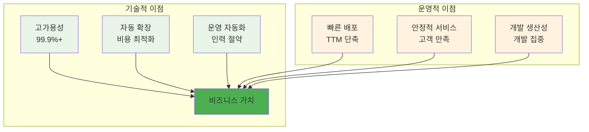

# Week 2 Day 2 Session 2: 오케스트레이션 개념과 핵심 기능

**🎼 오케스트레이션 개념** • **⚙️ 핵심 기능**

*컨테이너 오케스트레이션의 정의와 핵심 기능 완전 이해*

---

## 🕘 세션 정보

**시간**: 10:00-10:50 (50분)  
**목표**: 컨테이너 오케스트레이션의 정의와 핵심 기능 완전 이해  
**방식**: 개념 정립 + 기능 분석 + 가치 평가

---

## 🎯 세션 목표

### 📚 학습 목표
- **이해 목표**: 컨테이너 오케스트레이션의 정의와 핵심 기능 완전 이해
- **적용 목표**: 오케스트레이션이 해결하는 문제와 제공하는 가치 파악
- **협업 목표**: 개별 학습 후 경험 공유 및 질의응답

---

## 📖 핵심 개념 (35분)

### 🔍 개념 1: 오케스트레이션 정의와 개념 (12분)

> **정의**: 여러 컨테이너를 자동으로 배포, 관리, 확장, 네트워킹하는 시스템

**오케스트레이션의 핵심 개념**:

### 🔍 개념 2: 핵심 기능들 (12분)

> **정의**: 오케스트레이션 플랫폼이 제공하는 주요 기능들과 그 동작 원리

**주요 기능 상세**:

**1. 자동 배포 (Automated Deployment)**
- 선언적 설정 파일 기반 배포
- 롤링 업데이트와 무중단 배포
- 버전 관리와 롤백 기능

**2. 자동 확장 (Auto Scaling)**
- 수평 확장: 인스턴스 수 증가/감소
- 수직 확장: CPU/메모리 리소스 조정
- 예측적 확장: 패턴 분석 기반 사전 확장

**3. 자동 복구 (Self Healing)**
- 헬스 체크: 정기적인 상태 확인
- 자동 재시작: 실패한 컨테이너 자동 교체
- 롤링 업데이트: 무중단 업데이트

### 🔍 개념 3: 오케스트레이션의 이점 (11분)

> **정의**: 오케스트레이션 도입으로 얻을 수 있는 구체적인 비즈니스 가치

**비즈니스 가치**:

**ROI 계산 예시**:
- **다운타임 감소**: 99% → 99.9% (연간 3일 → 9시간)
- **운영 인력 절약**: 24/7 대기 → 자동화로 50% 절약
- **배포 속도 향상**: 수시간 → 수분으로 단축
- **리소스 효율성**: 자동 스케일링으로 30% 비용 절약

---

## 💭 함께 생각해보기 (15분)

### 🤝 페어 토론 (10분)

**토론 주제**:
1. **자동화 경험**: "업무나 일상에서 자동화를 활용해본 경험이 있나요?"
2. **가치 평가**: "오케스트레이션의 어떤 기능이 가장 유용할 것 같나요?"
3. **도입 고려사항**: "오케스트레이션을 도입할 때 고려해야 할 점들은?"

### 🎯 전체 공유 (5분)

- **자동화 가치**: 오케스트레이션의 비즈니스 가치 인식
- **도입 전략**: 효과적인 오케스트레이션 도입 방안

---

## 🔑 핵심 키워드

- **Container Orchestration**: 컨테이너 오케스트레이션
- **Declarative Configuration**: 선언적 설정
- **Auto Scaling**: 자동 확장
- **Self Healing**: 자동 복구
- **Service Discovery**: 서비스 디스커버리

---

## 📝 세션 마무리

### ✅ 오늘 세션 성과
- [ ] 오케스트레이션 개념 완전 이해
- [ ] 핵심 기능들의 동작 원리 파악
- [ ] 비즈니스 가치와 ROI 인식

### 🎯 다음 세션 준비
- **주제**: Docker Swarm vs Kubernetes 비교 분석
- **연결**: 구체적인 오케스트레이션 도구들 비교

---

**🎼 오케스트레이션의 핵심을 완전히 이해했습니다!**

**다음**: [Session 3 - Docker Swarm vs Kubernetes 비교 분석](./session_3.md)

