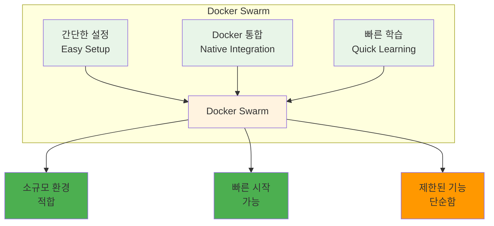
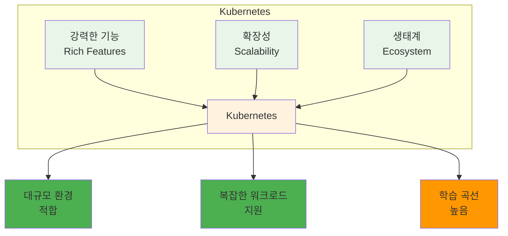
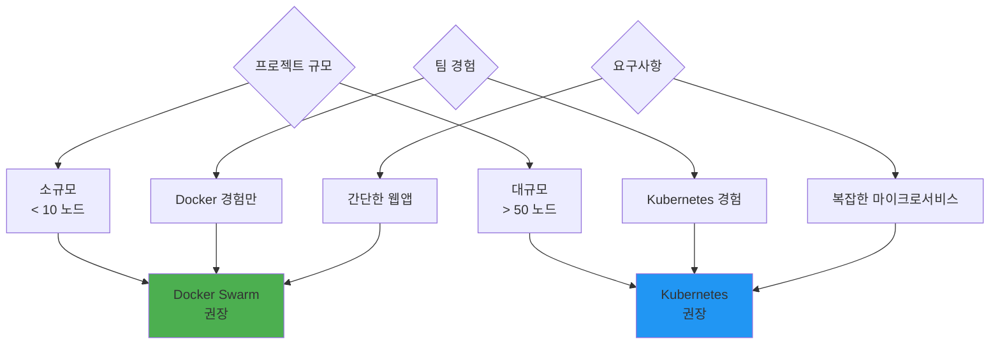

# Week 2 Day 2 Session 3: Docker Swarm vs Kubernetes 비교 분석

**🐳 Docker Swarm** • **☸️ Kubernetes** • **⚖️ 비교 분석**

*주요 오케스트레이션 도구들의 특징과 선택 기준*

---

## 🕘 세션 정보

**시간**: 11:00-11:50 (50분)  
**목표**: 주요 오케스트레이션 도구들의 특징과 차이점 이해  
**방식**: 도구 비교 + 선택 기준 + 실무 적용

---

## 🎯 세션 목표

### 📚 학습 목표
- **이해 목표**: 주요 오케스트레이션 도구들의 특징과 차이점 이해
- **적용 목표**: 상황에 맞는 오케스트레이션 도구 선택 기준 습득
- **협업 목표**: 팀원들과 도구 선택 기준 및 전략 토론

---

## 📖 핵심 개념 (35분)

### 🔍 개념 1: Docker Swarm 특징 (12분)

> **정의**: Docker에 내장된 간단하고 사용하기 쉬운 오케스트레이션 도구

**Docker Swarm 특징**:

**Swarm 주요 기능**:
- **서비스 정의**: `docker service create`로 간단한 서비스 생성
- **스케일링**: `docker service scale` 명령어로 확장
- **롤링 업데이트**: 자동 무중단 업데이트
- **로드 밸런싱**: 내장된 로드 밸런서

### 🔍 개념 2: Kubernetes 특징 (12분)

> **정의**: 구글이 개발한 강력하고 확장 가능한 컨테이너 오케스트레이션 플랫폼

**Kubernetes 특징**:

**Kubernetes 주요 개념**:
- **Pod**: 최소 배포 단위
- **Service**: 네트워크 추상화
- **Deployment**: 애플리케이션 배포 관리
- **Namespace**: 리소스 격리

### 🔍 개념 3: 선택 기준과 비교 (11분)

> **정의**: 프로젝트 요구사항에 따른 오케스트레이션 도구 선택 가이드

**상세 비교표**:
| 구분 | Docker Swarm | Kubernetes |
|------|--------------|------------|
| **학습 난이도** | 쉬움 (1-2주) | 어려움 (2-3개월) |
| **설정 복잡도** | 간단 | 복잡 |
| **확장성** | 중간 (수십 노드) | 높음 (수천 노드) |
| **기능 풍부함** | 기본 기능 | 매우 풍부 |
| **생태계** | 제한적 | 매우 풍부 |
| **커뮤니티** | 작음 | 매우 큼 |
| **기업 지원** | Docker Inc. | CNCF + 다수 기업 |

**선택 기준**:

---

## 💭 함께 생각해보기 (15분)

### 🤝 페어 토론 (10분)

**토론 주제**:
1. **도구 선택**: "우리 프로젝트에는 어떤 오케스트레이션 도구가 적합할까요?"
2. **학습 전략**: "Kubernetes를 효과적으로 학습하는 방법은?"
3. **마이그레이션**: "Docker Compose에서 오케스트레이션으로 어떻게 전환할까요?"

### 🎯 전체 공유 (5분)

- **도구 선택 기준**: 상황별 최적 도구 선택 방안
- **학습 로드맵**: Kubernetes 학습 계획 수립

---

## 🔑 핵심 키워드

- **Docker Swarm**: Docker 내장 오케스트레이션
- **Kubernetes (K8s)**: 구글 오픈소스 오케스트레이션
- **CNCF**: Cloud Native Computing Foundation
- **Learning Curve**: 학습 곡선
- **Ecosystem**: 생태계

---

## 📝 세션 마무리

### ✅ 오늘 세션 성과
- [ ] Docker Swarm과 Kubernetes 특징 이해
- [ ] 도구별 장단점 비교 분석
- [ ] 상황별 선택 기준 습득

### 🎯 실습 챌린지 준비
- **주제**: 장애 시나리오 & 오케스트레이션 체험
- **연결**: 이론으로 배운 필요성을 실제로 체감

---

**⚖️ 오케스트레이션 도구 선택 기준을 완전히 이해했습니다!**

**다음**: [Session 4 - 장애 시나리오 & 오케스트레이션 실습](./session_4.md)

