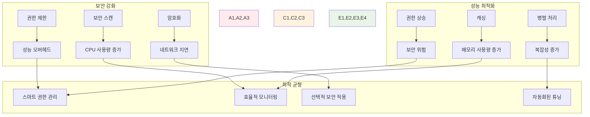

# Week 2 Day 2 Session 3: 런타임 보안과 성능 튜닝

<div align="center">

**🛡️ 런타임 보안** • **🚀 성능 튜닝**

*프로덕션 환경에서의 컨테이너 보안 정책과 성능 최적화 완전 마스터*

</div>

---

## 🕘 세션 정보

**시간**: 11:00-11:50 (50분)  
**목표**: 런타임 보안 정책과 성능 튜닝 기법 완전 습득  
**방식**: 보안 정책 실습 + 성능 프로파일링 + 실시간 튜닝

---

## 🎯 세션 목표

### 📚 학습 목표
- **이해 목표**: 컨테이너 런타임 보안 메커니즘과 성능 튜닝 원리 완전 이해
- **적용 목표**: 프로덕션급 보안 정책과 성능 최적화 구성 구현
- **협업 목표**: 팀 프로젝트에서 보안과 성능을 균형있게 관리하는 전략 수립

### 🤔 왜 런타임 보안과 성능 튜닝인가? (5분)

**현실 운영 문제**:
- 💼 **실무 상황**: 컨테이너 탈출 공격과 리소스 고갈로 인한 서비스 장애
- 🏠 **일상 비유**: 집의 보안 시스템과 에너지 효율성을 동시에 관리하는 것과 같음
- 📊 **운영 현실**: 런타임 보안 사고의 60%가 잘못된 권한 설정으로 발생

**보안과 성능의 상호작용**:


---

## 📖 핵심 개념 (35분)

### 🔍 개념 1: 컨테이너 런타임 보안 정책 (12분)

> **정의**: 컨테이너 실행 시 적용되는 보안 제약과 정책들

**보안 컨텍스트 설정**:
```yaml
# docker-compose.yml
version: '3.8'

services:
  secure-app:
    image: myapp:latest
    
    # 사용자 및 그룹 설정
    user: "1000:1000"  # 비root 사용자
    
    # 보안 옵션
    security_opt:
      - no-new-privileges:true  # 권한 상승 방지
      - apparmor:docker-default # AppArmor 프로필 적용
    
    # 읽기 전용 루트 파일시스템
    read_only: true
    
    # 임시 파일시스템 마운트
    tmpfs:
      - /tmp:noexec,nosuid,size=100m
      - /var/run:noexec,nosuid,size=50m
    
    # 캐퍼빌리티 제한
    cap_drop:
      - ALL
    cap_add:
      - NET_BIND_SERVICE  # 필요한 권한만 추가
    
    # 리소스 제한
    deploy:
      resources:
        limits:
          cpus: '1.0'
          memory: 1G
          pids: 100  # 프로세스 수 제한
        reservations:
          cpus: '0.5'
          memory: 512M
```

**고급 보안 설정**:
```dockerfile
# Dockerfile.secure
FROM node:18-alpine

# 비root 사용자 생성
RUN addgroup -g 1001 -S nodejs && \
    adduser -S nextjs -u 1001 -G nodejs

# 애플리케이션 디렉토리 설정
WORKDIR /app
RUN chown nextjs:nodejs /app

# 의존성 설치 (root 권한 필요)
COPY package*.json ./
RUN npm ci --only=production && \
    npm cache clean --force && \
    rm -rf /tmp/*

# 애플리케이션 파일 복사
COPY --chown=nextjs:nodejs . .

# 비root 사용자로 전환
USER nextjs

# 보안 강화 설정
ENV NODE_ENV=production
ENV NODE_OPTIONS="--max-old-space-size=512"

# 헬스체크 설정
HEALTHCHECK --interval=30s --timeout=10s --start-period=60s --retries=3 \
  CMD curl -f http://localhost:3000/health || exit 1

EXPOSE 3000
CMD ["node", "server.js"]
```

**AppArmor/SELinux 프로필**:
```bash
# AppArmor 프로필 예시
# /etc/apparmor.d/docker-myapp
#include <tunables/global>

profile docker-myapp flags=(attach_disconnected,mediate_deleted) {
  #include <abstractions/base>
  
  # 네트워크 접근 허용
  network inet tcp,
  network inet udp,
  
  # 파일 시스템 접근 제한
  /app/** r,
  /app/logs/** rw,
  /tmp/** rw,
  
  # 실행 가능한 바이너리 제한
  /usr/bin/node ix,
  /bin/sh ix,
  
  # 시스템 호출 제한
  deny @{PROC}/sys/kernel/** w,
  deny /sys/** w,
}
```

**Seccomp 프로필**:
```json
{
  "defaultAction": "SCMP_ACT_ERRNO",
  "architectures": ["SCMP_ARCH_X86_64"],
  "syscalls": [
    {
      "names": [
        "read", "write", "open", "close", "stat", "fstat",
        "mmap", "munmap", "brk", "rt_sigaction", "rt_sigprocmask",
        "clone", "execve", "exit", "wait4", "kill", "getpid"
      ],
      "action": "SCMP_ACT_ALLOW"
    },
    {
      "names": ["chmod", "chown", "setuid", "setgid"],
      "action": "SCMP_ACT_ERRNO"
    }
  ]
}
```

### 🔍 개념 2: 리소스 제한과 성능 모니터링 (12분)

> **정의**: 컨테이너의 리소스 사용량을 제한하고 성능을 모니터링하는 메커니즘

**세밀한 리소스 제한**:
```yaml
# docker-compose.yml
version: '3.8'

services:
  web-app:
    image: myapp:web
    deploy:
      resources:
        limits:
          cpus: '2.0'           # CPU 코어 수 제한
          memory: 2G            # 메모리 제한
          pids: 200             # 프로세스 수 제한
        reservations:
          cpus: '1.0'           # 최소 보장 CPU
          memory: 1G            # 최소 보장 메모리
    
    # cgroup 설정
    cgroup_parent: "myapp"
    
    # 스왑 제한
    memswap_limit: 2G
    mem_swappiness: 10
    
    # OOM 킬러 비활성화 (신중히 사용)
    oom_kill_disable: false
    oom_score_adj: 100

  database:
    image: postgres:13
    deploy:
      resources:
        limits:
          cpus: '4.0'
          memory: 8G
        reservations:
          cpus: '2.0'
          memory: 4G
    
    # I/O 제한
    blkio_config:
      weight: 300
      device_read_bps:
        - path: /dev/sda
          rate: '50mb'
      device_write_bps:
        - path: /dev/sda
          rate: '20mb'
```

**성능 모니터링 설정**:
```yaml
# monitoring-stack.yml
version: '3.8'

services:
  # cAdvisor - 컨테이너 메트릭 수집
  cadvisor:
    image: gcr.io/cadvisor/cadvisor:latest
    ports:
      - "8080:8080"
    volumes:
      - /:/rootfs:ro
      - /var/run:/var/run:ro
      - /sys:/sys:ro
      - /var/lib/docker/:/var/lib/docker:ro
      - /dev/disk/:/dev/disk:ro
    privileged: true
    devices:
      - /dev/kmsg
    
  # Node Exporter - 호스트 메트릭
  node-exporter:
    image: prom/node-exporter:latest
    ports:
      - "9100:9100"
    volumes:
      - /proc:/host/proc:ro
      - /sys:/host/sys:ro
      - /:/rootfs:ro
    command:
      - '--path.procfs=/host/proc'
      - '--path.sysfs=/host/sys'
      - '--collector.filesystem.ignored-mount-points=^/(sys|proc|dev|host|etc)($$|/)'
  
  # Prometheus - 메트릭 저장
  prometheus:
    image: prom/prometheus:latest
    ports:
      - "9090:9090"
    volumes:
      - ./prometheus.yml:/etc/prometheus/prometheus.yml
      - prometheus-data:/prometheus
    command:
      - '--config.file=/etc/prometheus/prometheus.yml'
      - '--storage.tsdb.path=/prometheus'
      - '--web.console.libraries=/etc/prometheus/console_libraries'
      - '--web.console.templates=/etc/prometheus/consoles'

volumes:
  prometheus-data:
```

**성능 프로파일링 도구**:
```bash
# 컨테이너 성능 분석
docker stats --format "table {{.Container}}\t{{.CPUPerc}}\t{{.MemUsage}}\t{{.NetIO}}\t{{.BlockIO}}"

# 상세 리소스 사용량
docker exec <container> cat /sys/fs/cgroup/memory/memory.usage_in_bytes
docker exec <container> cat /sys/fs/cgroup/cpu/cpu.stat

# 프로세스 레벨 분석
docker exec <container> top -p 1
docker exec <container> ps aux --sort=-%cpu
docker exec <container> iostat -x 1

# 네트워크 성능 분석
docker exec <container> netstat -i
docker exec <container> ss -tuln
```

### 🔍 개념 3: 성능 프로파일링과 튜닝 기법 (11분)

> **정의**: 컨테이너 애플리케이션의 성능 병목을 찾고 최적화하는 기법

**애플리케이션 레벨 튜닝**:
```javascript
// Node.js 성능 최적화
const cluster = require('cluster');
const numCPUs = require('os').cpus().length;

if (cluster.isMaster) {
  // CPU 코어 수만큼 워커 프로세스 생성
  for (let i = 0; i < numCPUs; i++) {
    cluster.fork();
  }
  
  cluster.on('exit', (worker, code, signal) => {
    console.log(`Worker ${worker.process.pid} died`);
    cluster.fork(); // 워커 재시작
  });
} else {
  const express = require('express');
  const app = express();
  
  // 성능 최적화 미들웨어
  app.use(require('compression')()); // gzip 압축
  app.use(require('helmet')()); // 보안 헤더
  
  // 메모리 사용량 모니터링
  setInterval(() => {
    const used = process.memoryUsage();
    console.log('Memory usage:', {
      rss: Math.round(used.rss / 1024 / 1024) + 'MB',
      heapTotal: Math.round(used.heapTotal / 1024 / 1024) + 'MB',
      heapUsed: Math.round(used.heapUsed / 1024 / 1024) + 'MB'
    });
  }, 30000);
  
  app.listen(3000);
}
```

**JVM 튜닝 (Java)**:
```dockerfile
FROM openjdk:17-jre-slim

# JVM 튜닝 옵션
ENV JAVA_OPTS="-Xms512m -Xmx2g \
  -XX:+UseG1GC \
  -XX:MaxGCPauseMillis=200 \
  -XX:+UseStringDeduplication \
  -XX:+OptimizeStringConcat \
  -XX:+UseCompressedOops \
  -Djava.security.egd=file:/dev/./urandom"

COPY app.jar /app.jar
ENTRYPOINT ["sh", "-c", "java $JAVA_OPTS -jar /app.jar"]
```

**데이터베이스 성능 튜닝**:
```yaml
# PostgreSQL 성능 최적화
services:
  postgres:
    image: postgres:13
    environment:
      - POSTGRES_DB=myapp
      - POSTGRES_USER=user
      - POSTGRES_PASSWORD=password
    volumes:
      - postgres-data:/var/lib/postgresql/data
      - ./postgresql.conf:/etc/postgresql/postgresql.conf
    command: postgres -c config_file=/etc/postgresql/postgresql.conf
    deploy:
      resources:
        limits:
          memory: 4G
        reservations:
          memory: 2G
```

```sql
-- postgresql.conf 최적화 설정
shared_buffers = 1GB                    # 메모리의 25%
effective_cache_size = 3GB              # 시스템 캐시 크기
work_mem = 64MB                         # 정렬/해시 작업 메모리
maintenance_work_mem = 256MB            # 유지보수 작업 메모리
checkpoint_completion_target = 0.9      # 체크포인트 완료 목표
wal_buffers = 16MB                      # WAL 버퍼 크기
default_statistics_target = 100         # 통계 수집 목표
random_page_cost = 1.1                  # SSD 최적화
effective_io_concurrency = 200          # I/O 동시성
```

**네트워크 성능 최적화**:
```yaml
services:
  nginx:
    image: nginx:alpine
    volumes:
      - ./nginx.conf:/etc/nginx/nginx.conf
    deploy:
      resources:
        limits:
          memory: 512M
        reservations:
          memory: 256M
    sysctls:
      - net.core.somaxconn=65535
      - net.ipv4.tcp_max_syn_backlog=65535
```

```nginx
# nginx.conf 성능 최적화
worker_processes auto;
worker_rlimit_nofile 65535;

events {
    worker_connections 65535;
    use epoll;
    multi_accept on;
}

http {
    sendfile on;
    tcp_nopush on;
    tcp_nodelay on;
    keepalive_timeout 65;
    keepalive_requests 1000;
    
    # 압축 설정
    gzip on;
    gzip_vary on;
    gzip_min_length 1024;
    gzip_types text/plain text/css application/json application/javascript;
    
    # 캐싱 설정
    open_file_cache max=10000 inactive=60s;
    open_file_cache_valid 30s;
    open_file_cache_min_uses 2;
    open_file_cache_errors on;
}
```

**성능 벤치마킹**:
```bash
# HTTP 성능 테스트
docker run --rm -it --network host \
  williamyeh/wrk -t12 -c400 -d30s http://localhost:8080/

# 데이터베이스 성능 테스트
docker run --rm -it --network myapp-network \
  postgres:13 pgbench -h postgres -U user -d myapp -c 10 -j 2 -t 1000

# 메모리 성능 테스트
docker run --rm -it myapp:latest \
  stress-ng --vm 2 --vm-bytes 1G --timeout 60s --metrics-brief
```

---

## 💭 함께 생각해보기 (10분)

### 🤝 페어 토론 (5분)

**토론 주제**:
1. **보안 vs 성능**: "보안을 강화하면서도 성능 저하를 최소화하는 방법은?"
2. **리소스 할당**: "마이크로서비스 환경에서 각 서비스의 리소스를 어떻게 할당해야 할까요?"
3. **모니터링 전략**: "성능 문제를 조기에 발견하고 대응하는 모니터링 전략은?"

**페어 활동 가이드**:
- 👥 **성능 실험**: 리소스 제한을 다르게 설정하여 성능 변화 관찰
- 🔄 **보안 테스트**: 다양한 보안 설정의 성능 영향 분석
- 📝 **튜닝 계획**: 실제 애플리케이션을 위한 성능 튜닝 계획 수립

### 🎯 전체 공유 (5분)

**인사이트 공유**:
- 페어 토론에서 발견한 효과적인 성능 튜닝 기법
- 보안과 성능의 균형점을 찾는 실용적 방법
- 오후 챌린지에서 적용할 최적화 전략

**💡 이해도 체크 질문**:
- ✅ "컨테이너 런타임 보안 정책을 설정할 수 있나요?"
- ✅ "리소스 제한과 성능 모니터링을 구현할 수 있나요?"
- ✅ "성능 병목을 찾고 튜닝할 수 있나요?"

---

## 🔑 핵심 키워드

### 🆕 새로운 용어
- **Security Context**: 보안 컨텍스트 - 컨테이너 실행 시 보안 설정
- **Capabilities**: 캐퍼빌리티 - Linux 권한 세분화 메커니즘
- **AppArmor/SELinux**: 강제 접근 제어 시스템
- **Seccomp**: 시스템 콜 필터링 보안 메커니즘
- **cgroups**: 컨트롤 그룹 - 리소스 제한과 격리

### 🔤 기술 용어
- **Resource Limits**: 리소스 제한 - CPU, 메모리 등 사용량 제한
- **Performance Profiling**: 성능 프로파일링 - 성능 병목 분석
- **Memory Management**: 메모리 관리 - 힙, 스택, 캐시 최적화
- **I/O Optimization**: I/O 최적화 - 디스크, 네트워크 성능 향상
- **Load Balancing**: 로드 밸런싱 - 부하 분산을 통한 성능 향상

### 🔤 실무 용어
- **Runtime Security**: 런타임 보안 - 실행 시점 보안 정책
- **Performance Tuning**: 성능 튜닝 - 시스템 성능 최적화
- **Resource Monitoring**: 리소스 모니터링 - 사용량 추적과 알림
- **Capacity Planning**: 용량 계획 - 리소스 요구사항 예측
- **SLA (Service Level Agreement)**: 서비스 수준 협약 - 성능 보장 기준

---

## 📝 세션 마무리

### ✅ 오늘 세션 성과
- [ ] 컨테이너 런타임 보안 정책 설정 완전 습득 ✅
- [ ] 리소스 제한과 성능 모니터링 구현 능력 ✅
- [ ] 성능 프로파일링과 튜닝 기법 마스터 ✅
- [ ] 보안과 성능의 균형점 찾는 전략 수립 ✅

### 🎯 오후 챌린지 준비
- **통합 적용**: 오전 3세션의 모든 보안과 성능 지식 결합
- **실무 구현**: 프로덕션급 보안 정책과 성능 최적화 적용
- **모니터링**: 실시간 보안과 성능 모니터링 시스템 구축

### 🔮 챌린지 미리보기
**보안 강화 E-Commerce 플랫폼**에서 구현할 내용:
- 모든 컨테이너의 런타임 보안 정책 적용
- 서비스별 최적화된 리소스 제한과 성능 튜닝
- 실시간 보안과 성능 모니터링 대시보드 구축
- 자동화된 성능 최적화와 보안 정책 적용

---

<div align="center">

**🛡️ 런타임 보안과 성능 튜닝을 완전히 마스터했습니다!**

*프로덕션 환경에서의 보안과 성능을 모두 잡는 전문가 완성*

**이전**: [Session 2 - 이미지 최적화 고급 기법](./session_2.md) | **다음**: [Session 4 - 보안 강화 E-Commerce 플랫폼](./session_4.md)

</div>