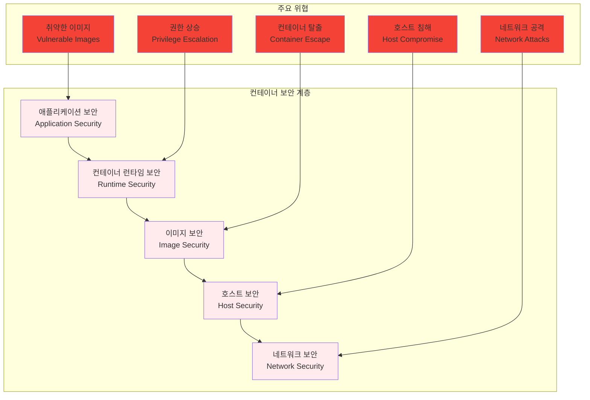
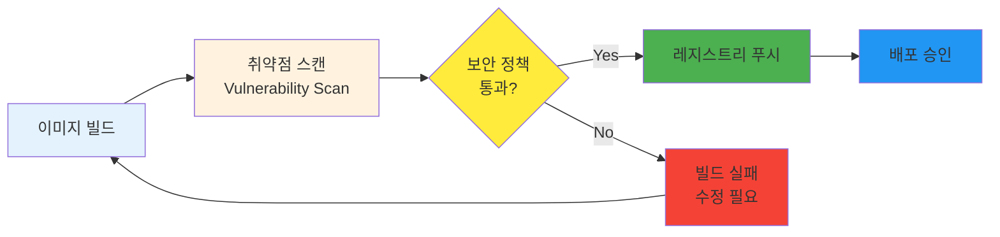
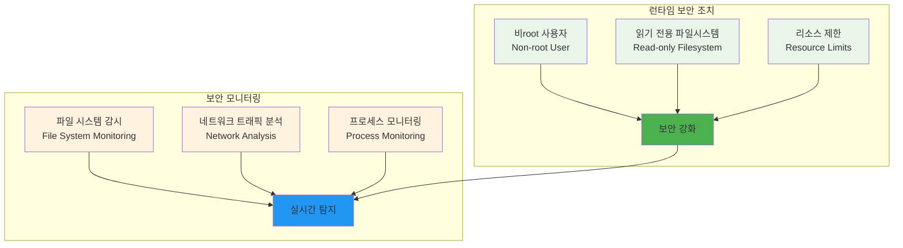
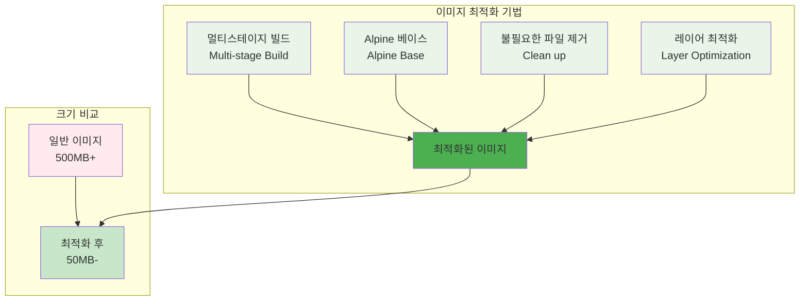
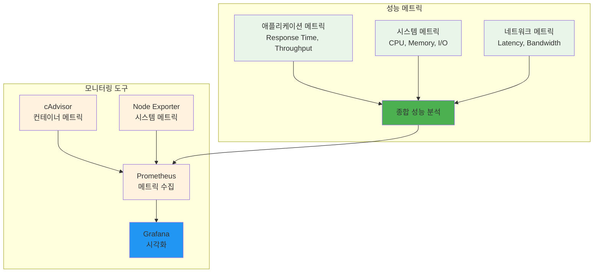
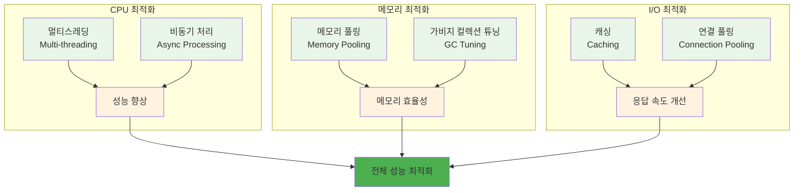
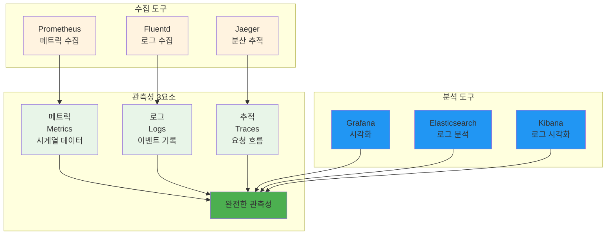
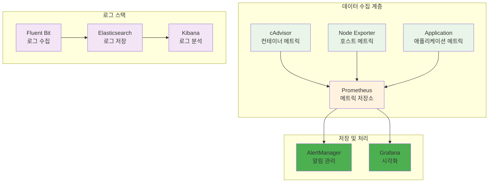
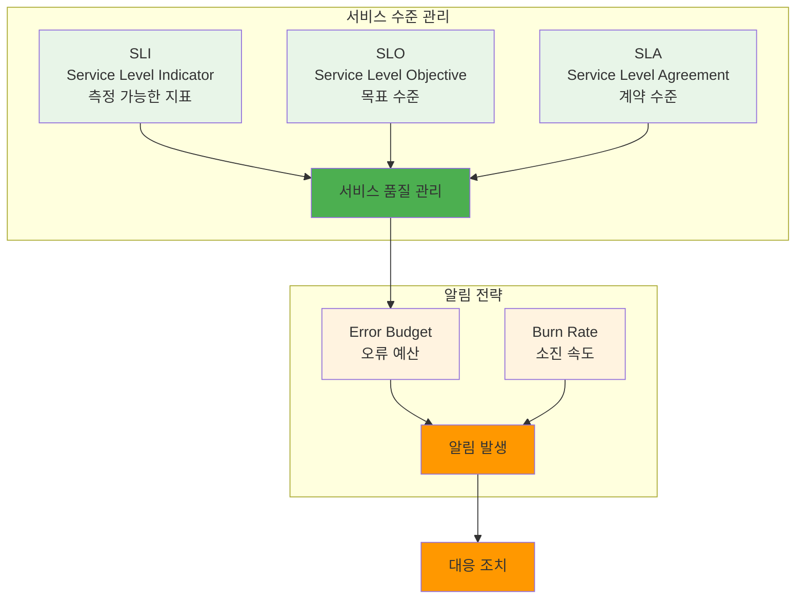
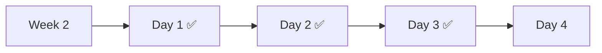

# Week 2 Day 3: 컨테이너 보안 & 성능 최적화

<div align="center">

**🔒 컨테이너 보안** • **⚡ 성능 최적화** • **📊 모니터링**

*실무에서 필수인 컨테이너 보안과 성능 최적화 기법 완전 습득*

</div>

---

## 🕘 일일 스케줄

### 📊 시간 배분
```
📚 이론 강의: 2.5시간 (31.25%) - 50분×3세션
🛠️ 실습 챌린지: 3시간 (37.5%) - 보안 & 최적화 실습
👥 학생 케어: 1시간 (12.5%) - 핵심 지원
```

### 🗓️ 상세 스케줄
| 시간 | 구분 | 내용 | 목적 |
|------|------|------|------|
| **09:00-09:50** | 📚 이론 1 | 컨테이너 보안 기초 (50분) | 보안 위협 이해 |
| **09:50-10:00** | ☕ 휴식 | 10분 휴식 | |
| **10:00-10:50** | 📚 이론 2 | 이미지 최적화 & 성능 튜닝 (50분) | 성능 향상 기법 |
| **10:50-11:00** | ☕ 휴식 | 10분 휴식 | |
| **11:00-11:50** | 📚 이론 3 | 모니터링 & 관측성 (50분) | 운영 가시성 확보 |
| **11:50-13:00** | 🍽️ 점심 | 점심시간 (70분) | |
| **13:00-16:00** | 🛠️ 챌린지 | 보안 & 최적화 통합 실습 (3시간) | 실무 적용 |
| **16:00-17:30** | 👥 케어 | 개별 맞춤 지원 & 심화 학습 (1.5시간) | 효율적 지원 |
| **17:30-18:00** | 👥 케어 | 핵심 회고 & 다음 준비 (30분) | 효율적 지원 |

---

## 📚 이론 강의 (2.5시간 - 50분×3세션)

### Session 1: 컨테이너 보안 기초 (50분)

#### 🎯 학습 목표
- **이해 목표**: 컨테이너 환경의 보안 위협과 대응 방안 완전 이해
- **적용 목표**: 실무에서 사용할 수 있는 보안 도구와 기법 습득
- **협업 목표**: 팀원들과 보안 정책 수립 및 적용 전략 토론

#### 🤔 왜 필요한가? (5분)
**현실 문제 상황**:
- 💼 **보안 사고**: 컨테이너 취약점으로 인한 실제 보안 사고 급증
- 🏠 **일상 비유**: 집의 문은 잠갔지만 창문을 열어둔 것과 같은 위험
- 📊 **시장 동향**: DevSecOps로의 패러다임 전환, 보안의 Shift-Left

#### 📖 핵심 개념 (35분)

**🔍 개념 1: 컨테이너 보안 위협 모델 (12분)**
> **정의**: 컨테이너 환경에서 발생할 수 있는 다양한 보안 위협과 공격 벡터

**컨테이너 보안 계층**:


**주요 보안 위협**:
- **취약한 베이스 이미지**: 알려진 CVE가 포함된 이미지 사용
- **과도한 권한**: root 권한으로 실행되는 컨테이너
- **시크릿 노출**: 하드코딩된 패스워드나 API 키
- **네트워크 노출**: 불필요한 포트 개방
- **리소스 남용**: 무제한 리소스 사용으로 인한 DoS

**🔍 개념 2: 이미지 보안 스캔 (12분)**
> **정의**: 컨테이너 이미지의 취약점을 자동으로 검사하고 보고하는 프로세스

**보안 스캔 워크플로우**:


**주요 스캔 도구**:
- **Trivy**: 오픈소스 취약점 스캐너
- **Clair**: CoreOS의 정적 분석 도구
- **Snyk**: 상용 보안 플랫폼
- **Anchore**: 엔터프라이즈 이미지 스캔

**스캔 실습 예시**:
```bash
# Trivy로 이미지 스캔
trivy image nginx:latest

# 심각도별 필터링
trivy image --severity HIGH,CRITICAL nginx:latest

# JSON 형태로 결과 출력
trivy image --format json nginx:latest > scan-result.json
```

**🔍 개념 3: 런타임 보안 강화 (11분)**
> **정의**: 컨테이너 실행 시점에서 적용하는 보안 조치와 모니터링

**런타임 보안 기법**:


**보안 강화 Dockerfile 예시**:
```dockerfile
FROM node:18-alpine

# 보안 강화: 비root 사용자 생성
RUN addgroup -g 1001 -S nodejs && \
    adduser -S nextjs -u 1001

# 애플리케이션 파일 복사
COPY --chown=nextjs:nodejs . .

# 비root 사용자로 전환
USER nextjs

# 읽기 전용 파일시스템 (docker run 시 --read-only 옵션)
# 리소스 제한 (docker run 시 --memory, --cpus 옵션)

EXPOSE 3000
CMD ["node", "server.js"]
```

#### 💭 함께 생각해보기 (10분)

**🤝 페어 토론** (5분):
**토론 주제**:
1. **보안 vs 편의성**: "보안을 강화하면서도 개발 편의성을 유지하는 방법은?"
2. **보안 정책**: "우리 조직에 맞는 컨테이너 보안 정책은 어떻게 수립해야 할까요?"
3. **자동화**: "보안 검사를 CI/CD 파이프라인에 어떻게 통합할까요?"

**🎯 전체 공유** (5분):
- **보안 인식**: 컨테이너 보안의 중요성과 실무 적용 방안
- **도구 선택**: 조직 규모와 요구사항에 맞는 보안 도구 선택

### Session 2: 이미지 최적화 & 성능 튜닝 (50분)

#### 🎯 학습 목표
- **이해 목표**: 컨테이너 이미지 최적화와 성능 튜닝 기법 완전 이해
- **적용 목표**: 실무에서 사용할 수 있는 최적화 도구와 기법 습득
- **협업 목표**: 팀원들과 성능 최적화 전략 및 모니터링 방안 토론

#### 📖 핵심 개념 (35분)

**🔍 개념 1: 이미지 크기 최적화 (12분)**
> **정의**: 컨테이너 이미지의 크기를 최소화하여 배포 속도와 저장 비용을 개선하는 기법

**이미지 최적화 전략**:


**멀티스테이지 빌드 예시**:
```dockerfile
# 빌드 스테이지
FROM node:18 AS builder
WORKDIR /app
COPY package*.json ./
RUN npm ci --only=production

# 프로덕션 스테이지
FROM node:18-alpine
WORKDIR /app
COPY --from=builder /app/node_modules ./node_modules
COPY . .
RUN npm run build && \
    npm prune --production && \
    rm -rf src/ tests/ *.md

USER node
EXPOSE 3000
CMD ["node", "dist/server.js"]
```

**이미지 크기 분석**:
```bash
# 이미지 크기 확인
docker images --format "table {{.Repository}}\t{{.Tag}}\t{{.Size}}"

# 이미지 레이어 분석
docker history myapp:latest

# dive 도구로 상세 분석
dive myapp:latest
```

**🔍 개념 2: 성능 모니터링과 프로파일링 (12분)**
> **정의**: 컨테이너 애플리케이션의 성능을 측정하고 병목 지점을 식별하는 방법

**성능 메트릭 계층**:


**성능 모니터링 설정**:
```yaml
# docker-compose.monitoring.yml
version: '3.8'
services:
  app:
    image: myapp:latest
    deploy:
      resources:
        limits:
          cpus: '0.5'
          memory: 512M
        reservations:
          cpus: '0.25'
          memory: 256M
    
  cadvisor:
    image: gcr.io/cadvisor/cadvisor:latest
    ports:
      - "8080:8080"
    volumes:
      - /:/rootfs:ro
      - /var/run:/var/run:ro
      - /sys:/sys:ro
      - /var/lib/docker/:/var/lib/docker:ro
    
  prometheus:
    image: prom/prometheus:latest
    ports:
      - "9090:9090"
    volumes:
      - ./prometheus.yml:/etc/prometheus/prometheus.yml
```

**🔍 개념 3: 리소스 최적화 (11분)**
> **정의**: CPU, 메모리, 네트워크 등 시스템 리소스를 효율적으로 사용하는 최적화 기법

**리소스 최적화 전략**:


**리소스 제한 설정**:
```bash
# CPU 제한 (0.5 코어)
docker run --cpus="0.5" myapp:latest

# 메모리 제한 (512MB)
docker run --memory="512m" myapp:latest

# 복합 리소스 제한
docker run \
  --cpus="0.5" \
  --memory="512m" \
  --memory-swap="1g" \
  myapp:latest
```

#### 💭 함께 생각해보기 (15분)

**🤝 페어 토론** (10분):
**토론 주제**:
1. **최적화 우선순위**: "이미지 크기, CPU, 메모리 중 어떤 것을 먼저 최적화해야 할까요?"
2. **성능 vs 안정성**: "성능 최적화와 시스템 안정성 사이의 균형점은?"
3. **모니터링 전략**: "어떤 메트릭을 가장 중요하게 모니터링해야 할까요?"

**🎯 전체 공유** (5분):
- **최적화 경험**: 성능 최적화 경험과 효과적인 방법
- **도구 활용**: 성능 모니터링 도구의 실무 활용 방안

### Session 3: 모니터링 & 관측성 (50분)

#### 🎯 학습 목표
- **이해 목표**: 컨테이너 환경에서의 포괄적인 관측성 구축 방법 이해
- **적용 목표**: 실무에서 사용할 수 있는 모니터링 시스템 구축 능력 습득
- **협업 목표**: 팀원들과 관측성 전략 및 알림 체계 설계 토론

#### 📖 핵심 개념 (35분)

**🔍 개념 1: 관측성의 3요소 (12분)**
> **정의**: 시스템의 내부 상태를 외부에서 관찰할 수 있게 하는 메트릭, 로그, 추적의 통합

**관측성 아키텍처**:


**각 요소의 역할**:
- **메트릭**: 시스템 성능 지표 (CPU, 메모리, 응답시간)
- **로그**: 애플리케이션 이벤트와 오류 정보
- **추적**: 분산 시스템에서의 요청 흐름 추적

**🔍 개념 2: 컨테이너 모니터링 스택 (12분)**
> **정의**: 컨테이너 환경에 특화된 모니터링 도구들의 통합 스택

**CNCF 모니터링 스택**:


**모니터링 설정 예시**:
```yaml
# prometheus.yml
global:
  scrape_interval: 15s

scrape_configs:
  - job_name: 'cadvisor'
    static_configs:
      - targets: ['cadvisor:8080']
  
  - job_name: 'node-exporter'
    static_configs:
      - targets: ['node-exporter:9100']
  
  - job_name: 'app'
    static_configs:
      - targets: ['app:3000']
    metrics_path: '/metrics'
```

**🔍 개념 3: 알림과 SLI/SLO (11분)**
> **정의**: 서비스 수준 지표와 목표를 기반으로 한 효과적인 알림 체계

**SLI/SLO 프레임워크**:


**SLI/SLO 예시**:
```yaml
# SLI 정의
availability_sli: |
  sum(rate(http_requests_total{status!~"5.."}[5m])) /
  sum(rate(http_requests_total[5m]))

latency_sli: |
  histogram_quantile(0.95, 
    sum(rate(http_request_duration_seconds_bucket[5m])) by (le)
  )

# SLO 목표
slo_targets:
  availability: 99.9%  # 99.9% 가용성
  latency_p95: 200ms   # 95% 요청이 200ms 이내
```

**알림 규칙 예시**:
```yaml
# alerting.yml
groups:
- name: slo_alerts
  rules:
  - alert: HighErrorRate
    expr: |
      (
        sum(rate(http_requests_total{status=~"5.."}[5m])) /
        sum(rate(http_requests_total[5m]))
      ) > 0.01
    for: 5m
    labels:
      severity: critical
    annotations:
      summary: "High error rate detected"
      description: "Error rate is {{ $value | humanizePercentage }}"
```

#### 💭 함께 생각해보기 (15분)

**🤝 페어 토론** (10분):
**토론 주제**:
1. **관측성 우선순위**: "메트릭, 로그, 추적 중 어떤 것부터 구축해야 할까요?"
2. **알림 피로도**: "너무 많은 알림으로 인한 피로도를 어떻게 줄일까요?"
3. **SLO 설정**: "우리 서비스에 적합한 SLO는 어떻게 설정해야 할까요?"

**🎯 전체 공유** (5분):
- **모니터링 경험**: 효과적인 모니터링 구축 경험
- **도구 선택**: 조직 규모에 맞는 모니터링 도구 선택 기준

---

## 🛠️ 보안 & 최적화 통합 실습 (3시간)

### 🎯 실습 개요
**통합 실습 목표**:
- 보안이 강화된 컨테이너 이미지 구축
- 성능 최적화된 애플리케이션 배포
- 포괄적인 모니터링 시스템 구축

### 📋 실습 준비 (15분)
**환경 설정**:
- 보안 스캔 도구 설치 (Trivy)
- 모니터링 스택 준비 (Prometheus, Grafana)
- 팀 구성 (3-4명씩)

### 🚀 Phase 1: 보안 강화 실습 (60분)

#### 🔧 보안 스캔 및 이미지 강화
**Step 1: 취약점 스캔 및 분석**
```bash
# 기존 이미지 스캔
trivy image node:16

# 취약점이 많은 이미지와 적은 이미지 비교
trivy image node:16 > node16-scan.txt
trivy image node:18-alpine > node18-alpine-scan.txt

# 결과 비교 분석
diff node16-scan.txt node18-alpine-scan.txt
```

**Step 2: 보안 강화 Dockerfile 작성**
```dockerfile
# Dockerfile.secure
FROM node:18-alpine AS builder

# 보안: 패키지 업데이트
RUN apk update && apk upgrade && apk add --no-cache dumb-init

WORKDIR /app
COPY package*.json ./
RUN npm ci --only=production && npm cache clean --force

FROM node:18-alpine
RUN apk update && apk upgrade && apk add --no-cache dumb-init

# 보안: 비root 사용자 생성
RUN addgroup -g 1001 -S nodejs && \
    adduser -S nextjs -u 1001 -G nodejs

WORKDIR /app
COPY --from=builder /app/node_modules ./node_modules
COPY --chown=nextjs:nodejs . .

# 보안: 비root 사용자로 전환
USER nextjs

# 보안: 불필요한 파일 제거
RUN rm -rf /app/tests /app/docs /app/*.md

EXPOSE 3000
ENTRYPOINT ["dumb-init", "--"]
CMD ["node", "server.js"]
```

**Step 3: 보안 정책 적용**
```bash
# 보안 강화된 컨테이너 실행
docker run -d \
  --name secure-app \
  --read-only \
  --tmpfs /tmp \
  --tmpfs /var/run \
  --no-new-privileges \
  --cap-drop ALL \
  --cap-add NET_BIND_SERVICE \
  --memory="256m" \
  --cpus="0.5" \
  -p 3000:3000 \
  myapp:secure

# 보안 설정 확인
docker inspect secure-app | jq '.[] | {ReadonlyRootfs, SecurityOpt, CapAdd, CapDrop}'
```

#### ✅ Phase 1 체크포인트
- [ ] 취약점 스캔 결과 분석 완료
- [ ] 보안 강화 이미지 빌드 성공
- [ ] 런타임 보안 정책 적용 확인
- [ ] 보안 설정 검증 완료

### 🌟 Phase 2: 성능 최적화 실습 (60분)

#### 🔧 이미지 최적화 및 성능 튜닝
**Step 1: 멀티스테이지 빌드 최적화**
```dockerfile
# Dockerfile.optimized
FROM node:18-alpine AS deps
WORKDIR /app
COPY package*.json ./
RUN npm ci --only=production && npm cache clean --force

FROM node:18-alpine AS builder
WORKDIR /app
COPY package*.json ./
RUN npm ci
COPY . .
RUN npm run build

FROM node:18-alpine AS runner
WORKDIR /app
RUN addgroup -g 1001 -S nodejs && \
    adduser -S nextjs -u 1001 -G nodejs

COPY --from=deps --chown=nextjs:nodejs /app/node_modules ./node_modules
COPY --from=builder --chown=nextjs:nodejs /app/dist ./dist
COPY --from=builder --chown=nextjs:nodejs /app/public ./public

USER nextjs
EXPOSE 3000
CMD ["node", "dist/server.js"]
```

**Step 2: 이미지 크기 분석 및 최적화**
```bash
# 이미지 크기 비교
docker images | grep myapp

# 레이어 분석
docker history myapp:latest
docker history myapp:optimized

# dive 도구로 상세 분석 (설치 필요)
# dive myapp:optimized
```

**Step 3: 성능 벤치마크 테스트**
```bash
# Apache Bench로 성능 테스트
ab -n 10000 -c 100 http://localhost:3000/

# 리소스 사용량 모니터링
docker stats secure-app

# 성능 프로파일링
docker exec secure-app top
docker exec secure-app free -h
```

#### ✅ Phase 2 체크포인트
- [ ] 멀티스테이지 빌드로 이미지 크기 50% 이상 감소
- [ ] 성능 벤치마크 테스트 완료
- [ ] 리소스 사용량 최적화 확인
- [ ] 응답 시간 개선 측정

### 🏆 Phase 3: 모니터링 시스템 구축 (60분)

#### 🔧 통합 모니터링 스택 구축
**Step 1: Prometheus + Grafana 스택 배포**
```yaml
# monitoring-stack.yml
version: '3.8'
services:
  app:
    image: myapp:optimized
    ports:
      - "3000:3000"
    deploy:
      resources:
        limits:
          memory: 256M
          cpus: '0.5'
    
  cadvisor:
    image: gcr.io/cadvisor/cadvisor:latest
    ports:
      - "8080:8080"
    volumes:
      - /:/rootfs:ro
      - /var/run:/var/run:ro
      - /sys:/sys:ro
      - /var/lib/docker/:/var/lib/docker:ro
    
  prometheus:
    image: prom/prometheus:latest
    ports:
      - "9090:9090"
    volumes:
      - ./prometheus.yml:/etc/prometheus/prometheus.yml
      - ./alerts.yml:/etc/prometheus/alerts.yml
    command:
      - '--config.file=/etc/prometheus/prometheus.yml'
      - '--storage.tsdb.path=/prometheus'
      - '--web.console.libraries=/etc/prometheus/console_libraries'
      - '--web.console.templates=/etc/prometheus/consoles'
      - '--web.enable-lifecycle'
    
  grafana:
    image: grafana/grafana:latest
    ports:
      - "3001:3000"
    environment:
      - GF_SECURITY_ADMIN_PASSWORD=admin
    volumes:
      - grafana-data:/var/lib/grafana
      - ./grafana/dashboards:/etc/grafana/provisioning/dashboards
      - ./grafana/datasources:/etc/grafana/provisioning/datasources

volumes:
  grafana-data:
```

**Step 2: 커스텀 메트릭 구현**
```javascript
// app.js - 애플리케이션 메트릭 추가
const prometheus = require('prom-client');

// 기본 메트릭 수집
prometheus.collectDefaultMetrics();

// 커스텀 메트릭 정의
const httpRequestDuration = new prometheus.Histogram({
  name: 'http_request_duration_seconds',
  help: 'Duration of HTTP requests in seconds',
  labelNames: ['method', 'route', 'status']
});

const httpRequestTotal = new prometheus.Counter({
  name: 'http_requests_total',
  help: 'Total number of HTTP requests',
  labelNames: ['method', 'route', 'status']
});

// 메트릭 엔드포인트
app.get('/metrics', (req, res) => {
  res.set('Content-Type', prometheus.register.contentType);
  res.end(prometheus.register.metrics());
});
```

**Step 3: 대시보드 및 알림 설정**
```bash
# 모니터링 스택 시작
docker-compose -f monitoring-stack.yml up -d

# Grafana 접속 (admin/admin)
open http://localhost:3001

# Prometheus 접속
open http://localhost:9090

# 부하 테스트로 메트릭 생성
ab -n 5000 -c 50 http://localhost:3000/
```

#### ✅ Phase 3 체크포인트
- [ ] Prometheus + Grafana 스택 정상 동작
- [ ] 애플리케이션 커스텀 메트릭 수집 확인
- [ ] 대시보드에서 실시간 메트릭 시각화
- [ ] 알림 규칙 설정 및 테스트 완료

### 🎤 결과 발표 및 공유 (40분)

#### 📊 팀별 발표 (10분×4팀)
**발표 내용**:
1. **보안 강화 결과**: 취약점 스캔 결과와 보안 조치 효과
2. **성능 최적화 성과**: 이미지 크기 감소율과 성능 개선 지표
3. **모니터링 시스템**: 구축한 모니터링 대시보드와 핵심 메트릭
4. **통합 효과**: 보안, 성능, 모니터링의 통합적 효과
5. **실무 적용 계획**: 학습한 내용의 실무 적용 방안
6. **팀 협업 경험**: 협업 과정에서 배운 점과 시너지

---

## 👥 핵심 학생 케어 (30분)

### 🎯 전체 통합 회고 (20분)
**오늘의 핵심 성과**:
- 컨테이너 보안 위협 이해 및 대응 방안 습득
- 이미지 최적화와 성능 튜닝 기법 완전 습득
- 포괄적인 모니터링 시스템 구축 경험
- 보안-성능-모니터링의 통합적 접근법 체득

**어려웠던 점과 해결 방법**:
- 보안과 성능 사이의 트레이드오프 → 균형점 찾기
- 복잡한 모니터링 설정 → 단계별 구축과 팀 협업
- 다양한 도구 활용 → 실습을 통한 체득과 상호 학습

### 🚀 내일 준비 및 동기부여 (10분)
**Week 2 Day 4 미리보기**:
- Week 1-2 전체 기술 스택 통합 프로젝트
- Docker 전문가 수준의 실무 프로젝트 완성
- 오케스트레이션 학습을 위한 완벽한 준비
- Week 3 진입을 위한 최종 점검

**개인별 준비사항**:
- 오늘 학습한 보안, 성능, 모니터링 개념 복습
- 내일 통합 프로젝트를 위한 아이디어 구상
- 팀 협업을 위한 역할 분담 계획

---

## 📝 일일 마무리

### ✅ 오늘의 성과
- [ ] 컨테이너 보안 위협 모델 완전 이해
- [ ] 이미지 보안 스캔 및 런타임 보안 강화 실습 완료
- [ ] 이미지 최적화로 50% 이상 크기 감소 달성
- [ ] 성능 모니터링 및 튜닝 기법 습득
- [ ] Prometheus + Grafana 모니터링 스택 구축 완료
- [ ] SLI/SLO 기반 알림 시스템 설정 경험
- [ ] 보안-성능-모니터링 통합 접근법 체득

### 🎯 내일 준비사항
- **예습**: Week 1-2 전체 기술 스택 복습
- **복습**: 오늘 배운 보안, 최적화, 모니터링 개념 정리
- **환경**: 내일 통합 프로젝트를 위한 개발 환경 최종 점검

### 📊 학습 진도 체크


---

<div align="center">

**🔒 보안 전문가** • **⚡ 성능 최적화 마스터** • **📊 모니터링 구축 완료**

*실무에서 바로 사용할 수 있는 컨테이너 운영 전문 역량을 완성했습니다*

**다음**: [Day 4 - Week 1-2 종합 실습 & 프로젝트](./day4/README.md)

</div>