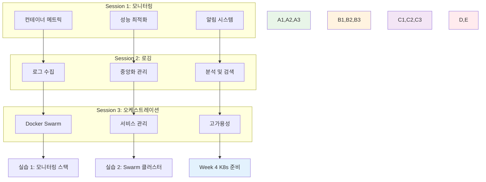

# Week 2 Day 3: Docker 운영 & 모니터링

<div align="center">

**📊 운영 모니터링** • **🔍 성능 최적화** • **🐳 Docker Swarm**

*프로덕션 환경을 위한 컨테이너 운영과 오케스트레이션 기초*

</div>

---

## 🕘 일일 스케줄

### 📊 시간 배분
```
📚 이론 강의: 2.5시간 (50분×3세션) - 운영 중심 학습
🛠️ 실습 세션: 2시간 (50분×2세션) - 모니터링 구축
👥 학생 케어: 개별 맞춤 지원 (필요시)
```

### 🗓️ 상세 스케줄
| 시간 | 구분 | 내용 | 목적 |
|------|------|------|------|
| **09:00-09:50** | 📚 이론 1 | [컨테이너 모니터링 & 성능 최적화](./session_1.md) | 운영 관측성 |
| **09:50-10:00** | ☕ 휴식 | 10분 휴식 | |
| **10:00-10:50** | 📚 이론 2 | [로깅 전략 & 중앙화된 로그 관리](./session_2.md) | 로그 시스템 |
| **10:50-11:00** | ☕ 휴식 | 10분 휴식 | |
| **11:00-11:50** | 📚 이론 3 | [Docker Swarm 기초 & 오케스트레이션 체험](./session_3.md) | 클러스터 관리 |
| **11:50-12:00** | ☕ 휴식 | 10분 휴식 | |
| **12:00-12:50** | 🛠️ 실습 1 | [운영급 모니터링 시스템 구축](./lab_1.md) | 종합 모니터링 |
| **12:50-13:00** | ☕ 휴식 | 10분 휴식 | |
| **13:00-14:00** | 🍽️ 점심 | 점심시간 (60분) | |
| **14:00-14:50** | 🛠️ 실습 2 | [Docker Swarm 클러스터 구성](./lab_2.md) | 오케스트레이션 |

---

## 🎯 일일 학습 목표

### 📚 이론 목표
- **모니터링**: 컨테이너 성능 지표 수집과 분석 방법 이해
- **로깅**: 중앙화된 로그 관리 시스템 구축 방법 학습
- **오케스트레이션**: Docker Swarm을 통한 클러스터 관리 기초

### 🛠️ 실습 목표
- **운영 시스템**: Prometheus + Grafana 모니터링 스택 구축
- **로그 시스템**: ELK Stack을 활용한 로그 중앙화
- **클러스터**: Docker Swarm 멀티 노드 클러스터 구성

### 🤝 협업 목표
- **운영 경험**: 실제 운영 환경에서의 문제 해결 경험 공유
- **모니터링 설계**: 팀별 모니터링 전략 수립 및 발표
- **장애 대응**: 시뮬레이션을 통한 장애 상황 대응 연습

---

## 📚 3개 세션 통합 맵



---

## 🔗 연결성 및 발전

### 이전 학습과의 연결
- **Day 1**: Docker 네트워킹 → 모니터링 네트워크 구성
- **Day 2**: 데이터 관리 → 메트릭/로그 데이터 저장
- **기본 컨테이너**: 단일 컨테이너 → 멀티 컨테이너 운영

### 다음 학습 준비
- **Day 4**: Kubernetes 준비 → Swarm 경험 활용
- **Week 3**: K8s 클러스터 → 오케스트레이션 개념 확장
- **운영 실무**: 실제 프로덕션 환경 운영 기초

---

## 📊 성공 지표

### 기술적 성취
- **모니터링 구축**: Prometheus + Grafana 완전 구성
- **로그 시스템**: ELK Stack 정상 동작
- **Swarm 클러스터**: 3노드 클러스터 구성 및 서비스 배포
- **장애 대응**: 모니터링을 통한 문제 감지 및 해결

### 학습 효과
- **운영 마인드**: 개발에서 운영으로 사고 전환
- **관측성 이해**: 메트릭, 로그, 트레이싱 통합 이해
- **클러스터 개념**: 분산 시스템 기초 개념 습득
- **실무 준비**: Kubernetes 학습을 위한 기반 마련

---

## 🎯 실무 연계 포인트

### 운영 환경 시뮬레이션
- **24/7 모니터링**: 실시간 메트릭 수집과 알림
- **로그 분석**: 장애 원인 분석을 위한 로그 검색
- **무중단 배포**: Swarm을 통한 롤링 업데이트
- **스케일링**: 부하에 따른 자동/수동 스케일링

### 실제 운영 사례
- **Netflix**: 마이크로서비스 모니터링 전략
- **Uber**: 대규모 로그 처리 시스템
- **Airbnb**: 컨테이너 오케스트레이션 경험
- **Spotify**: 개발팀별 모니터링 자율성

---

## 📋 학습 점검 체크리스트

### 이론 이해도
- [ ] **메트릭 수집**: Prometheus 메트릭 수집 원리 이해
- [ ] **로그 파이프라인**: Logstash 데이터 처리 과정 이해
- [ ] **Swarm 아키텍처**: Manager/Worker 노드 역할 이해
- [ ] **서비스 디스커버리**: 동적 서비스 발견 메커니즘 이해

### 실습 완성도
- [ ] **모니터링 대시보드**: Grafana 대시보드 구성 완료
- [ ] **로그 검색**: Kibana에서 로그 검색 및 분석 가능
- [ ] **Swarm 서비스**: 멀티 노드에서 서비스 정상 동작
- [ ] **장애 시뮬레이션**: 의도적 장애 발생 및 복구 경험

### 협업 참여도
- [ ] **모니터링 전략**: 팀별 모니터링 방안 수립 참여
- [ ] **문제 해결**: 동료의 기술적 문제 해결 지원
- [ ] **경험 공유**: 실습 중 발견한 인사이트 공유
- [ ] **질문 및 토론**: 적극적인 질문과 건설적 토론 참여

---

## 🔮 다음 학습 예고

### Day 4: Kubernetes 준비 & 마이그레이션
- **Docker vs K8s**: 오케스트레이션 도구 비교 분석
- **K8s 아키텍처**: 클러스터 구성 요소와 동작 원리
- **마이그레이션**: Docker Compose/Swarm → Kubernetes
- **실습 준비**: K8s 환경 구축과 기본 배포

### Week 3 연결고리
- **모니터링**: Prometheus → K8s 네이티브 모니터링
- **로깅**: ELK → K8s 로그 수집 및 관리
- **오케스트레이션**: Swarm → K8s 고급 기능
- **운영**: 컨테이너 운영 → 클라우드 네이티브 운영

---

<div align="center">

**📊 체계적 운영 학습** • **🤝 협업 중심 실습** • **🚀 실무 연계 강화**

*Docker 운영의 모든 것을 마스터하고 Kubernetes로 도약하는 하루*

</div>