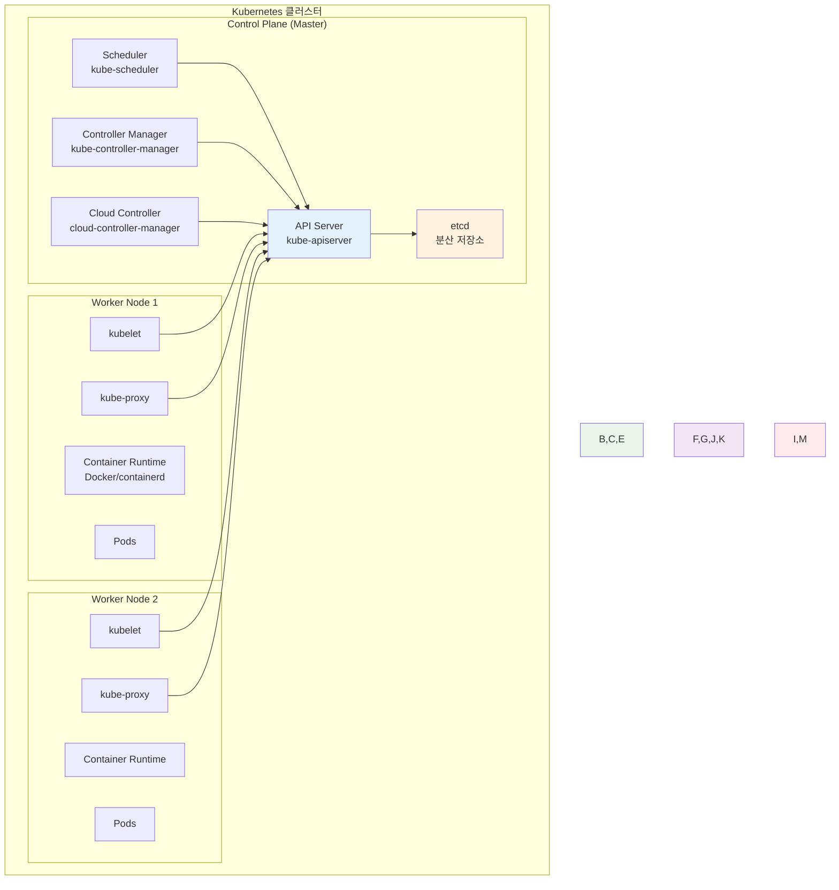
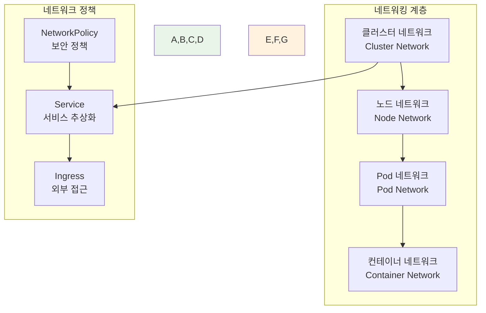
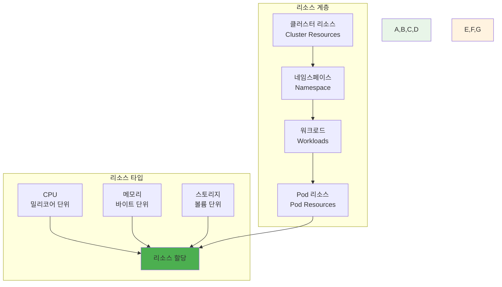
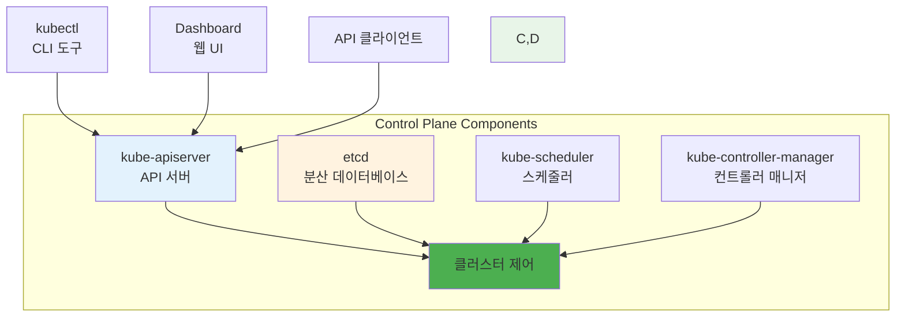
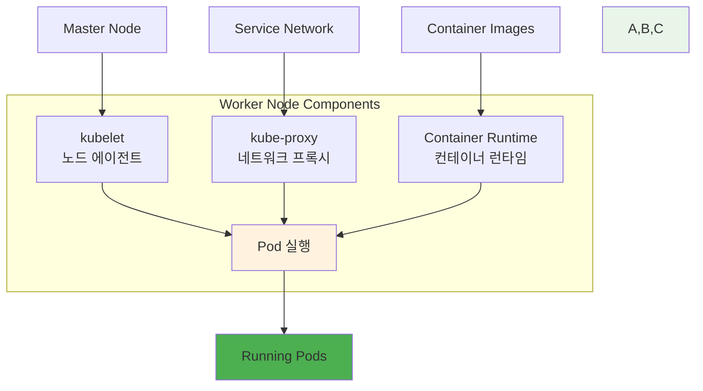
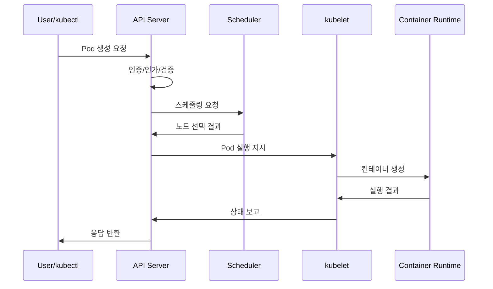
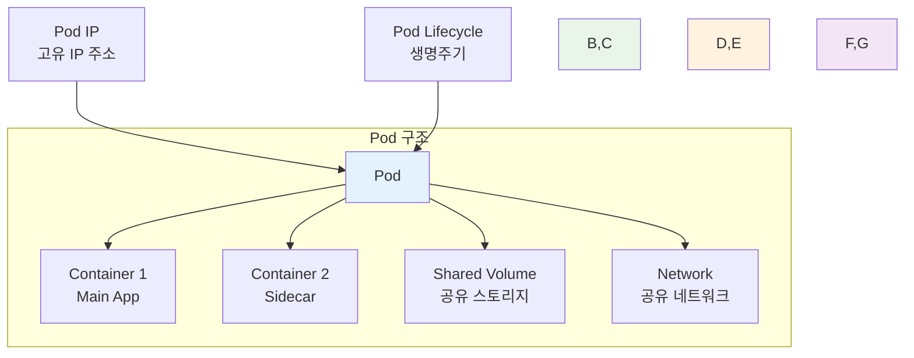
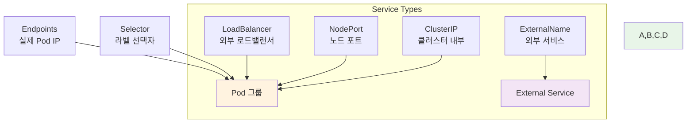
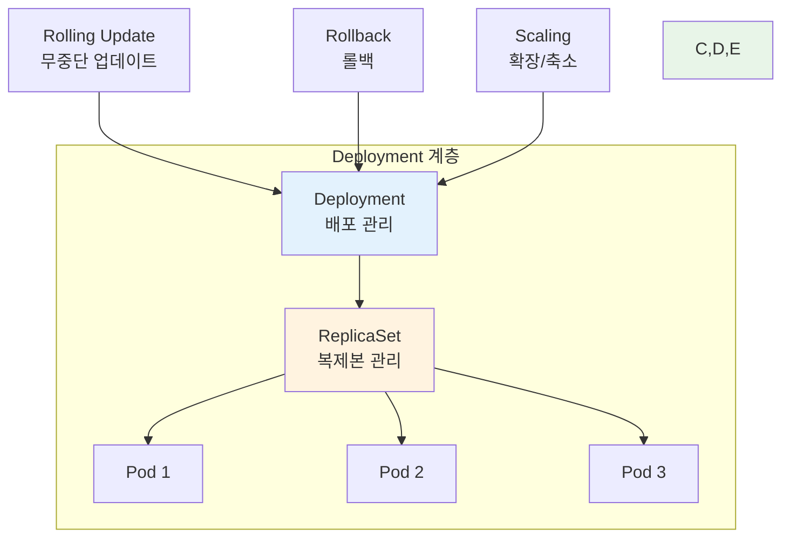
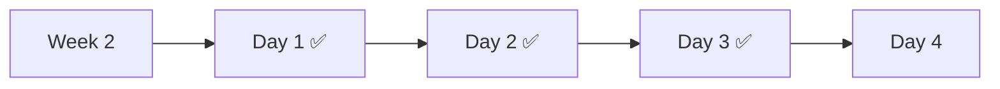

# Week 2 Day 3: Kubernetes 아키텍처 & 핵심 개념

<div align="center">

**☸️ Kubernetes 아키텍처** • **🏗️ 클러스터 구조** • **📦 핵심 오브젝트**

*Kubernetes의 전체 구조와 핵심 구성 요소를 완전히 이해*

</div>

---

## 🕘 일일 스케줄

### 📊 시간 배분
```
📚 이론 강의: 2.5시간 (31.25%) - 50분×3세션
🛠️ 실습 챌린지: 4.5시간 (56.25%) - K8s 환경 구축 & 고급 실습
👥 학생 케어: 1시간 (12.5%) - 핵심 지원
```

### 🗓️ 상세 스케줄
| 시간 | 구분 | 내용 | 목적 |
|------|------|------|------|
| **09:00-09:50** | 📚 이론 1 | Kubernetes 아키텍처 (50분) | 전체 구조 이해 |
| **09:50-10:00** | ☕ 휴식 | 10분 휴식 | |
| **10:00-10:50** | 📚 이론 2 | 마스터 & 워커 노드 (50분) | 노드 역할 이해 |
| **10:50-11:00** | ☕ 휴식 | 10분 휴식 | |
| **11:00-11:50** | 📚 이론 3 | 핵심 오브젝트 (50분) | Pod, Service, Deployment |
| **11:50-13:00** | 🍽️ 점심 | 점심시간 (70분) | |
| **13:00-17:30** | 🛠️ 챌린지 | K8s 환경 구축 & 고급 실습 (4.5시간) | 실무 적용 |
| **17:30-18:00** | 👥 케어 | 핵심 회고 & 다음 준비 (30분) | 효율적 지원 |

---

## 📚 이론 강의 (2.5시간 - 50분×3세션)

### Session 1: Kubernetes 아키텍처와 클러스터 구조 (50분)

#### 🎯 학습 목표
- **이해 목표**: Kubernetes 전체 아키텍처와 클러스터 구성 요소 완전 이해
- **적용 목표**: 클러스터 구조를 바탕으로 한 시스템 설계 능력 습득
- **협업 목표**: 팀원들과 Kubernetes 아키텍처 분석 및 설계 토론

#### 🤔 왜 필요한가? (5분)
**현실 문제 상황**:
- 💼 **복잡한 시스템**: 수백 개의 마이크로서비스를 관리해야 하는 현실
- 🏠 **일상 비유**: 대규모 아파트 단지를 체계적으로 관리하는 것과 같은 복잡성
- 📊 **시장 동향**: 클라우드 네이티브 애플리케이션의 표준 플랫폼으로 자리잡은 Kubernetes

#### 📖 핵심 개념 (35분)

**🔍 개념 1: Kubernetes 전체 아키텍처 (12분)**
> **정의**: 분산 시스템으로 구성된 Kubernetes의 전체적인 구조와 구성 요소

**Kubernetes 클러스터 구조**:


**아키텍처 특징**:
- **분산 시스템**: 여러 노드에 걸쳐 분산된 구조
- **선언적 API**: 원하는 상태를 선언하면 자동으로 달성
- **확장 가능**: 노드 추가로 수평 확장 가능
- **고가용성**: 마스터 노드 다중화로 장애 대응

**🔍 개념 2: 클러스터 네트워킹 (12분)**
> **정의**: Kubernetes 클러스터 내부와 외부 간의 네트워크 통신 구조

**네트워킹 계층**:


**네트워킹 원칙**:
- **모든 Pod는 고유 IP**: 각 Pod는 클러스터 내에서 유일한 IP 주소
- **Pod 간 직접 통신**: NAT 없이 Pod끼리 직접 통신 가능
- **노드-Pod 통신**: 노드에서 모든 Pod에 직접 접근 가능
- **서비스 추상화**: Service를 통한 안정적인 네트워크 엔드포인트

**🔍 개념 3: 리소스 관리 모델 (11분)**
> **정의**: Kubernetes에서 컴퓨팅 리소스를 관리하고 할당하는 방법

**리소스 관리 구조**:


**리소스 관리 개념**:
- **Requests**: Pod가 보장받을 최소 리소스
- **Limits**: Pod가 사용할 수 있는 최대 리소스
- **QoS Classes**: 리소스 보장 수준에 따른 분류
- **Resource Quotas**: 네임스페이스별 리소스 제한

#### 💭 함께 생각해보기 (10분)

**🤝 페어 토론** (5분):
**토론 주제**:
1. **아키텍처 이해**: "Kubernetes의 분산 구조가 가지는 장점은 무엇일까요?"
2. **네트워킹**: "Pod 간 직접 통신이 가능한 것의 의미는?"
3. **리소스 관리**: "클라우드 환경에서 리소스를 효율적으로 관리하는 방법은?"

**🎯 전체 공유** (5분):
- **아키텍처 이해도**: Kubernetes 구조에 대한 이해 확인
- **설계 관점**: 시스템 설계 시 고려사항 공유

### Session 2: 마스터 노드와 워커 노드의 역할 (50분)

#### 🎯 학습 목표
- **이해 목표**: 마스터 노드와 워커 노드의 구체적인 역할과 책임 이해
- **적용 목표**: 노드별 장애 상황과 대응 방법 파악
- **협업 목표**: 팀원들과 클러스터 운영 전략 토론

#### 📖 핵심 개념 (35분)

**🔍 개념 1: 마스터 노드 (Control Plane) (12분)**
> **정의**: 클러스터의 두뇌 역할을 하는 제어 평면 구성 요소들

**마스터 노드 구성 요소**:


**각 구성 요소 역할**:

**1. kube-apiserver**
- **역할**: 모든 API 요청의 중앙 처리
- **기능**: 인증, 인가, 검증, 변환
- **특징**: RESTful API 제공, 모든 통신의 허브

**2. etcd**
- **역할**: 클러스터 상태 정보 저장
- **기능**: 분산 키-값 저장소
- **특징**: 강한 일관성, 고가용성

**3. kube-scheduler**
- **역할**: Pod를 적절한 노드에 배치
- **기능**: 리소스 요구사항과 노드 상태 분석
- **특징**: 다양한 스케줄링 정책 지원

**4. kube-controller-manager**
- **역할**: 다양한 컨트롤러 실행
- **기능**: 원하는 상태 유지
- **특징**: 선언적 상태 관리

**🔍 개념 2: 워커 노드 (Worker Node) (12분)**
> **정의**: 실제 애플리케이션 워크로드가 실행되는 노드

**워커 노드 구성 요소**:


**각 구성 요소 역할**:

**1. kubelet**
- **역할**: 노드의 Kubernetes 에이전트
- **기능**: Pod 생명주기 관리, 노드 상태 보고
- **특징**: API 서버와 지속적 통신

**2. kube-proxy**
- **역할**: 네트워크 프록시 및 로드 밸런서
- **기능**: Service 추상화 구현
- **특징**: iptables 또는 IPVS 기반 트래픽 라우팅

**3. Container Runtime**
- **역할**: 컨테이너 실행 환경
- **기능**: 이미지 풀, 컨테이너 생성/삭제
- **특징**: CRI(Container Runtime Interface) 호환

**🔍 개념 3: 노드 간 통신과 협업 (11분)**
> **정의**: 마스터 노드와 워커 노드 간의 통신 방식과 협업 메커니즘

**통신 흐름**:


**협업 메커니즘**:
- **Watch API**: 실시간 상태 변경 감지
- **Heartbeat**: 노드 생존 확인
- **Leader Election**: 마스터 노드 고가용성
- **Event System**: 클러스터 이벤트 전파

#### 💭 함께 생각해보기 (15분)

**🤝 페어 토론** (10분):
**토론 주제**:
1. **역할 분담**: "마스터와 워커 노드의 역할 분담이 가지는 장점은?"
2. **장애 대응**: "마스터 노드나 워커 노드에 장애가 발생하면 어떻게 될까요?"
3. **확장 전략**: "클러스터를 확장할 때 어떤 노드를 먼저 추가해야 할까요?"

**🎯 전체 공유** (5분):
- **운영 관점**: 클러스터 운영 시 고려사항
- **장애 대응**: 노드별 장애 상황과 대응 방안

### Session 3: 핵심 오브젝트 (Pod, Service, Deployment) (50분)

#### 🎯 학습 목표
- **이해 목표**: Kubernetes의 핵심 오브젝트들의 개념과 관계 완전 이해
- **적용 목표**: 각 오브젝트의 적절한 사용 시기와 방법 습득
- **협업 목표**: 팀원들과 오브젝트 설계 및 활용 전략 토론

#### 📖 핵심 개념 (35분)

**🔍 개념 1: Pod - 최소 배포 단위 (12분)**
> **정의**: Kubernetes에서 생성하고 관리할 수 있는 가장 작은 배포 단위

**Pod의 특징**:


**Pod 설계 원칙**:
- **단일 책임**: 하나의 주요 애플리케이션
- **공유 리소스**: 네트워크와 스토리지 공유
- **생명주기 동기화**: 함께 생성되고 함께 삭제
- **사이드카 패턴**: 보조 컨테이너 활용

**Pod YAML 예시**:
```yaml
apiVersion: v1
kind: Pod
metadata:
  name: web-pod
  labels:
    app: web
spec:
  containers:
  - name: web-container
    image: nginx:1.21
    ports:
    - containerPort: 80
    resources:
      requests:
        memory: "64Mi"
        cpu: "250m"
      limits:
        memory: "128Mi"
        cpu: "500m"
```

**🔍 개념 2: Service - 네트워크 추상화 (12분)**
> **정의**: Pod에 대한 안정적인 네트워크 엔드포인트를 제공하는 추상화 계층

**Service 타입들**:


**Service 동작 원리**:
- **라벨 셀렉터**: 대상 Pod 선택
- **엔드포인트**: 실제 Pod IP 목록 관리
- **로드 밸런싱**: 트래픽 분산
- **서비스 디스커버리**: DNS 기반 서비스 발견

**Service YAML 예시**:
```yaml
apiVersion: v1
kind: Service
metadata:
  name: web-service
spec:
  selector:
    app: web
  ports:
  - protocol: TCP
    port: 80
    targetPort: 80
  type: ClusterIP
```

**🔍 개념 3: Deployment - 애플리케이션 배포 관리 (11분)**
> **정의**: Pod의 선언적 업데이트와 롤백을 관리하는 고수준 오브젝트

**Deployment 구조**:


**Deployment 주요 기능**:
- **선언적 업데이트**: 원하는 상태 선언
- **롤링 업데이트**: 무중단 배포
- **롤백**: 이전 버전으로 복구
- **스케일링**: 복제본 수 조정

**Deployment YAML 예시**:
```yaml
apiVersion: apps/v1
kind: Deployment
metadata:
  name: web-deployment
spec:
  replicas: 3
  selector:
    matchLabels:
      app: web
  template:
    metadata:
      labels:
        app: web
    spec:
      containers:
      - name: web
        image: nginx:1.21
        ports:
        - containerPort: 80
  strategy:
    type: RollingUpdate
    rollingUpdate:
      maxUnavailable: 1
      maxSurge: 1
```

#### 💭 함께 생각해보기 (15분)

**🤝 페어 토론** (10분):
**토론 주제**:
1. **오브젝트 관계**: "Pod, Service, Deployment는 어떻게 함께 동작하나요?"
2. **설계 결정**: "언제 Pod를 직접 생성하고, 언제 Deployment를 사용해야 할까요?"
3. **실무 적용**: "실제 애플리케이션을 배포할 때 어떤 순서로 오브젝트를 생성해야 할까요?"

**🎯 전체 공유** (5분):
- **오브젝트 설계**: 효과적인 Kubernetes 오브젝트 설계 방안
- **베스트 프랙티스**: 실무에서 권장되는 사용 패턴

---

## 🛠️ 실습 챌린지 (3시간)

### 🎯 챌린지 개요
**실무 환경 구축 목표**:
- 로컬 Kubernetes 환경 구축
- 핵심 오브젝트 생성 및 관리 실습
- 간단한 애플리케이션 배포 체험

### 📋 챌린지 준비 (15분)
**환경 설정**:
- Minikube 또는 Kind 설치
- kubectl CLI 도구 설치
- 팀 구성 (3-4명씩)

### 🚀 Phase 1: 로컬 Kubernetes 환경 구축 (90분)

#### 🔧 구현 단계
**Step 1: Minikube 설치 및 클러스터 시작**
```bash
# Minikube 설치 (Windows)
choco install minikube

# 클러스터 시작
minikube start --driver=docker --cpus=2 --memory=4096

# 클러스터 상태 확인
kubectl cluster-info
kubectl get nodes
```

**Step 2: 클러스터 구성 요소 확인**
```bash
# 시스템 Pod 확인
kubectl get pods -n kube-system

# 노드 상세 정보
kubectl describe node minikube

# 클러스터 이벤트 확인
kubectl get events --sort-by=.metadata.creationTimestamp
```

**Step 3: kubectl 기본 명령어 실습**
```bash
# 네임스페이스 생성
kubectl create namespace my-app

# 현재 컨텍스트 확인
kubectl config current-context

# 리소스 목록 확인
kubectl api-resources

# 도움말 확인
kubectl explain pod
kubectl explain service
```

#### ✅ Phase 1 체크포인트
- [ ] Minikube 클러스터 정상 시작
- [ ] kubectl 명령어로 클러스터 접근 확인
- [ ] 시스템 구성 요소 상태 확인
- [ ] 기본 kubectl 명령어 숙달

### 🌟 Phase 2: 기본 오브젝트 생성 및 관리 (90분)

#### 🔧 오브젝트 생성 실습
**Step 1: Pod 생성 및 관리**
```yaml
# nginx-pod.yaml
apiVersion: v1
kind: Pod
metadata:
  name: nginx-pod
  labels:
    app: nginx
spec:
  containers:
  - name: nginx
    image: nginx:1.21
    ports:
    - containerPort: 80
    resources:
      requests:
        memory: "64Mi"
        cpu: "250m"
      limits:
        memory: "128Mi"
        cpu: "500m"
```

```bash
# Pod 생성
kubectl apply -f nginx-pod.yaml

# Pod 상태 확인
kubectl get pods
kubectl describe pod nginx-pod

# Pod 로그 확인
kubectl logs nginx-pod

# Pod 내부 접속
kubectl exec -it nginx-pod -- /bin/bash
```

**Step 2: Service 생성 및 테스트**
```yaml
# nginx-service.yaml
apiVersion: v1
kind: Service
metadata:
  name: nginx-service
spec:
  selector:
    app: nginx
  ports:
  - protocol: TCP
    port: 80
    targetPort: 80
  type: ClusterIP
```

```bash
# Service 생성
kubectl apply -f nginx-service.yaml

# Service 확인
kubectl get services
kubectl describe service nginx-service

# 엔드포인트 확인
kubectl get endpoints nginx-service

# 서비스 테스트
kubectl run test-pod --image=busybox --rm -it -- wget -qO- nginx-service
```

**Step 3: Deployment 생성 및 관리**
```yaml
# nginx-deployment.yaml
apiVersion: apps/v1
kind: Deployment
metadata:
  name: nginx-deployment
spec:
  replicas: 3
  selector:
    matchLabels:
      app: nginx-deploy
  template:
    metadata:
      labels:
        app: nginx-deploy
    spec:
      containers:
      - name: nginx
        image: nginx:1.21
        ports:
        - containerPort: 80
```

```bash
# Deployment 생성
kubectl apply -f nginx-deployment.yaml

# Deployment 상태 확인
kubectl get deployments
kubectl get replicasets
kubectl get pods -l app=nginx-deploy

# 스케일링 테스트
kubectl scale deployment nginx-deployment --replicas=5
kubectl get pods -w

# 롤링 업데이트 테스트
kubectl set image deployment/nginx-deployment nginx=nginx:1.22
kubectl rollout status deployment/nginx-deployment

# 롤백 테스트
kubectl rollout undo deployment/nginx-deployment
```

#### ✅ Phase 2 체크포인트
- [ ] Pod 생성 및 관리 성공
- [ ] Service를 통한 네트워크 접근 확인
- [ ] Deployment 스케일링 및 업데이트 체험
- [ ] 오브젝트 간 관계 이해

### 🏆 Phase 3: 고급 Kubernetes 실습 (90분)

#### 🔧 고급 오브젝트 실습
**Step 1: ConfigMap과 Secret 활용**
```yaml
# app-config.yaml
apiVersion: v1
kind: ConfigMap
metadata:
  name: app-config
data:
  database_url: "postgresql://db:5432/myapp"
  redis_url: "redis://redis:6379"
  log_level: "INFO"
---
apiVersion: v1
kind: Secret
metadata:
  name: app-secrets
type: Opaque
data:
  db_password: cGFzc3dvcmQxMjM=  # password123 base64 encoded
  jwt_secret: bXlzZWNyZXRrZXk=     # mysecretkey base64 encoded
```

```bash
# ConfigMap과 Secret 생성
kubectl apply -f app-config.yaml

# 확인
kubectl get configmaps
kubectl get secrets
kubectl describe configmap app-config
```

**Step 2: Ingress 컨트롤러 설정**
```bash
# Nginx Ingress Controller 설치
kubectl apply -f https://raw.githubusercontent.com/kubernetes/ingress-nginx/controller-v1.8.1/deploy/static/provider/cloud/deploy.yaml

# 설치 확인
kubectl get pods -n ingress-nginx
kubectl get services -n ingress-nginx
```

```yaml
# ingress.yaml
apiVersion: networking.k8s.io/v1
kind: Ingress
metadata:
  name: app-ingress
  annotations:
    nginx.ingress.kubernetes.io/rewrite-target: /
spec:
  rules:
  - host: myapp.local
    http:
      paths:
      - path: /
        pathType: Prefix
        backend:
          service:
            name: frontend-service
            port:
              number: 80
      - path: /api
        pathType: Prefix
        backend:
          service:
            name: backend-service
            port:
              number: 8000
```

**Step 3: PersistentVolume과 StatefulSet**
```yaml
# postgres-statefulset.yaml
apiVersion: v1
kind: PersistentVolume
metadata:
  name: postgres-pv
spec:
  capacity:
    storage: 1Gi
  accessModes:
    - ReadWriteOnce
  hostPath:
    path: /data/postgres
---
apiVersion: v1
kind: PersistentVolumeClaim
metadata:
  name: postgres-pvc
spec:
  accessModes:
    - ReadWriteOnce
  resources:
    requests:
      storage: 1Gi
---
apiVersion: apps/v1
kind: StatefulSet
metadata:
  name: postgres
spec:
  serviceName: postgres
  replicas: 1
  selector:
    matchLabels:
      app: postgres
  template:
    metadata:
      labels:
        app: postgres
    spec:
      containers:
      - name: postgres
        image: postgres:13
        env:
        - name: POSTGRES_DB
          value: myapp
        - name: POSTGRES_USER
          value: admin
        - name: POSTGRES_PASSWORD
          valueFrom:
            secretKeyRef:
              name: app-secrets
              key: db_password
        volumeMounts:
        - name: postgres-storage
          mountPath: /var/lib/postgresql/data
        ports:
        - containerPort: 5432
      volumes:
      - name: postgres-storage
        persistentVolumeClaim:
          claimName: postgres-pvc
```

**Step 4: HorizontalPodAutoscaler 설정**
```yaml
# hpa.yaml
apiVersion: autoscaling/v2
kind: HorizontalPodAutoscaler
metadata:
  name: backend-hpa
spec:
  scaleTargetRef:
    apiVersion: apps/v1
    kind: Deployment
    name: backend-deployment
  minReplicas: 2
  maxReplicas: 10
  metrics:
  - type: Resource
    resource:
      name: cpu
      target:
        type: Utilization
        averageUtilization: 70
  - type: Resource
    resource:
      name: memory
      target:
        type: Utilization
        averageUtilization: 80
```

```bash
# HPA 생성 및 테스트
kubectl apply -f hpa.yaml
kubectl get hpa

# 부하 테스트로 오토스케일링 확인
kubectl run -i --tty load-generator --rm --image=busybox --restart=Never -- /bin/sh
# 컨테이너 내에서
while true; do wget -q -O- http://backend-service:8000/api/health; done
```

### 🎯 Phase 4: 간단한 애플리케이션 배포 (30분)

#### 🤝 팀별 애플리케이션 배포
**팀별 할당**:
- **Team 1**: WordPress + MySQL
- **Team 2**: Node.js + Redis
- **Team 3**: Python Flask + PostgreSQL
- **Team 4**: Java Spring Boot + MongoDB

**공통 요구사항**:
- Deployment로 애플리케이션 배포
- Service로 네트워크 노출
- ConfigMap으로 설정 관리
- Secret으로 민감 정보 관리

**예시: WordPress 배포**
```yaml
# wordpress-deployment.yaml
apiVersion: apps/v1
kind: Deployment
metadata:
  name: wordpress
spec:
  replicas: 2
  selector:
    matchLabels:
      app: wordpress
  template:
    metadata:
      labels:
        app: wordpress
    spec:
      containers:
      - name: wordpress
        image: wordpress:5.8
        ports:
        - containerPort: 80
        env:
        - name: WORDPRESS_DB_HOST
          value: mysql-service
        - name: WORDPRESS_DB_PASSWORD
          valueFrom:
            secretKeyRef:
              name: mysql-secret
              key: password
---
apiVersion: v1
kind: Service
metadata:
  name: wordpress-service
spec:
  selector:
    app: wordpress
  ports:
  - port: 80
    targetPort: 80
  type: NodePort
```

### 🎤 결과 발표 및 공유 (40분)
**팀별 발표** (10분×4팀):
- 배포한 애플리케이션 아키텍처
- 사용한 Kubernetes 오브젝트들 (기본 + 고급)
- ConfigMap, Secret, Ingress, StatefulSet 활용 경험
- HPA를 통한 오토스케일링 테스트 결과
- 배포 과정에서 겪은 어려움과 해결 방법
- Kubernetes의 장점과 특징 체감
- 실무 적용 가능성과 다음 학습 계획

---

## 👥 핵심 학생 케어 (30분)

### 🎯 전체 통합 회고 (20분)
**오늘의 핵심 성과**:
- Kubernetes 아키텍처 완전 이해
- 기본부터 고급 오브젝트까지 실습 완료
- 실무급 애플리케이션 배포 경험
- 팀 협업을 통한 문제 해결 능력 향상

**어려웠던 점과 해결 방법**:
- YAML 문법과 들여쓰기 오류 → 팀원 간 상호 검토
- 네트워킹 개념 이해 → 시각화와 실습을 통한 체득
- 오브젝트 간 관계 파악 → 단계별 구축으로 이해

### 🚀 내일 준비 및 동기부여 (10분)
**Week 2 Day 4 미리보기**:
- Week 1-2 전체 기술 스택 통합 프로젝트
- Docker + Kubernetes 완전 통합 워크플로우
- 실무 수준의 애플리케이션 구축
- Week 3 Kubernetes 심화 학습 준비

**개인별 준비사항**:
- 오늘 학습한 Kubernetes 개념 복습
- kubectl 명령어 연습
- 내일 통합 프로젝트를 위한 아이디어 구상

---

## 📝 일일 마무리

### ✅ 오늘의 성과
- [ ] Kubernetes 전체 아키텍처 완전 이해
- [ ] 마스터/워커 노드 역할과 책임 파악
- [ ] 핵심 오브젝트 개념과 관계 습득
- [ ] 로컬 K8s 환경 구축 및 기본 배포 체험
- [ ] 고급 오브젝트 (ConfigMap, Secret, Ingress, StatefulSet) 실습 완료
- [ ] HPA를 통한 오토스케일링 체험
- [ ] 실무급 Kubernetes 애플리케이션 배포 경험

### 🎯 내일 준비사항
- **예습**: Docker와 Kubernetes 통합 워크플로우
- **복습**: 오늘 학습한 Kubernetes 핵심 개념 정리
- **환경**: Week 1-2 통합 프로젝트를 위한 환경 준비

### 📊 학습 진도 체크


---

<div align="center">

**☸️ Kubernetes 아키텍처 마스터** • **🏗️ 클러스터 구조 완전 이해** • **📦 핵심 오브젝트 활용**

*Kubernetes의 전체 구조와 핵심 개념을 완전히 이해했습니다*

</div>