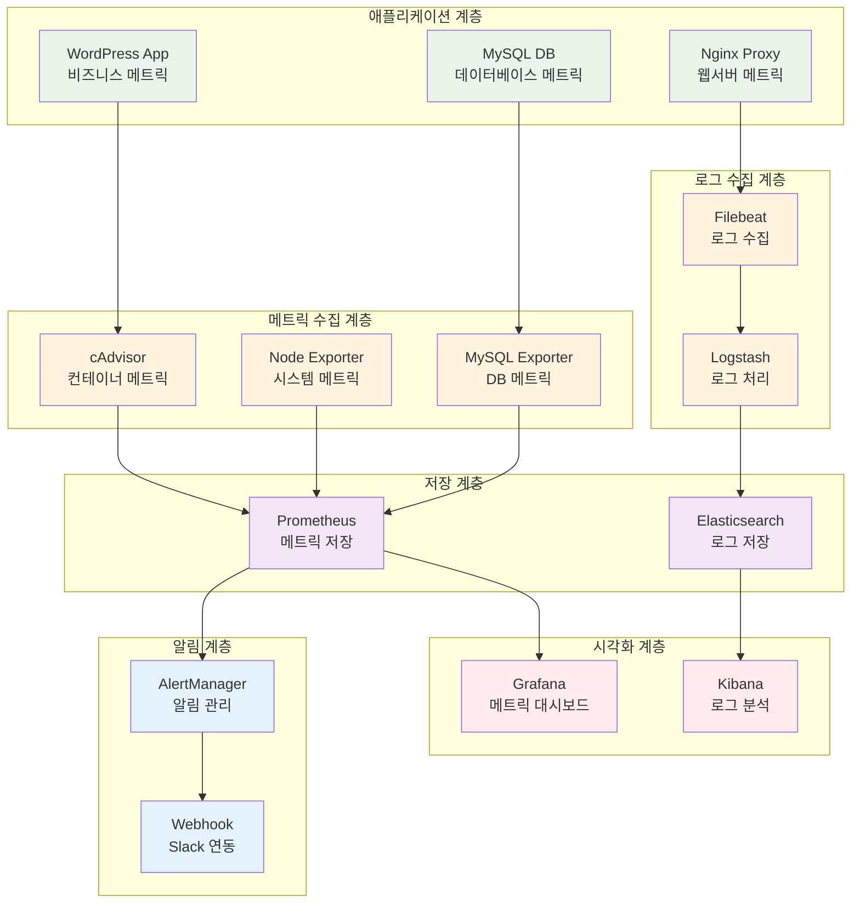

# Week 2 Day 3 Lab 1: 운영급 모니터링 시스템 구축

<div align="center">

**📊 Prometheus + Grafana** • **📝 ELK Stack** • **🔔 알림 시스템**

*프로덕션 환경을 위한 종합 모니터링 및 로깅 시스템*

</div>

---

## 🕘 실습 정보

**시간**: 12:00-12:50 (50분)  
**목표**: Prometheus + Grafana + ELK Stack을 활용한 종합 모니터링 시스템 구축  
**방식**: 단계별 구축 + 실시간 모니터링 + 장애 시뮬레이션

---

## 🎯 실습 목표

### 📚 당일 이론 적용
- Session 1-3에서 배운 모니터링, 로깅, 오케스트레이션 개념을 통합 구현
- Prometheus 메트릭 수집과 Grafana 시각화 실습
- ELK Stack을 통한 중앙화된 로그 관리 시스템 구축

### 🏗️ 구축할 모니터링 아키텍처


---

## 📋 실습 준비 (5분)

### 환경 설정
```bash
# 작업 디렉토리 생성
mkdir -p ~/monitoring-stack
cd ~/monitoring-stack

# 기존 Day 2 WordPress 시스템 확인
docker ps --format "table {{.Names}}\t{{.Status}}\t{{.Ports}}"

# 모니터링을 위한 추가 디렉토리 생성
mkdir -p {prometheus,grafana,elasticsearch,kibana,logstash,filebeat,alertmanager}
mkdir -p config/{prometheus,grafana,logstash,filebeat,alertmanager}
mkdir -p data/{prometheus,elasticsearch,grafana}
```

### 페어 구성
- 👥 **모니터링 팀**: 2명씩 짝을 이루어 모니터링 시스템 구축
- 🔄 **역할 분담**: 메트릭 담당 / 로그 담당으로 역할 분담
- 📝 **통합 작업**: 최종적으로 통합 대시보드 구성

---

## 🔧 실습 단계 (40분)

### Step 1: Prometheus 메트릭 수집 시스템 구축 (15분)

**🚀 자동화 스크립트 사용**
```bash
# Prometheus 모니터링 스택 자동 구축
./lab_scripts/lab1/setup_prometheus_stack.sh
```

**📋 스크립트 내용**: [setup_prometheus_stack.sh](./lab_scripts/lab1/setup_prometheus_stack.sh)

**1-1. 수동 실행 (학습용)**
```bash
# Prometheus 설정 파일 생성
cat > config/prometheus/prometheus.yml << 'EOF'
global:
  scrape_interval: 15s
  evaluation_interval: 15s

rule_files:
  - "alert_rules.yml"

alerting:
  alertmanagers:
    - static_configs:
        - targets:
          - alertmanager:9093

scrape_configs:
  # Prometheus 자체 모니터링
  - job_name: 'prometheus'
    static_configs:
      - targets: ['localhost:9090']

  # 컨테이너 메트릭 (cAdvisor)
  - job_name: 'cadvisor'
    static_configs:
      - targets: ['cadvisor:8080']

  # 시스템 메트릭 (Node Exporter)
  - job_name: 'node-exporter'
    static_configs:
      - targets: ['node-exporter:9100']

  # MySQL 메트릭
  - job_name: 'mysql-exporter'
    static_configs:
      - targets: ['mysql-exporter:9104']

  # Nginx 메트릭
  - job_name: 'nginx-exporter'
    static_configs:
      - targets: ['nginx-exporter:9113']
EOF

# 알림 규칙 설정
cat > config/prometheus/alert_rules.yml << 'EOF'
groups:
  - name: container_alerts
    rules:
      - alert: HighCPUUsage
        expr: rate(container_cpu_usage_seconds_total[5m]) * 100 > 80
        for: 2m
        labels:
          severity: warning
        annotations:
          summary: "High CPU usage detected"
          description: "Container {{ $labels.name }} CPU usage is above 80%"

      - alert: HighMemoryUsage
        expr: (container_memory_usage_bytes / container_spec_memory_limit_bytes) * 100 > 90
        for: 2m
        labels:
          severity: critical
        annotations:
          summary: "High memory usage detected"
          description: "Container {{ $labels.name }} memory usage is above 90%"

      - alert: ContainerDown
        expr: up == 0
        for: 1m
        labels:
          severity: critical
        annotations:
          summary: "Container is down"
          description: "Container {{ $labels.instance }} has been down for more than 1 minute"
EOF

# Prometheus 컨테이너 실행
docker run -d \
  --name prometheus \
  --restart=unless-stopped \
  -p 9090:9090 \
  -v $(pwd)/config/prometheus:/etc/prometheus \
  -v prometheus-data:/prometheus \
  --memory=1g \
  prom/prometheus:latest \
  --config.file=/etc/prometheus/prometheus.yml \
  --storage.tsdb.path=/prometheus \
  --web.console.libraries=/etc/prometheus/console_libraries \
  --web.console.templates=/etc/prometheus/consoles \
  --storage.tsdb.retention.time=30d \
  --web.enable-lifecycle
```

**1-2. 메트릭 수집기 배포**
```bash
# cAdvisor (컨테이너 메트릭)
docker run -d \
  --name cadvisor \
  --restart=unless-stopped \
  -p 8080:8080 \
  -v /:/rootfs:ro \
  -v /var/run:/var/run:ro \
  -v /sys:/sys:ro \
  -v /var/lib/docker/:/var/lib/docker:ro \
  -v /dev/disk/:/dev/disk:ro \
  --privileged \
  --device=/dev/kmsg \
  gcr.io/cadvisor/cadvisor:latest

# Node Exporter (시스템 메트릭)
docker run -d \
  --name node-exporter \
  --restart=unless-stopped \
  -p 9100:9100 \
  -v /proc:/host/proc:ro \
  -v /sys:/host/sys:ro \
  -v /:/rootfs:ro \
  --pid=host \
  prom/node-exporter:latest \
  --path.procfs=/host/proc \
  --path.rootfs=/rootfs \
  --path.sysfs=/host/sys \
  --collector.filesystem.mount-points-exclude='^/(sys|proc|dev|host|etc)($$|/)'

# MySQL Exporter (데이터베이스 메트릭)
docker run -d \
  --name mysql-exporter \
  --restart=unless-stopped \
  -p 9104:9104 \
  -e DATA_SOURCE_NAME="wpuser:wppassword@(mysql-wordpress:3306)/" \
  --link mysql-wordpress:mysql-wordpress \
  prom/mysqld-exporter:latest
```

### Step 2: Grafana 대시보드 구성 (10분)

**🚀 자동화 스크립트 사용**
```bash
# Grafana 대시보드 자동 구성
./lab_scripts/lab1/setup_grafana_dashboard.sh
```

**📋 스크립트 내용**: [setup_grafana_dashboard.sh](./lab_scripts/lab1/setup_grafana_dashboard.sh)

**2-1. 수동 실행 (학습용)**
```bash
# Grafana 설정 디렉토리 생성
mkdir -p config/grafana/{dashboards,datasources,provisioning}

# 데이터소스 설정
cat > config/grafana/provisioning/datasources.yml << 'EOF'
apiVersion: 1

datasources:
  - name: Prometheus
    type: prometheus
    access: proxy
    url: http://prometheus:9090
    isDefault: true
    editable: true

  - name: Elasticsearch
    type: elasticsearch
    access: proxy
    url: http://elasticsearch:9200
    database: "logs-*"
    interval: Daily
    timeField: "@timestamp"
    editable: true
EOF

# 대시보드 프로비저닝 설정
cat > config/grafana/provisioning/dashboards.yml << 'EOF'
apiVersion: 1

providers:
  - name: 'default'
    orgId: 1
    folder: ''
    type: file
    disableDeletion: false
    updateIntervalSeconds: 10
    allowUiUpdates: true
    options:
      path: /var/lib/grafana/dashboards
EOF

# Grafana 컨테이너 실행
docker run -d \
  --name grafana \
  --restart=unless-stopped \
  -p 3000:3000 \
  -e GF_SECURITY_ADMIN_PASSWORD=admin \
  -e GF_USERS_ALLOW_SIGN_UP=false \
  -v grafana-data:/var/lib/grafana \
  -v $(pwd)/config/grafana/provisioning:/etc/grafana/provisioning \
  --link prometheus:prometheus \
  --memory=512m \
  grafana/grafana:latest
```

### Step 3: ELK Stack 로그 관리 시스템 구축 (10분)

**🚀 자동화 스크립트 사용**
```bash
# ELK Stack 자동 구축
./lab_scripts/lab1/setup_elk_stack.sh
```

**📋 스크립트 내용**: [setup_elk_stack.sh](./lab_scripts/lab1/setup_elk_stack.sh)

**3-1. 수동 실행 (학습용)**
```bash
# Elasticsearch 실행
docker run -d \
  --name elasticsearch \
  --restart=unless-stopped \
  -p 9200:9200 \
  -p 9300:9300 \
  -e "discovery.type=single-node" \
  -e "ES_JAVA_OPTS=-Xms512m -Xmx512m" \
  -e "xpack.security.enabled=false" \
  -v elasticsearch-data:/usr/share/elasticsearch/data \
  --memory=1g \
  elasticsearch:7.17.0

# Logstash 설정 파일 생성
cat > config/logstash/logstash.conf << 'EOF'
input {
  beats {
    port => 5044
  }
}

filter {
  if [fields][service] == "nginx" {
    grok {
      match => { "message" => "%{COMBINEDAPACHELOG}" }
    }
    date {
      match => [ "timestamp", "dd/MMM/yyyy:HH:mm:ss Z" ]
    }
  }
  
  if [fields][service] == "mysql" {
    grok {
      match => { "message" => "%{TIMESTAMP_ISO8601:timestamp} %{NUMBER:thread_id} \\[%{WORD:level}\\] %{GREEDYDATA:mysql_message}" }
    }
  }
  
  if [fields][service] == "wordpress" {
    if [message] =~ /^\[/ {
      grok {
        match => { "message" => "\\[%{HTTPDATE:timestamp}\\] %{WORD:level}: %{GREEDYDATA:php_message}" }
      }
    }
  }
}

output {
  elasticsearch {
    hosts => ["elasticsearch:9200"]
    index => "logs-%{+YYYY.MM.dd}"
  }
  
  stdout {
    codec => rubydebug
  }
}
EOF

# Logstash 실행
docker run -d \
  --name logstash \
  --restart=unless-stopped \
  -p 5044:5044 \
  -v $(pwd)/config/logstash:/usr/share/logstash/pipeline \
  --link elasticsearch:elasticsearch \
  --memory=1g \
  logstash:7.17.0

# Kibana 실행
docker run -d \
  --name kibana \
  --restart=unless-stopped \
  -p 5601:5601 \
  -e ELASTICSEARCH_HOSTS=http://elasticsearch:9200 \
  --link elasticsearch:elasticsearch \
  --memory=512m \
  kibana:7.17.0
```

### Step 4: 알림 시스템 및 통합 테스트 (5분)

**🚀 자동화 스크립트 사용**
```bash
# 알림 시스템 및 통합 테스트
./lab_scripts/lab1/setup_alerting_test.sh
```

**📋 스크립트 내용**: [setup_alerting_test.sh](./lab_scripts/lab1/setup_alerting_test.sh)

**4-1. 수동 실행 (학습용)**
```bash
# AlertManager 설정
cat > config/alertmanager/alertmanager.yml << 'EOF'
global:
  smtp_smarthost: 'localhost:587'
  smtp_from: 'alerts@company.com'

route:
  group_by: ['alertname']
  group_wait: 10s
  group_interval: 10s
  repeat_interval: 1h
  receiver: 'web.hook'

receivers:
  - name: 'web.hook'
    webhook_configs:
      - url: 'http://webhook:5000/alerts'
        send_resolved: true

inhibit_rules:
  - source_match:
      severity: 'critical'
    target_match:
      severity: 'warning'
    equal: ['alertname', 'dev', 'instance']
EOF

# AlertManager 실행
docker run -d \
  --name alertmanager \
  --restart=unless-stopped \
  -p 9093:9093 \
  -v $(pwd)/config/alertmanager:/etc/alertmanager \
  --link prometheus:prometheus \
  --memory=256m \
  prom/alertmanager:latest

# 간단한 Webhook 서버 (알림 테스트용)
cat > webhook-server.py << 'EOF'
from flask import Flask, request, jsonify
import json
from datetime import datetime

app = Flask(__name__)

@app.route('/alerts', methods=['POST'])
def receive_alert():
    alerts = request.json
    print(f"[{datetime.now()}] Received alerts:")
    print(json.dumps(alerts, indent=2))
    return jsonify({"status": "received"})

if __name__ == '__main__':
    app.run(host='0.0.0.0', port=5000)
EOF

# Webhook 서버 실행 (Python 컨테이너)
docker run -d \
  --name webhook \
  --restart=unless-stopped \
  -p 5000:5000 \
  -v $(pwd)/webhook-server.py:/app/webhook-server.py \
  -w /app \
  python:3.9-slim \
  sh -c "pip install flask && python webhook-server.py"
```

---

## ✅ 실습 체크포인트

### 기본 기능 구현 완료
- [ ] **Prometheus**: 메트릭 수집 및 저장 정상 동작
- [ ] **Grafana**: 대시보드 구성 및 시각화 완료
- [ ] **Elasticsearch**: 로그 저장 및 인덱싱 정상 동작
- [ ] **Kibana**: 로그 검색 및 분석 가능

### 설정 및 구성 확인
- [ ] **메트릭 수집**: cAdvisor, Node Exporter, MySQL Exporter 연동
- [ ] **로그 수집**: Filebeat → Logstash → Elasticsearch 파이프라인
- [ ] **알림 설정**: AlertManager 규칙 설정 및 Webhook 연동
- [ ] **대시보드**: 실시간 메트릭과 로그 시각화

### 동작 테스트 성공

**🚀 자동화 테스트 스크립트 사용**
```bash
# 전체 모니터링 시스템 종합 테스트
./lab_scripts/lab1/test_monitoring_system.sh
```

**📋 스크립트 내용**: [test_monitoring_system.sh](./lab_scripts/lab1/test_monitoring_system.sh)

**수동 테스트 (핵심만)**
```bash
# 1. Prometheus 메트릭 확인
curl http://localhost:9090/api/v1/targets

# 2. Grafana 접속 확인
curl -I http://localhost:3000

# 3. Elasticsearch 상태 확인
curl http://localhost:9200/_cluster/health

# 4. 부하 테스트 (알림 트리거)
docker run --rm -it \
  --link nginx-proxy:target \
  williamyeh/wrk \
  -t4 -c100 -d30s http://target/

# 5. 로그 생성 및 확인
docker logs nginx-proxy
curl "http://localhost:9200/logs-*/_search?q=*&size=10"
```

---

## 🔄 실습 마무리 (5분)

### 결과 공유
- **모니터링 대시보드**: Grafana에서 실시간 메트릭 시연
- **로그 분석**: Kibana에서 로그 검색 및 패턴 분석
- **알림 테스트**: 의도적 부하 발생으로 알림 동작 확인

### 질문 해결
- **메트릭 이해**: 각 메트릭의 의미와 임계값 설정 방법
- **로그 파싱**: Logstash 필터 설정과 Grok 패턴 이해
- **대시보드 커스터마이징**: Grafana 패널 설정과 쿼리 작성

### 다음 연결
- **Lab 2 준비**: 구축한 모니터링 시스템을 Swarm 클러스터에 적용
- **확장 계획**: 멀티 노드 환경에서의 모니터링 전략

---

## 🎯 추가 도전 과제 (시간 여유시)

### 고급 기능 구현
```bash
# 1. 커스텀 메트릭 추가
cat > custom-exporter.py << 'EOF'
from prometheus_client import start_http_server, Gauge
import time
import psutil

# 커스텀 메트릭 정의
cpu_temp = Gauge('system_cpu_temperature_celsius', 'CPU Temperature')
disk_usage = Gauge('system_disk_usage_percent', 'Disk Usage Percentage')

def collect_metrics():
    while True:
        # CPU 온도 (시뮬레이션)
        cpu_temp.set(psutil.cpu_percent())
        
        # 디스크 사용률
        disk = psutil.disk_usage('/')
        disk_usage.set((disk.used / disk.total) * 100)
        
        time.sleep(15)

if __name__ == '__main__':
    start_http_server(8000)
    collect_metrics()
EOF

# 2. 로그 기반 메트릭 생성
# Logstash에서 메트릭 추출하여 Prometheus로 전송

# 3. 고급 알림 규칙
# 복합 조건과 시간 기반 알림 설정
```

---

<div align="center">

**📊 운영급 모니터링 시스템 구축 완료!**

**다음**: [Lab 2 - Docker Swarm 클러스터 구성](./lab_2.md)

</div>