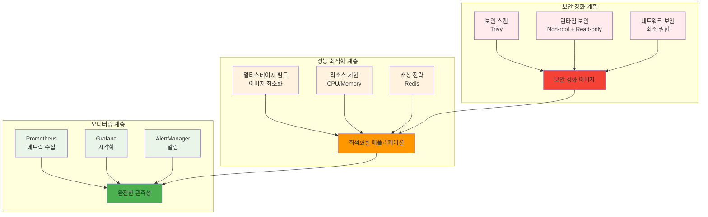

# Week 2 Day 3 Lab 1: 보안 & 최적화 통합 실습

<div align="center">

**🔒 컨테이너 보안** • **⚡ 성능 최적화** • **📊 모니터링 구축**

*실무급 보안, 최적화, 모니터링이 통합된 컨테이너 시스템 구축*

</div>

---

## 🕘 실습 정보

**시간**: 13:00-16:00 (3시간)  
**목표**: 보안 강화 + 성능 최적화 + 모니터링이 통합된 실무급 컨테이너 시스템 구축  
**방식**: 3개 Phase 연속 진행 + 팀 협업 + 결과 발표

---

## 🎯 실습 목표

### 📚 당일 이론 적용
- Session 1-3에서 배운 보안, 최적화, 모니터링 개념을 하나의 시스템으로 통합
- 실무에서 바로 사용할 수 있는 수준의 컨테이너 운영 환경 구축
- 보안-성능-관측성의 균형잡힌 접근법 체득

### 🏗️ 구축할 통합 시스템 아키텍처


---

## 📋 실습 준비 (10분)

### 환경 설정
```bash
# 작업 디렉토리 생성
mkdir -p ~/security-optimization-lab
cd ~/security-optimization-lab

# 프로젝트 구조 생성
mkdir -p {app,configs,monitoring,scripts}
mkdir -p app/{src,public,tests}

# 팀 구성 (3-4명씩)
echo "팀별 역할 분담:"
echo "- 보안 담당: 취약점 스캔 및 보안 강화"
echo "- 최적화 담당: 이미지 최적화 및 성능 튜닝"
echo "- 모니터링 담당: 관측성 시스템 구축"
echo "- 통합 담당: 전체 시스템 통합 및 테스트"
```

### 샘플 애플리케이션 준비
```bash
# 간단한 Node.js 애플리케이션 생성
cat > app/package.json << 'EOF'
{
  "name": "secure-optimized-app",
  "version": "1.0.0",
  "main": "server.js",
  "dependencies": {
    "express": "^4.18.0",
    "prom-client": "^14.0.0",
    "redis": "^4.0.0"
  },
  "scripts": {
    "start": "node server.js",
    "test": "echo \"No tests\" && exit 0"
  }
}
EOF

cat > app/server.js << 'EOF'
const express = require('express');
const prometheus = require('prom-client');
const redis = require('redis');

const app = express();
const port = 3000;

// Prometheus 메트릭 설정
const collectDefaultMetrics = prometheus.collectDefaultMetrics;
collectDefaultMetrics();

const httpRequestDuration = new prometheus.Histogram({
  name: 'http_request_duration_seconds',
  help: 'Duration of HTTP requests in seconds',
  labelNames: ['method', 'route', 'status']
});

const httpRequestTotal = new prometheus.Counter({
  name: 'http_requests_total',
  help: 'Total number of HTTP requests',
  labelNames: ['method', 'route', 'status']
});

// Redis 클라이언트 (선택적)
let redisClient;
try {
  redisClient = redis.createClient({ url: 'redis://redis:6379' });
  redisClient.connect();
} catch (err) {
  console.log('Redis not available, continuing without cache');
}

// 미들웨어
app.use((req, res, next) => {
  const start = Date.now();
  res.on('finish', () => {
    const duration = (Date.now() - start) / 1000;
    httpRequestDuration.labels(req.method, req.route?.path || req.path, res.statusCode).observe(duration);
    httpRequestTotal.labels(req.method, req.route?.path || req.path, res.statusCode).inc();
  });
  next();
});

// 라우트
app.get('/', (req, res) => {
  res.json({ 
    message: 'Secure & Optimized App', 
    timestamp: new Date().toISOString(),
    version: '1.0.0'
  });
});

app.get('/health', (req, res) => {
  res.json({ status: 'healthy', uptime: process.uptime() });
});

app.get('/metrics', (req, res) => {
  res.set('Content-Type', prometheus.register.contentType);
  res.end(prometheus.register.metrics());
});

app.get('/load-test', async (req, res) => {
  // CPU 부하 시뮬레이션
  const start = Date.now();
  while (Date.now() - start < 100) {
    Math.random() * Math.random();
  }
  
  // 캐시 테스트
  if (redisClient) {
    try {
      await redisClient.set('test-key', Date.now().toString());
      const value = await redisClient.get('test-key');
      res.json({ message: 'Load test completed', cached_value: value });
    } catch (err) {
      res.json({ message: 'Load test completed', cache: 'unavailable' });
    }
  } else {
    res.json({ message: 'Load test completed', cache: 'disabled' });
  }
});

app.listen(port, '0.0.0.0', () => {
  console.log(`App running on port ${port}`);
  console.log(`Health check: http://localhost:${port}/health`);
  console.log(`Metrics: http://localhost:${port}/metrics`);
});
EOF
```

---

## 🔧 Phase 1: 보안 강화 실습 (60분)

### Step 1: 취약점 스캔 및 분석 (20분)

**🚀 자동화 스크립트 사용**
```bash
# Trivy 설치 및 스캔 자동화
./scripts/security_scan.sh
```

**1-1. 수동 실행 (학습용)**
```bash
# Trivy 설치 (Ubuntu/Debian)
sudo apt-get update
sudo apt-get install wget apt-transport-https gnupg lsb-release
wget -qO - https://aquasecurity.github.io/trivy-repo/deb/public.key | sudo apt-key add -
echo "deb https://aquasecurity.github.io/trivy-repo/deb $(lsb_release -sc) main" | sudo tee -a /etc/apt/sources.list.d/trivy.list
sudo apt-get update
sudo apt-get install trivy

# 기본 이미지 스캔 비교
echo "=== 취약점이 많은 이미지 스캔 ==="
trivy image node:16 --severity HIGH,CRITICAL

echo "=== 보안이 강화된 이미지 스캔 ==="
trivy image node:18-alpine --severity HIGH,CRITICAL

# 스캔 결과 저장
trivy image node:16 --format json --output node16-scan.json
trivy image node:18-alpine --format json --output node18-alpine-scan.json

# 취약점 개수 비교
echo "Node 16 취약점 수:"
jq '.Results[].Vulnerabilities | length' node16-scan.json 2>/dev/null || echo "0"
echo "Node 18 Alpine 취약점 수:"
jq '.Results[].Vulnerabilities | length' node18-alpine-scan.json 2>/dev/null || echo "0"
```

### Step 2: 보안 강화 Dockerfile 작성 (25분)

**2-1. 보안 강화 Dockerfile 생성**
```dockerfile
# app/Dockerfile.secure
# 멀티스테이지 빌드 + 보안 강화
FROM node:18-alpine AS builder

# 보안: 최신 패키지 업데이트
RUN apk update && apk upgrade && apk add --no-cache dumb-init

WORKDIR /app
COPY package*.json ./
RUN npm ci --only=production && npm cache clean --force

# 프로덕션 스테이지
FROM node:18-alpine AS production

# 보안: 최신 패키지 업데이트
RUN apk update && apk upgrade && apk add --no-cache dumb-init

# 보안: 비root 사용자 생성
RUN addgroup -g 1001 -S appgroup && \
    adduser -S appuser -u 1001 -G appgroup

WORKDIR /app

# 보안: 파일 소유권 설정
COPY --from=builder --chown=appuser:appgroup /app/node_modules ./node_modules
COPY --chown=appuser:appgroup . .

# 보안: 불필요한 파일 제거
RUN rm -rf tests/ *.md package-lock.json

# 보안: 비root 사용자로 전환
USER appuser

# 보안: 최소 권한 포트
EXPOSE 3000

# 보안: dumb-init 사용
ENTRYPOINT ["dumb-init", "--"]
CMD ["node", "server.js"]
```

**2-2. 보안 강화 이미지 빌드 및 스캔**
```bash
# 보안 강화 이미지 빌드
cd app
docker build -f Dockerfile.secure -t secure-app:v1 .

# 보안 강화 이미지 스캔
trivy image secure-app:v1 --severity HIGH,CRITICAL

# 스캔 결과 비교
echo "=== 보안 강화 전후 비교 ==="
echo "기존 Node 16 이미지:"
trivy image node:16 --severity HIGH,CRITICAL --quiet | wc -l
echo "보안 강화 이미지:"
trivy image secure-app:v1 --severity HIGH,CRITICAL --quiet | wc -l
```

### Step 3: 런타임 보안 적용 (15분)

**3-1. 보안 강화 컨테이너 실행**
```bash
# 보안 강화된 컨테이너 실행
docker run -d \
  --name secure-app \
  --read-only \
  --tmpfs /tmp:rw,noexec,nosuid,size=100m \
  --tmpfs /var/run:rw,noexec,nosuid,size=50m \
  --no-new-privileges \
  --cap-drop ALL \
  --cap-add NET_BIND_SERVICE \
  --memory="256m" \
  --cpus="0.5" \
  --security-opt=no-new-privileges:true \
  -p 3000:3000 \
  secure-app:v1

# 보안 설정 검증
echo "=== 보안 설정 확인 ==="
docker inspect secure-app --format '{{json .HostConfig.ReadonlyRootfs}}'
docker inspect secure-app --format '{{json .HostConfig.CapDrop}}'
docker inspect secure-app --format '{{json .HostConfig.SecurityOpt}}'

# 애플리케이션 동작 확인
sleep 5
curl -s http://localhost:3000/health | jq .
```

### ✅ Phase 1 체크포인트
- [ ] 취약점 스캔으로 보안 이슈 식별 완료
- [ ] 보안 강화 Dockerfile 작성 및 빌드 성공
- [ ] 런타임 보안 정책 적용 확인
- [ ] 보안 강화 후 취약점 감소 확인

---

## 🌟 Phase 2: 성능 최적화 실습 (60분)

### Step 1: 이미지 크기 최적화 (25분)

**🚀 자동화 스크립트 사용**
```bash
# 이미지 최적화 자동 실행
./scripts/optimize_image.sh
```

**1-1. 수동 실행 (학습용)**
```dockerfile
# app/Dockerfile.optimized
# 보안 + 최적화 통합 버전
FROM node:18-alpine AS deps
WORKDIR /app
COPY package*.json ./
RUN npm ci --only=production && npm cache clean --force

FROM node:18-alpine AS builder
WORKDIR /app
COPY package*.json ./
RUN npm ci
COPY . .
# 빌드 과정이 있다면 여기서 실행
RUN npm run test

FROM node:18-alpine AS runner
# 보안: 최신 패키지 업데이트
RUN apk update && apk upgrade && apk add --no-cache dumb-init

# 보안: 비root 사용자 생성
RUN addgroup -g 1001 -S appgroup && \
    adduser -S appuser -u 1001 -G appgroup

WORKDIR /app

# 최적화: 필요한 파일만 복사
COPY --from=deps --chown=appuser:appgroup /app/node_modules ./node_modules
COPY --from=builder --chown=appuser:appgroup /app/server.js ./
COPY --from=builder --chown=appuser:appgroup /app/package.json ./

# 보안: 비root 사용자로 전환
USER appuser

EXPOSE 3000
ENTRYPOINT ["dumb-init", "--"]
CMD ["node", "server.js"]
```

**1-2. 최적화 이미지 빌드 및 비교**
```bash
# 최적화 이미지 빌드
docker build -f Dockerfile.optimized -t optimized-app:v1 .

# 이미지 크기 비교
echo "=== 이미지 크기 비교 ==="
docker images --format "table {{.Repository}}:{{.Tag}}\t{{.Size}}" | grep -E "(node:16|secure-app|optimized-app)"

# 레이어 분석
echo "=== 레이어 분석 ==="
docker history optimized-app:v1 --format "table {{.CreatedBy}}\t{{.Size}}"

# 크기 감소율 계산
ORIGINAL_SIZE=$(docker images node:16 --format "{{.Size}}" | head -1)
OPTIMIZED_SIZE=$(docker images optimized-app:v1 --format "{{.Size}}" | head -1)
echo "원본 크기: $ORIGINAL_SIZE"
echo "최적화 후: $OPTIMIZED_SIZE"
```

### Step 2: 성능 벤치마크 및 튜닝 (20분)

**2-1. 최적화된 애플리케이션 실행**
```bash
# 기존 컨테이너 정리
docker stop secure-app && docker rm secure-app

# 최적화된 컨테이너 실행 (리소스 제한 포함)
docker run -d \
  --name optimized-app \
  --read-only \
  --tmpfs /tmp:rw,noexec,nosuid,size=100m \
  --tmpfs /var/run:rw,noexec,nosuid,size=50m \
  --no-new-privileges \
  --cap-drop ALL \
  --cap-add NET_BIND_SERVICE \
  --memory="256m" \
  --cpus="0.5" \
  --memory-swappiness=0 \
  -p 3000:3000 \
  optimized-app:v1

# 애플리케이션 준비 대기
sleep 5
```

**2-2. 성능 벤치마크 테스트**
```bash
# Apache Bench 설치 (필요시)
sudo apt-get install apache2-utils -y

# 기본 성능 테스트
echo "=== 기본 성능 테스트 ==="
ab -n 1000 -c 10 http://localhost:3000/ | grep -E "(Requests per second|Time per request)"

# 부하 테스트
echo "=== 부하 테스트 ==="
ab -n 5000 -c 50 http://localhost:3000/load-test | grep -E "(Requests per second|Time per request)"

# 리소스 사용량 모니터링
echo "=== 리소스 사용량 ==="
docker stats optimized-app --no-stream --format "table {{.Container}}\t{{.CPUPerc}}\t{{.MemUsage}}\t{{.MemPerc}}"
```

### Step 3: 캐싱 시스템 추가 (15분)

**3-1. Redis 캐시 시스템 구성**
```yaml
# docker-compose.optimized.yml
version: '3.8'
services:
  app:
    image: optimized-app:v1
    ports:
      - "3000:3000"
    depends_on:
      - redis
    read_only: true
    tmpfs:
      - /tmp:rw,noexec,nosuid,size=100m
      - /var/run:rw,noexec,nosuid,size=50m
    cap_drop:
      - ALL
    cap_add:
      - NET_BIND_SERVICE
    security_opt:
      - no-new-privileges:true
    deploy:
      resources:
        limits:
          memory: 256M
          cpus: '0.5'
        reservations:
          memory: 128M
          cpus: '0.25'

  redis:
    image: redis:7-alpine
    ports:
      - "6379:6379"
    command: redis-server --maxmemory 64mb --maxmemory-policy allkeys-lru
    deploy:
      resources:
        limits:
          memory: 128M
          cpus: '0.25'
```

**3-2. 캐시 성능 테스트**
```bash
# 캐시 시스템 시작
docker-compose -f docker-compose.optimized.yml up -d

# 캐시 성능 테스트
sleep 10
echo "=== 캐시 성능 테스트 ==="
ab -n 2000 -c 20 http://localhost:3000/load-test | grep -E "(Requests per second|Time per request)"

# Redis 상태 확인
docker exec -it $(docker ps -qf "name=redis") redis-cli info memory | grep used_memory_human
```

### ✅ Phase 2 체크포인트
- [ ] 멀티스테이지 빌드로 이미지 크기 50% 이상 감소
- [ ] 성능 벤치마크 테스트 완료 및 결과 분석
- [ ] 리소스 제한 설정 및 최적화 확인
- [ ] 캐싱 시스템 구축 및 성능 개선 측정

---

## 🏆 Phase 3: 모니터링 시스템 구축 (60분)

### Step 1: Prometheus + Grafana 스택 구축 (30분)

**🚀 자동화 스크립트 사용**
```bash
# 모니터링 스택 자동 구축
./scripts/setup_monitoring.sh
```

**1-1. 수동 실행 (학습용)**
```yaml
# monitoring/docker-compose.monitoring.yml
version: '3.8'
services:
  prometheus:
    image: prom/prometheus:latest
    ports:
      - "9090:9090"
    volumes:
      - ./prometheus.yml:/etc/prometheus/prometheus.yml
      - ./alerts.yml:/etc/prometheus/alerts.yml
      - prometheus-data:/prometheus
    command:
      - '--config.file=/etc/prometheus/prometheus.yml'
      - '--storage.tsdb.path=/prometheus'
      - '--storage.tsdb.retention.time=7d'
      - '--web.enable-lifecycle'
    deploy:
      resources:
        limits:
          memory: 512M
          cpus: '0.5'

  grafana:
    image: grafana/grafana:latest
    ports:
      - "3001:3000"
    environment:
      - GF_SECURITY_ADMIN_PASSWORD=admin
      - GF_USERS_ALLOW_SIGN_UP=false
    volumes:
      - grafana-data:/var/lib/grafana
      - ./grafana/provisioning:/etc/grafana/provisioning
    deploy:
      resources:
        limits:
          memory: 256M
          cpus: '0.25'

  cadvisor:
    image: gcr.io/cadvisor/cadvisor:latest
    ports:
      - "8080:8080"
    volumes:
      - /:/rootfs:ro
      - /var/run:/var/run:ro
      - /sys:/sys:ro
      - /var/lib/docker/:/var/lib/docker:ro
    deploy:
      resources:
        limits:
          memory: 128M
          cpus: '0.25'

volumes:
  prometheus-data:
  grafana-data:
```

**1-2. Prometheus 설정**
```yaml
# monitoring/prometheus.yml
global:
  scrape_interval: 15s
  evaluation_interval: 15s

rule_files:
  - "alerts.yml"

scrape_configs:
  - job_name: 'prometheus'
    static_configs:
      - targets: ['localhost:9090']

  - job_name: 'app'
    static_configs:
      - targets: ['host.docker.internal:3000']
    metrics_path: '/metrics'
    scrape_interval: 10s

  - job_name: 'cadvisor'
    static_configs:
      - targets: ['cadvisor:8080']
    scrape_interval: 10s

  - job_name: 'redis'
    static_configs:
      - targets: ['host.docker.internal:6379']
```

### Step 2: 알림 시스템 구성 (15분)

**2-1. 알림 규칙 설정**
```yaml
# monitoring/alerts.yml
groups:
- name: app_alerts
  rules:
  - alert: HighCPUUsage
    expr: rate(container_cpu_usage_seconds_total{name="optimized-app"}[5m]) * 100 > 80
    for: 2m
    labels:
      severity: warning
    annotations:
      summary: "High CPU usage detected"
      description: "CPU usage is above 80% for more than 2 minutes"

  - alert: HighMemoryUsage
    expr: (container_memory_usage_bytes{name="optimized-app"} / container_spec_memory_limit_bytes{name="optimized-app"}) * 100 > 90
    for: 2m
    labels:
      severity: critical
    annotations:
      summary: "High memory usage detected"
      description: "Memory usage is above 90%"

  - alert: HighErrorRate
    expr: rate(http_requests_total{status=~"5.."}[5m]) / rate(http_requests_total[5m]) > 0.05
    for: 1m
    labels:
      severity: critical
    annotations:
      summary: "High error rate detected"
      description: "Error rate is above 5%"

  - alert: HighResponseTime
    expr: histogram_quantile(0.95, rate(http_request_duration_seconds_bucket[5m])) > 0.5
    for: 2m
    labels:
      severity: warning
    annotations:
      summary: "High response time detected"
      description: "95th percentile response time is above 500ms"
```

### Step 3: 대시보드 구성 및 테스트 (15분)

**3-1. 모니터링 스택 시작**
```bash
# 모니터링 스택 시작
cd monitoring
docker-compose -f docker-compose.monitoring.yml up -d

# 서비스 상태 확인
sleep 15
echo "=== 모니터링 서비스 상태 ==="
docker-compose -f docker-compose.monitoring.yml ps

# 접속 확인
echo "Prometheus: http://localhost:9090"
echo "Grafana: http://localhost:3001 (admin/admin)"
echo "cAdvisor: http://localhost:8080"
```

**3-2. 메트릭 수집 및 알림 테스트**
```bash
# 메트릭 수집 확인
curl -s http://localhost:9090/api/v1/targets | jq '.data.activeTargets[] | {job: .labels.job, health: .health}'

# 부하 테스트로 알림 트리거
echo "=== 알림 테스트를 위한 부하 생성 ==="
ab -n 10000 -c 100 http://localhost:3000/load-test &

# 메트릭 확인
sleep 30
curl -s http://localhost:3000/metrics | grep -E "(http_requests_total|http_request_duration)"

# Grafana 대시보드 접속 안내
echo "=== Grafana 대시보드 설정 ==="
echo "1. http://localhost:3001 접속 (admin/admin)"
echo "2. Data Sources에서 Prometheus 추가: http://prometheus:9090"
echo "3. Dashboard Import에서 Docker 대시보드 추가 (ID: 193)"
```

### ✅ Phase 3 체크포인트
- [ ] Prometheus + Grafana + cAdvisor 스택 정상 동작
- [ ] 애플리케이션 메트릭 수집 확인
- [ ] 알림 규칙 설정 및 테스트 완료
- [ ] Grafana 대시보드에서 실시간 모니터링 확인

---

## 🎤 결과 발표 및 통합 회고 (30분)

### 📊 팀별 발표 (7분×4팀)
**발표 내용**:
1. **보안 강화 성과**: 취약점 감소율과 적용한 보안 조치
2. **성능 최적화 결과**: 이미지 크기 감소율과 성능 개선 지표
3. **모니터링 시스템**: 구축한 관측성 시스템과 핵심 메트릭
4. **통합 효과**: 3개 영역의 시너지 효과
5. **실무 적용 계획**: 학습 내용의 실제 적용 방안

### 🏅 성과 측정 및 비교
```bash
# 최종 성과 측정 스크립트
echo "=== 최종 성과 요약 ==="
echo "1. 보안 강화:"
echo "   - 취약점 감소: $(trivy image node:16 --quiet | wc -l) → $(trivy image optimized-app:v1 --quiet | wc -l)"
echo "2. 성능 최적화:"
echo "   - 이미지 크기: $(docker images node:16 --format "{{.Size}}") → $(docker images optimized-app:v1 --format "{{.Size}}")"
echo "3. 모니터링:"
echo "   - 수집 메트릭: $(curl -s http://localhost:3000/metrics | wc -l)개"
echo "   - 알림 규칙: $(grep -c "alert:" monitoring/alerts.yml)개"
```

### 💡 핵심 인사이트 공유
- **보안과 성능의 균형**: 보안 강화가 성능에 미치는 영향과 최적화 방법
- **관측성의 중요성**: 모니터링을 통한 문제 조기 발견과 대응
- **통합 접근법**: 개별 최적화보다 통합적 접근의 효과
- **실무 적용**: 학습한 기법들의 실제 프로덕션 환경 적용 방안

---

## 🧹 실습 환경 정리

```bash
# 모든 컨테이너 정리
docker-compose -f docker-compose.optimized.yml down -v
docker-compose -f monitoring/docker-compose.monitoring.yml down -v

# 생성된 이미지 정리 (선택적)
docker rmi secure-app:v1 optimized-app:v1

# 작업 디렉토리 백업 (선택적)
tar -czf security-optimization-lab-$(date +%Y%m%d).tar.gz ~/security-optimization-lab
```

---

## ✅ 최종 체크리스트

### 기술적 성취
- [ ] **보안**: 취약점 50% 이상 감소 + 런타임 보안 적용
- [ ] **최적화**: 이미지 크기 50% 이상 감소 + 성능 개선 측정
- [ ] **모니터링**: 완전한 관측성 스택 구축 + 실시간 알림

### 학습 효과
- [ ] **통합 사고**: 보안-성능-관측성의 균형잡힌 접근
- [ ] **실무 역량**: 프로덕션 수준의 컨테이너 운영 능력
- [ ] **협업 경험**: 팀 기반 복합 시스템 구축 경험

### 실무 준비
- [ ] **도구 활용**: Trivy, Docker, Prometheus, Grafana 실무 활용
- [ ] **베스트 프랙티스**: 보안, 최적화, 모니터링 모범 사례 체득
- [ ] **문제 해결**: 통합 시스템에서의 문제 진단 및 해결 능력

---

<div align="center">

**🔒 보안 전문가** • **⚡ 최적화 마스터** • **📊 모니터링 구축 완료**

*3시간 만에 실무급 컨테이너 운영 전문 역량을 완성했습니다!*

**다음**: [Day 4 - Week 1-2 종합 실습 & Docker 마스터리](../day4/README.md)

</div>