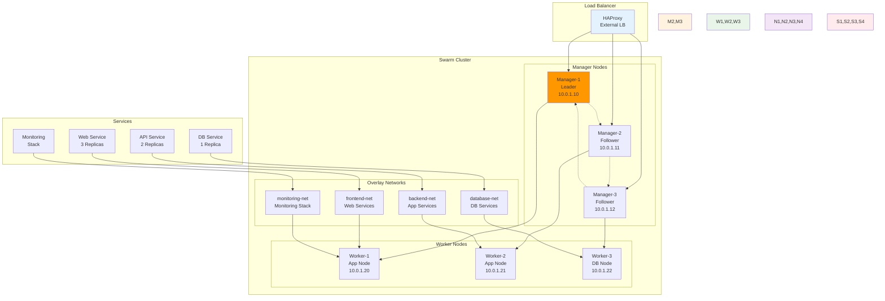

# Week 2 Day 3 Lab 2: Docker Swarm 클러스터 구성

<div align="center">

**🐳 멀티 노드 클러스터** • **🔄 서비스 오케스트레이션** • **🛡️ 고가용성 구현**

*실제 프로덕션 환경을 위한 Docker Swarm 클러스터 운영*

</div>

---

## 🕘 실습 정보

**시간**: 14:00-14:50 (50분)  
**목표**: Docker Swarm 멀티 노드 클러스터 구성과 고가용성 서비스 배포  
**방식**: 클러스터 구축 + 서비스 배포 + 장애 시뮬레이션

---

## 🎯 심화 목표

### 🛡️ 고급 기능 구현
- Lab 1에서 구축한 모니터링 시스템을 Swarm 클러스터에 배포
- 멀티 노드 환경에서의 서비스 오케스트레이션 경험
- 고가용성 아키텍처 설계와 장애 복구 시뮬레이션
- 실무 환경에서 사용하는 배포 전략 적용

### 🏗️ Swarm 클러스터 아키텍처


---

## 📋 실습 준비 (5분)

### 환경 설정
```bash
# 작업 디렉토리 생성
mkdir -p ~/swarm-cluster
cd ~/swarm-cluster

# 클러스터 구성을 위한 디렉토리 생성
mkdir -p {compose,configs,secrets,scripts}
mkdir -p stacks/{web,api,database,monitoring}

# 가상 노드 시뮬레이션을 위한 Docker-in-Docker 준비
docker network create --driver bridge swarm-net
```

### 클러스터 요구사항 정의
- **노드 구성**: Manager 3개, Worker 3개 (고가용성)
- **네트워크**: Overlay 네트워크를 통한 서비스 간 통신
- **서비스**: WordPress, MySQL, Monitoring Stack
- **배포 전략**: Rolling Update, Health Check, Constraint

---

## 🔧 심화 구현 (40분)

### Step 1: Swarm 클러스터 초기화 및 노드 구성 (15분)

**🚀 자동화 스크립트 사용**
```bash
# Swarm 클러스터 자동 구성
./lab_scripts/lab2/setup_swarm_cluster.sh
```

**📋 스크립트 내용**: [setup_swarm_cluster.sh](./lab_scripts/lab2/setup_swarm_cluster.sh)

**1-1. 수동 실행 (학습용)**
```bash
# Swarm 클러스터 초기화
docker swarm init --advertise-addr $(hostname -I | awk '{print $1}')

# Manager 조인 토큰 확인
MANAGER_TOKEN=$(docker swarm join-token manager -q)
WORKER_TOKEN=$(docker swarm join-token worker -q)
MANAGER_IP=$(docker info --format '{{.Swarm.NodeAddr}}')

echo "Manager Token: $MANAGER_TOKEN"
echo "Worker Token: $WORKER_TOKEN"
echo "Manager IP: $MANAGER_IP"

# 가상 노드 시뮬레이션 (Docker-in-Docker)
# Manager 노드 2개 추가 시뮬레이션
for i in 2 3; do
    docker run -d \
        --name manager-$i \
        --hostname manager-$i \
        --privileged \
        --network swarm-net \
        -v /var/lib/docker \
        docker:dind
    
    # 잠시 대기 후 Swarm 조인
    sleep 10
    docker exec manager-$i docker swarm join \
        --token $MANAGER_TOKEN $MANAGER_IP:2377
done

# Worker 노드 3개 추가 시뮬레이션
for i in 1 2 3; do
    docker run -d \
        --name worker-$i \
        --hostname worker-$i \
        --privileged \
        --network swarm-net \
        -v /var/lib/docker \
        docker:dind
    
    sleep 10
    docker exec worker-$i docker swarm join \
        --token $WORKER_TOKEN $MANAGER_IP:2377
done

# 클러스터 상태 확인
docker node ls
```

**1-2. 노드 레이블링 및 제약 조건 설정**
```bash
# 노드 역할별 레이블 설정
docker node update --label-add role=manager manager-2
docker node update --label-add role=manager manager-3
docker node update --label-add role=web worker-1
docker node update --label-add role=api worker-2
docker node update --label-add role=database worker-3
docker node update --label-add storage=ssd worker-3

# 노드 가용성 설정
docker node update --availability active worker-1
docker node update --availability active worker-2
docker node update --availability active worker-3

# 노드 상태 확인
docker node ls
docker node inspect worker-3 --format '{{.Spec.Labels}}'
```

### Step 2: 오버레이 네트워크 및 서비스 스택 구성 (15분)

**🚀 자동화 스크립트 사용**
```bash
# 서비스 스택 자동 배포
./lab_scripts/lab2/deploy_service_stack.sh
```

**📋 스크립트 내용**: [deploy_service_stack.sh](./lab_scripts/lab2/deploy_service_stack.sh)

**2-1. 수동 실행 (학습용)**
```bash
# 오버레이 네트워크 생성
docker network create --driver overlay --attachable frontend-net
docker network create --driver overlay --attachable backend-net
docker network create --driver overlay --attachable database-net
docker network create --driver overlay --attachable monitoring-net

# Docker Compose 스택 파일 생성
cat > stacks/web/docker-compose.yml << 'EOF'
version: '3.8'

services:
  nginx:
    image: nginx:alpine
    ports:
      - "80:80"
    networks:
      - frontend-net
      - backend-net
    configs:
      - source: nginx_config
        target: /etc/nginx/nginx.conf
    deploy:
      replicas: 3
      placement:
        constraints:
          - node.labels.role == web
      update_config:
        parallelism: 1
        delay: 30s
        failure_action: rollback
      restart_policy:
        condition: on-failure
        delay: 5s
        max_attempts: 3

  wordpress:
    image: wordpress:latest
    networks:
      - backend-net
      - database-net
    environment:
      WORDPRESS_DB_HOST: mysql:3306
      WORDPRESS_DB_NAME: wordpress
      WORDPRESS_DB_USER: wpuser
      WORDPRESS_DB_PASSWORD: wppassword
    volumes:
      - wp-content:/var/www/html/wp-content
    deploy:
      replicas: 2
      placement:
        constraints:
          - node.labels.role == api
      update_config:
        parallelism: 1
        delay: 60s
      restart_policy:
        condition: on-failure

networks:
  frontend-net:
    external: true
  backend-net:
    external: true
  database-net:
    external: true

volumes:
  wp-content:
    driver: local

configs:
  nginx_config:
    external: true
EOF

# 데이터베이스 스택 파일 생성
cat > stacks/database/docker-compose.yml << 'EOF'
version: '3.8'

services:
  mysql:
    image: mysql:8.0
    networks:
      - database-net
    environment:
      MYSQL_ROOT_PASSWORD: rootpassword
      MYSQL_DATABASE: wordpress
      MYSQL_USER: wpuser
      MYSQL_PASSWORD: wppassword
    volumes:
      - mysql-data:/var/lib/mysql
    deploy:
      replicas: 1
      placement:
        constraints:
          - node.labels.role == database
          - node.labels.storage == ssd
      restart_policy:
        condition: on-failure
        delay: 10s
        max_attempts: 5
    healthcheck:
      test: ["CMD", "mysqladmin", "ping", "-h", "localhost"]
      timeout: 20s
      retries: 10

networks:
  database-net:
    external: true

volumes:
  mysql-data:
    driver: local
EOF

# Nginx 설정 파일을 Config로 생성
cat > configs/nginx.conf << 'EOF'
upstream wordpress {
    server wordpress:80;
}

server {
    listen 80;
    server_name _;
    
    location / {
        proxy_pass http://wordpress;
        proxy_set_header Host $host;
        proxy_set_header X-Real-IP $remote_addr;
        proxy_set_header X-Forwarded-For $proxy_add_x_forwarded_for;
        proxy_set_header X-Forwarded-Proto $scheme;
    }
    
    location /health {
        access_log off;
        return 200 "healthy\n";
        add_header Content-Type text/plain;
    }
}
EOF

docker config create nginx_config configs/nginx.conf
```

**2-2. 모니터링 스택 Swarm 배포**
```bash
# 모니터링 스택 파일 생성
cat > stacks/monitoring/docker-compose.yml << 'EOF'
version: '3.8'

services:
  prometheus:
    image: prom/prometheus:latest
    ports:
      - "9090:9090"
    networks:
      - monitoring-net
    configs:
      - source: prometheus_config
        target: /etc/prometheus/prometheus.yml
    volumes:
      - prometheus-data:/prometheus
    command:
      - '--config.file=/etc/prometheus/prometheus.yml'
      - '--storage.tsdb.path=/prometheus'
      - '--storage.tsdb.retention.time=30d'
      - '--web.enable-lifecycle'
    deploy:
      replicas: 1
      placement:
        constraints:
          - node.role == manager
      restart_policy:
        condition: on-failure

  grafana:
    image: grafana/grafana:latest
    ports:
      - "3000:3000"
    networks:
      - monitoring-net
    environment:
      GF_SECURITY_ADMIN_PASSWORD: admin
    volumes:
      - grafana-data:/var/lib/grafana
    deploy:
      replicas: 1
      placement:
        constraints:
          - node.role == manager
      restart_policy:
        condition: on-failure

  cadvisor:
    image: gcr.io/cadvisor/cadvisor:latest
    ports:
      - "8080:8080"
    networks:
      - monitoring-net
    volumes:
      - /:/rootfs:ro
      - /var/run:/var/run:ro
      - /sys:/sys:ro
      - /var/lib/docker/:/var/lib/docker:ro
      - /dev/disk/:/dev/disk:ro
    deploy:
      mode: global
      restart_policy:
        condition: on-failure

networks:
  monitoring-net:
    external: true

volumes:
  prometheus-data:
    driver: local
  grafana-data:
    driver: local

configs:
  prometheus_config:
    external: true
EOF

# Prometheus 설정을 Config로 생성
cat > configs/prometheus-swarm.yml << 'EOF'
global:
  scrape_interval: 15s

scrape_configs:
  - job_name: 'prometheus'
    static_configs:
      - targets: ['localhost:9090']

  - job_name: 'cadvisor'
    dns_sd_configs:
      - names:
          - 'tasks.cadvisor'
        type: 'A'
        port: 8080

  - job_name: 'node-exporter'
    dns_sd_configs:
      - names:
          - 'tasks.node-exporter'
        type: 'A'
        port: 9100
EOF

docker config create prometheus_config configs/prometheus-swarm.yml
```

### Step 3: 서비스 배포 및 스케일링 (10분)

**🚀 자동화 스크립트 사용**
```bash
# 서비스 배포 및 스케일링 자동 실행
./lab_scripts/lab2/deploy_and_scale_services.sh
```

**📋 스크립트 내용**: [deploy_and_scale_services.sh](./lab_scripts/lab2/deploy_and_scale_services.sh)

**3-1. 수동 실행 (학습용)**
```bash
# 스택 배포
docker stack deploy -c stacks/database/docker-compose.yml database
docker stack deploy -c stacks/web/docker-compose.yml web
docker stack deploy -c stacks/monitoring/docker-compose.yml monitoring

# 서비스 상태 확인
docker service ls
docker stack ls

# 서비스 세부 정보 확인
docker service ps web_wordpress
docker service ps database_mysql
docker service ps monitoring_prometheus

# 서비스 로그 확인
docker service logs web_nginx
docker service logs database_mysql

# 서비스 스케일링
docker service scale web_wordpress=3
docker service scale web_nginx=4

# 업데이트 테스트
docker service update --image wordpress:6.1 web_wordpress

# 롤백 테스트
docker service rollback web_wordpress
```

---

## ✅ 심화 체크포인트

### 고급 기능 구현
- [ ] **멀티 노드 클러스터**: Manager 3개, Worker 3개 정상 구성
- [ ] **오버레이 네트워크**: 서비스 간 네트워크 분리 및 통신
- [ ] **서비스 오케스트레이션**: 제약 조건 기반 배치 및 스케일링
- [ ] **모니터링 통합**: Swarm 환경에서 모니터링 스택 정상 동작

### 실무 환경 연동
- [ ] **고가용성**: Manager 노드 장애 시 자동 복구
- [ ] **로드 밸런싱**: 내장 로드밸런서를 통한 트래픽 분산
- [ ] **롤링 업데이트**: 무중단 서비스 업데이트 및 롤백
- [ ] **헬스 체크**: 서비스 상태 모니터링 및 자동 복구

### 성능 최적화
- [ ] **리소스 제한**: CPU/메모리 제한을 통한 안정적 운영
- [ ] **배치 전략**: 노드 레이블 기반 최적 배치
- [ ] **네트워크 최적화**: 오버레이 네트워크 성능 튜닝
- [ ] **스토리지 관리**: 볼륨 배치 및 백업 전략

### 베스트 프랙티스
- [ ] **보안**: Secrets 관리 및 네트워크 분리
- [ ] **모니터링**: 클러스터 및 서비스 상태 실시간 추적
- [ ] **로깅**: 중앙화된 로그 수집 및 분석
- [ ] **백업**: 서비스 상태 및 데이터 백업 전략

---

## 🎤 결과 발표 및 회고 (5분)

### 시연
- **클러스터 상태**: `docker node ls`로 클러스터 구성 확인
- **서비스 배포**: 멀티 노드에 분산된 서비스 시연
- **장애 복구**: 노드 다운 시뮬레이션과 자동 복구 과정
- **스케일링**: 실시간 서비스 스케일 업/다운

### 기술적 인사이트
- **오케스트레이션**: 단일 컨테이너 vs 클러스터 관리의 차이점
- **네트워크**: 오버레이 네트워크의 동작 원리와 성능 특성
- **배포 전략**: Rolling Update의 장점과 주의사항
- **모니터링**: 분산 환경에서의 관측성 확보 방법

### 베스트 프랙티스
- **클러스터 설계**: 홀수 개 Manager 노드의 중요성
- **서비스 배치**: 제약 조건을 통한 최적 배치 전략
- **장애 대응**: 예측 가능한 장애 시나리오와 대응 방안
- **성능 튜닝**: 리소스 제한과 헬스 체크 설정

### 문제 해결 경험
- **네트워크 이슈**: 오버레이 네트워크 연결 문제 해결
- **서비스 배포**: 제약 조건 충돌 시 해결 방법
- **리소스 부족**: 노드 리소스 부족 시 대응 방안
- **모니터링**: 분산 환경에서의 메트릭 수집 최적화

### 향후 발전 방향
- **Kubernetes**: Swarm 경험을 K8s로 확장
- **CI/CD 통합**: GitOps와 자동 배포 파이프라인
- **멀티 클라우드**: 여러 클라우드 환경에서의 클러스터 운영
- **서비스 메시**: Istio 등 고급 네트워킹 솔루션

---

## 🧹 실습 환경 정리

**실습 완료 후 정리**
```bash
# 모든 실습 환경 자동 정리
./lab_scripts/lab2/cleanup.sh
```

**📋 스크립트 내용**: [cleanup.sh](./lab_scripts/lab2/cleanup.sh)

---

<div align="center">

**🐳 Docker Swarm 클러스터 구성 완료!**

**축하합니다! 컨테이너 오케스트레이션의 모든 것을 마스터했습니다!**

**다음**: [Day 4 - Kubernetes 준비 & 마이그레이션](../day4/README.md)

</div>