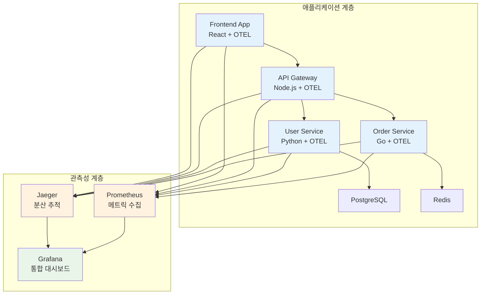

# Week 2 Day 3 Lab 2: OpenTelemetry & Jaeger 분산 추적

<div align="center">

**🔍 분산 추적** • **📊 OpenTelemetry** • **🎯 Jaeger**

*완전한 관측성 구현 - 메트릭, 로그, 추적의 통합*

</div>

---

## 🎯 실습 목표

### 📚 학습 목표
- **OpenTelemetry 이해**: 관측성 표준 프레임워크 활용
- **분산 추적 구현**: 마이크로서비스 간 요청 흐름 추적
- **통합 관측성**: Prometheus + Grafana + Jaeger 완전 통합
- **실무 적용**: 실제 운영 환경에서 사용하는 관측성 스택 구축

### 🛠️ 구축할 시스템


---

## 🚀 Step 1: 환경 준비 및 기본 설정 (10분)

### 🔧 자동화 스크립트 사용
```bash
# 전체 환경 자동 구성
./lab_scripts/tracing/setup_tracing_environment.sh
```

**📋 스크립트 내용**: [setup_tracing_environment.sh](./lab_scripts/tracing/setup_tracing_environment.sh)

### 1-1. 수동 실행 (학습용)
```bash
# 작업 디렉토리 생성
mkdir -p ~/docker-tracing-lab
cd ~/docker-tracing-lab

# Docker Compose 파일 생성
cat > docker-compose.yml << 'EOF'
version: '3.8'

services:
  # Jaeger - 분산 추적
  jaeger:
    image: jaegertracing/all-in-one:1.50
    container_name: jaeger
    ports:
      - "16686:16686"  # Jaeger UI
      - "14268:14268"  # Jaeger collector HTTP
      - "14250:14250"  # Jaeger collector gRPC
      - "6831:6831/udp"  # Jaeger agent UDP
    environment:
      - COLLECTOR_OTLP_ENABLED=true
      - COLLECTOR_ZIPKIN_HOST_PORT=:9411
    networks:
      - observability

  # OTEL Collector
  otel-collector:
    image: otel/opentelemetry-collector-contrib:0.88.0
    container_name: otel-collector
    command: ["--config=/etc/otel-collector-config.yaml"]
    volumes:
      - ./otel-collector-config.yaml:/etc/otel-collector-config.yaml
    ports:
      - "4317:4317"   # OTLP gRPC receiver
      - "4318:4318"   # OTLP HTTP receiver
      - "8889:8889"   # Prometheus metrics
    depends_on:
      - jaeger
      - prometheus
    networks:
      - observability

  # Prometheus
  prometheus:
    image: prom/prometheus:v2.47.0
    container_name: prometheus
    ports:
      - "9090:9090"
    volumes:
      - ./prometheus.yml:/etc/prometheus/prometheus.yml
    networks:
      - observability

  # Grafana
  grafana:
    image: grafana/grafana:10.1.0
    container_name: grafana
    ports:
      - "3000:3000"
    environment:
      - GF_SECURITY_ADMIN_PASSWORD=admin
    volumes:
      - grafana-data:/var/lib/grafana
      - ./grafana/provisioning:/etc/grafana/provisioning
    networks:
      - observability

  # PostgreSQL
  postgres:
    image: postgres:15
    container_name: postgres
    environment:
      - POSTGRES_DB=userdb
      - POSTGRES_USER=admin
      - POSTGRES_PASSWORD=password
    ports:
      - "5432:5432"
    networks:
      - observability

  # Redis
  redis:
    image: redis:7-alpine
    container_name: redis
    ports:
      - "6379:6379"
    networks:
      - observability

networks:
  observability:
    driver: bridge

volumes:
  grafana-data:
EOF
```

### 1-2. OpenTelemetry Collector 설정
```bash
# OTEL Collector 설정 파일 생성
cat > otel-collector-config.yaml << 'EOF'
receivers:
  otlp:
    protocols:
      grpc:
        endpoint: 0.0.0.0:4317
      http:
        endpoint: 0.0.0.0:4318

processors:
  batch:
  memory_limiter:
    limit_mib: 512

exporters:
  jaeger:
    endpoint: jaeger:14250
    tls:
      insecure: true
  
  prometheus:
    endpoint: "0.0.0.0:8889"
    
  logging:
    loglevel: debug

service:
  pipelines:
    traces:
      receivers: [otlp]
      processors: [memory_limiter, batch]
      exporters: [jaeger, logging]
    
    metrics:
      receivers: [otlp]
      processors: [memory_limiter, batch]
      exporters: [prometheus, logging]
EOF
```

---

## 🛠️ Step 2: 마이크로서비스 애플리케이션 배포 (15분)

### 🚀 자동화 스크립트 사용
```bash
# 트레이싱 지원 애플리케이션 배포
./lab_scripts/tracing/deploy_traced_apps.sh
```

**📋 스크립트 내용**: [deploy_traced_apps.sh](./lab_scripts/tracing/deploy_traced_apps.sh)

### 2-1. API Gateway (Node.js) 배포
```bash
# API Gateway 디렉토리 생성
mkdir -p apps/api-gateway
cd apps/api-gateway

# package.json 생성
cat > package.json << 'EOF'
{
  "name": "api-gateway",
  "version": "1.0.0",
  "main": "server.js",
  "dependencies": {
    "express": "^4.18.2",
    "axios": "^1.5.0",
    "@opentelemetry/api": "^1.6.0",
    "@opentelemetry/sdk-node": "^0.43.0",
    "@opentelemetry/auto-instrumentations-node": "^0.39.4",
    "@opentelemetry/exporter-otlp-http": "^0.43.0",
    "prom-client": "^14.2.0"
  }
}
EOF

# 트레이싱 설정 파일
cat > tracing.js << 'EOF'
const { NodeSDK } = require('@opentelemetry/sdk-node');
const { getNodeAutoInstrumentations } = require('@opentelemetry/auto-instrumentations-node');
const { OTLPTraceExporter } = require('@opentelemetry/exporter-otlp-http');

const sdk = new NodeSDK({
  traceExporter: new OTLPTraceExporter({
    url: 'http://otel-collector:4318/v1/traces',
  }),
  instrumentations: [getNodeAutoInstrumentations()],
  serviceName: 'api-gateway',
});

sdk.start();
EOF

# 메인 서버 파일
cat > server.js << 'EOF'
require('./tracing');
const express = require('express');
const axios = require('axios');
const client = require('prom-client');

const app = express();
const port = 3001;

// Prometheus 메트릭 설정
const register = new client.Registry();
const httpRequestDuration = new client.Histogram({
  name: 'http_request_duration_seconds',
  help: 'Duration of HTTP requests in seconds',
  labelNames: ['method', 'route', 'status'],
  buckets: [0.1, 0.3, 0.5, 0.7, 1, 3, 5, 7, 10]
});
register.registerMetric(httpRequestDuration);

app.use(express.json());

// 메트릭 수집 미들웨어
app.use((req, res, next) => {
  const start = Date.now();
  res.on('finish', () => {
    const duration = (Date.now() - start) / 1000;
    httpRequestDuration.observe(
      { method: req.method, route: req.path, status: res.statusCode },
      duration
    );
  });
  next();
});

// 헬스체크
app.get('/health', (req, res) => {
  res.json({ status: 'healthy', service: 'api-gateway' });
});

// 메트릭 엔드포인트
app.get('/metrics', async (req, res) => {
  res.set('Content-Type', register.contentType);
  res.end(await register.metrics());
});

// 사용자 정보 조회 (User Service 호출)
app.get('/api/users/:id', async (req, res) => {
  try {
    const response = await axios.get(`http://user-service:3002/users/${req.params.id}`);
    res.json(response.data);
  } catch (error) {
    res.status(500).json({ error: 'User service error' });
  }
});

// 주문 생성 (Order Service 호출)
app.post('/api/orders', async (req, res) => {
  try {
    const response = await axios.post('http://order-service:3003/orders', req.body);
    res.json(response.data);
  } catch (error) {
    res.status(500).json({ error: 'Order service error' });
  }
});

app.listen(port, () => {
  console.log(`API Gateway running on port ${port}`);
});
EOF

# Dockerfile 생성
cat > Dockerfile << 'EOF'
FROM node:18-alpine
WORKDIR /app
COPY package.json .
RUN npm install
COPY . .
EXPOSE 3001
CMD ["node", "server.js"]
EOF
```

### 2-2. User Service (Python) 배포
```bash
# User Service 디렉토리 생성
mkdir -p ../user-service
cd ../user-service

# requirements.txt 생성
cat > requirements.txt << 'EOF'
flask==2.3.3
psycopg2-binary==2.9.7
opentelemetry-api==1.20.0
opentelemetry-sdk==1.20.0
opentelemetry-instrumentation-flask==0.41b0
opentelemetry-instrumentation-psycopg2==0.41b0
opentelemetry-exporter-otlp==1.20.0
prometheus-client==0.17.1
EOF

# 메인 애플리케이션
cat > app.py << 'EOF'
from opentelemetry import trace
from opentelemetry.sdk.trace import TracerProvider
from opentelemetry.sdk.trace.export import BatchSpanProcessor
from opentelemetry.exporter.otlp.proto.http.trace_exporter import OTLPSpanExporter
from opentelemetry.instrumentation.flask import FlaskInstrumentor
from opentelemetry.instrumentation.psycopg2 import Psycopg2Instrumentor

from flask import Flask, jsonify
import psycopg2
import time
import random
from prometheus_client import Counter, Histogram, generate_latest

# OpenTelemetry 설정
trace.set_tracer_provider(TracerProvider())
tracer = trace.get_tracer(__name__)

otlp_exporter = OTLPSpanExporter(endpoint="http://otel-collector:4318/v1/traces")
span_processor = BatchSpanProcessor(otlp_exporter)
trace.get_tracer_provider().add_span_processor(span_processor)

app = Flask(__name__)

# 자동 계측 활성화
FlaskInstrumentor().instrument_app(app)
Psycopg2Instrumentor().instrument()

# Prometheus 메트릭
REQUEST_COUNT = Counter('user_service_requests_total', 'Total requests', ['method', 'endpoint'])
REQUEST_LATENCY = Histogram('user_service_request_duration_seconds', 'Request latency')

# 데이터베이스 연결
def get_db_connection():
    return psycopg2.connect(
        host="postgres",
        database="userdb",
        user="admin",
        password="password"
    )

@app.route('/health')
def health():
    return jsonify({"status": "healthy", "service": "user-service"})

@app.route('/metrics')
def metrics():
    return generate_latest()

@app.route('/users/<int:user_id>')
@REQUEST_LATENCY.time()
def get_user(user_id):
    REQUEST_COUNT.labels(method='GET', endpoint='/users').inc()
    
    with tracer.start_as_current_span("get_user_from_db") as span:
        span.set_attribute("user.id", user_id)
        
        # 의도적 지연 (트레이싱 시각화용)
        time.sleep(random.uniform(0.1, 0.3))
        
        try:
            conn = get_db_connection()
            cur = conn.cursor()
            cur.execute("SELECT id, name, email FROM users WHERE id = %s", (user_id,))
            user = cur.fetchone()
            cur.close()
            conn.close()
            
            if user:
                return jsonify({
                    "id": user[0],
                    "name": user[1],
                    "email": user[2]
                })
            else:
                return jsonify({"error": "User not found"}), 404
                
        except Exception as e:
            span.record_exception(e)
            return jsonify({"error": str(e)}), 500

if __name__ == '__main__':
    app.run(host='0.0.0.0', port=3002)
EOF

# Dockerfile 생성
cat > Dockerfile << 'EOF'
FROM python:3.11-slim
WORKDIR /app
COPY requirements.txt .
RUN pip install -r requirements.txt
COPY . .
EXPOSE 3002
CMD ["python", "app.py"]
EOF
```

### 2-3. Docker Compose에 서비스 추가
```bash
cd ~/docker-tracing-lab

# Docker Compose에 애플리케이션 서비스 추가
cat >> docker-compose.yml << 'EOF'

  # API Gateway
  api-gateway:
    build: ./apps/api-gateway
    container_name: api-gateway
    ports:
      - "3001:3001"
    depends_on:
      - otel-collector
      - user-service
      - order-service
    networks:
      - observability

  # User Service
  user-service:
    build: ./apps/user-service
    container_name: user-service
    ports:
      - "3002:3002"
    depends_on:
      - postgres
      - otel-collector
    networks:
      - observability

  # Order Service (간단한 Go 서비스)
  order-service:
    image: nginx:alpine
    container_name: order-service
    ports:
      - "3003:80"
    networks:
      - observability
EOF
```

---

## 📊 Step 3: Grafana 대시보드 구성 (10분)

### 🚀 자동화 스크립트 사용
```bash
# Grafana 대시보드 자동 구성
./lab_scripts/tracing/setup_grafana_dashboards.sh
```

**📋 스크립트 내용**: [setup_grafana_dashboards.sh](./lab_scripts/tracing/setup_grafana_dashboards.sh)

### 3-1. Grafana 프로비저닝 설정
```bash
# Grafana 프로비저닝 디렉토리 생성
mkdir -p grafana/provisioning/{datasources,dashboards}

# 데이터소스 설정
cat > grafana/provisioning/datasources/datasources.yml << 'EOF'
apiVersion: 1

datasources:
  - name: Prometheus
    type: prometheus
    access: proxy
    url: http://prometheus:9090
    isDefault: true

  - name: Jaeger
    type: jaeger
    access: proxy
    url: http://jaeger:16686
    
  - name: OTEL Metrics
    type: prometheus
    access: proxy
    url: http://otel-collector:8889
EOF

# 대시보드 프로비저닝 설정
cat > grafana/provisioning/dashboards/dashboards.yml << 'EOF'
apiVersion: 1

providers:
  - name: 'default'
    orgId: 1
    folder: ''
    type: file
    disableDeletion: false
    updateIntervalSeconds: 10
    options:
      path: /etc/grafana/provisioning/dashboards
EOF
```

### 3-2. 통합 관측성 대시보드 생성
```bash
# 통합 대시보드 JSON 생성
cat > grafana/provisioning/dashboards/observability-dashboard.json << 'EOF'
{
  "dashboard": {
    "id": null,
    "title": "Complete Observability Stack",
    "tags": ["observability", "tracing", "metrics"],
    "timezone": "browser",
    "panels": [
      {
        "id": 1,
        "title": "Request Rate",
        "type": "stat",
        "targets": [
          {
            "expr": "sum(rate(http_requests_total[5m]))",
            "legendFormat": "Requests/sec"
          }
        ],
        "gridPos": {"h": 8, "w": 12, "x": 0, "y": 0}
      },
      {
        "id": 2,
        "title": "Response Time P95",
        "type": "stat",
        "targets": [
          {
            "expr": "histogram_quantile(0.95, sum(rate(http_request_duration_seconds_bucket[5m])) by (le))",
            "legendFormat": "P95 Latency"
          }
        ],
        "gridPos": {"h": 8, "w": 12, "x": 12, "y": 0}
      },
      {
        "id": 3,
        "title": "Service Map (Jaeger)",
        "type": "text",
        "options": {
          "content": "<iframe src=\"http://localhost:16686\" width=\"100%\" height=\"400px\"></iframe>"
        },
        "gridPos": {"h": 12, "w": 24, "x": 0, "y": 8}
      }
    ],
    "time": {
      "from": "now-1h",
      "to": "now"
    },
    "refresh": "5s"
  }
}
EOF
```

---

## 🔍 Step 4: 분산 추적 테스트 및 검증 (10분)

### 🚀 자동화 스크립트 사용
```bash
# 트레이싱 테스트 실행
./lab_scripts/tracing/test_distributed_tracing.sh
```

**📋 스크립트 내용**: [test_distributed_tracing.sh](./lab_scripts/tracing/test_distributed_tracing.sh)

### 4-1. 전체 시스템 시작
```bash
# 모든 서비스 시작
docker-compose up -d

# 서비스 상태 확인
docker-compose ps

# 로그 확인
docker-compose logs -f otel-collector
```

### 4-2. 테스트 트래픽 생성
```bash
# 사용자 조회 요청 (분산 추적 생성)
for i in {1..10}; do
  curl -X GET "http://localhost:3001/api/users/$i"
  sleep 1
done

# 주문 생성 요청
for i in {1..5}; do
  curl -X POST "http://localhost:3001/api/orders" \
    -H "Content-Type: application/json" \
    -d '{"user_id": '$i', "product": "laptop", "quantity": 1}'
  sleep 2
done
```

### 4-3. 관측성 도구 접속 및 확인
```bash
echo "=== 관측성 도구 접속 정보 ==="
echo "🔍 Jaeger UI: http://localhost:16686"
echo "📊 Grafana: http://localhost:3000 (admin/admin)"
echo "📈 Prometheus: http://localhost:9090"
echo "🔧 OTEL Collector Metrics: http://localhost:8889/metrics"
```

---

## 📊 Step 5: 통합 분석 및 트러블슈팅 (10분)

### 5-1. Jaeger에서 분산 추적 분석
**Jaeger UI 활용법**:
1. **Service Map**: 서비스 간 의존성 시각화
2. **Trace Timeline**: 요청 처리 시간 분석
3. **Error Tracking**: 오류 발생 지점 추적
4. **Performance Bottleneck**: 병목 구간 식별

### 5-2. Grafana에서 통합 대시보드 확인
**통합 관측성 확인**:
```bash
# Grafana 대시보드 접속
open http://localhost:3000

# 확인할 메트릭들:
# - Request Rate (요청 처리율)
# - Response Time Distribution (응답 시간 분포)
# - Error Rate (오류율)
# - Service Dependencies (서비스 의존성)
```

### 5-3. 의도적 오류 생성 및 추적
```bash
# 오류 시나리오 테스트
curl -X GET "http://localhost:3001/api/users/999"  # 존재하지 않는 사용자

# 지연 시나리오 테스트
curl -X GET "http://localhost:3001/api/users/1?delay=5000"  # 5초 지연
```

---

## ✅ 실습 체크포인트

### 🎯 완성 확인 사항
- [ ] **Jaeger UI 접속**: 분산 추적 데이터 시각화 확인
- [ ] **Service Map**: 마이크로서비스 간 의존성 맵 생성
- [ ] **Trace Details**: 개별 요청의 상세 추적 정보 확인
- [ ] **Grafana 통합**: 메트릭과 추적 데이터 통합 대시보드
- [ ] **OpenTelemetry**: 표준 관측성 프레임워크 동작 확인
- [ ] **성능 분석**: 병목 지점 및 최적화 포인트 식별

### 🔍 고급 분석 활동
- **Trace Comparison**: 정상 요청 vs 오류 요청 추적 비교
- **Performance Profiling**: 서비스별 성능 프로파일링
- **Dependency Analysis**: 서비스 의존성 분석 및 최적화
- **SLI/SLO Monitoring**: 서비스 수준 지표 모니터링

---

## 🎓 실습 마무리

### ✅ 오늘 실습 성과
- **완전한 관측성 구현**: 메트릭 + 로그 + 추적 통합
- **OpenTelemetry 활용**: 표준 관측성 프레임워크 실무 적용
- **분산 추적 마스터**: 마이크로서비스 환경에서의 요청 흐름 완전 추적
- **실무 준비**: 실제 운영 환경에서 사용하는 관측성 스택 구축

### 🚀 다음 단계 준비
- **Week 3 연결**: Kubernetes 환경에서의 Istio + Jaeger 고급 활용
- **실무 적용**: 실제 프로젝트에서의 관측성 전략 수립
- **고급 기능**: 커스텀 메트릭, 알림 규칙, 대시보드 고도화

### 🧹 환경 정리
```bash
# 실습 환경 정리
docker-compose down -v
docker system prune -f
```

---

<div align="center">

**🔍 분산 추적 마스터** • **📊 통합 관측성** • **🎯 실무 준비 완료**

*OpenTelemetry와 Jaeger를 활용한 완전한 관측성 구현을 마스터했습니다*

</div>