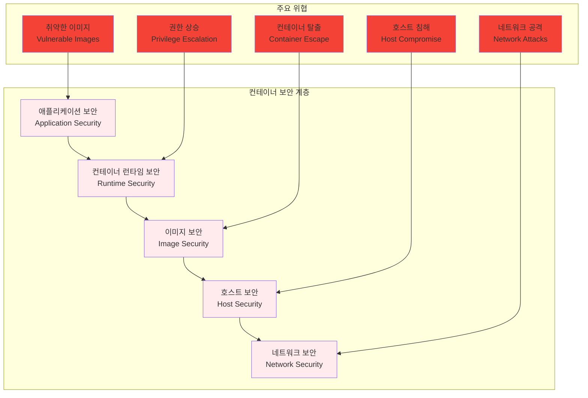
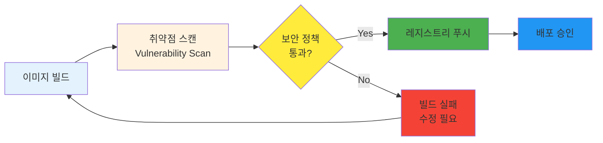
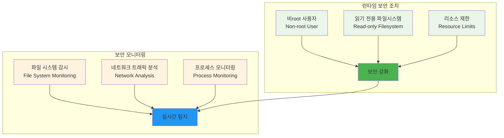

# Week 2 Day 3 Session 1: 컨테이너 보안 기초

<div align="center">
**🔒 컨테이너 보안** • **📚 보안 위협 이해**
*컨테이너 환경의 보안 위협과 대응 방안 완전 이해*
</div>

---

## 🕘 세션 정보
**시간**: 09:00-09:50 (50분)
**목표**: 컨테이너 환경의 보안 위협과 대응 방안 완전 이해
**방식**: 이론 강의 + 페어 토론

## 🎯 세션 목표
### 📚 학습 목표
- **이해 목표**: 컨테이너 환경의 보안 위협과 대응 방안 완전 이해
- **적용 목표**: 실무에서 사용할 수 있는 보안 도구와 기법 습득
- **협업 목표**: 개별 학습 후 경험 공유 및 질의응답

### 🤔 왜 필요한가? (5분)
**현실 문제 상황**:
- 💼 **보안 사고**: 컨테이너 취약점으로 인한 실제 보안 사고 급증
- 🏠 **일상 비유**: 집의 문은 잠갔지만 창문을 열어둔 것과 같은 위험
- 📊 **시장 동향**: DevSecOps로의 패러다임 전환, 보안의 Shift-Left

## 📖 핵심 개념 (35분)

### 🔍 개념 1: 컨테이너 보안 위협 모델 (12분)
> **정의**: 컨테이너 환경에서 발생할 수 있는 다양한 보안 위협과 공격 벡터

**컨테이너 보안 계층**:


**주요 보안 위협**:
- **취약한 베이스 이미지**: 알려진 CVE가 포함된 이미지 사용
- **과도한 권한**: root 권한으로 실행되는 컨테이너
- **시크릿 노출**: 하드코딩된 패스워드나 API 키
- **네트워크 노출**: 불필요한 포트 개방
- **리소스 남용**: 무제한 리소스 사용으로 인한 DoS

### 🔍 개념 2: 이미지 보안 스캔 (12분)
> **정의**: 컨테이너 이미지의 취약점을 자동으로 검사하고 보고하는 프로세스

**보안 스캔 워크플로우**:


**주요 스캔 도구**:
- **Trivy**: 오픈소스 취약점 스캐너
- **Clair**: CoreOS의 정적 분석 도구
- **Snyk**: 상용 보안 플랫폼
- **Anchore**: 엔터프라이즈 이미지 스캔

**스캔 실습 예시**:
```bash
# Trivy로 이미지 스캔
trivy image nginx:latest

# 심각도별 필터링
trivy image --severity HIGH,CRITICAL nginx:latest

# JSON 형태로 결과 출력
trivy image --format json nginx:latest > scan-result.json
```

### 🔍 개념 3: 런타임 보안 강화 (11분)
> **정의**: 컨테이너 실행 시점에서 적용하는 보안 조치와 모니터링

**런타임 보안 기법**:


**보안 강화 Dockerfile 예시**:
```dockerfile
FROM node:18-alpine

# 보안 강화: 비root 사용자 생성
RUN addgroup -g 1001 -S nodejs && \
    adduser -S nextjs -u 1001

# 애플리케이션 파일 복사
COPY --chown=nextjs:nodejs . .

# 비root 사용자로 전환
USER nextjs

# 읽기 전용 파일시스템 (docker run 시 --read-only 옵션)
# 리소스 제한 (docker run 시 --memory, --cpus 옵션)

EXPOSE 3000
CMD ["node", "server.js"]
```

## 💭 함께 생각해보기 (10분)

### 🤝 페어 토론 (5분)
**토론 주제**:
1. **보안 vs 편의성**: "보안을 강화하면서도 개발 편의성을 유지하는 방법은?"
2. **보안 정책**: "우리 조직에 맞는 컨테이너 보안 정책은 어떻게 수립해야 할까요?"
3. **자동화**: "보안 검사를 CI/CD 파이프라인에 어떻게 통합할까요?"

### 🎯 전체 공유 (5분)
- **보안 인식**: 컨테이너 보안의 중요성과 실무 적용 방안
- **도구 선택**: 조직 규모와 요구사항에 맞는 보안 도구 선택

## 🔑 핵심 키워드
- **CVE (Common Vulnerabilities and Exposures)**: 공통 취약점 및 노출
- **Shift-Left Security**: 개발 초기 단계부터 보안 적용
- **Container Escape**: 컨테이너 탈출 공격
- **Least Privilege**: 최소 권한 원칙
- **Runtime Security**: 런타임 보안

## 📝 세션 마무리
### ✅ 오늘 세션 성과
- 컨테이너 보안 위협 모델 완전 이해
- 이미지 보안 스캔 도구와 프로세스 학습
- 런타임 보안 강화 기법 습득

### 🎯 다음 세션 준비
- **Session 2**: 이미지 최적화 & 성능 튜닝
- **연결**: 보안과 성능의 균형점 찾기

---

**다음**: [Session 2 - 이미지 최적화 & 성능 튜닝](./session_2.md)