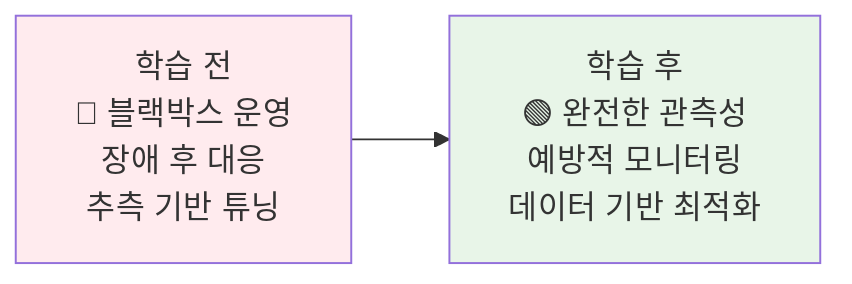
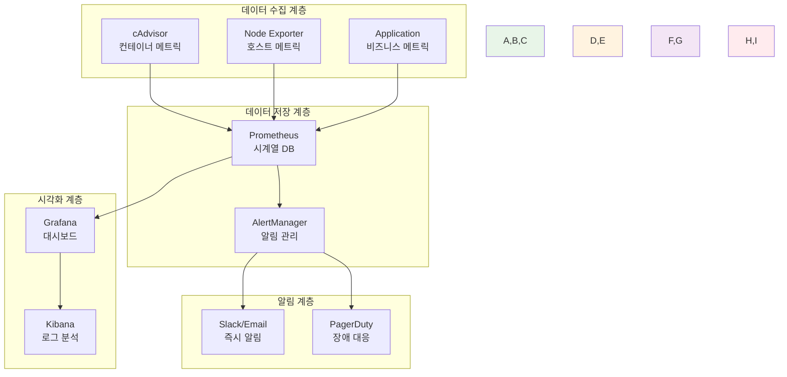
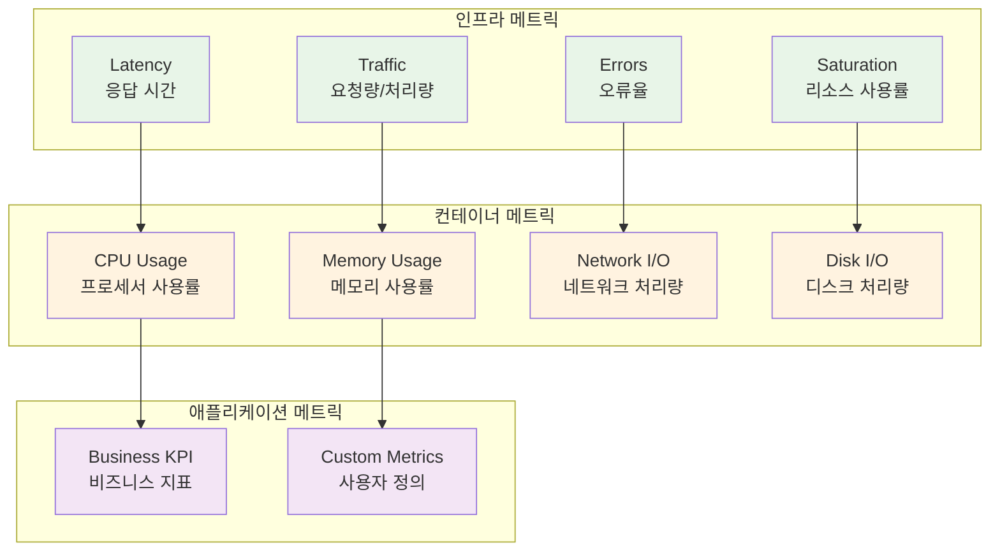
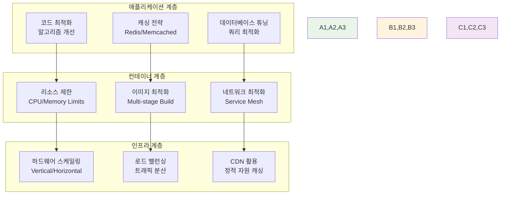

# Week 2 Day 3 Session 1: 컨테이너 모니터링 & 성능 최적화

<div align="center">

**📊 메트릭 수집** • **🔍 성능 분석** • **⚡ 최적화 전략**

*프로덕션 환경에서의 컨테이너 관측성과 성능 튜닝*

</div>

---

## 🕘 세션 정보

**시간**: 09:00-09:50 (50분)  
**목표**: 컨테이너 모니터링 시스템 구축과 성능 최적화 방법 학습  
**방식**: 이론 + 실시간 데모 + 페어 토론

---

## 🎯 세션 목표

### 📚 학습 목표
- **이해 목표**: Prometheus 기반 메트릭 수집 아키텍처 완전 이해
- **적용 목표**: 컨테이너 성능 지표 분석과 최적화 방법 습득
- **협업 목표**: 팀별 모니터링 전략 수립과 경험 공유

### 🤔 왜 필요한가? (5분)

**현실 문제 상황**:
- 💼 **실무 시나리오**: "새벽 3시에 서비스가 다운되었는데 원인을 모르겠어요"
- 🏠 **일상 비유**: 자동차 계기판 없이 운전하는 것과 같은 위험성
- 📊 **시장 동향**: 99.9% 가용성 요구사항과 SLA 준수 필요성

**학습 전후 비교**:


---

## 📖 핵심 개념 (35분)

### 🔍 개념 1: 컨테이너 모니터링 아키텍처 (12분)

> **정의**: 컨테이너 환경에서 시스템과 애플리케이션의 상태를 실시간으로 수집, 저장, 분석하는 체계

**모니터링 스택 구성**:


**핵심 구성 요소**:
- **메트릭 수집기**: cAdvisor, Node Exporter, Custom Exporters
- **시계열 데이터베이스**: Prometheus (Pull 기반 수집)
- **시각화 도구**: Grafana (대시보드 및 알림)
- **알림 관리**: AlertManager (규칙 기반 알림)

**실무 적용 사례**:
- **Netflix**: 수천 개 마이크로서비스 실시간 모니터링
- **Uber**: 글로벌 서비스의 지역별 성능 추적
- **Airbnb**: 예약 시스템의 실시간 비즈니스 메트릭

### 🔍 개념 2: 핵심 성능 지표와 분석 (12분)

> **정의**: 컨테이너와 애플리케이션의 건강 상태를 나타내는 측정 가능한 지표들

**4가지 황금 신호 (Four Golden Signals)**:


**메트릭 분류와 임계값**:

| 메트릭 유형 | 정상 범위 | 주의 임계값 | 위험 임계값 | 대응 방안 |
|------------|-----------|-------------|-------------|-----------|
| **CPU 사용률** | < 70% | 70-85% | > 85% | 스케일 아웃, 최적화 |
| **메모리 사용률** | < 80% | 80-90% | > 90% | 메모리 증설, 튜닝 |
| **응답 시간** | < 200ms | 200-500ms | > 500ms | 캐싱, 쿼리 최적화 |
| **오류율** | < 0.1% | 0.1-1% | > 1% | 버그 수정, 롤백 |
| **디스크 I/O** | < 80% | 80-90% | > 90% | SSD 교체, 최적화 |

**실시간 분석 기법**:
- **트렌드 분석**: 시간대별 패턴 파악
- **이상 탐지**: 평소와 다른 패턴 감지
- **상관관계 분석**: 메트릭 간 연관성 파악
- **예측 분석**: 미래 리소스 요구량 예측

### 🔍 개념 3: 성능 최적화 전략과 실무 적용 (11분)

> **정의**: 수집된 메트릭을 기반으로 시스템 성능을 체계적으로 개선하는 방법론

**계층별 최적화 전략**:


**Docker 컨테이너 최적화 실무**:

**1. 리소스 제한 최적화**:
```yaml
# docker-compose.yml 예시
services:
  web:
    image: nginx:alpine
    deploy:
      resources:
        limits:
          cpus: '1.0'
          memory: 512M
        reservations:
          cpus: '0.5'
          memory: 256M
```

**2. 이미지 크기 최적화**:
```dockerfile
# Multi-stage build 예시
FROM node:16-alpine AS builder
WORKDIR /app
COPY package*.json ./
RUN npm ci --only=production

FROM node:16-alpine
WORKDIR /app
COPY --from=builder /app/node_modules ./node_modules
COPY . .
EXPOSE 3000
CMD ["node", "server.js"]
```

**3. 네트워크 최적화**:
- **Keep-Alive 연결**: HTTP 연결 재사용
- **압축 활성화**: gzip/brotli 압축 적용
- **CDN 활용**: 정적 자원 캐싱 및 배포

**성능 튜닝 체크리스트**:
- [ ] **CPU 바운드**: 멀티스레딩, 비동기 처리 적용
- [ ] **메모리 바운드**: 캐싱 전략, 메모리 풀 활용
- [ ] **I/O 바운드**: 비동기 I/O, 배치 처리 적용
- [ ] **네트워크 바운드**: 압축, 캐싱, CDN 활용

---

## 💭 함께 생각해보기 (10분)

### 🤝 페어 토론 (5분)

**토론 주제**:
1. **모니터링 전략**: "우리 팀의 서비스라면 어떤 메트릭을 가장 중요하게 모니터링할까요?"
2. **성능 병목**: "경험했던 성능 문제와 해결 방법을 공유해주세요"
3. **알림 설계**: "새벽에 깨우지 않으면서도 중요한 장애는 놓치지 않는 알림 전략은?"

**페어 활동 가이드**:
- 👥 **경험 기반 토론**: 실제 경험이나 상상 시나리오 활용
- 🔄 **역할 교대**: 3분씩 설명자/질문자 역할 바꾸기
- 📝 **아이디어 정리**: 좋은 아이디어는 메모하여 전체 공유 준비

### 🎯 전체 공유 (5분)

**인사이트 공유**:
- **창의적 모니터링**: 독특하거나 효과적인 모니터링 아이디어
- **실무 경험**: 실제 장애 대응이나 성능 개선 사례
- **도구 활용**: 유용한 모니터링 도구나 기법 추천

**💡 이해도 체크 질문**:
- ✅ "Prometheus의 Pull 방식과 Push 방식의 차이점을 설명할 수 있나요?"
- ✅ "컨테이너 CPU 사용률이 100%일 때 가능한 원인과 해결책은?"
- ✅ "모니터링 데이터를 기반으로 스케일링 결정을 내릴 수 있나요?"

---

## 🔑 핵심 키워드

### 🆕 새로운 용어
- **Prometheus(프로메테우스)**: 오픈소스 모니터링 및 알림 시스템
- **cAdvisor**: 컨테이너 리소스 사용량 및 성능 특성 분석 도구
- **Grafana(그라파나)**: 메트릭 시각화 및 대시보드 플랫폼
- **AlertManager**: Prometheus 알림 처리 및 라우팅 시스템

### 🔤 기술 용어
- **Time Series Database**: 시간 순서로 정렬된 데이터를 저장하는 데이터베이스
- **Scraping**: Prometheus가 메트릭을 수집하는 방식
- **Exporter**: 메트릭을 Prometheus 형식으로 노출하는 컴포넌트
- **PromQL**: Prometheus Query Language, 메트릭 쿼리 언어

### 🔤 성능 지표
- **Latency**: 요청 처리 시간 (지연 시간)
- **Throughput**: 단위 시간당 처리량
- **Saturation**: 리소스 포화도
- **SLA/SLO**: Service Level Agreement/Objective (서비스 수준 협약/목표)

---

## 📝 세션 마무리

### ✅ 오늘 세션 성과
- **모니터링 아키텍처**: Prometheus 기반 모니터링 스택 이해
- **성능 지표**: 4가지 황금 신호와 컨테이너 메트릭 분석 방법
- **최적화 전략**: 계층별 성능 튜닝 방법론과 실무 적용

### 🎯 다음 세션 준비
- **Session 2 연결**: 모니터링 메트릭 → 로그 데이터 연계 분석
- **실습 준비**: 오후 실습에서 Prometheus + Grafana 직접 구축
- **심화 학습**: 로그 기반 문제 해결과 중앙화된 로그 관리 시스템

### 🔮 실무 적용 계획
- **모니터링 설계**: 현재 또는 미래 프로젝트의 모니터링 전략 수립
- **성능 개선**: 학습한 최적화 기법을 실제 환경에 적용
- **알림 체계**: 효과적인 알림 규칙과 에스컬레이션 정책 설계

---

<div align="center">

**📊 다음 세션**: [Session 2 - 로깅 전략 & 중앙화된 로그 관리](./session_2.md)

**🛠️ 오후 실습**: [Lab 1 - 운영급 모니터링 시스템 구축](./lab_1.md)

</div>