# Week 2 Day 3 Session 1: 컨테이너 보안 기초

<div align="center">
**🔒 컨테이너 보안** • **📚 보안 위협 이해**
*컨테이너 환경의 보안 위협과 대응 방안 완전 이해*
</div>

---

## 🕘 세션 정보
**시간**: 09:00-09:50 (50분)
**목표**: 컨테이너 환경의 보안 위협과 대응 방안 완전 이해
**방식**: 이론 강의 + 페어 토론

## 🎯 세션 목표
### 📚 학습 목표
- **이해 목표**: 컨테이너 환경의 보안 위협과 대응 방안 완전 이해
- **적용 목표**: 실무에서 사용할 수 있는 보안 도구와 기법 습득
- **협업 목표**: 개별 학습 후 경험 공유 및 질의응답

### 🤔 왜 필요한가? (5분)
**현실 문제 상황**:
- 💼 **보안 사고**: 컨테이너 취약점으로 인한 실제 보안 사고 급증
- 🏠 **일상 비유**: 집의 문은 잠갔지만 창문을 열어둔 것과 같은 위험
- 📊 **시장 동향**: DevSecOps로의 패러다임 전환, 보안의 Shift-Left

## 📖 핵심 개념 (35분)

### 🔍 개념 1: 컨테이너 보안 위협 모델 (12분)
> **정의**: 컨테이너 환경에서 발생할 수 있는 다양한 보안 위협과 공격 벡터

**컨테이너 보안 계층**:

```mermaid
graph TB
    subgraph "컨테이너 보안 계층"
        A[애플리케이션 보안<br/>Application Security] --> B[컨테이너 런타임 보안<br/>Runtime Security]
        B --> C[이미지 보안<br/>Image Security]
        C --> D[호스트 보안<br/>Host Security]
        D --> E[네트워크 보안<br/>Network Security]
    end
    
    subgraph "주요 위협"
        F[취약한 이미지<br/>Vulnerable Images] --> A
        G[권한 상승<br/>Privilege Escalation] --> B
        H[컨테이너 탈출<br/>Container Escape] --> C
        I[호스트 침해<br/>Host Compromise] --> D
        J[네트워크 공격<br/>Network Attacks] --> E
    end
    
    style A fill:#ffebee
    style B fill:#ffebee
    style C fill:#ffebee
    style D fill:#ffebee
    style E fill:#ffebee
    style F fill:#f44336
    style G fill:#f44336
    style H fill:#f44336
    style I fill:#f44336
    style J fill:#f44336
```


**주요 보안 위협**:
- **취약한 베이스 이미지**: 알려진 CVE가 포함된 이미지 사용
- **과도한 권한**: root 권한으로 실행되는 컨테이너
- **시크릿 노출**: 하드코딩된 패스워드나 API 키
- **네트워크 노출**: 불필요한 포트 개방
- **리소스 남용**: 무제한 리소스 사용으로 인한 DoS

### 🔍 개념 2: 이미지 보안 스캔 (12분)
> **정의**: 컨테이너 이미지의 취약점을 자동으로 검사하고 보고하는 프로세스

**보안 스캔 워크플로우**:

```mermaid
graph LR
    A[이미지 빌드] --> B[취약점 스캔<br/>Vulnerability Scan]
    B --> C{보안 정책<br/>통과?}
    C -->|Yes| D[레지스트리 푸시]
    C -->|No| E[빌드 실패<br/>수정 필요]
    E --> A
    D --> F[배포 승인]
    
    style A fill:#e3f2fd
    style B fill:#fff3e0
    style C fill:#ffeb3b
    style D fill:#4caf50
    style E fill:#f44336
    style F fill:#2196f3
```


**주요 스캔 도구**:
- **Trivy**: 오픈소스 취약점 스캐너
- **Clair**: CoreOS의 정적 분석 도구
- **Snyk**: 상용 보안 플랫폼
- **Anchore**: 엔터프라이즈 이미지 스캔

**스캔 실습 예시**:
```bash
# Trivy로 이미지 스캔
trivy image nginx:latest

# 심각도별 필터링
trivy image --severity HIGH,CRITICAL nginx:latest

# JSON 형태로 결과 출력
trivy image --format json nginx:latest > scan-result.json
```

### 🔍 개념 3: 런타임 보안 강화 (11분)
> **정의**: 컨테이너 실행 시점에서 적용하는 보안 조치와 모니터링

**런타임 보안 기법**:

```mermaid
graph TB
    subgraph "런타임 보안 조치"
        A[비root 사용자<br/>Non-root User] --> D[보안 강화]
        B[읽기 전용 파일시스템<br/>Read-only Filesystem] --> D
        C[리소스 제한<br/>Resource Limits] --> D
    end
    
    subgraph "보안 모니터링"
        E[파일 시스템 감시<br/>File System Monitoring] --> F[실시간 탐지]
        G[네트워크 트래픽 분석<br/>Network Analysis] --> F
        H[프로세스 모니터링<br/>Process Monitoring] --> F
    end
    
    D --> F
    
    style A fill:#e8f5e8
    style B fill:#e8f5e8
    style C fill:#e8f5e8
    style D fill:#4caf50
    style E fill:#fff3e0
    style F fill:#2196f3
    style G fill:#fff3e0
    style H fill:#fff3e0
```


**고급 보안 기법**:

**1. 컨테이너 이미지 서명**:
```bash
# Docker Content Trust 활성화
export DOCKER_CONTENT_TRUST=1

# 이미지 서명 및 검증
docker trust sign myregistry.com/myapp:v1.0
docker trust inspect myregistry.com/myapp:v1.0

# Notary를 사용한 서명 검증
notary verify myregistry.com/myapp v1.0
```

**2. 런타임 보안 정책**:
```yaml
# AppArmor 프로파일
#include <tunables/global>

profile docker-default flags=(attach_disconnected,mediate_deleted) {
  #include <abstractions/base>
  
  # 네트워크 접근 제한
  network inet tcp,
  network inet udp,
  network inet icmp,
  
  # 파일 시스템 접근 제한
  /etc/passwd r,
  /etc/group r,
  /tmp/** rw,
  /var/tmp/** rw,
  
  # 시스템 콜 제한
  deny @{PROC}/sys/kernel/** w,
  deny /sys/kernel/security/** w,
}
```

**3. 보안 스캔 자동화**:
```yaml
# CI/CD 파이프라인에서 보안 스캔
name: Security Scan
on:
  push:
    branches: [ main ]
  pull_request:
    branches: [ main ]

jobs:
  security-scan:
    runs-on: ubuntu-latest
    steps:
    - uses: actions/checkout@v3
    
    - name: Build Docker image
      run: docker build -t myapp:${{ github.sha }} .
    
    - name: Run Trivy vulnerability scanner
      uses: aquasecurity/trivy-action@master
      with:
        image-ref: 'myapp:${{ github.sha }}'
        format: 'sarif'
        output: 'trivy-results.sarif'
    
    - name: Upload Trivy scan results
      uses: github/codeql-action/upload-sarif@v2
      with:
        sarif_file: 'trivy-results.sarif'
    
    - name: Fail on high vulnerabilities
      run: |
        HIGH_VULNS=$(docker run --rm -v /var/run/docker.sock:/var/run/docker.sock \
          aquasec/trivy image --severity HIGH,CRITICAL --format json myapp:${{ github.sha }} | \
          jq '.Results[].Vulnerabilities | length')
        if [ "$HIGH_VULNS" -gt 0 ]; then
          echo "High/Critical vulnerabilities found: $HIGH_VULNS"
          exit 1
        fi
```

**보안 강화 Dockerfile 예시**:
```dockerfile
FROM node:18-alpine

# 보안 강화: 비root 사용자 생성
RUN addgroup -g 1001 -S nodejs && \
    adduser -S nextjs -u 1001

# 애플리케이션 파일 복사
COPY --chown=nextjs:nodejs . .

# 비root 사용자로 전환
USER nextjs

# 읽기 전용 파일시스템 (docker run 시 --read-only 옵션)
# 리소스 제한 (docker run 시 --memory, --cpus 옵션)

EXPOSE 3000
CMD ["node", "server.js"]
```

## 💭 함께 생각해보기 (10분)

### 🤝 페어 토론 (5분)
**토론 주제**:
1. **보안 vs 편의성**: "보안을 강화하면서도 개발 편의성을 유지하는 방법은?"
2. **보안 정책**: "우리 조직에 맞는 컨테이너 보안 정책은 어떻게 수립해야 할까요?"
3. **자동화**: "보안 검사를 CI/CD 파이프라인에 어떻게 통합할까요?"

### 🎯 전체 공유 (5분)
- **보안 인식**: 컨테이너 보안의 중요성과 실무 적용 방안
- **도구 선택**: 조직 규모와 요구사항에 맞는 보안 도구 선택

## 🔑 핵심 키워드
- **CVE (Common Vulnerabilities and Exposures)**: 공통 취약점 및 노출
- **Shift-Left Security**: 개발 초기 단계부터 보안 적용
- **Container Escape**: 컨테이너 탈출 공격
- **Least Privilege**: 최소 권한 원칙
- **Runtime Security**: 런타임 보안

## 📝 세션 마무리
### ✅ 오늘 세션 성과
- 컨테이너 보안 위협 모델 완전 이해
- 이미지 보안 스캔 도구와 프로세스 학습
- 런타임 보안 강화 기법 습득

### 🎯 다음 세션 준비
- **Session 2**: 이미지 최적화 & 성능 튜닝
- **연결**: 보안과 성능의 균형점 찾기

---

**다음**: [Session 2 - 이미지 최적화 & 성능 튜닝](./session_2.md)