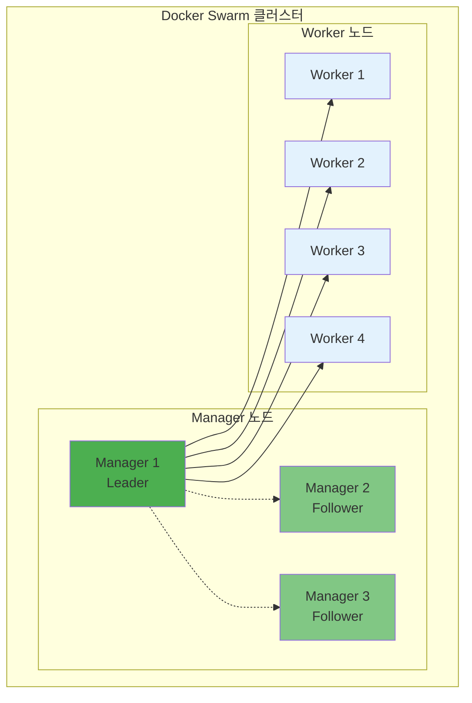
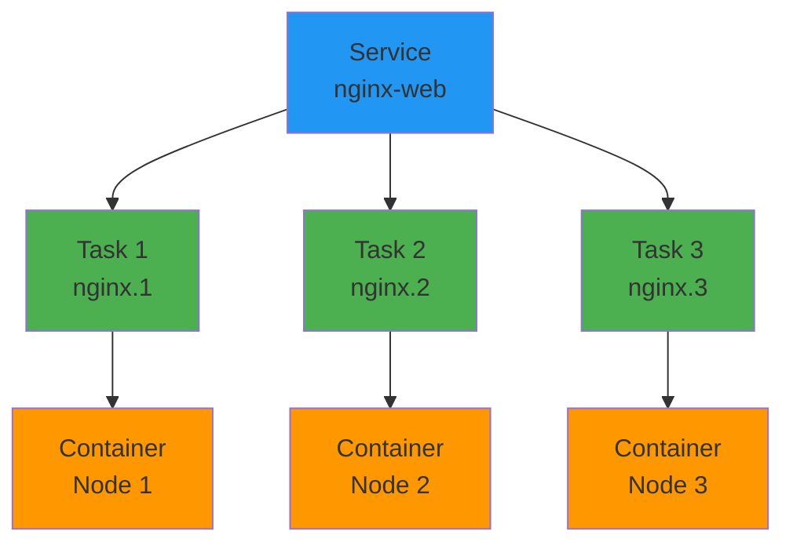

# Week 2 Day 3 Session 1: Docker Swarm 기초

<div align="center">

**🐝 Docker Swarm** • **🎼 오케스트레이션 체험**

*Docker 내장 오케스트레이션으로 클러스터 관리 첫 경험*

</div>

---

## 🕘 세션 정보

**시간**: 09:00-09:50 (50분)  
**목표**: Docker Swarm을 통한 오케스트레이션 기초 체험  
**방식**: 개념 학습 + 실습 체험 + Kubernetes 준비

---

## 🎯 세션 목표

### 📚 학습 목표
- **이해 목표**: Docker Swarm의 기본 개념과 아키텍처 이해
- **적용 목표**: 간단한 클러스터 구성과 서비스 배포 체험
- **협업 목표**: Week 3 Kubernetes 학습을 위한 오케스트레이션 기초 다지기

### 🤔 왜 필요한가? (5분)

**현실 문제 상황**:
- 💼 **오케스트레이션 체험**: Kubernetes 전에 간단한 오케스트레이션 도구로 개념 학습
- 🏠 **일상 비유**: 혼자 일하다가 팀으로 일하는 것의 차이 체험
- 📊 **학습 전략**: 복잡한 Kubernetes 전에 Docker 내장 도구로 부담 없이 시작

---

## 📖 핵심 개념 (35분)

### 🔍 개념 1: Docker Swarm 아키텍처 (12분)

> **정의**: Docker에 내장된 네이티브 클러스터링 및 오케스트레이션 도구

**Swarm 클러스터 구조**:


**핵심 구성 요소**:
- **Manager 노드**: 클러스터 관리, 스케줄링, API 제공
- **Worker 노드**: 실제 컨테이너 실행
- **Raft 합의**: Manager 노드 간 리더 선출 및 상태 동기화
- **Overlay 네트워크**: 노드 간 컨테이너 통신

### 🔍 개념 2: Swarm 서비스와 태스크 (12분)

> **정의**: Swarm에서 애플리케이션을 배포하고 관리하는 단위

**서비스 계층 구조**:


**기본 명령어**:
```bash
# Swarm 클러스터 초기화
docker swarm init --advertise-addr <MANAGER-IP>

# 워커 노드 추가
docker swarm join --token <TOKEN> <MANAGER-IP>:2377

# 서비스 생성
docker service create --name web --replicas 3 --publish 80:80 nginx

# 서비스 확인
docker service ls
docker service ps web

# 서비스 스케일링
docker service scale web=5

# 서비스 업데이트
docker service update --image nginx:alpine web

# 서비스 제거
docker service rm web
```

### 🔍 개념 3: Swarm vs Kubernetes 비교 (11분)

> **정의**: Docker Swarm과 Kubernetes의 특징 비교를 통한 선택 기준 이해

**비교 분석**:
| 구분 | Docker Swarm | Kubernetes |
|------|--------------|------------|
| **학습 곡선** | 쉬움 (Docker 지식 활용) | 어려움 (새로운 개념 많음) |
| **설치/설정** | 간단 (Docker 내장) | 복잡 (별도 설치 필요) |
| **기능 범위** | 기본적 오케스트레이션 | 풍부한 기능과 생태계 |
| **확장성** | 중소규모 적합 | 대규모 엔터프라이즈 |
| **커뮤니티** | Docker 생태계 | CNCF 거대 생태계 |
| **사용 사례** | 간단한 클러스터링 | 복잡한 마이크로서비스 |

**Swarm의 장점**:
- Docker 명령어와 유사한 인터페이스
- 빠른 설정과 간단한 관리
- Docker Compose와 호환성
- 내장 로드 밸런싱

**Swarm의 한계**:
- 제한적인 스케줄링 옵션
- 부족한 모니터링 도구
- 작은 생태계
- 복잡한 네트워킹 제약

**실습 예제**:
```bash
# 1. Swarm 모드 활성화
docker swarm init

# 2. 간단한 웹 서비스 배포
docker service create \
  --name webapp \
  --replicas 3 \
  --publish 8080:80 \
  nginx:alpine

# 3. 서비스 상태 확인
docker service ls
docker service ps webapp

# 4. 로드 밸런싱 테스트
curl http://localhost:8080

# 5. 스케일링 테스트
docker service scale webapp=5
docker service ps webapp

# 6. 롤링 업데이트
docker service update \
  --image nginx:latest \
  --update-delay 10s \
  webapp

# 7. 서비스 로그 확인
docker service logs webapp

# 8. 정리
docker service rm webapp
docker swarm leave --force
```

**Docker Compose vs Swarm Stack**:
```yaml
# docker-compose.yml (Swarm 모드용)
version: '3.8'
services:
  web:
    image: nginx:alpine
    ports:
      - "80:80"
    deploy:
      replicas: 3
      update_config:
        parallelism: 1
        delay: 10s
      restart_policy:
        condition: on-failure
    networks:
      - webnet

  redis:
    image: redis:alpine
    deploy:
      replicas: 1
      placement:
        constraints: [node.role == manager]
    networks:
      - webnet

networks:
  webnet:
    driver: overlay

# 스택 배포
# docker stack deploy -c docker-compose.yml myapp
```

**Swarm 네트워킹**:
```bash
# 오버레이 네트워크 생성
docker network create --driver overlay mynetwork

# 서비스를 특정 네트워크에 연결
docker service create \
  --name web \
  --network mynetwork \
  --replicas 3 \
  nginx:alpine

# 네트워크 정보 확인
docker network ls
docker network inspect mynetwork
```

---

## 💭 함께 생각해보기 (10분)

### 🤝 페어 토론 (5분)

**토론 주제**:
1. **오케스트레이션 체험**: "Swarm을 사용해보니 어떤 점이 편리했나요?"
2. **도구 선택**: "언제 Swarm을, 언제 Kubernetes를 사용하면 좋을까요?"
3. **학습 연결**: "Kubernetes 학습에 도움이 될 것 같은 개념들은?"

### 🎯 전체 공유 (5분)

- **오케스트레이션 이해**: 클러스터 관리의 기본 개념 체득
- **Kubernetes 준비**: Week 3 학습을 위한 기초 다지기

---

## 🔑 핵심 키워드

- **Docker Swarm**: Docker 내장 오케스트레이션 도구
- **Manager Node**: 클러스터 관리 노드
- **Worker Node**: 컨테이너 실행 노드
- **Service**: Swarm에서의 애플리케이션 배포 단위
- **Task**: 서비스의 개별 실행 인스턴스
- **Overlay Network**: 노드 간 컨테이너 통신 네트워크

---

## 📝 세션 마무리

### ✅ 오늘 세션 성과
- [ ] Docker Swarm 기본 개념 이해
- [ ] 간단한 클러스터 구성 체험
- [ ] 서비스 배포와 스케일링 실습
- [ ] Kubernetes와의 차이점 파악

### 🎯 다음 세션 준비
- **주제**: Week 1-2 종합 정리 및 Kubernetes 준비
- **연결**: 오케스트레이션 기초 → Kubernetes 고급 기능

### 🚀 Week 3 Kubernetes 준비
- **개념 연결**: Swarm의 Service → Kubernetes의 Deployment
- **네트워킹**: Overlay Network → Kubernetes Networking
- **스케일링**: Swarm Scale → Kubernetes HPA
- **배포**: Swarm Stack → Kubernetes Manifests

---

<div align="center">

**🐝 Docker Swarm으로 오케스트레이션 첫 경험을 완료했습니다!**

*이제 Week 3 Kubernetes 학습을 위한 준비가 완료되었습니다*

**다음**: [Session 2 - Docker 고급 네트워킹](./session_2.md)

</div>