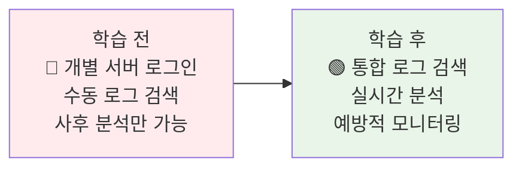
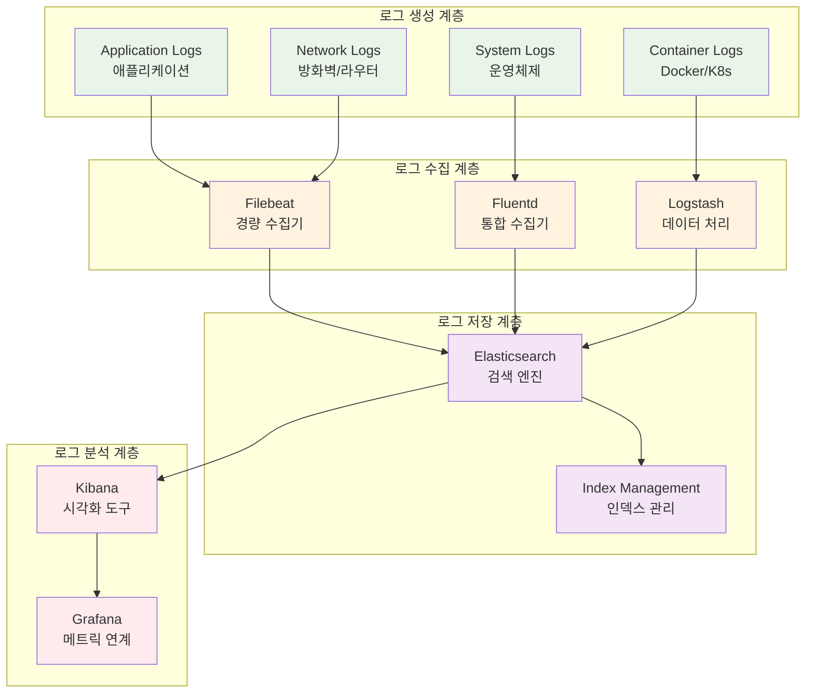
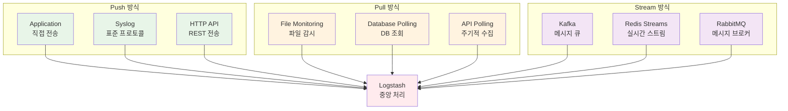
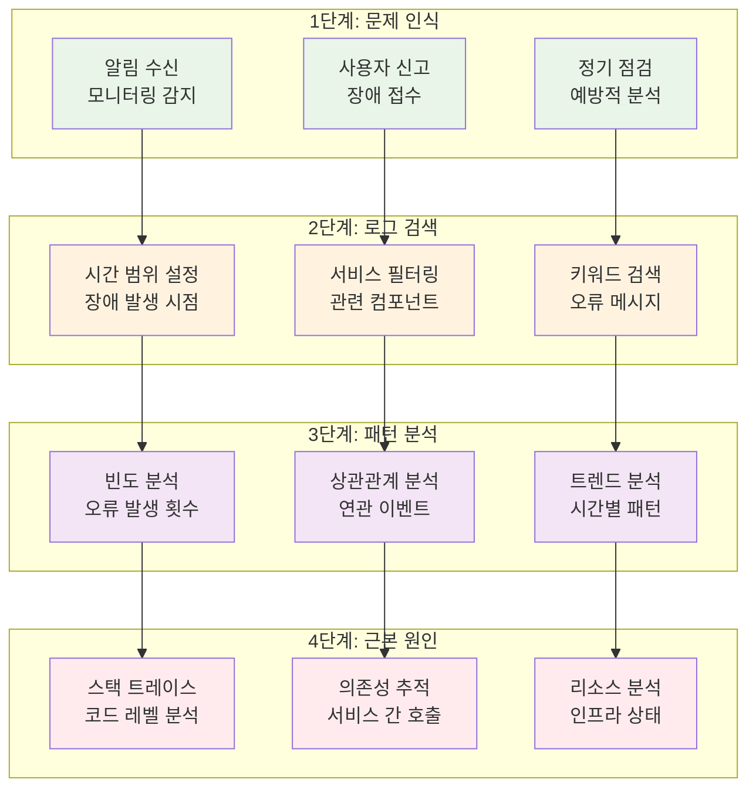

# Week 2 Day 3 Session 2: 로깅 전략 & 중앙화된 로그 관리

<div align="center">

**📝 로그 수집** • **🔍 중앙화 관리** • **🔎 분석 및 검색**

*분산 환경에서의 효과적인 로그 관리와 문제 해결*

</div>

---

## 🕘 세션 정보

**시간**: 10:00-10:50 (50분)  
**목표**: 중앙화된 로그 관리 시스템 구축과 효과적인 로그 분석 방법 학습  
**방식**: 이론 + 실시간 로그 분석 + 문제 해결 시나리오

---

## 🎯 세션 목표

### 📚 학습 목표
- **이해 목표**: ELK Stack 기반 로그 파이프라인 아키텍처 완전 이해
- **적용 목표**: 로그 수집, 파싱, 검색을 통한 문제 해결 능력 습득
- **협업 목표**: 팀별 로그 분석을 통한 장애 원인 파악 경험

### 🤔 왜 필요한가? (5분)

**현실 문제 상황**:
- 💼 **실무 시나리오**: "마이크로서비스 10개 중 어디서 에러가 발생했는지 모르겠어요"
- 🏠 **일상 비유**: 범죄 수사에서 증거를 수집하고 분석하는 과정과 유사
- 📊 **시장 동향**: 분산 시스템 증가로 로그 관리의 복잡성 급증

**학습 전후 비교**:


---

## 📖 핵심 개념 (35분)

### 🔍 개념 1: 로그 관리 아키텍처와 ELK Stack (12분)

> **정의**: 분산된 시스템의 로그를 중앙에서 수집, 저장, 분석할 수 있는 통합 플랫폼

**ELK Stack 구성 요소**:


**각 구성 요소의 역할**:
- **Elasticsearch**: 분산 검색 및 분석 엔진 (JSON 기반 문서 저장)
- **Logstash**: 로그 데이터 수집, 파싱, 변환 및 전송
- **Kibana**: 로그 데이터 시각화 및 대시보드 제공
- **Beats**: 경량 데이터 수집기 (Filebeat, Metricbeat 등)

**실무 적용 사례**:
- **Netflix**: 수백만 건의 로그를 실시간으로 처리하여 사용자 경험 분석
- **Uber**: 글로벌 서비스의 지역별 로그 분석으로 서비스 품질 관리
- **Airbnb**: 예약 시스템의 트랜잭션 로그 분석으로 비즈니스 인사이트 도출

### 🔍 개념 2: 로그 수집 전략과 파싱 기법 (12분)

> **정의**: 다양한 소스의 로그를 효율적으로 수집하고 구조화된 데이터로 변환하는 방법론

**로그 수집 패턴**:


**로그 파싱 및 구조화**:

**1. 일반적인 로그 형식들**:
```bash
# Apache/Nginx 액세스 로그
127.0.0.1 - - [25/Dec/2024:10:00:00 +0000] "GET /api/users HTTP/1.1" 200 1234

# 애플리케이션 로그 (JSON)
{"timestamp":"2024-12-25T10:00:00Z","level":"ERROR","message":"Database connection failed","service":"user-api"}

# 시스템 로그 (Syslog)
Dec 25 10:00:00 server01 kernel: [12345.678] Out of memory: Kill process 1234
```

**2. Logstash 파싱 설정 예시**:
```ruby
# logstash.conf
input {
  beats {
    port => 5044
  }
}

filter {
  if [fields][service] == "nginx" {
    grok {
      match => { "message" => "%{COMBINEDAPACHELOG}" }
    }
    date {
      match => [ "timestamp", "dd/MMM/yyyy:HH:mm:ss Z" ]
    }
  }
  
  if [fields][service] == "app" {
    json {
      source => "message"
    }
  }
}

output {
  elasticsearch {
    hosts => ["elasticsearch:9200"]
    index => "logs-%{+YYYY.MM.dd}"
  }
}
```

**로그 레벨과 분류**:
| 로그 레벨 | 용도 | 보관 기간 | 알림 필요성 |
|-----------|------|-----------|-------------|
| **TRACE** | 상세 디버깅 | 1-3일 | 없음 |
| **DEBUG** | 개발 디버깅 | 1주일 | 없음 |
| **INFO** | 일반 정보 | 1개월 | 없음 |
| **WARN** | 주의 상황 | 3개월 | 선택적 |
| **ERROR** | 오류 발생 | 1년 | 필수 |
| **FATAL** | 치명적 오류 | 영구 | 즉시 |

### 🔍 개념 3: 로그 분석과 문제 해결 방법론 (11분)

> **정의**: 수집된 로그 데이터를 활용하여 시스템 문제를 진단하고 해결하는 체계적 접근법

**로그 분석 워크플로우**:


**Kibana 검색 쿼리 실무 예시**:

**1. 기본 검색 쿼리**:
```bash
# 특정 시간 범위의 에러 로그
level:ERROR AND @timestamp:[2024-12-25T09:00:00 TO 2024-12-25T10:00:00]

# 특정 서비스의 응답 시간이 느린 요청
service:user-api AND response_time:>1000

# 특정 사용자의 활동 로그
user_id:12345 AND (action:login OR action:logout)
```

**2. 집계 및 시각화**:
```bash
# 시간별 에러 발생 건수
GET /logs-*/_search
{
  "aggs": {
    "errors_over_time": {
      "date_histogram": {
        "field": "@timestamp",
        "interval": "1h"
      },
      "aggs": {
        "error_count": {
          "filter": {
            "term": { "level": "ERROR" }
          }
        }
      }
    }
  }
}
```

**문제 해결 시나리오별 접근법**:

**시나리오 1: 응답 시간 급증**
1. **증상 확인**: 응답 시간 메트릭 급증 알림
2. **로그 검색**: `response_time:>1000 AND @timestamp:[now-1h TO now]`
3. **패턴 분석**: 특정 API 엔드포인트에 집중된 느린 응답
4. **근본 원인**: 데이터베이스 쿼리 성능 저하 발견

**시나리오 2: 간헐적 500 에러**
1. **증상 확인**: 에러율 증가 감지
2. **로그 검색**: `status:500 AND service:payment-api`
3. **패턴 분석**: 특정 시간대에 집중된 에러 발생
4. **근본 원인**: 외부 API 타임아웃 설정 문제

**로그 기반 성능 최적화**:
- **슬로우 쿼리 분석**: 데이터베이스 성능 병목 지점 파악
- **API 응답 시간**: 엔드포인트별 성능 분석
- **사용자 행동 패턴**: 비즈니스 로직 최적화 포인트 발견
- **리소스 사용 패턴**: 스케일링 시점 예측

---

## 💭 함께 생각해보기 (10분)

### 🤝 페어 토론 (5분)

**토론 주제**:
1. **로그 전략**: "우리 서비스에서 가장 중요한 로그는 무엇이고, 어떻게 수집할까요?"
2. **장애 대응**: "새벽에 장애 알림을 받았을 때, 로그를 어떤 순서로 확인하시겠어요?"
3. **보안 고려**: "로그에 민감한 정보가 포함되지 않도록 하는 방법은?"

**페어 활동 가이드**:
- 👥 **실무 시나리오**: 구체적인 상황을 가정하여 토론
- 🔄 **경험 공유**: 실제 경험했던 로그 분석 사례 공유
- 📝 **베스트 프랙티스**: 효과적인 로그 관리 방법 정리

### 🎯 전체 공유 (5분)

**인사이트 공유**:
- **창의적 로그 활용**: 로그를 활용한 독특한 문제 해결 사례
- **효율적 검색**: 빠르고 정확한 로그 검색 팁
- **자동화 아이디어**: 로그 분석 자동화 방안

**💡 이해도 체크 질문**:
- ✅ "ELK Stack에서 각 구성 요소의 역할을 설명할 수 있나요?"
- ✅ "로그 레벨별 적절한 사용 시기와 보관 정책을 수립할 수 있나요?"
- ✅ "Kibana에서 복잡한 검색 쿼리를 작성할 수 있나요?"

---

## 🔑 핵심 키워드

### 🆕 새로운 용어
- **ELK Stack**: Elasticsearch, Logstash, Kibana의 조합
- **Beats**: 경량 데이터 수집기 (Filebeat, Metricbeat 등)
- **Grok**: Logstash의 텍스트 파싱 플러그인
- **Index**: Elasticsearch의 데이터 저장 단위

### 🔤 로그 관리 용어
- **Log Aggregation**: 로그 집계 및 중앙화
- **Log Rotation**: 로그 파일 순환 관리
- **Log Retention**: 로그 보관 정책
- **Log Parsing**: 로그 데이터 구조화

### 🔤 검색 및 분석
- **Query DSL**: Elasticsearch 쿼리 언어
- **Aggregation**: 데이터 집계 및 통계
- **Visualization**: 데이터 시각화
- **Dashboard**: 종합 모니터링 대시보드

---

## 📝 세션 마무리

### ✅ 오늘 세션 성과
- **로그 아키텍처**: ELK Stack 기반 중앙화된 로그 관리 시스템 이해
- **수집 전략**: 다양한 로그 소스의 효율적 수집과 파싱 방법
- **분석 방법론**: 체계적인 로그 분석을 통한 문제 해결 프로세스

### 🎯 다음 세션 준비
- **Session 3 연결**: 로그 분석 → Docker Swarm 클러스터 로그 관리
- **실습 준비**: 오후 실습에서 ELK Stack 직접 구축 및 로그 분석
- **심화 학습**: 분산 환경에서의 오케스트레이션과 서비스 관리

### 🔮 실무 적용 계획
- **로그 정책**: 현재 프로젝트의 로그 수집 및 보관 정책 수립
- **검색 최적화**: 효율적인 로그 검색과 분석 워크플로우 구축
- **자동화**: 로그 기반 알림과 자동 대응 시스템 설계

---

<div align="center">

**📊 다음 세션**: [Session 3 - Docker Swarm 기초 & 오케스트레이션 체험](./session_3.md)

**🛠️ 오후 실습**: [Lab 1 - 운영급 모니터링 시스템 구축](./lab_1.md)

</div>