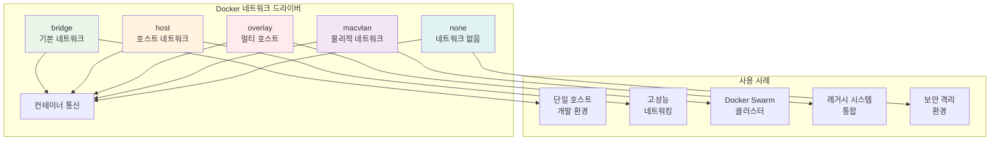
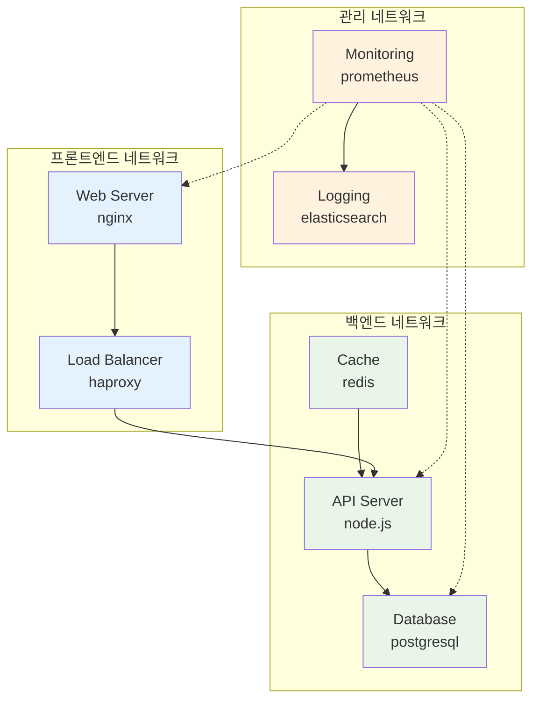
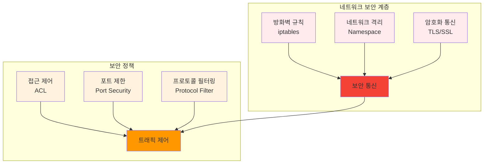

# Week 2 Day 3 Session 2: Docker 고급 네트워킹

<div align="center">

**🌐 고급 네트워킹** • **🔗 컨테이너 통신**

*Docker 네트워킹 심화와 컨테이너 간 통신 완전 정복*

</div>

---

## 🕘 세션 정보

**시간**: 10:00-10:50 (50분)  
**목표**: Docker 고급 네트워킹과 컨테이너 간 통신 방법 완전 이해  
**방식**: 네트워킹 이론 + 실습 + 문제 해결

---

## 🎯 세션 목표

### 📚 학습 목표
- **이해 목표**: Docker 네트워킹 모델과 드라이버별 특징 완전 이해
- **적용 목표**: 복잡한 네트워크 구성과 컨테이너 간 통신 설정 능력
- **협업 목표**: 네트워킹 문제 해결을 위한 팀 협업과 지식 공유

### 🤔 왜 필요한가? (5분)

**현실 문제 상황**:
- 💼 **마이크로서비스**: 여러 컨테이너가 서로 통신해야 하는 복잡한 아키텍처
- 🏠 **일상 비유**: 아파트 단지에서 각 세대가 서로 연결되는 네트워크 구조
- 📊 **실무 필요성**: 프로덕션 환경에서 안전하고 효율적인 컨테이너 통신

---

## 📖 핵심 개념 (35분)

### 🔍 개념 1: Docker 네트워크 드라이버 (12분)

> **정의**: Docker에서 제공하는 다양한 네트워크 드라이버와 각각의 특징 및 사용 사례

**네트워크 드라이버 종류**:


**네트워크 드라이버 상세 비교**:

| 드라이버 | 특징 | 사용 사례 | 장점 | 단점 |
|----------|------|-----------|------|------|
| **bridge** | 기본 네트워크, NAT 사용 | 단일 호스트 개발 | 간단한 설정, 격리성 | 성능 오버헤드 |
| **host** | 호스트 네트워크 직접 사용 | 고성능 요구 애플리케이션 | 최고 성능 | 포트 충돌 위험 |
| **overlay** | 멀티 호스트 네트워킹 | Docker Swarm, 분산 환경 | 확장성, 암호화 | 복잡한 설정 |
| **macvlan** | 물리적 MAC 주소 할당 | 레거시 시스템 통합 | 네이티브 성능 | 네트워크 제약 |
| **none** | 네트워크 비활성화 | 최대 보안 격리 | 완전 격리 | 통신 불가 |

**기본 네트워크 명령어**:
```bash
# 네트워크 목록 확인
docker network ls

# 네트워크 상세 정보
docker network inspect bridge

# 커스텀 네트워크 생성
docker network create --driver bridge my-network

# 컨테이너를 특정 네트워크에 연결
docker run --network my-network nginx

# 실행 중인 컨테이너를 네트워크에 연결
docker network connect my-network container-name

# 네트워크에서 컨테이너 분리
docker network disconnect my-network container-name
```

### 🔍 개념 2: 고급 네트워크 구성 (12분)

> **정의**: 복잡한 네트워크 토폴로지와 고급 네트워킹 기능 구현

**멀티 네트워크 아키텍처**:


**고급 네트워크 설정 예시**:

**1. 서브넷과 IP 범위 지정**:
```bash
# 커스텀 서브넷으로 네트워크 생성
docker network create \
  --driver bridge \
  --subnet=172.20.0.0/16 \
  --ip-range=172.20.240.0/20 \
  --gateway=172.20.0.1 \
  custom-network

# 고정 IP로 컨테이너 실행
docker run --network custom-network --ip 172.20.0.10 nginx
```

**2. 네트워크 별칭과 DNS**:
```bash
# 네트워크 별칭 설정
docker run --network my-network --network-alias web nginx
docker run --network my-network --network-alias api node:alpine

# DNS 해석 테스트
docker run --network my-network alpine nslookup web
```

**3. 포트 매핑과 노출**:
```bash
# 특정 인터페이스에 포트 바인딩
docker run -p 127.0.0.1:8080:80 nginx

# 포트 범위 매핑
docker run -p 8000-8010:8000-8010 myapp

# UDP 포트 매핑
docker run -p 53:53/udp dns-server
```

### 🔍 개념 3: 네트워크 보안과 격리 (11분)

> **정의**: 컨테이너 네트워크의 보안 강화와 트래픽 격리 방법

**네트워크 보안 계층**:


**네트워크 보안 실습**:

**1. 네트워크 격리 구현**:
```bash
# 격리된 네트워크 생성
docker network create --internal secure-network

# 외부 접근 차단된 컨테이너 실행
docker run --network secure-network --name secure-app alpine

# 내부 통신만 허용하는 구조
docker run --network secure-network --name secure-db postgres
```

**2. 방화벽 규칙 설정**:
```bash
# Docker 방화벽 규칙 확인
sudo iptables -L DOCKER

# 특정 포트만 허용
sudo iptables -I DOCKER-USER -p tcp --dport 80 -j ACCEPT
sudo iptables -I DOCKER-USER -p tcp --dport 443 -j ACCEPT
sudo iptables -I DOCKER-USER -j DROP
```

**3. TLS 암호화 통신**:
```yaml
# docker-compose.yml with TLS
version: '3.8'
services:
  web:
    image: nginx
    volumes:
      - ./ssl:/etc/nginx/ssl
    ports:
      - "443:443"
    environment:
      - SSL_CERT=/etc/nginx/ssl/cert.pem
      - SSL_KEY=/etc/nginx/ssl/key.pem
    networks:
      - secure-net

  app:
    image: myapp
    networks:
      - secure-net
    environment:
      - TLS_ENABLED=true

networks:
  secure-net:
    driver: bridge
    driver_opts:
      encrypted: "true"
```

**네트워크 문제 해결 도구**:

**1. 네트워크 진단 명령어**:
```bash
# 컨테이너 네트워크 정보 확인
docker exec container-name ip addr show
docker exec container-name ip route show

# 네트워크 연결 테스트
docker exec container-name ping target-container
docker exec container-name telnet target-host 80

# DNS 해석 테스트
docker exec container-name nslookup hostname
docker exec container-name dig hostname
```

**2. 네트워크 모니터링**:
```bash
# 네트워크 트래픽 모니터링
docker exec container-name netstat -tuln
docker exec container-name ss -tuln

# 패킷 캡처
docker exec container-name tcpdump -i eth0

# 네트워크 성능 테스트
docker exec container-name iperf3 -c target-host
```

**3. 문제 해결 시나리오**:
```bash
#!/bin/bash
# network-troubleshoot.sh

echo "=== Docker Network Troubleshooting ==="

# 1. 네트워크 목록 확인
echo "1. Available Networks:"
docker network ls

# 2. 컨테이너 네트워크 상태
echo -e "\n2. Container Network Status:"
docker ps --format "table {{.Names}}\t{{.Networks}}\t{{.Ports}}"

# 3. 네트워크 상세 정보
echo -e "\n3. Network Details:"
for network in $(docker network ls --format "{{.Name}}" | grep -v "bridge\|host\|none"); do
    echo "Network: $network"
    docker network inspect $network --format "{{.IPAM.Config}}"
done

# 4. 컨테이너 간 연결 테스트
echo -e "\n4. Container Connectivity Test:"
containers=$(docker ps --format "{{.Names}}")
for container in $containers; do
    echo "Testing connectivity from $container:"
    docker exec $container ping -c 1 google.com > /dev/null 2>&1
    if [ $? -eq 0 ]; then
        echo "  ✓ Internet connectivity: OK"
    else
        echo "  ✗ Internet connectivity: FAILED"
    fi
done

# 5. 포트 바인딩 확인
echo -e "\n5. Port Bindings:"
docker ps --format "table {{.Names}}\t{{.Ports}}"
```

---

## 💭 함께 생각해보기 (10분)

### 🤝 페어 토론 (5분)

**토론 주제**:
1. **네트워크 설계**: "마이크로서비스 아키텍처에서 어떻게 네트워크를 설계하시겠어요?"
2. **보안 고려사항**: "컨테이너 네트워크에서 가장 중요한 보안 요소는 무엇일까요?"
3. **성능 최적화**: "네트워크 성능을 향상시키기 위한 방법은?"

### 🎯 전체 공유 (5분)

- **네트워크 아키텍처**: 효과적인 컨테이너 네트워크 설계 방안
- **문제 해결**: 네트워킹 문제 진단과 해결 경험 공유

---

## 🔑 핵심 키워드

- **Bridge Network**: 기본 브리지 네트워크
- **Overlay Network**: 멀티 호스트 오버레이 네트워크
- **Network Namespace**: 네트워크 네임스페이스
- **Port Mapping**: 포트 매핑
- **Network Isolation**: 네트워크 격리
- **DNS Resolution**: DNS 해석

---

## 📝 세션 마무리

### ✅ 오늘 세션 성과
- [ ] Docker 네트워크 드라이버별 특징 완전 이해
- [ ] 고급 네트워크 구성과 관리 방법 습득
- [ ] 네트워크 보안과 격리 기법 학습
- [ ] 네트워크 문제 진단과 해결 능력 개발

### 🎯 다음 세션 준비
- **주제**: 모니터링 & 관측성
- **연결**: 네트워크 모니터링과 성능 분석

### 🚀 실무 적용 포인트
- **마이크로서비스**: 서비스 간 안전한 통신 구현
- **보안 강화**: 네트워크 레벨에서의 보안 정책 적용
- **성능 최적화**: 네트워크 병목 지점 식별과 개선
- **문제 해결**: 네트워킹 이슈의 체계적 진단과 해결

---

<div align="center">

**🌐 Docker 고급 네트워킹을 완전히 마스터했습니다!**

*이제 복잡한 컨테이너 네트워크도 자유자재로 구성할 수 있습니다*

**다음**: [Session 3 - 모니터링 & 관측성](./session_3.md)

</div>