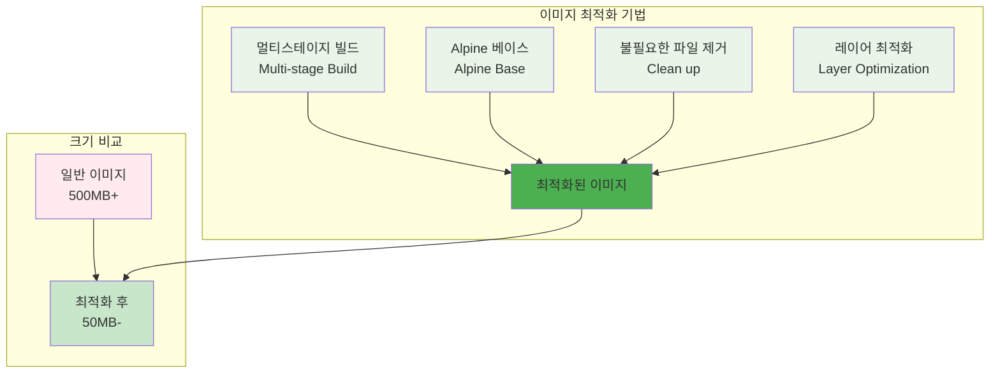
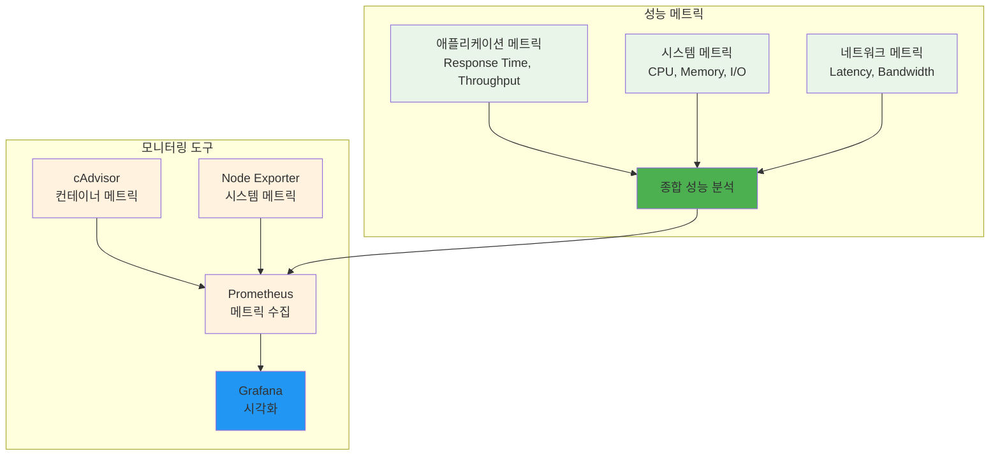
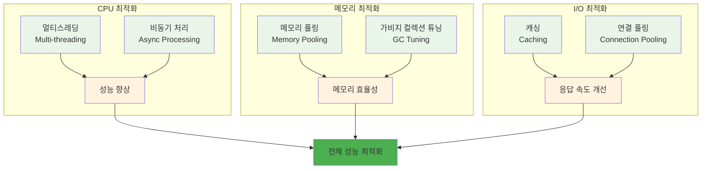

# Week 2 Day 3 Session 2: 이미지 최적화 & 성능 튜닝

<div align="center">
**⚡ 성능 최적화** • **📊 성능 모니터링**
*컨테이너 이미지 최적화와 성능 튜닝 기법 완전 습득*
</div>

---

## 🕘 세션 정보
**시간**: 10:00-10:50 (50분)
**목표**: 컨테이너 이미지 최적화와 성능 튜닝 기법 완전 습득
**방식**: 이론 강의 + 페어 토론

## 🎯 세션 목표
### 📚 학습 목표
- **이해 목표**: 컨테이너 이미지 최적화와 성능 튜닝 기법 완전 이해
- **적용 목표**: 실무에서 사용할 수 있는 최적화 도구와 기법 습득
- **협업 목표**: 개별 학습 후 경험 공유 및 질의응답

## 📖 핵심 개념 (35분)

### 🔍 개념 1: 이미지 크기 최적화 (12분)
> **정의**: 컨테이너 이미지의 크기를 최소화하여 배포 속도와 저장 비용을 개선하는 기법

**이미지 최적화 전략**:


**멀티스테이지 빌드 예시**:
```dockerfile
# 빌드 스테이지
FROM node:18 AS builder
WORKDIR /app
COPY package*.json ./
RUN npm ci --only=production

# 프로덕션 스테이지
FROM node:18-alpine
WORKDIR /app
COPY --from=builder /app/node_modules ./node_modules
COPY . .
RUN npm run build && \
    npm prune --production && \
    rm -rf src/ tests/ *.md

USER node
EXPOSE 3000
CMD ["node", "dist/server.js"]
```

**이미지 크기 분석**:
```bash
# 이미지 크기 확인
docker images --format "table {{.Repository}}\t{{.Tag}}\t{{.Size}}"

# 이미지 레이어 분석
docker history myapp:latest

# dive 도구로 상세 분석
dive myapp:latest
```

### 🔍 개념 2: 성능 모니터링과 프로파일링 (12분)
> **정의**: 컨테이너 애플리케이션의 성능을 측정하고 병목 지점을 식별하는 방법

**성능 메트릭 계층**:


**성능 모니터링 설정**:
```yaml
# docker-compose.monitoring.yml
version: '3.8'
services:
  app:
    image: myapp:latest
    deploy:
      resources:
        limits:
          cpus: '0.5'
          memory: 512M
        reservations:
          cpus: '0.25'
          memory: 256M
    
  cadvisor:
    image: gcr.io/cadvisor/cadvisor:latest
    ports:
      - "8080:8080"
    volumes:
      - /:/rootfs:ro
      - /var/run:/var/run:ro
      - /sys:/sys:ro
      - /var/lib/docker/:/var/lib/docker:ro
    
  prometheus:
    image: prom/prometheus:latest
    ports:
      - "9090:9090"
    volumes:
      - ./prometheus.yml:/etc/prometheus/prometheus.yml
```

### 🔍 개념 3: 리소스 최적화 (11분)
> **정의**: CPU, 메모리, 네트워크 등 시스템 리소스를 효율적으로 사용하는 최적화 기법

**리소스 최적화 전략**:


**리소스 제한 설정**:
```bash
# CPU 제한 (0.5 코어)
docker run --cpus="0.5" myapp:latest

# 메모리 제한 (512MB)
docker run --memory="512m" myapp:latest

# 복합 리소스 제한
docker run \
  --cpus="0.5" \
  --memory="512m" \
  --memory-swap="1g" \
  myapp:latest
```

**성능 최적화 실무 기법**:

**1. JVM 최적화 (Java 애플리케이션)**:
```dockerfile
FROM openjdk:11-jre-slim

# JVM 튜닝 파라미터
ENV JAVA_OPTS="-Xms512m -Xmx1024m -XX:+UseG1GC -XX:MaxGCPauseMillis=200 -XX:+UseStringDeduplication"

# 애플리케이션 설정
COPY app.jar /app/
WORKDIR /app

# 비특권 사용자
RUN adduser --disabled-password --gecos '' appuser
USER appuser

# 성능 모니터링 포트 노출
EXPOSE 8080 9090

CMD ["sh", "-c", "java $JAVA_OPTS -jar app.jar"]
```

**2. Node.js 최적화**:
```dockerfile
FROM node:18-alpine AS builder

# 빌드 최적화
WORKDIR /app
COPY package*.json ./
RUN npm ci --only=production && npm cache clean --force

# 소스 복사 및 빌드
COPY . .
RUN npm run build

# 프로덕션 스테이지
FROM node:18-alpine
WORKDIR /app

# Node.js 성능 튜닝
ENV NODE_ENV=production
ENV NODE_OPTIONS="--max-old-space-size=1024 --optimize-for-size"

# 필요한 파일만 복사
COPY --from=builder /app/dist ./dist
COPY --from=builder /app/node_modules ./node_modules
COPY package*.json ./

# 비특권 사용자
RUN addgroup -g 1001 -S nodejs && adduser -S nextjs -u 1001
USER nextjs

EXPOSE 3000
CMD ["node", "dist/server.js"]
```

**3. 데이터베이스 연결 최적화**:
```javascript
// 연결 풀 설정 예시
const mysql = require('mysql2/promise');

const pool = mysql.createPool({
  host: process.env.DB_HOST,
  user: process.env.DB_USER,
  password: process.env.DB_PASSWORD,
  database: process.env.DB_NAME,
  connectionLimit: 20,        // 최대 연결 수
  acquireTimeout: 60000,      // 연결 획득 타임아웃
  timeout: 60000,             // 쿼리 타임아웃
  reconnect: true,            // 자동 재연결
  idleTimeout: 300000,        // 유휴 연결 타임아웃
});

// 캐싱 전략
const Redis = require('redis');
const redis = Redis.createClient({
  host: process.env.REDIS_HOST,
  port: process.env.REDIS_PORT,
  retryDelayOnFailover: 100,
  maxRetriesPerRequest: 3,
});
```

**4. 성능 벤치마크 자동화**:
```bash
#!/bin/bash
# performance-benchmark.sh

APP_URL="http://localhost:8080"
RESULT_DIR="./benchmark-results"
mkdir -p $RESULT_DIR

echo "Starting performance benchmark..."

# 1. 기본 로드 테스트
echo "Running basic load test..."
ab -n 10000 -c 100 -g "$RESULT_DIR/basic-load.dat" $APP_URL/ > "$RESULT_DIR/basic-load.txt"

# 2. 스트레스 테스트
echo "Running stress test..."
ab -n 50000 -c 500 -g "$RESULT_DIR/stress-test.dat" $APP_URL/ > "$RESULT_DIR/stress-test.txt"

# 3. 지속성 테스트
echo "Running endurance test..."
ab -t 300 -c 50 -g "$RESULT_DIR/endurance.dat" $APP_URL/ > "$RESULT_DIR/endurance.txt"

# 4. 리소스 모니터링
echo "Monitoring resources during test..."
docker stats --format "table {{.Container}}\t{{.CPUPerc}}\t{{.MemUsage}}\t{{.NetIO}}" \
  --no-stream > "$RESULT_DIR/resource-usage.txt"

# 5. 결과 분석
echo "Analyzing results..."
python3 << EOF
import json
import re

# 결과 파싱 및 분석
with open('$RESULT_DIR/basic-load.txt', 'r') as f:
    content = f.read()
    
# 주요 메트릭 추출
rps_match = re.search(r'Requests per second:\s+([\d.]+)', content)
total_time_match = re.search(r'Time taken for tests:\s+([\d.]+)', content)
mean_time_match = re.search(r'Time per request:\s+([\d.]+).*\(mean\)', content)

if rps_match and total_time_match and mean_time_match:
    print(f"Performance Summary:")
    print(f"- Requests per second: {rps_match.group(1)}")
    print(f"- Total time: {total_time_match.group(1)} seconds")
    print(f"- Mean response time: {mean_time_match.group(1)} ms")
EOF

echo "Benchmark completed. Results saved in $RESULT_DIR"
```

## 💭 함께 생각해보기 (15분)

### 🤝 페어 토론 (10분)
**토론 주제**:
1. **최적화 우선순위**: "이미지 크기, CPU, 메모리 중 어떤 것을 먼저 최적화해야 할까요?"
2. **성능 vs 안정성**: "성능 최적화와 시스템 안정성 사이의 균형점은?"
3. **모니터링 전략**: "어떤 메트릭을 가장 중요하게 모니터링해야 할까요?"

### 🎯 전체 공유 (5분)
- **최적화 경험**: 성능 최적화 경험과 효과적인 방법
- **도구 활용**: 성능 모니터링 도구의 실무 활용 방안

## 🔑 핵심 키워드
- **Multi-stage Build**: 멀티스테이지 빌드
- **Alpine Linux**: 경량 리눅스 배포판
- **Layer Optimization**: 레이어 최적화
- **Resource Limits**: 리소스 제한
- **Performance Profiling**: 성능 프로파일링

## 📝 세션 마무리
### ✅ 오늘 세션 성과
- 이미지 최적화 기법 완전 습득
- 성능 모니터링 도구와 방법 학습
- 리소스 최적화 전략 이해

### 🎯 다음 세션 준비
- **Session 3**: 모니터링 & 관측성
- **연결**: 성능 최적화와 모니터링의 통합

---

**다음**: [Session 3 - 모니터링 & 관측성](./session_3.md)