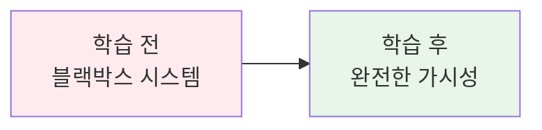
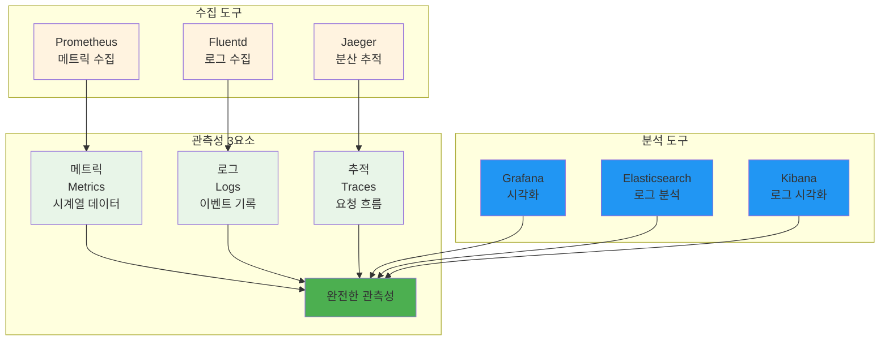
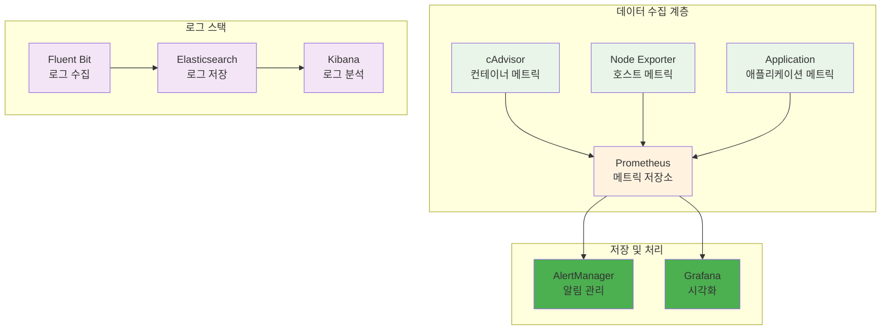
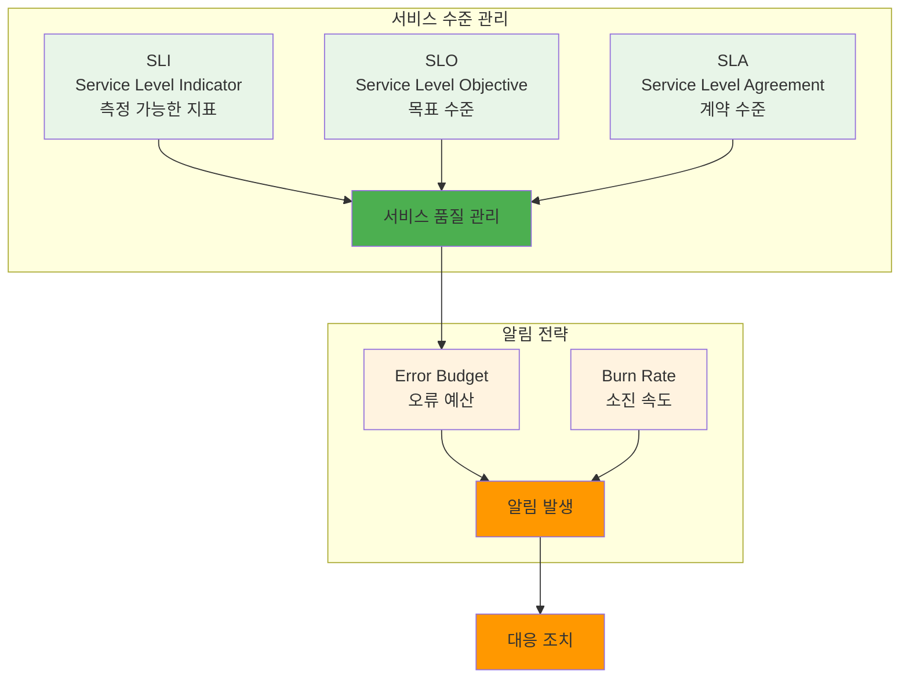

# Week 2 Day 3 Session 3: 모니터링 & 관측성

<div align="center">

**📊 모니터링** • **🔍 관측성** • **🚨 알림 시스템**

*컨테이너 환경에서의 포괄적인 관측성 구축과 운영 모니터링*

</div>

---

## 🕘 세션 정보
**시간**: 11:00-11:50 (50분)
**목표**: 컨테이너 환경에서의 포괄적인 관측성 구축 방법 이해
**방식**: 이론 학습 + 실습 예제 + 팀 토론

## 🎯 세션 목표
### 📚 학습 목표
- **이해 목표**: 컨테이너 환경에서의 포괄적인 관측성 구축 방법 이해
- **적용 목표**: 실무에서 사용할 수 있는 모니터링 시스템 구축 능력 습득
- **협업 목표**: 팀원들과 관측성 전략 및 알림 체계 설계 토론

### 🤔 왜 필요한가? (5분)

**현실 문제 상황**:
- 💼 **장애 대응**: 문제 발생 시 원인 파악이 어려운 블랙박스 상황
- 🏠 **일상 비유**: 계기판 없는 자동차 운전과 같은 위험
- 📊 **비즈니스 영향**: 서비스 장애로 인한 매출 손실과 고객 이탈

**학습 전후 비교**:


## 📖 핵심 개념 (35분)

### 🔍 개념 1: 관측성의 3요소 (12분)
> **정의**: 시스템의 내부 상태를 외부에서 관찰할 수 있게 하는 메트릭, 로그, 추적의 통합

**관측성 아키텍처**:


**각 요소의 역할**:
- **메트릭**: 시스템 성능 지표 (CPU, 메모리, 응답시간)
- **로그**: 애플리케이션 이벤트와 오류 정보
- **추적**: 분산 시스템에서의 요청 흐름 추적

**메트릭 수집 예시**:
```yaml
# prometheus.yml
global:
  scrape_interval: 15s

scrape_configs:
  - job_name: 'cadvisor'
    static_configs:
      - targets: ['cadvisor:8080']
  
  - job_name: 'node-exporter'
    static_configs:
      - targets: ['node-exporter:9100']
  
  - job_name: 'app'
    static_configs:
      - targets: ['app:3000']
    metrics_path: '/metrics'
```

### 🔍 개념 2: 컨테이너 모니터링 스택 (12분)
> **정의**: 컨테이너 환경에 특화된 모니터링 도구들의 통합 스택

**CNCF 모니터링 스택**:


**모니터링 스택 구성**:
```yaml
# monitoring-stack.yml
version: '3.8'
services:
  prometheus:
    image: prom/prometheus:latest
    ports:
      - "9090:9090"
    volumes:
      - ./prometheus.yml:/etc/prometheus/prometheus.yml
      - ./alerts.yml:/etc/prometheus/alerts.yml
    command:
      - '--config.file=/etc/prometheus/prometheus.yml'
      - '--storage.tsdb.path=/prometheus'
      - '--web.enable-lifecycle'
    
  grafana:
    image: grafana/grafana:latest
    ports:
      - "3001:3000"
    environment:
      - GF_SECURITY_ADMIN_PASSWORD=admin
    volumes:
      - grafana-data:/var/lib/grafana
      - ./grafana/dashboards:/etc/grafana/provisioning/dashboards
      - ./grafana/datasources:/etc/grafana/provisioning/datasources

  cadvisor:
    image: gcr.io/cadvisor/cadvisor:latest
    ports:
      - "8080:8080"
    volumes:
      - /:/rootfs:ro
      - /var/run:/var/run:ro
      - /sys:/sys:ro
      - /var/lib/docker/:/var/lib/docker:ro

volumes:
  grafana-data:
```

### 🔍 개념 3: 알림과 SLI/SLO (11분)
> **정의**: 서비스 수준 지표와 목표를 기반으로 한 효과적인 알림 체계

**SLI/SLO 프레임워크**:


**SLI/SLO 예시**:
```yaml
# SLI 정의
availability_sli: |
  sum(rate(http_requests_total{status!~"5.."}[5m])) /
  sum(rate(http_requests_total[5m]))

latency_sli: |
  histogram_quantile(0.95, 
    sum(rate(http_request_duration_seconds_bucket[5m])) by (le)
  )

# SLO 목표
slo_targets:
  availability: 99.9%  # 99.9% 가용성
  latency_p95: 200ms   # 95% 요청이 200ms 이내
```

**알림 규칙 예시**:
```yaml
# alerting.yml
groups:
- name: slo_alerts
  rules:
  - alert: HighErrorRate
    expr: |
      (
        sum(rate(http_requests_total{status=~"5.."}[5m])) /
        sum(rate(http_requests_total[5m]))
      ) > 0.01
    for: 5m
    labels:
      severity: critical
    annotations:
      summary: "High error rate detected"
      description: "Error rate is {{ $value | humanizePercentage }}"
  
  - alert: HighLatency
    expr: |
      histogram_quantile(0.95,
        sum(rate(http_request_duration_seconds_bucket[5m])) by (le)
      ) > 0.2
    for: 10m
    labels:
      severity: warning
    annotations:
      summary: "High latency detected"
      description: "95th percentile latency is {{ $value }}s"
```

## 💭 함께 생각해보기 (10분)

**🤝 페어 토론** (5분):
**토론 주제**:
1. **관측성 우선순위**: "메트릭, 로그, 추적 중 어떤 것부터 구축해야 할까요?"
2. **알림 피로도**: "너무 많은 알림으로 인한 피로도를 어떻게 줄일까요?"
3. **SLO 설정**: "우리 서비스에 적합한 SLO는 어떻게 설정해야 할까요?"

**페어 활동 가이드**:
- 👥 **경험 공유**: 모니터링 시스템 구축 경험 공유
- 🔄 **문제 해결**: 장애 상황에서의 모니터링 활용 경험
- 📝 **전략 수립**: 효과적인 관측성 전략 토론

**🎯 전체 공유** (5분):
- **모니터링 경험**: 효과적인 모니터링 구축 경험
- **도구 선택**: 조직 규모에 맞는 모니터링 도구 선택 기준
- **실습 연결**: 오후 실습에서 구축할 모니터링 시스템 계획

**💡 이해도 체크 질문**:
- ✅ "관측성 3요소의 역할을 설명할 수 있나요?"
- ✅ "SLI와 SLO의 차이점을 이해했나요?"
- ✅ "효과적인 알림 전략을 수립할 수 있나요?"

## 🔑 핵심 키워드

### 🔤 기본 용어
- **Observability**: 관측성
- **SLI (Service Level Indicator)**: 서비스 수준 지표
- **SLO (Service Level Objective)**: 서비스 수준 목표
- **SLA (Service Level Agreement)**: 서비스 수준 계약

### 🔤 기술 용어
- **Time Series**: 시계열 데이터
- **Distributed Tracing**: 분산 추적
- **Error Budget**: 오류 예산
- **Burn Rate**: 예산 소진 속도

### 🔤 도구 및 플랫폼
- **Prometheus**: 메트릭 수집 및 저장
- **Grafana**: 시각화 및 대시보드
- **AlertManager**: 알림 관리
- **Jaeger**: 분산 추적 시스템

## 📝 세션 마무리
### ✅ 오늘 세션 성과
- 관측성 3요소 완전 이해
- 컨테이너 모니터링 스택 구성 방법 학습
- SLI/SLO 기반 알림 시스템 설계 능력 습득

### 🎯 실습 연결
- **오후 실습**: 보안 & 최적화 통합 실습
- **모니터링 구축**: Prometheus + Grafana 스택 구성
- **알림 설정**: 실제 알림 규칙 작성 및 테스트

---

<div align="center">

**📊 완전한 관측성** • **🔍 실시간 모니터링** • **🚨 스마트 알림**

*컨테이너 환경의 포괄적인 관측성 구축 방법을 완전히 마스터했습니다*

</div>