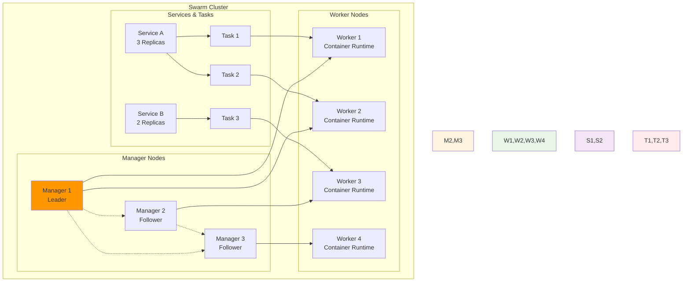
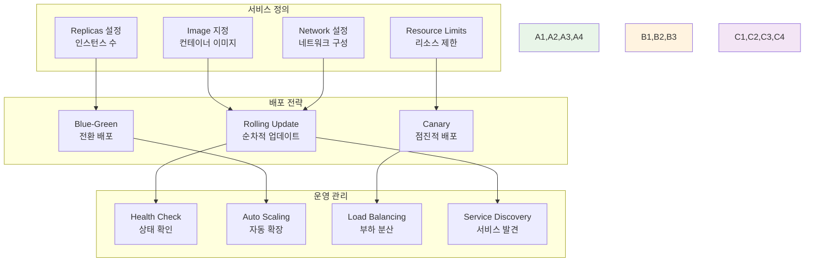
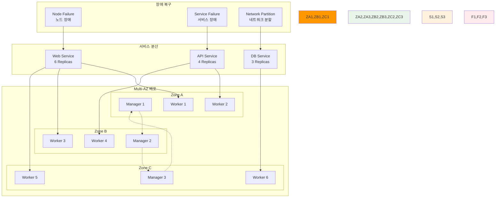

# Week 2 Day 3 Session 3: Docker Swarm 기초 & 오케스트레이션 체험

<div align="center">

**🐳 Docker Swarm** • **🔄 서비스 관리** • **🏗️ 클러스터 운영**

*컨테이너 오케스트레이션의 첫걸음과 분산 시스템 관리*

</div>

---

## 🕘 세션 정보

**시간**: 11:00-11:50 (50분)  
**목표**: Docker Swarm을 통한 컨테이너 오케스트레이션 기초 이해와 실습  
**방식**: 이론 + 라이브 데모 + 클러스터 체험

---

## 🎯 세션 목표

### 📚 학습 목표
- **이해 목표**: Docker Swarm 아키텍처와 오케스트레이션 개념 완전 이해
- **적용 목표**: 멀티 노드 클러스터 구성과 서비스 배포 능력 습득
- **협업 목표**: 팀별 클러스터 구성과 고가용성 서비스 운영 경험

### 🤔 왜 필요한가? (5분)

**현실 문제 상황**:
- 💼 **실무 시나리오**: "서버 한 대가 다운되면 전체 서비스가 중단되어요"
- 🏠 **일상 비유**: 혼자 일하다가 팀으로 협업하게 되는 상황과 유사
- 📊 **시장 동향**: 마이크로서비스와 클라우드 네이티브 아키텍처 필수 요소

**학습 전후 비교**:


---

## 📖 핵심 개념 (35분)

### 🔍 개념 1: Docker Swarm 아키텍처와 핵심 개념 (12분)

> **정의**: Docker의 네이티브 클러스터링 및 오케스트레이션 도구로, 여러 Docker 호스트를 하나의 가상 Docker 호스트로 관리

**Swarm 클러스터 아키텍처**:


**핵심 구성 요소**:
- **Manager Node**: 클러스터 상태 관리, 스케줄링, API 제공
- **Worker Node**: 컨테이너 실행 전용 노드
- **Service**: 원하는 상태를 정의하는 추상화 계층
- **Task**: 실제 컨테이너 인스턴스
- **Raft Consensus**: Manager 노드 간 상태 동기화 알고리즘

**Swarm vs 단일 Docker 비교**:
| 구분 | 단일 Docker | Docker Swarm |
|------|-------------|--------------|
| **확장성** | 수직 확장만 가능 | 수평 확장 가능 |
| **가용성** | 단일 장애점 | 고가용성 |
| **배포** | 수동 배포 | 자동 배포/롤백 |
| **로드밸런싱** | 외부 도구 필요 | 내장 로드밸런서 |
| **서비스 디스커버리** | 수동 설정 | 자동 서비스 발견 |
| **스케일링** | 수동 조정 | 선언적 스케일링 |

### 🔍 개념 2: 서비스 관리와 배포 전략 (12분)

> **정의**: Swarm에서 애플리케이션을 서비스 단위로 관리하고 다양한 배포 전략을 통해 안정적으로 운영하는 방법

**서비스 생명주기 관리**:


**서비스 배포 명령어 예시**:

**1. 기본 서비스 생성**:
```bash
# 웹 서비스 배포 (3개 복제본)
docker service create \
  --name web-service \
  --replicas 3 \
  --publish 80:80 \
  --constraint 'node.role==worker' \
  nginx:alpine

# 데이터베이스 서비스 배포 (단일 인스턴스)
docker service create \
  --name db-service \
  --replicas 1 \
  --mount type=volume,source=db-data,target=/var/lib/mysql \
  --env MYSQL_ROOT_PASSWORD=secret \
  --constraint 'node.labels.storage==ssd' \
  mysql:8.0
```

**2. 서비스 업데이트 및 롤백**:
```bash
# 롤링 업데이트 (이미지 버전 변경)
docker service update \
  --image nginx:1.21 \
  --update-delay 30s \
  --update-parallelism 1 \
  web-service

# 스케일링 (복제본 수 변경)
docker service scale web-service=5

# 롤백 (이전 버전으로 복구)
docker service rollback web-service
```

**배포 전략별 특징**:

**Rolling Update (기본값)**:
- **장점**: 무중단 배포, 점진적 적용
- **단점**: 배포 시간이 오래 걸림
- **적용**: 안정성이 중요한 프로덕션 환경

**Blue-Green 배포**:
- **장점**: 빠른 전환, 쉬운 롤백
- **단점**: 2배의 리소스 필요
- **적용**: 리소스 여유가 있는 중요한 서비스

**Canary 배포**:
- **장점**: 위험 최소화, 점진적 검증
- **단점**: 복잡한 설정, 모니터링 필요
- **적용**: 새로운 기능이나 대규모 변경

### 🔍 개념 3: 고가용성과 장애 복구 메커니즘 (11분)

> **정의**: Swarm 클러스터에서 노드나 서비스 장애 시 자동으로 복구하여 서비스 연속성을 보장하는 시스템

**고가용성 아키텍처 설계**:


**장애 복구 시나리오와 대응**:

**시나리오 1: Worker 노드 장애**
```bash
# 장애 감지 및 자동 대응
1. Health Check 실패 감지 (30초 간격)
2. 해당 노드의 Task들을 다른 노드로 재스케줄링
3. 서비스 복제본 수 유지
4. 로드밸런서에서 자동 제외

# 수동 노드 제거 (복구 불가능한 경우)
docker node update --availability drain node-2
docker node rm node-2
```

**시나리오 2: Manager 노드 장애**
```bash
# Raft Consensus를 통한 자동 리더 선출
1. Leader Manager 장애 감지
2. 남은 Manager들이 새로운 Leader 선출
3. 클러스터 상태 정보 동기화
4. API 서비스 지속 제공

# Manager 노드 복구
docker swarm join-token manager  # 새 토큰 생성
# 새 노드에서 Manager로 조인
```

**시나리오 3: 서비스 장애**
```bash
# 자동 재시작 및 복구
1. Container Health Check 실패
2. 해당 Task 자동 재시작
3. 재시작 실패 시 다른 노드에서 새 Task 생성
4. 서비스 가용성 유지

# 서비스 상태 확인
docker service ps web-service --no-trunc
docker service logs web-service
```

**고가용성 베스트 프랙티스**:
- **Manager 노드**: 홀수 개 (3, 5, 7개) 권장
- **Zone 분산**: 여러 가용 영역에 노드 분산 배치
- **Health Check**: 적절한 헬스체크 설정
- **Resource Limits**: 리소스 제한으로 노드 과부하 방지
- **Backup**: 정기적인 Swarm 상태 백업

**모니터링 및 알림**:
```bash
# 클러스터 상태 모니터링
docker node ls                    # 노드 상태 확인
docker service ls                 # 서비스 상태 확인
docker system events             # 실시간 이벤트 모니터링

# Prometheus 메트릭 수집
docker service create \
  --name prometheus \
  --publish 9090:9090 \
  --mount type=bind,source=/var/run/docker.sock,target=/var/run/docker.sock \
  prom/prometheus
```

---

## 💭 함께 생각해보기 (10분)

### 🤝 페어 토론 (5분)

**토론 주제**:
1. **클러스터 설계**: "3개 서버로 웹 서비스를 운영한다면 어떻게 클러스터를 구성하시겠어요?"
2. **장애 대응**: "새벽에 서버 한 대가 다운되었을 때, Swarm이 어떻게 대응할까요?"
3. **배포 전략**: "중요한 결제 서비스를 업데이트할 때 어떤 배포 전략을 선택하시겠어요?"

**페어 활동 가이드**:
- 👥 **실무 관점**: 실제 운영 환경을 가정한 토론
- 🔄 **시나리오 기반**: 구체적인 상황을 설정하여 해결책 모색
- 📝 **설계 스케치**: 간단한 아키텍처 다이어그램 그려보기

### 🎯 전체 공유 (5분)

**인사이트 공유**:
- **창의적 설계**: 독특하거나 효율적인 클러스터 구성 아이디어
- **장애 경험**: 실제 경험했거나 들어본 장애 사례와 교훈
- **운영 노하우**: Swarm 운영에 도움이 될 만한 팁

**💡 이해도 체크 질문**:
- ✅ "Manager 노드와 Worker 노드의 역할 차이를 설명할 수 있나요?"
- ✅ "Rolling Update와 Blue-Green 배포의 장단점을 비교할 수 있나요?"
- ✅ "노드 장애 시 Swarm의 자동 복구 과정을 설명할 수 있나요?"

---

## 🔑 핵심 키워드

### 🆕 새로운 용어
- **Docker Swarm**: Docker의 네이티브 오케스트레이션 도구
- **Manager Node**: 클러스터 관리 및 API 제공 노드
- **Worker Node**: 컨테이너 실행 전용 노드
- **Service**: 원하는 상태를 정의하는 추상화 계층

### 🔤 오케스트레이션 용어
- **Task**: 실제 컨테이너 인스턴스
- **Replica**: 서비스의 복제본 수
- **Raft Consensus**: 분산 합의 알고리즘
- **Ingress Network**: 내장 로드밸런서 네트워크

### 🔤 배포 및 운영
- **Rolling Update**: 순차적 무중단 업데이트
- **Blue-Green Deployment**: 전환 배포 방식
- **Canary Deployment**: 점진적 배포 방식
- **Service Discovery**: 자동 서비스 발견

---

## 📝 세션 마무리

### ✅ 오늘 세션 성과
- **Swarm 아키텍처**: Manager/Worker 노드 구조와 역할 이해
- **서비스 관리**: 선언적 서비스 정의와 다양한 배포 전략 학습
- **고가용성**: 장애 복구 메커니즘과 클러스터 운영 방법 습득

### 🎯 다음 실습 준비
- **Lab 1 연결**: 모니터링 시스템을 Swarm 클러스터에 배포
- **Lab 2 실습**: 실제 멀티 노드 Swarm 클러스터 구성 및 서비스 배포
- **실무 적용**: 학습한 개념을 실제 환경에서 체험

### 🔮 Week 4 Kubernetes 준비
- **개념 연결**: Swarm Service → K8s Deployment/Service
- **오케스트레이션**: 기본 개념을 K8s 고급 기능으로 확장
- **운영 경험**: 클러스터 운영 경험을 K8s 환경에 적용

---

<div align="center">

**🛠️ 다음 실습**: [Lab 1 - 운영급 모니터링 시스템 구축](./lab_1.md)

**🐳 심화 실습**: [Lab 2 - Docker Swarm 클러스터 구성](./lab_2.md)

</div>