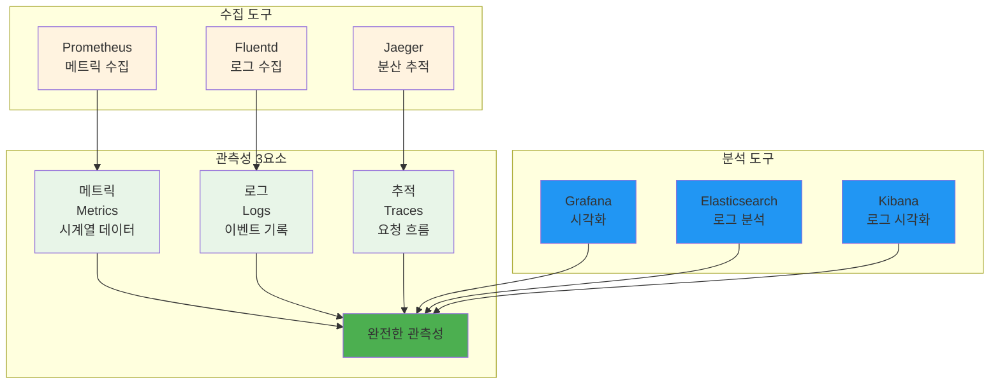
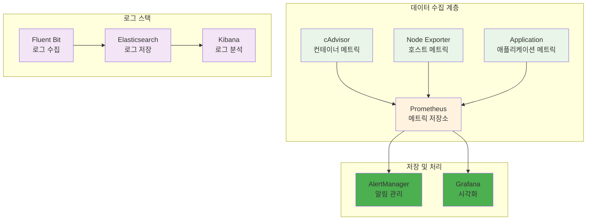
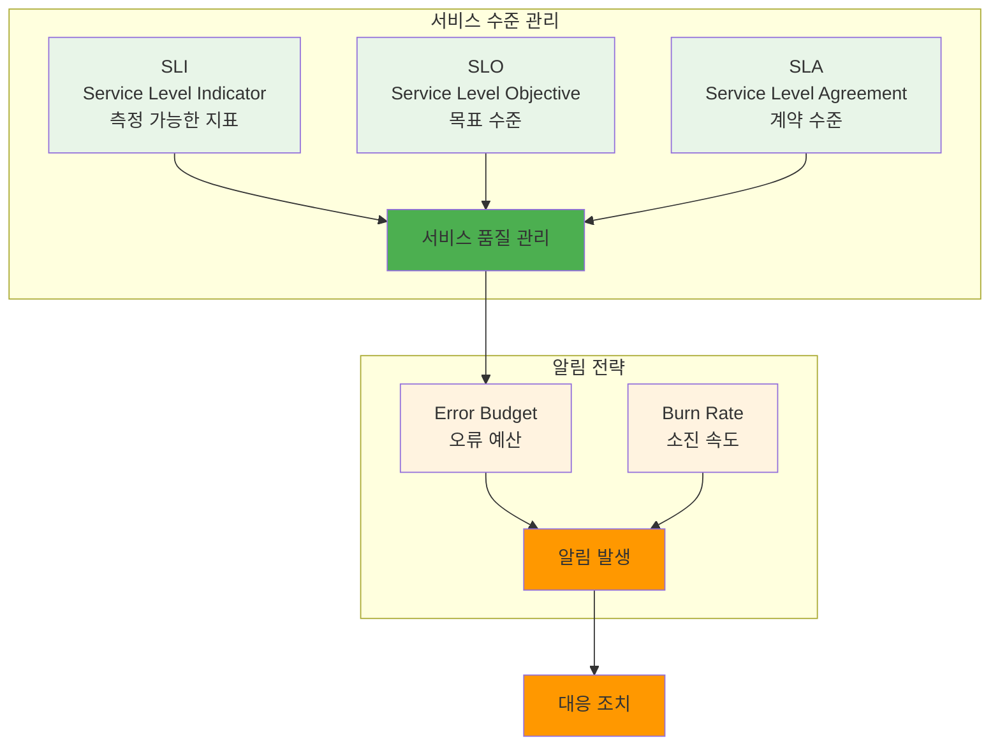

# Week 2 Day 3 Session 3: 모니터링 & 관측성

<div align="center">
**📊 모니터링** • **🔍 관측성**
*컨테이너 환경에서의 포괄적인 관측성 구축 방법 이해*
</div>

---

## 🕘 세션 정보
**시간**: 11:00-11:50 (50분)
**목표**: 컨테이너 환경에서의 포괄적인 관측성 구축 방법 이해
**방식**: 이론 강의 + 페어 토론

## 🎯 세션 목표
### 📚 학습 목표
- **이해 목표**: 컨테이너 환경에서의 포괄적인 관측성 구축 방법 이해
- **적용 목표**: 실무에서 사용할 수 있는 모니터링 시스템 구축 능력 습득
- **협업 목표**: 개별 학습 후 경험 공유 및 질의응답

## 📖 핵심 개념 (35분)

### 🔍 개념 1: 관측성의 3요소 (12분)
> **정의**: 시스템의 내부 상태를 외부에서 관찰할 수 있게 하는 메트릭, 로그, 추적의 통합

**관측성 아키텍처**:


**각 요소의 역할**:
- **메트릭**: 시스템 성능 지표 (CPU, 메모리, 응답시간)
- **로그**: 애플리케이션 이벤트와 오류 정보
- **추적**: 분산 시스템에서의 요청 흐름 추적

### 🔍 개념 2: 컨테이너 모니터링 스택 (12분)
> **정의**: 컨테이너 환경에 특화된 모니터링 도구들의 통합 스택

**CNCF 모니터링 스택**:


**모니터링 설정 예시**:
```yaml
# prometheus.yml
global:
  scrape_interval: 15s

scrape_configs:
  - job_name: 'cadvisor'
    static_configs:
      - targets: ['cadvisor:8080']
  
  - job_name: 'node-exporter'
    static_configs:
      - targets: ['node-exporter:9100']
  
  - job_name: 'app'
    static_configs:
      - targets: ['app:3000']
    metrics_path: '/metrics'
```

### 🔍 개념 3: 알림과 SLI/SLO (11분)
> **정의**: 서비스 수준 지표와 목표를 기반으로 한 효과적인 알림 체계

**SLI/SLO 프레임워크**:


**SLI/SLO 예시**:
```yaml
# SLI 정의
availability_sli: |
  sum(rate(http_requests_total{status!~"5.."}[5m])) /
  sum(rate(http_requests_total[5m]))

latency_sli: |
  histogram_quantile(0.95, 
    sum(rate(http_request_duration_seconds_bucket[5m])) by (le)
  )

# SLO 목표
slo_targets:
  availability: 99.9%  # 99.9% 가용성
  latency_p95: 200ms   # 95% 요청이 200ms 이내
```

**알림 규칙 예시**:
```yaml
# alerting.yml
groups:
- name: slo_alerts
  rules:
  - alert: HighErrorRate
    expr: |
      (
        sum(rate(http_requests_total{status=~"5.."}[5m])) /
        sum(rate(http_requests_total[5m]))
      ) > 0.01
    for: 5m
    labels:
      severity: critical
    annotations:
      summary: "High error rate detected"
      description: "Error rate is {{ $value | humanizePercentage }}"
```

**고급 관측성 기법**:

**1. 사용자 정의 메트릭**:
```javascript
// Node.js 애플리케이션 메트릭
const client = require('prom-client');

// 비즈니스 메트릭 정의
const orderCounter = new client.Counter({
  name: 'orders_total',
  help: 'Total number of orders',
  labelNames: ['status', 'product_category']
});

const orderDuration = new client.Histogram({
  name: 'order_processing_duration_seconds',
  help: 'Order processing duration',
  buckets: [0.1, 0.5, 1, 2, 5, 10]
});

const activeUsers = new client.Gauge({
  name: 'active_users_current',
  help: 'Current number of active users'
});

// 메트릭 사용 예시
app.post('/order', async (req, res) => {
  const timer = orderDuration.startTimer();
  
  try {
    await processOrder(req.body);
    orderCounter.inc({ status: 'success', product_category: req.body.category });
    res.json({ success: true });
  } catch (error) {
    orderCounter.inc({ status: 'failed', product_category: req.body.category });
    res.status(500).json({ error: error.message });
  } finally {
    timer();
  }
});
```

**2. 로그 집계 및 분석**:
```yaml
# fluentd 설정
<source>
  @type forward
  port 24224
  bind 0.0.0.0
</source>

<filter docker.**>
  @type parser
  key_name log
  reserve_data true
  <parse>
    @type json
  </parse>
</filter>

<match docker.**>
  @type elasticsearch
  host elasticsearch
  port 9200
  index_name docker-logs
  type_name _doc
  
  <buffer>
    @type file
    path /var/log/fluentd-buffers/docker.buffer
    flush_mode interval
    flush_interval 10s
  </buffer>
</match>
```

**3. 분산 추적 (Distributed Tracing)**:
```javascript
// OpenTelemetry 설정
const { NodeSDK } = require('@opentelemetry/sdk-node');
const { getNodeAutoInstrumentations } = require('@opentelemetry/auto-instrumentations-node');
const { JaegerExporter } = require('@opentelemetry/exporter-jaeger');

const jaegerExporter = new JaegerExporter({
  endpoint: 'http://jaeger:14268/api/traces',
});

const sdk = new NodeSDK({
  traceExporter: jaegerExporter,
  instrumentations: [getNodeAutoInstrumentations()]
});

sdk.start();

// 사용자 정의 스팬
const opentelemetry = require('@opentelemetry/api');

app.get('/api/user/:id', async (req, res) => {
  const tracer = opentelemetry.trace.getTracer('user-service');
  
  const span = tracer.startSpan('get-user-profile');
  span.setAttributes({
    'user.id': req.params.id,
    'http.method': req.method,
    'http.url': req.url
  });
  
  try {
    const user = await getUserProfile(req.params.id);
    span.setStatus({ code: opentelemetry.SpanStatusCode.OK });
    res.json(user);
  } catch (error) {
    span.recordException(error);
    span.setStatus({ 
      code: opentelemetry.SpanStatusCode.ERROR, 
      message: error.message 
    });
    res.status(500).json({ error: error.message });
  } finally {
    span.end();
  }
});
```

**4. 성능 대시보드 구성**:
```json
{
  "dashboard": {
    "title": "Container Performance Dashboard",
    "panels": [
      {
        "title": "Request Rate",
        "type": "graph",
        "targets": [
          {
            "expr": "rate(http_requests_total[5m])",
            "legendFormat": "{{method}} {{status}}"
          }
        ]
      },
      {
        "title": "Response Time P95",
        "type": "singlestat",
        "targets": [
          {
            "expr": "histogram_quantile(0.95, rate(http_request_duration_seconds_bucket[5m]))"
          }
        ]
      },
      {
        "title": "Error Rate",
        "type": "singlestat",
        "targets": [
          {
            "expr": "rate(http_requests_total{status=~\"5..\"}[5m]) / rate(http_requests_total[5m])"
          }
        ]
      },
      {
        "title": "Container Resource Usage",
        "type": "graph",
        "targets": [
          {
            "expr": "rate(container_cpu_usage_seconds_total[5m])",
            "legendFormat": "CPU - {{container_name}}"
          },
          {
            "expr": "container_memory_usage_bytes / 1024 / 1024",
            "legendFormat": "Memory MB - {{container_name}}"
          }
        ]
      }
    ]
  }
}
```

**5. 자동 이상 탐지**:
```python
# 이상 탐지 스크립트
import numpy as np
from sklearn.ensemble import IsolationForest
import requests
import json
from datetime import datetime, timedelta

class AnomalyDetector:
    def __init__(self, prometheus_url):
        self.prometheus_url = prometheus_url
        self.model = IsolationForest(contamination=0.1)
        
    def fetch_metrics(self, query, hours=24):
        end_time = datetime.now()
        start_time = end_time - timedelta(hours=hours)
        
        params = {
            'query': query,
            'start': start_time.isoformat(),
            'end': end_time.isoformat(),
            'step': '5m'
        }
        
        response = requests.get(f"{self.prometheus_url}/api/v1/query_range", params=params)
        return response.json()
    
    def detect_anomalies(self):
        # CPU 사용률 데이터 수집
        cpu_data = self.fetch_metrics('rate(container_cpu_usage_seconds_total[5m])')
        
        # 데이터 전처리
        values = []
        for result in cpu_data['data']['result']:
            for value in result['values']:
                values.append(float(value[1]))
        
        if len(values) < 10:
            return []
        
        # 이상 탐지 모델 학습
        X = np.array(values).reshape(-1, 1)
        self.model.fit(X)
        
        # 이상치 탐지
        anomalies = self.model.predict(X)
        anomaly_indices = np.where(anomalies == -1)[0]
        
        return [
            {
                'timestamp': datetime.now().isoformat(),
                'metric': 'cpu_usage',
                'value': values[i],
                'anomaly_score': self.model.decision_function(X[i].reshape(1, -1))[0]
            }
            for i in anomaly_indices
        ]

# 사용 예시
detector = AnomalyDetector('http://prometheus:9090')
anomalies = detector.detect_anomalies()

for anomaly in anomalies:
    print(f"Anomaly detected: {anomaly}")
    # Slack 또는 이메일 알림 전송
```

## 💭 함께 생각해보기 (15분)

### 🤝 페어 토론 (10분)
**토론 주제**:
1. **관측성 우선순위**: "메트릭, 로그, 추적 중 어떤 것부터 구축해야 할까요?"
2. **알림 피로도**: "너무 많은 알림으로 인한 피로도를 어떻게 줄일까요?"
3. **SLO 설정**: "우리 서비스에 적합한 SLO는 어떻게 설정해야 할까요?"

### 🎯 전체 공유 (5분)
- **모니터링 경험**: 효과적인 모니터링 구축 경험
- **도구 선택**: 조직 규모에 맞는 모니터링 도구 선택 기준

## 🔑 핵심 키워드
- **Observability**: 관측성
- **SLI (Service Level Indicator)**: 서비스 수준 지표
- **SLO (Service Level Objective)**: 서비스 수준 목표
- **Error Budget**: 오류 예산
- **Alerting**: 알림 시스템

## 📝 세션 마무리
### ✅ 오늘 세션 성과
- 관측성 3요소 완전 이해
- 컨테이너 모니터링 스택 구성 방법 학습
- SLI/SLO 기반 알림 체계 설계 능력 습득

### 🎯 다음 세션 준비
- **실습 챌린지**: 보안 & 최적화 통합 실습
- **연결**: 이론에서 실습으로의 자연스러운 전환

---

**다음**: [보안 & 최적화 통합 실습](../README.md#실습-챌린지)