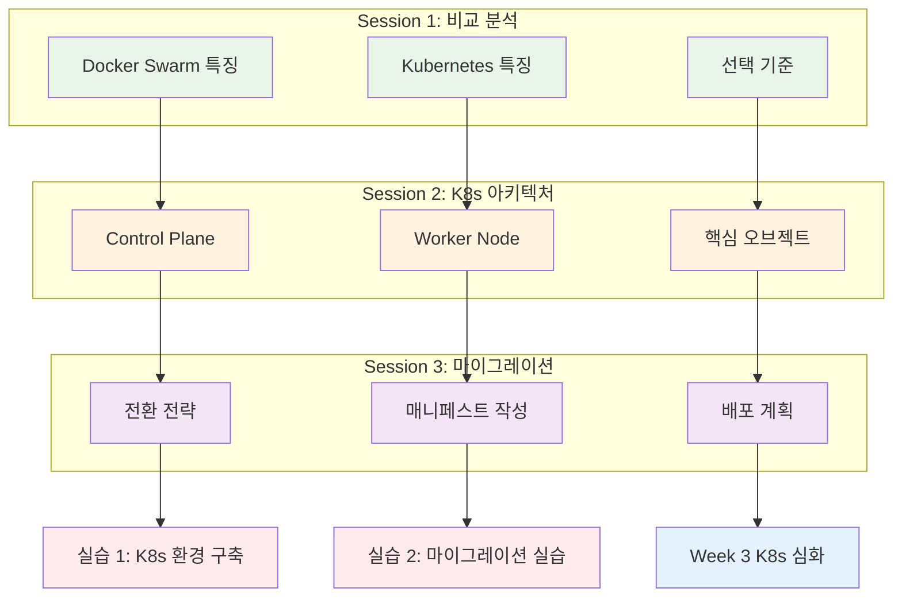

# Week 2 Day 4: Kubernetes 준비 & 마이그레이션

<div align="center">

**☸️ K8s 아키텍처** • **🔄 마이그레이션 전략** • **🚀 실습 준비**

*Week 3 Kubernetes 학습을 위한 완벽한 준비와 Docker 앱 마이그레이션*

</div>

---

## 🕘 일일 스케줄

### 📊 시간 배분 (신규 구조)
```
📚 이론 강의: 2.5시간 (50분×3세션) - K8s 준비 중심 학습
🛠️ 실습 세션: 2시간 (50분×2세션) - K8s 환경 구축
👥 학생 케어: 개별 맞춤 지원 (필요시)
```

### 🗓️ 상세 스케줄
| 시간 | 구분 | 내용 | 목적 |
|------|------|------|------|
| **09:00-09:50** | 📚 이론 1 | [Docker vs Kubernetes 비교 분석](./session_1.md) | 오케스트레이션 비교 |
| **09:50-10:00** | ☕ 휴식 | 10분 휴식 | |
| **10:00-10:50** | 📚 이론 2 | [Kubernetes 아키텍처 & 핵심 개념](./session_2.md) | K8s 기초 이해 |
| **10:50-11:00** | ☕ 휴식 | 10분 휴식 | |
| **11:00-11:50** | 📚 이론 3 | [Docker 애플리케이션의 K8s 마이그레이션 전략](./session_3.md) | 마이그레이션 계획 |
| **11:50-12:00** | ☕ 휴식 | 10분 휴식 | |
| **12:00-12:50** | 🛠️ 실습 1 | [K8s 환경 구축 & 기본 배포](./lab_1.md) | K8s 환경 체험 |
| **12:50-13:00** | ☕ 휴식 | 10분 휴식 | |
| **13:00-14:00** | 🍽️ 점심 | 점심시간 (60분) | |
| **14:00-14:50** | 🛠️ 실습 2 | [Docker 앱의 K8s 마이그레이션 실습](./lab_2.md) | 실제 마이그레이션 |

---

## 🎯 일일 학습 목표

### 📚 이론 목표
- **비교 분석**: Docker Swarm vs Kubernetes 차이점과 선택 기준 이해
- **K8s 아키텍처**: 클러스터 구성 요소와 동작 원리 완전 이해
- **마이그레이션**: Docker 애플리케이션을 K8s로 전환하는 체계적 방법론

### 🛠️ 실습 목표
- **K8s 환경**: 로컬 Kubernetes 클러스터 구축 및 기본 배포
- **마이그레이션**: Week 2에서 구축한 Docker 애플리케이션의 K8s 전환
- **Week 3 준비**: Kubernetes 심화 학습을 위한 실습 환경 완성

### 🤝 협업 목표
- **전략 수립**: 팀별 마이그레이션 계획 수립 및 발표
- **경험 공유**: Docker vs K8s 장단점 비교 토론
- **Week 3 준비**: 다음 주 학습 계획과 목표 설정

---

## 📚 3개 세션 통합 맵



---

## 🔗 연결성 및 발전

### Week 2 통합 연결
- **Day 1**: Docker 네트워킹 → K8s Service/Ingress 개념
- **Day 2**: 데이터 관리 → K8s PV/PVC 이해
- **Day 3**: Swarm 오케스트레이션 → K8s 클러스터 관리
- **전체 통합**: Docker 심화 → K8s 기초 완성

### Week 3 학습 준비
- **K8s 기초**: 아키텍처와 핵심 개념 이해 완료
- **실습 환경**: 로컬 K8s 클러스터 구축 완료
- **마이그레이션**: Docker 앱의 K8s 전환 경험
- **심화 준비**: K8s 고급 기능 학습을 위한 기반 마련

---

## 📊 성공 지표

### 기술적 성취
- **K8s 환경**: 로컬 클러스터 구축 및 기본 배포 성공
- **마이그레이션**: Docker 애플리케이션의 K8s 전환 완료
- **아키텍처 이해**: K8s 구성 요소와 동작 원리 75% 이상 이해
- **Week 3 준비**: 다음 주 학습을 위한 환경과 지식 준비 완료

### 학습 효과
- **오케스트레이션 비교**: Docker Swarm과 K8s의 차이점 명확 이해
- **K8s 기초**: 클러스터 아키텍처와 핵심 개념 습득
- **마이그레이션 역량**: 체계적인 전환 방법론 이해
- **실무 준비**: 실제 K8s 환경에서의 작업 능력 기초 확보

---

## 🎯 실무 연계 포인트

### 마이그레이션 시나리오
- **레거시 전환**: 기존 Docker 환경에서 K8s로의 점진적 마이그레이션
- **하이브리드 운영**: Docker와 K8s 환경의 동시 운영 전략
- **클라우드 전환**: 온프레미스에서 클라우드 K8s로의 이전
- **마이크로서비스**: 모놀리스에서 K8s 기반 마이크로서비스로 전환

### 실제 기업 사례
- **Spotify**: Docker에서 K8s로의 대규모 마이그레이션
- **Airbnb**: 하이브리드 환경에서의 점진적 전환
- **Netflix**: 클라우드 네이티브 K8s 아키텍처 구축
- **Uber**: 글로벌 K8s 플랫폼 운영 경험

---

## 📋 학습 점검 체크리스트

### 이론 이해도
- [ ] **오케스트레이션 비교**: Docker Swarm vs K8s 차이점 이해
- [ ] **K8s 아키텍처**: Control Plane과 Worker Node 구조 이해
- [ ] **핵심 오브젝트**: Pod, Service, Deployment 개념 이해
- [ ] **마이그레이션**: 체계적인 전환 방법론 이해

### 실습 완성도
- [ ] **K8s 클러스터**: 로컬 환경에서 클러스터 구축 완료
- [ ] **기본 배포**: Pod, Service 배포 및 동작 확인
- [ ] **마이그레이션**: Docker 앱의 K8s 매니페스트 작성 완료
- [ ] **통합 테스트**: 마이그레이션된 애플리케이션 정상 동작 확인

### Week 3 준비도
- [ ] **환경 구축**: K8s 학습을 위한 실습 환경 준비 완료
- [ ] **기초 지식**: K8s 핵심 개념 이해도 75% 이상
- [ ] **실습 경험**: 기본적인 K8s 명령어와 매니페스트 작성 경험
- [ ] **학습 계획**: Week 3 학습 목표와 계획 수립 완료

---

## 🔮 Week 3 학습 예고

### Week 3 Day 1: Kubernetes 기초와 클러스터 관리
- **K8s 설치**: 다양한 환경에서의 K8s 클러스터 구축
- **기본 오브젝트**: Pod, Service, Deployment 심화 학습
- **네임스페이스**: 리소스 격리와 멀티 테넌시

### Week 3 Day 2: 워크로드 관리와 스케줄링
- **고급 워크로드**: StatefulSet, DaemonSet, Job
- **스케줄링**: 노드 선택과 리소스 관리
- **오토스케일링**: HPA, VPA, 클러스터 오토스케일링

### Week 3 연결고리
- **네트워킹**: Docker 네트워킹 → K8s Service/Ingress
- **스토리지**: Docker 볼륨 → K8s PV/PVC
- **모니터링**: Prometheus → K8s 네이티브 모니터링
- **운영**: Docker 운영 → K8s 클러스터 운영

---

## 🎓 Week 2 종합 회고

### 학습 성과 정리
- **Day 1**: Docker 네트워킹 심화 → 멀티 호스트 통신 마스터
- **Day 2**: 스토리지 관리 → 데이터 영속성과 백업 전략 완성
- **Day 3**: 운영 모니터링 → 프로덕션급 모니터링 시스템 구축
- **Day 4**: K8s 준비 → 마이그레이션 전략과 환경 구축 완료

### 다음 단계 준비
- **기술적 기반**: Docker 심화 역량 완성
- **실습 환경**: K8s 학습을 위한 환경 준비 완료
- **학습 동기**: 다음 단계 학습에 대한 명확한 목표 설정
- **협업 경험**: 팀 프로젝트를 통한 협업 역량 강화

---

<div align="center">

**☸️ Kubernetes 준비 완료** • **🤝 협업 중심 학습** • **🚀 Week 3 도약 준비**

*Docker 심화 학습을 완성하고 Kubernetes 여정을 시작할 준비가 되었습니다*

</div>