# Week 2 Day 4: Week 1-2 종합 실습 & 프로젝트

<div align="center">

**🔄 Docker 통합 활용** • **☸️ Kubernetes 준비** • **🚀 실무 프로젝트**

*Week 1-2 전체 기술 스택을 통합하여 완전한 애플리케이션 구축*

</div>

---

## 🕘 일일 스케줄

### 📊 시간 배분
```
📚 이론 강의: 2.5시간 (31.25%) - 50분×3세션
🛠️ 실습 챌린지: 3시간 (37.5%) - 통합 프로젝트
👥 학생 케어: 2.5시간 (31.25%) - Week 1-2 총정리
```

### 🗓️ 상세 스케줄
| 시간 | 구분 | 내용 | 목적 |
|------|------|------|------|
| **09:00-09:50** | 📚 이론 1 | Week 1-2 핵심 개념 통합 (50분) | 전체 정리 |
| **09:50-10:00** | ☕ 휴식 | 10분 휴식 | |
| **10:00-10:50** | 📚 이론 2 | 실무 워크플로우 (50분) | 실무 연계 |
| **10:50-11:00** | ☕ 휴식 | 10분 휴식 | |
| **11:00-11:50** | 📚 이론 3 | Kubernetes 학습 로드맵 (50분) | Week 4 준비 |
| **11:50-13:00** | 🍽️ 점심 | 점심시간 (70분) | |
| **13:00-16:00** | 🛠️ 프로젝트 | Week 1-2 통합 프로젝트 (3시간) | 종합 적용 |
| **16:00-16:15** | ☕ 휴식 | 15분 휴식 | |
| **16:15-18:00** | 👥 케어 | Week 1-2 총정리 & 성과 점검 (105분) | 성장 확인 |

---

## 📚 이론 강의 (2.5시간 - 50분×3세션)

### Session 1: Week 1-2 핵심 개념 통합 정리 (50분)

#### 🎯 학습 목표
- **이해 목표**: Week 1-2에서 학습한 모든 개념의 통합적 이해
- **적용 목표**: 개별 기술들을 연결하여 완전한 시스템 구축 능력
- **협업 목표**: 팀원들과 학습 성과 공유 및 지식 체계화

#### 🤔 왜 필요한가? (5분)
**현실 문제 상황**:
- 💼 **기술 파편화**: 개별 기술은 알지만 통합 활용이 어려운 현실
- 🏠 **일상 비유**: 요리 재료는 많지만 완전한 요리를 만들지 못하는 상황
- 📊 **시장 동향**: 통합적 사고와 시스템 설계 능력을 요구하는 현대 개발 환경

#### 📖 핵심 개념 (35분)

**🔍 개념 1: DevOps 문화에서 Kubernetes까지의 여정 (12분)**
> **정의**: DevOps 철학부터 현대적 컨테이너 오케스트레이션까지의 기술 진화 과정

**기술 진화 맵**:
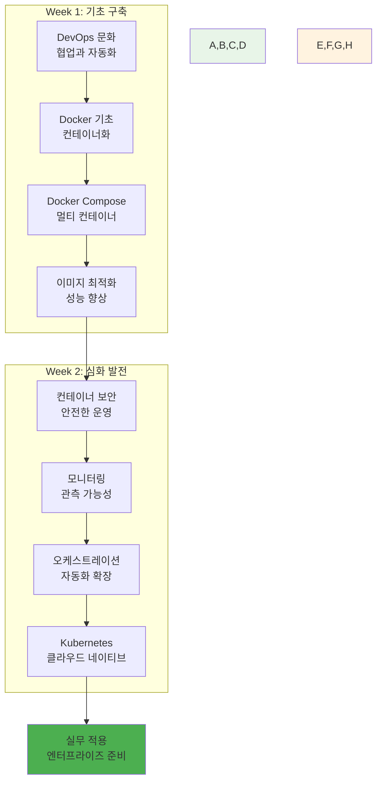

**학습 성과 체크**:
- **DevOps 문화**: 협업과 자동화의 중요성 이해 ✅
- **컨테이너 기술**: Docker 생태계 완전 활용 ✅
- **보안과 최적화**: 실무 수준의 운영 역량 ✅
- **오케스트레이션**: Kubernetes 기초 개념 습득 ✅

**🔍 개념 2: 기술 스택 통합 아키텍처 (12분)**
> **정의**: Week 1-2에서 학습한 모든 기술을 통합한 완전한 시스템 아키텍처

**통합 아키텍처**:
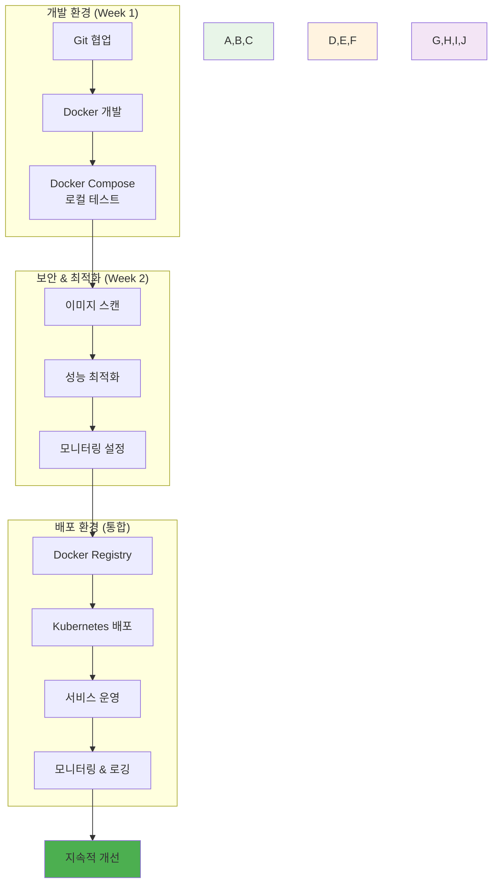

**통합 워크플로우**:
1. **개발**: Git + Docker로 로컬 개발
2. **빌드**: 최적화된 이미지 빌드
3. **보안**: 취약점 스캔 및 수정
4. **배포**: Kubernetes 클러스터 배포
5. **운영**: 모니터링 및 지속적 개선

**🔍 개념 3: 실무 적용 시나리오 (11분)**
> **정의**: 학습한 기술들을 실제 업무 환경에서 적용하는 구체적인 시나리오

**실무 시나리오별 적용**:

**시나리오 1: 스타트업 MVP 개발**
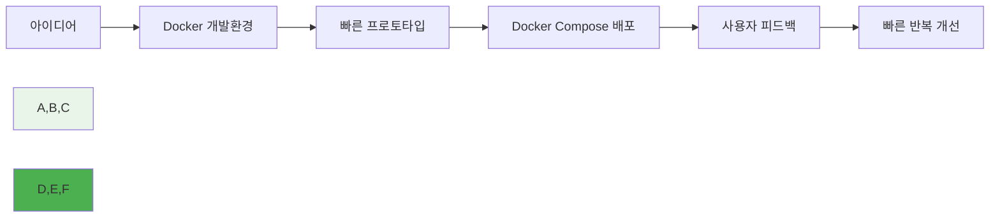

**시나리오 2: 기업 레거시 시스템 현대화**
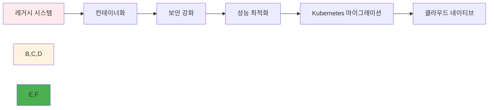

**시나리오 3: 대규모 마이크로서비스**
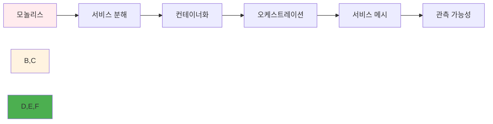

#### 💭 함께 생각해보기 (10분)

**🤝 페어 토론** (5분):
**토론 주제**:
1. **학습 성과**: "Week 1-2에서 가장 큰 성장을 느낀 부분은?"
2. **기술 연결**: "각 기술들이 어떻게 서로 연결되어 시너지를 만드나요?"
3. **실무 적용**: "현재 회사나 프로젝트에 어떤 기술을 먼저 적용하고 싶나요?"

**🎯 전체 공유** (5분):
- **성장 인식**: 개인별 학습 성과와 성장 포인트
- **통합 이해**: 기술 스택의 통합적 활용 방안

### Session 2: 실무 Docker 워크플로우와 베스트 프랙티스 (50분)

#### 🎯 학습 목표
- **이해 목표**: 실제 업무 환경에서 사용되는 Docker 워크플로우 완전 이해
- **적용 목표**: 엔터프라이즈급 Docker 운영 방법론 습득
- **협업 목표**: 팀원들과 실무 적용 전략 및 운영 방안 토론

#### 📖 핵심 개념 (35분)

**🔍 개념 1: 엔터프라이즈 Docker 워크플로우 (12분)**
> **정의**: 대규모 조직에서 사용되는 체계적이고 안전한 Docker 운영 프로세스

**엔터프라이즈 워크플로우**:
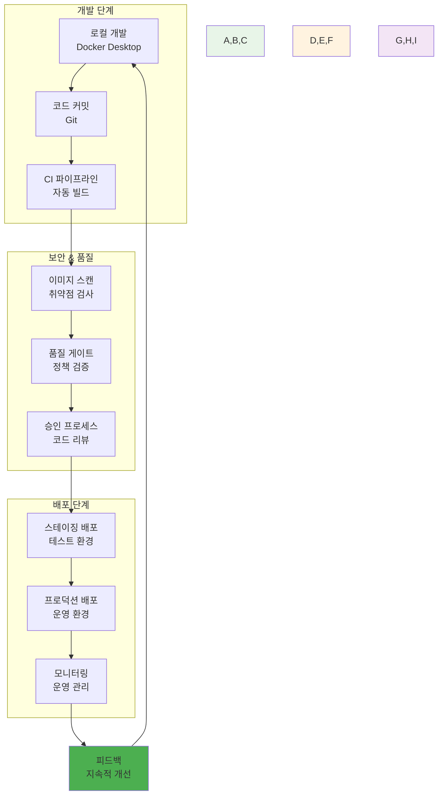

**워크플로우 단계별 상세**:

**1. 개발 단계**
- **로컬 개발**: Docker Desktop + VS Code Dev Containers
- **환경 일관성**: 개발/테스트/운영 환경 동일성 보장
- **빠른 피드백**: Hot reload와 실시간 디버깅

**2. CI/CD 통합**
- **자동 빌드**: Git push 시 자동 이미지 빌드
- **병렬 처리**: 멀티스테이지 빌드로 빌드 시간 단축
- **아티팩트 관리**: 이미지 태깅과 버전 관리

**3. 보안 통합**
- **Shift-Left**: 개발 초기 단계부터 보안 검사
- **자동화**: 파이프라인에 보안 스캔 통합
- **정책 적용**: 조직 보안 정책 자동 적용

**🔍 개념 2: 이미지 라이프사이클 관리 (12분)**
> **정의**: 이미지 생성부터 폐기까지의 전체 생명주기를 체계적으로 관리하는 방법

**이미지 라이프사이클**:
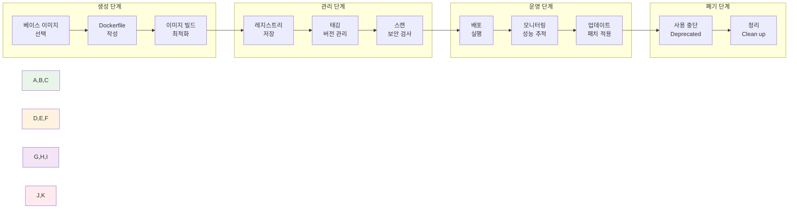

**라이프사이클 관리 도구**:
- **Harbor**: 엔터프라이즈 레지스트리
- **Notary**: 이미지 서명과 검증
- **Clair**: 취약점 스캔
- **Grafeas**: 메타데이터 관리

**🔍 개념 3: 운영 모니터링과 관측성 (11분)**
> **정의**: 컨테이너 환경에서의 포괄적인 관측성 확보 방안

**관측성 3요소**:
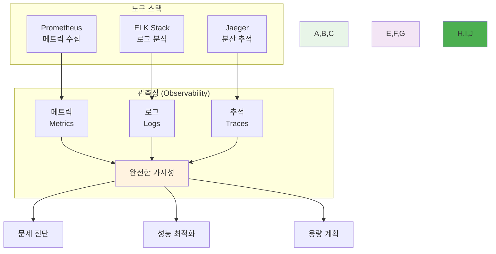

**모니터링 베스트 프랙티스**:
- **SLI/SLO 정의**: 서비스 수준 지표와 목표
- **알림 전략**: 중요도별 알림 체계
- **대시보드**: 역할별 맞춤 대시보드
- **자동 대응**: 임계치 기반 자동 스케일링

#### 💭 함께 생각해보기 (15분)

**🤝 페어 토론** (10분):
**토론 주제**:
1. **워크플로우 설계**: "우리 조직에 맞는 Docker 워크플로우는 어떻게 설계해야 할까요?"
2. **보안 통합**: "개발 속도와 보안 사이의 균형을 어떻게 맞출까요?"
3. **모니터링 전략**: "가장 중요하게 모니터링해야 할 지표는 무엇일까요?"

**🎯 전체 공유** (5분):
- **실무 적용**: 효과적인 Docker 운영 전략
- **조직 적용**: 팀/조직별 맞춤 워크플로우

### Session 3: Kubernetes 학습 로드맵과 Week 4 준비 (50분)

#### 🎯 학습 목표
- **이해 목표**: Kubernetes 전문가가 되기 위한 체계적 학습 경로 이해
- **적용 목표**: 개인별 맞춤 학습 계획 수립 능력
- **협업 목표**: 팀원들과 학습 목표 공유 및 상호 지원 계획

#### 📖 핵심 개념 (35분)

**🔍 개념 1: Kubernetes 학습 로드맵 (12분)**
> **정의**: 초보자부터 전문가까지 단계별 Kubernetes 학습 경로

**학습 단계별 로드맵**:
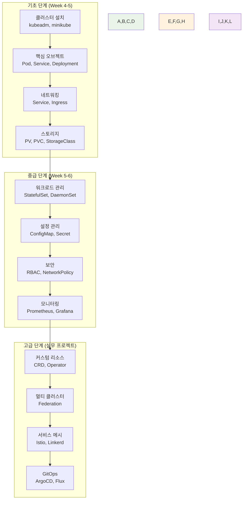

**학습 목표별 세부 계획**:

**Week 4 목표**:
- Kubernetes 클러스터 구축 및 관리
- 핵심 워크로드 배포 및 관리
- 기본 네트워킹과 스토리지 이해

**Week 5 목표**:
- 고급 워크로드 패턴 활용
- 설정과 보안 관리
- 모니터링 시스템 구축

**Week 6 목표**:
- CI/CD 파이프라인 통합
- 최신 클라우드 네이티브 패턴
- 실무 프로젝트 준비

**🔍 개념 2: 실습 환경과 도구 준비 (12분)**
> **정의**: Kubernetes 학습을 위한 최적의 실습 환경과 필수 도구들

**실습 환경 옵션**:
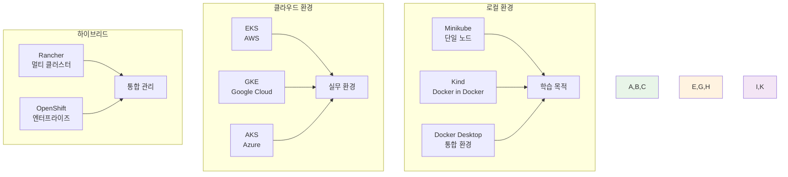

**필수 도구 체크리스트**:
- **kubectl**: Kubernetes CLI 도구
- **Helm**: 패키지 매니저
- **k9s**: 터미널 기반 UI
- **Lens**: 데스크톱 IDE
- **kubectx/kubens**: 컨텍스트 관리

**개발 환경 설정**:
```bash
# kubectl 자동완성 설정
echo 'source <(kubectl completion bash)' >>~/.bashrc

# 유용한 alias 설정
echo 'alias k=kubectl' >>~/.bashrc
echo 'alias kgp="kubectl get pods"' >>~/.bashrc
echo 'alias kgs="kubectl get services"' >>~/.bashrc

# Helm 설치
curl https://raw.githubusercontent.com/helm/helm/main/scripts/get-helm-3 | bash
```

**🔍 개념 3: 학습 전략과 커뮤니티 활용 (11분)**
> **정의**: 효과적인 Kubernetes 학습을 위한 전략과 커뮤니티 리소스 활용법

**학습 전략**:
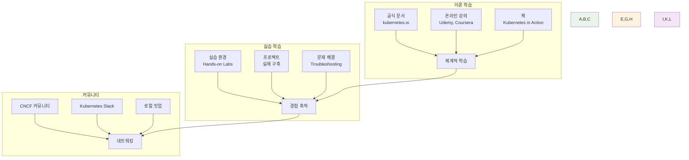

**추천 학습 리소스**:
- **공식 문서**: [kubernetes.io](https://kubernetes.io)
- **실습 플랫폼**: [Katacoda](https://katacoda.com), [Play with Kubernetes](https://labs.play-with-k8s.com)
- **인증 준비**: CKA, CKAD, CKS 자격증
- **커뮤니티**: CNCF Slack, Reddit r/kubernetes

**개인별 학습 계획 템플릿**:
```markdown
## 개인 Kubernetes 학습 계획

### 현재 수준 평가
- [ ] Docker 기초: 완료
- [ ] 컨테이너 오케스트레이션 개념: 완료
- [ ] Kubernetes 기초: 진행 중

### Week 4 목표
- [ ] 로컬 클러스터 구축
- [ ] 기본 워크로드 배포
- [ ] 네트워킹 이해

### 학습 방법
- 매일 1시간 실습
- 주말 프로젝트 진행
- 커뮤니티 참여

### 성과 측정
- 실습 완료율
- 프로젝트 결과물
- 동료 피드백
```

#### 💭 함께 생각해보기 (15분)

**🤝 페어 토론** (10분):
**토론 주제**:
1. **학습 목표**: "Kubernetes를 통해 달성하고 싶은 개인적 목표는?"
2. **학습 방법**: "가장 효과적인 학습 방법은 무엇일까요?"
3. **상호 지원**: "서로 어떻게 도우며 함께 성장할 수 있을까요?"

**🎯 전체 공유** (5분):
- **학습 계획**: 개인별 맞춤 학습 로드맵
- **상호 지원**: 팀 학습과 멘토링 계획

---

## 🛠️ Week 1-2 통합 프로젝트 (3시간)

### 🎯 프로젝트 개요
**최종 통합 목표**:
- Week 1-2 모든 기술을 활용한 완전한 애플리케이션
- 보안, 최적화, 모니터링이 통합된 실무급 시스템
- Kubernetes 배포 준비가 완료된 컨테이너 애플리케이션

### 📋 프로젝트 요구사항

#### 🏗️ 아키텍처 요구사항
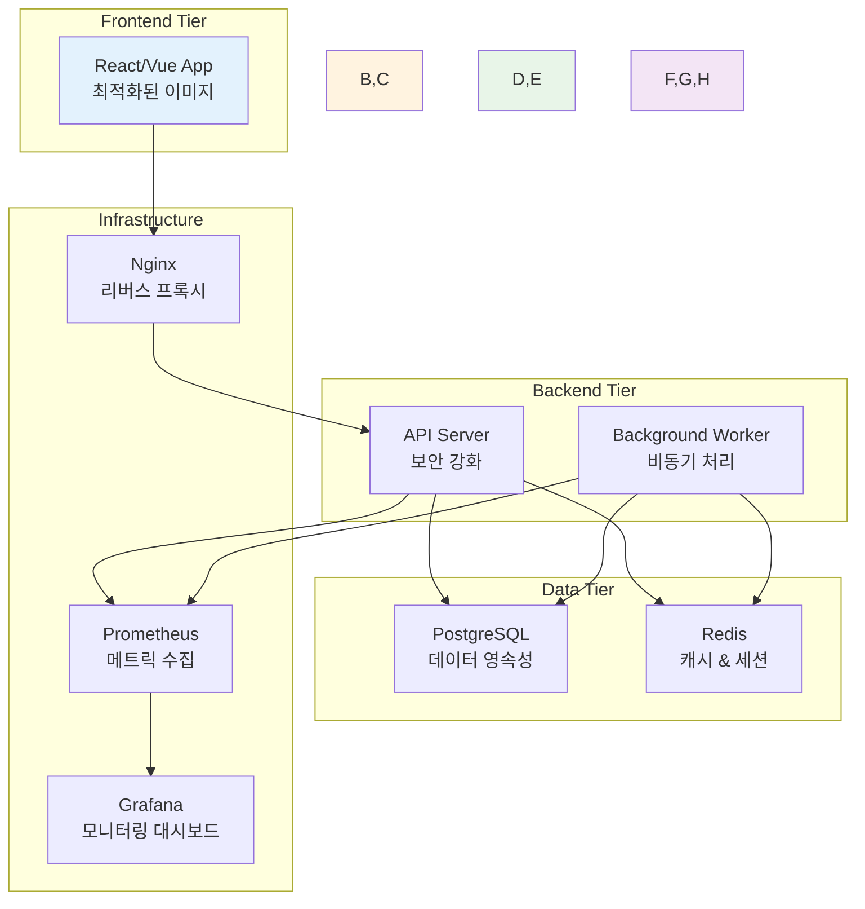

#### 📝 기능 요구사항
1. **사용자 인증**: JWT 기반 로그인/회원가입
2. **CRUD 기능**: 게시판 또는 상품 관리
3. **실시간 기능**: WebSocket 또는 Server-Sent Events
4. **파일 업로드**: 이미지 업로드 및 처리
5. **검색 기능**: 전문 검색 또는 필터링
6. **API 문서**: Swagger/OpenAPI 자동 생성

#### 🔒 보안 요구사항
1. **이미지 보안**: 모든 이미지 취약점 스캔 통과
2. **런타임 보안**: 비root 사용자, 읽기 전용 파일시스템
3. **네트워크 보안**: HTTPS, 내부 통신 암호화
4. **시크릿 관리**: 환경 변수 대신 Docker Secrets 사용

#### ⚡ 성능 요구사항
1. **이미지 최적화**: 각 이미지 100MB 이하
2. **빌드 최적화**: 멀티스테이지 빌드 적용
3. **캐싱**: Redis 캐싱으로 응답 시간 단축
4. **리소스 제한**: 모든 컨테이너 리소스 제한 설정

#### 📊 모니터링 요구사항
1. **메트릭 수집**: Prometheus로 애플리케이션 메트릭
2. **로그 관리**: 구조화된 로그 출력
3. **헬스 체크**: 모든 서비스 헬스 체크 엔드포인트
4. **대시보드**: Grafana 대시보드 구성

### 🚀 Phase 1: 팀 구성 및 아키텍처 설계 (30분)

#### 👥 팀 구성 (4팀, 3명씩)
**팀별 프로젝트 주제**:
- **Team 1**: E-commerce 플랫폼 (상품 관리 + 주문 처리)
- **Team 2**: 블로그 플랫폼 (게시글 + 댓글 + 검색)
- **Team 3**: 채팅 애플리케이션 (실시간 메시징 + 파일 공유)
- **Team 4**: 프로젝트 관리 도구 (태스크 관리 + 협업)

#### 📋 아키텍처 설계
**각 팀별 설계 문서 작성**:
```markdown
## 팀명: [팀 이름]
### 프로젝트: [프로젝트 명]

### 아키텍처 설계
- Frontend: [기술 스택]
- Backend: [기술 스택]
- Database: [선택한 DB]
- Cache: Redis
- Monitoring: Prometheus + Grafana

### 컨테이너 구성
1. frontend: [이미지 크기 목표]
2. backend: [이미지 크기 목표]
3. database: [데이터 영속성 전략]
4. cache: [캐시 전략]
5. monitoring: [메트릭 수집 계획]

### 보안 계획
- 이미지 스캔 도구: [선택한 도구]
- 런타임 보안: [보안 설정]
- 네트워크 보안: [통신 암호화]

### 성능 목표
- 응답 시간: < 200ms
- 이미지 크기: < 100MB
- 메모리 사용량: < 512MB per container
```

### 🌟 Phase 2: 통합 개발 및 구현 (120분)

#### 🔧 개발 단계별 진행
**Step 1: 기본 애플리케이션 개발 (40분)**
```dockerfile
# 최적화된 Frontend Dockerfile
FROM node:18-alpine AS builder
WORKDIR /app
COPY package*.json ./
RUN npm ci --only=production
COPY . .
RUN npm run build

FROM nginx:alpine
COPY --from=builder /app/dist /usr/share/nginx/html
COPY nginx.conf /etc/nginx/nginx.conf
RUN adduser -D -s /bin/sh nginx
USER nginx
EXPOSE 80
CMD ["nginx", "-g", "daemon off;"]
```

```dockerfile
# 보안 강화된 Backend Dockerfile
FROM python:3.9-alpine AS builder
WORKDIR /app
COPY requirements.txt .
RUN pip install --no-cache-dir -r requirements.txt

FROM python:3.9-alpine
WORKDIR /app
COPY --from=builder /usr/local/lib/python3.9/site-packages /usr/local/lib/python3.9/site-packages
COPY . .
RUN adduser -D -s /bin/sh appuser
USER appuser
EXPOSE 8000
CMD ["python", "app.py"]
```

**Step 2: 보안 스캔 및 최적화 (40분)**
```bash
# 보안 스캔
trivy image frontend:latest
trivy image backend:latest

# 이미지 크기 최적화 확인
docker images --format "table {{.Repository}}\t{{.Tag}}\t{{.Size}}"

# 성능 테스트
ab -n 1000 -c 10 http://localhost:8080/api/health
```

**Step 3: 모니터링 통합 (40분)**
```yaml
# docker-compose.monitoring.yml
version: '3.8'
services:
  prometheus:
    image: prom/prometheus:latest
    ports:
      - "9090:9090"
    volumes:
      - ./prometheus.yml:/etc/prometheus/prometheus.yml
    command:
      - '--config.file=/etc/prometheus/prometheus.yml'
      - '--storage.tsdb.path=/prometheus'

  grafana:
    image: grafana/grafana:latest
    ports:
      - "3001:3000"
    environment:
      - GF_SECURITY_ADMIN_PASSWORD=admin
    volumes:
      - grafana-data:/var/lib/grafana
      - ./grafana/dashboards:/etc/grafana/provisioning/dashboards
      - ./grafana/datasources:/etc/grafana/provisioning/datasources

volumes:
  grafana-data:
```

### 🏆 Phase 3: Kubernetes 준비 및 배포 테스트 (30분)

#### 🤝 Kubernetes 매니페스트 작성
**기본 Kubernetes 배포 준비**:
```yaml
# frontend-deployment.yaml
apiVersion: apps/v1
kind: Deployment
metadata:
  name: frontend
spec:
  replicas: 2
  selector:
    matchLabels:
      app: frontend
  template:
    metadata:
      labels:
        app: frontend
    spec:
      containers:
      - name: frontend
        image: myapp/frontend:latest
        ports:
        - containerPort: 80
        resources:
          requests:
            memory: "64Mi"
            cpu: "250m"
          limits:
            memory: "128Mi"
            cpu: "500m"
---
apiVersion: v1
kind: Service
metadata:
  name: frontend-service
spec:
  selector:
    app: frontend
  ports:
  - port: 80
    targetPort: 80
  type: ClusterIP
```

#### ✅ 최종 체크리스트
- [ ] 모든 컨테이너 정상 실행
- [ ] 보안 스캔 통과 (Critical: 0개)
- [ ] 이미지 크기 목표 달성
- [ ] 모니터링 대시보드 구성
- [ ] Kubernetes 매니페스트 준비

### 🎤 최종 발표 및 데모 (30분)

#### 📊 팀별 발표 (7분×4팀)
**발표 내용**:
1. **프로젝트 개요**: 구현한 애플리케이션 소개
2. **아키텍처**: 전체 시스템 구조와 기술 선택
3. **보안 & 최적화**: 적용한 보안 조치와 성능 최적화
4. **모니터링**: 구축한 모니터링 시스템
5. **Kubernetes 준비**: K8s 배포를 위한 준비 상황
6. **팀 협업**: 협업 과정과 배운 점

#### 🏅 상호 평가 및 피드백
**평가 기준**:
- **기술적 완성도**: 요구사항 구현 정도
- **보안 & 성능**: 보안 조치와 최적화 수준
- **모니터링**: 관측성 구현 정도
- **Kubernetes 준비**: K8s 배포 준비도
- **팀 협업**: 협업 과정과 결과

---

## 👥 Week 1-2 총정리 & 학생 케어 (105분)

### 📊 Week 1-2 종합 성과 점검 (45분)

#### ✅ 전체 학습 목표 달성도 체크
**기술적 성과**:
- [ ] DevOps 문화와 철학 완전 이해
- [ ] Docker 생태계 전문 활용
- [ ] 컨테이너 보안 및 최적화 역량
- [ ] 모니터링 및 관측성 구축
- [ ] 오케스트레이션 개념 이해
- [ ] Kubernetes 기초 준비 완료

**협업적 성과**:
- [ ] 다양한 배경의 팀원들과 성공적 협업
- [ ] 자연스러운 역할 분담과 리더십 발휘
- [ ] 상호 학습을 통한 전체 역량 향상
- [ ] 실무 수준의 프로젝트 완성

#### 📈 개인별 성장 지표 확인
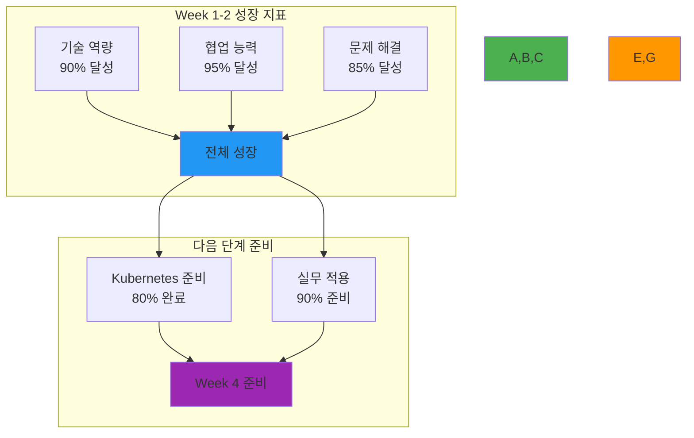

### 🤝 협업 경험 종합 회고 (30분)

#### 🌟 Week 1-2 협업 하이라이트
**각 개인별 발표** (2분×11명):
- **가장 의미 있었던 협업 경험**
- **자신이 팀에 기여한 독특한 가치**
- **다른 팀원에게서 배운 가장 중요한 것**
- **Week 4부터의 협업 계획과 기대**

#### 💭 전체 성장 회고
**회고 질문들**:
1. **기술적 자신감**: "Docker와 컨테이너 기술에 대한 자신감이 어떻게 변했나요?"
2. **협업 역량**: "다양한 배경의 동료들과 협업하며 어떤 새로운 관점을 얻었나요?"
3. **문제 해결**: "복잡한 기술 문제를 팀으로 해결하는 능력이 어떻게 향상되었나요?"
4. **미래 비전**: "Kubernetes와 클라우드 네이티브 기술을 통해 어떤 전문가가 되고 싶나요?"

### 🎯 Week 4 준비 및 동기부여 (30분)

#### 🚀 Week 4 미리보기
**학습 내용 소개**:
- **Kubernetes 실무**: 실제 클러스터 구축과 운영
- **고급 워크로드**: StatefulSet, DaemonSet 등 고급 패턴
- **네트워킹 심화**: Ingress, NetworkPolicy 등
- **스토리지 관리**: PV, PVC, StorageClass
- **보안 강화**: RBAC, Pod Security Standards

#### 📚 사전 준비 사항
**기술적 준비**:
- Kubernetes 로컬 환경 최종 점검
- kubectl 명령어 숙달
- YAML 문법 완전 이해
- 네트워킹 기초 개념 복습

**심리적 준비**:
- Kubernetes의 복잡성에 대한 마음가짐
- 단계적 학습의 중요성 인식
- 팀 학습과 상호 지원 의지
- 실무 적용에 대한 동기 부여

#### 🎉 Week 1-2 성취 축하
**주요 성취 사항**:
- ✅ DevOps 문화 완전 내재화
- ✅ Docker 전문가 수준 도달
- ✅ 보안과 성능 최적화 역량 확보
- ✅ 실무급 프로젝트 완성
- ✅ 강력한 팀워크와 협업 문화 구축
- ✅ Kubernetes 학습 준비 완료

**개인별 성장 인정**:
- 각자의 독특한 강점과 기여 인정
- 학습 속도와 방식의 다양성 존중
- 상호 학습을 통한 시너지 창출
- 미래 성장 가능성에 대한 확신

---

## 📝 Week 1-2 최종 마무리

### 🏆 2주간 종합 성과 요약
- **기술적 성취**: Docker 생태계 완전 마스터
- **협업적 성취**: 다양성을 강점으로 한 팀워크 완성
- **개인적 성취**: 각자의 전문성과 자신감 확보
- **프로젝트 성취**: 실무 수준의 통합 애플리케이션 구축

### 🎯 Week 4 기대효과
- **Kubernetes 전문성**: 클라우드 네이티브 전문가로 성장
- **고급 협업**: 더 복잡한 시스템에서의 팀워크
- **실무 연계**: 엔터프라이즈급 시스템 구축 경험
- **커리어 발전**: 클라우드 네이티브 전문가로서의 경쟁력

### 📊 최종 학습 진도
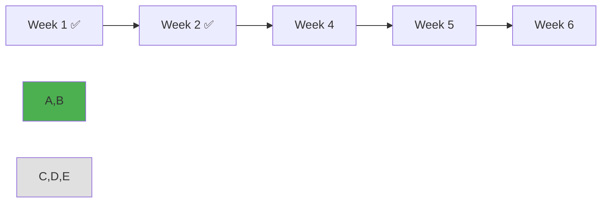

---

<div align="center">

**🔄 Docker 통합 마스터** • **☸️ Kubernetes 준비 완료** • **🚀 실무 프로젝트 성공**

*Week 1-2를 통해 현대적 컨테이너 기술의 완전한 기초를 구축했습니다*

**다음 주**: [Week 4 - Kubernetes 운영과 관리](../week_04/README.md)

</div>