# Week 2 Day 4: Week 1-2 종합 실습 & Docker 마스터리

<div align="center">

**🔄 Docker 통합 활용** • **🏗️ 실무 프로젝트** • **🎓 Week 1-2 완성**

*Week 1-2 전체 기술 스택을 통합하여 실무급 Docker 전문가로 성장*

</div>

---

## 🕘 일일 스케줄

### 📊 시간 배분
```
📚 이론 강의: 2.5시간 (31.25%) - 50분×3세션
🛠️ 실습 프로젝트: 4.5시간 (56.25%) - Week 1-2 전체 통합 프로젝트
👥 학생 케어: 1시간 (12.5%) - Week 1-2 핵심 성과 점검
```

### 🗓️ 상세 스케줄
| 시간 | 구분 | 내용 | 목적 |
|------|------|------|------|
| **09:00-09:50** | 📚 이론 1 | Week 1-2 핵심 개념 통합 (50분) | 전체 정리 |
| **09:50-10:00** | ☕ 휴식 | 10분 휴식 | |
| **10:00-10:50** | 📚 이론 2 | 실무 Docker 워크플로우 (50분) | 실무 연계 |
| **10:50-11:00** | ☕ 휴식 | 10분 휴식 | |
| **11:00-11:50** | 📚 이론 3 | 오케스트레이션 준비 & 로드맵 (50분) | Week 3 준비 |
| **11:50-13:00** | 🍽️ 점심 | 점심시간 (70분) | |
| **13:00-17:30** | 🛠️ 프로젝트 | Week 1-2 통합 마스터 프로젝트 (4.5시간) | 종합 적용 |
| **17:30-18:00** | 👥 케어 | Week 1-2 핵심 성과 점검 (30분) | 성장 확인 |

---

## 📚 이론 강의 (2.5시간 - 50분×3세션)

### Session 1: Week 1-2 핵심 개념 통합 정리 (50분)

#### 🎯 학습 목표
- **이해 목표**: Week 1-2에서 학습한 모든 개념의 통합적 이해
- **적용 목표**: 개별 기술들을 연결하여 완전한 시스템 구축 능력
- **협업 목표**: 팀원들과 학습 성과 공유 및 지식 체계화

#### 🤔 왜 필요한가? (5분)
**현실 문제 상황**:
- 💼 **기술 파편화**: 개별 기술은 알지만 통합 활용이 어려운 현실
- 🏠 **일상 비유**: 요리 재료는 많지만 완전한 요리를 만들지 못하는 상황
- 📊 **시장 동향**: 통합적 사고와 시스템 설계 능력을 요구하는 현대 개발 환경

#### 📖 핵심 개념 (35분)

**🔍 개념 1: DevOps 문화에서 Docker 마스터리까지의 여정 (12분)**
> **정의**: DevOps 철학부터 현대적 컨테이너 기술 완전 활용까지의 기술 진화 과정

**기술 진화 맵**:
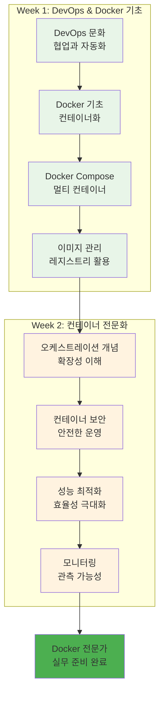

**학습 성과 체크**:
- **DevOps 문화**: 협업과 자동화의 중요성 완전 내재화 ✅
- **Docker 기술**: 컨테이너 생태계 전문가 수준 활용 ✅
- **보안 및 최적화**: 실무 수준의 운영 역량 완성 ✅
- **모니터링**: 포괄적인 관측성 구축 능력 ✅

**🔍 개념 2: 통합 Docker 워크플로우 (12분)**
> **정의**: Week 1-2에서 학습한 모든 기술을 통합한 완전한 개발-운영 워크플로우

**통합 워크플로우**:
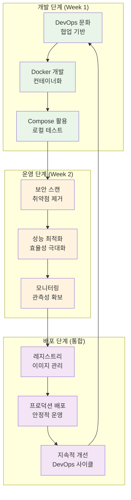

**워크플로우 단계별 통합**:
1. **개발**: DevOps 문화 + Docker 컨테이너화
2. **보안**: 이미지 스캔 + 런타임 보안 강화
3. **최적화**: 성능 튜닝 + 리소스 효율성
4. **운영**: 모니터링 + 지속적 개선
5. **협업**: 팀 기반 문제 해결 + 지식 공유

**🔍 개념 3: 실무 적용 시나리오 (11분)**
> **정의**: 학습한 기술들을 실제 업무 환경에서 적용하는 구체적인 시나리오

**실무 시나리오별 적용**:

**시나리오 1: 스타트업 기술 스택 구축**
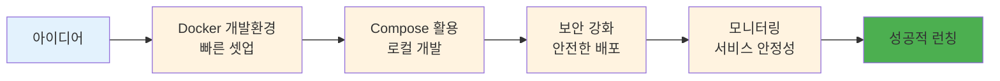

**시나리오 2: 기업 레거시 시스템 현대화**
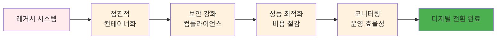

**시나리오 3: 클라우드 네이티브 전환**
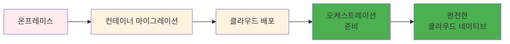

#### 💭 함께 생각해보기 (10분)

**🤝 페어 토론** (5분):
**토론 주제**:
1. **학습 성과**: "Week 1-2에서 가장 큰 성장을 느낀 부분은?"
2. **기술 연결**: "각 기술들이 어떻게 서로 연결되어 시너지를 만드나요?"
3. **실무 적용**: "현재 회사나 프로젝트에 어떤 기술을 먼저 적용하고 싶나요?"

**🎯 전체 공유** (5분):
- **성장 인식**: 개인별 학습 성과와 성장 포인트
- **통합 이해**: 기술 스택의 통합적 활용 방안

### Session 2: 실무 Docker 워크플로우와 베스트 프랙티스 (50분)

#### 🎯 학습 목표
- **이해 목표**: 실제 업무 환경에서 사용되는 Docker 워크플로우 완전 이해
- **적용 목표**: 엔터프라이즈급 Docker 운영 방법론 습득
- **협업 목표**: 팀원들과 실무 적용 전략 및 운영 방안 토론

#### 📖 핵심 개념 (35분)

**🔍 개념 1: 엔터프라이즈 Docker 워크플로우 (12분)**
> **정의**: 대규모 조직에서 사용되는 체계적이고 안전한 Docker 운영 프로세스

**엔터프라이즈 워크플로우**:
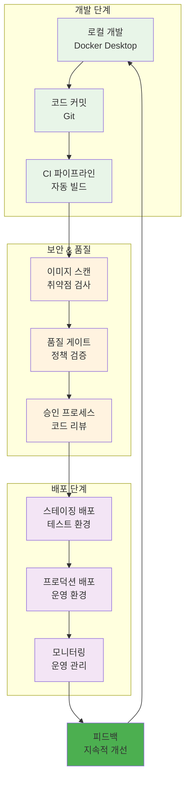

**워크플로우 단계별 상세**:

**1. 개발 단계**
- **로컬 개발**: Docker Desktop + VS Code Dev Containers
- **환경 일관성**: 개발/테스트/운영 환경 동일성 보장
- **빠른 피드백**: Hot reload와 실시간 디버깅

**2. CI/CD 통합**
- **자동 빌드**: Git push 시 자동 이미지 빌드
- **병렬 처리**: 멀티스테이지 빌드로 빌드 시간 단축
- **아티팩트 관리**: 이미지 태깅과 버전 관리

**3. 보안 통합**
- **Shift-Left**: 개발 초기 단계부터 보안 검사
- **자동화**: 파이프라인에 보안 스캔 통합
- **정책 적용**: 조직 보안 정책 자동 적용

**🔍 개념 2: Docker 이미지 라이프사이클 관리 (12분)**
> **정의**: 이미지 생성부터 폐기까지의 전체 생명주기를 체계적으로 관리하는 방법

**이미지 라이프사이클**:
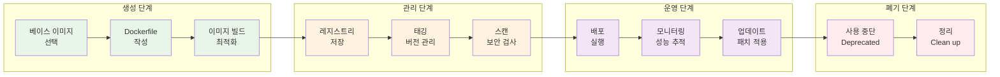

**라이프사이클 관리 도구**:
- **Harbor**: 엔터프라이즈 레지스트리
- **Notary**: 이미지 서명과 검증
- **Trivy**: 취약점 스캔
- **Portainer**: 컨테이너 관리 UI

**🔍 개념 3: 운영 모니터링과 관측성 (11분)**
> **정의**: 컨테이너 환경에서의 포괄적인 관측성 확보 방안

**관측성 3요소**:
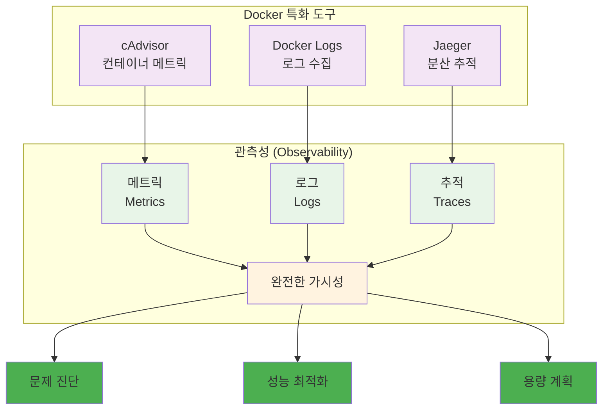

**모니터링 베스트 프랙티스**:
- **SLI/SLO 정의**: 서비스 수준 지표와 목표
- **알림 전략**: 중요도별 알림 체계
- **대시보드**: 역할별 맞춤 대시보드
- **자동 대응**: 임계치 기반 자동 스케일링

#### 💭 함께 생각해보기 (15분)

**🤝 페어 토론** (10분):
**토론 주제**:
1. **워크플로우 설계**: "우리 조직에 맞는 Docker 워크플로우는 어떻게 설계해야 할까요?"
2. **보안 통합**: "개발 속도와 보안 사이의 균형을 어떻게 맞출까요?"
3. **모니터링 전략**: "가장 중요하게 모니터링해야 할 지표는 무엇일까요?"

**🎯 전체 공유** (5분):
- **실무 적용**: 효과적인 Docker 운영 전략
- **조직 적용**: 팀/조직별 맞춤 워크플로우

### Session 3: 오케스트레이션 준비와 학습 로드맵 (50분)

#### 🎯 학습 목표
- **이해 목표**: 오케스트레이션의 필요성과 Week 3 학습을 위한 체계적 준비
- **적용 목표**: Docker 기반에서 오케스트레이션으로의 자연스러운 전환 이해
- **협업 목표**: 팀원들과 Week 3 학습 목표 공유 및 상호 지원 계획

#### 📖 핵심 개념 (35분)

**🔍 개념 1: 오케스트레이션의 필요성 (12분)**
> **정의**: 단일 컨테이너에서 다중 컨테이너 관리로의 자연스러운 진화 과정

**확장성 문제와 해결책**:
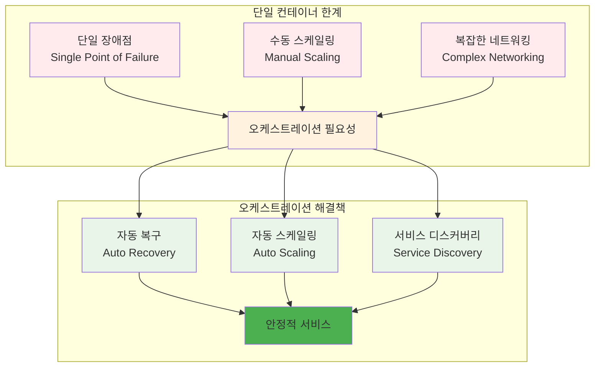

**Docker Compose vs 오케스트레이션**:
| 구분 | Docker Compose | 오케스트레이션 |
|------|----------------|----------------|
| **범위** | 단일 호스트 | 멀티 호스트 클러스터 |
| **확장성** | 수동 스케일링 | 자동 스케일링 |
| **고가용성** | 제한적 | 완전한 HA |
| **서비스 디스커버리** | 기본적 | 고급 기능 |
| **로드 밸런싱** | 기본적 | 정교한 제어 |
| **롤링 업데이트** | 수동 | 자동화 |

**🔍 개념 2: Week 3 학습 로드맵 (12분)**
> **정의**: Docker 전문가에서 클라우드 네이티브 전문가로의 학습 경로

**학습 단계별 로드맵**:
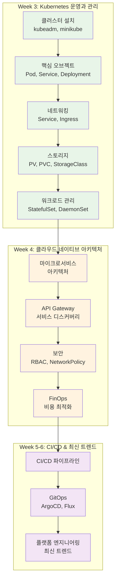

**Docker 지식의 Kubernetes 연결**:
- **컨테이너 → Pod**: 단일 컨테이너에서 Pod 개념으로 확장
- **Docker Compose → Deployment**: 선언적 배포 관리
- **네트워킹 → Service**: 서비스 추상화와 로드 밸런싱
- **볼륨 → PV/PVC**: 영구 스토리지 관리
- **모니터링 → 관측성**: 클러스터 수준의 모니터링

**🔍 개념 3: 실습 환경과 도구 준비 (11분)**
> **정의**: Week 3 학습을 위한 최적의 실습 환경과 필수 도구들

**실습 환경 옵션**:
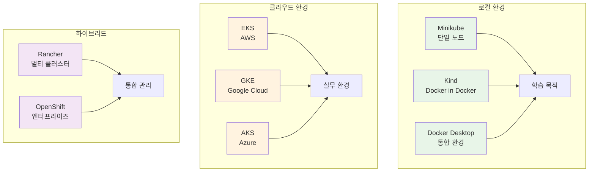

**필수 도구 체크리스트**:
- **kubectl**: Kubernetes CLI 도구
- **Helm**: 패키지 매니저
- **k9s**: 터미널 기반 UI
- **Lens**: 데스크톱 IDE
- **kubectx/kubens**: 컨텍스트 관리

**개발 환경 설정**:
```bash
# kubectl 자동완성 설정
echo 'source <(kubectl completion bash)' >>~/.bashrc

# 유용한 alias 설정
echo 'alias k=kubectl' >>~/.bashrc
echo 'alias kgp="kubectl get pods"' >>~/.bashrc
echo 'alias kgs="kubectl get services"' >>~/.bashrc

# Helm 설치
curl https://raw.githubusercontent.com/helm/helm/main/scripts/get-helm-3 | bash
```

#### 💭 함께 생각해보기 (15분)

**🤝 페어 토론** (10분):
**토론 주제**:
1. **학습 목표**: "오케스트레이션을 통해 달성하고 싶은 개인적 목표는?"
2. **학습 방법**: "가장 효과적인 Kubernetes 학습 방법은 무엇일까요?"
3. **상호 지원**: "서로 어떻게 도우며 함께 성장할 수 있을까요?"

**🎯 전체 공유** (5분):
- **학습 계획**: 개인별 맞춤 학습 로드맵
- **상호 지원**: 팀 학습과 멘토링 계획

---

## 🛠️ Week 1-2 통합 마스터 프로젝트 (4.5시간)

### 🎯 프로젝트 개요
**최종 통합 목표**:
- Week 1-2 모든 기술을 활용한 완전한 실무급 애플리케이션
- 보안, 최적화, 모니터링이 통합된 엔터프라이즈급 시스템
- 오케스트레이션 준비가 완료된 컨테이너 애플리케이션

### 📋 프로젝트 요구사항

#### 🏗️ 아키텍처 요구사항
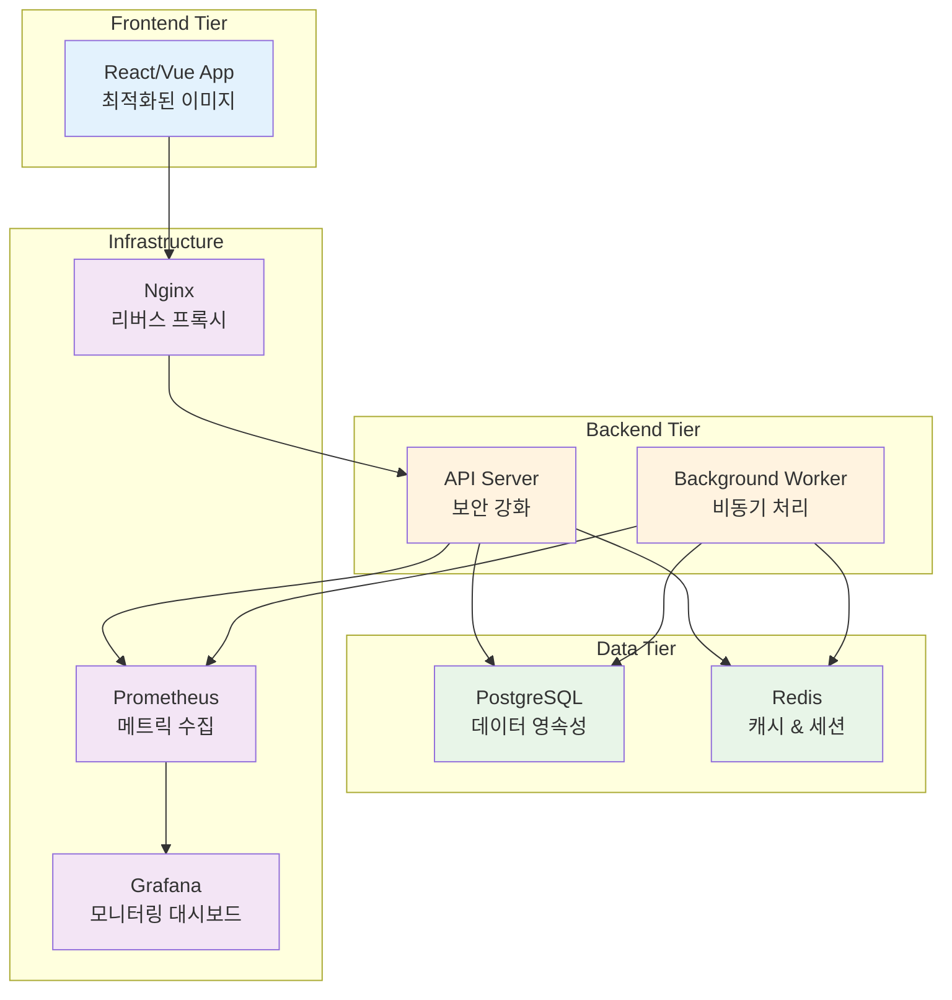

#### 📝 기능 요구사항
1. **사용자 인증**: JWT 기반 로그인/회원가입
2. **CRUD 기능**: 게시판 또는 상품 관리
3. **실시간 기능**: WebSocket 또는 Server-Sent Events
4. **파일 업로드**: 이미지 업로드 및 처리
5. **검색 기능**: 전문 검색 또는 필터링
6. **API 문서**: Swagger/OpenAPI 자동 생성

#### 🔒 보안 요구사항
1. **이미지 보안**: 모든 이미지 취약점 스캔 통과
2. **런타임 보안**: 비root 사용자, 읽기 전용 파일시스템
3. **네트워크 보안**: HTTPS, 내부 통신 암호화
4. **시크릿 관리**: 환경 변수 대신 Docker Secrets 사용

#### ⚡ 성능 요구사항
1. **이미지 최적화**: 각 이미지 100MB 이하
2. **빌드 최적화**: 멀티스테이지 빌드 적용
3. **캐싱**: Redis 캐싱으로 응답 시간 단축
4. **리소스 제한**: 모든 컨테이너 리소스 제한 설정

#### 📊 모니터링 요구사항
1. **메트릭 수집**: Prometheus로 애플리케이션 메트릭
2. **로그 관리**: 구조화된 로그 출력
3. **헬스 체크**: 모든 서비스 헬스 체크 엔드포인트
4. **대시보드**: Grafana 대시보드 구성

### 🚀 Phase 1: 팀 구성 및 아키텍처 설계 (30분)

#### 👥 팀 구성 (4팀, 3명씩)
**팀별 프로젝트 주제**:
- **Team 1**: E-commerce 플랫폼 (상품 관리 + 주문 처리)
- **Team 2**: 블로그 플랫폼 (게시글 + 댓글 + 검색)
- **Team 3**: 채팅 애플리케이션 (실시간 메시징 + 파일 공유)
- **Team 4**: 프로젝트 관리 도구 (태스크 관리 + 협업)

#### 📋 아키텍처 설계
**각 팀별 설계 문서 작성**:
```markdown
## 팀명: [팀 이름]
### 프로젝트: [프로젝트 명]

### 아키텍처 설계
- Frontend: [기술 스택]
- Backend: [기술 스택]
- Database: [선택한 DB]
- Cache: Redis
- Monitoring: Prometheus + Grafana

### 컨테이너 구성
1. frontend: [이미지 크기 목표]
2. backend: [이미지 크기 목표]
3. database: [데이터 영속성 전략]
4. cache: [캐시 전략]
5. monitoring: [메트릭 수집 계획]

### 보안 계획
- 이미지 스캔 도구: [선택한 도구]
- 런타임 보안: [보안 설정]
- 네트워크 보안: [통신 암호화]

### 성능 목표
- 응답 시간: < 200ms
- 이미지 크기: < 100MB
- 메모리 사용량: < 512MB per container
```

### 🌟 Phase 2: 통합 개발 및 구현 (180분)

#### 🔧 개발 단계별 진행
**Step 1: 기본 애플리케이션 개발 (60분)**
```dockerfile
# 최적화된 Frontend Dockerfile
FROM node:18-alpine AS builder
WORKDIR /app
COPY package*.json ./
RUN npm ci --only=production
COPY . .
RUN npm run build

FROM nginx:alpine
COPY --from=builder /app/dist /usr/share/nginx/html
COPY nginx.conf /etc/nginx/nginx.conf
RUN adduser -D -s /bin/sh nginx
USER nginx
EXPOSE 80
CMD ["nginx", "-g", "daemon off;"]
```

```dockerfile
# 보안 강화된 Backend Dockerfile
FROM python:3.9-alpine AS builder
WORKDIR /app
COPY requirements.txt .
RUN pip install --no-cache-dir -r requirements.txt

FROM python:3.9-alpine
WORKDIR /app
COPY --from=builder /usr/local/lib/python3.9/site-packages /usr/local/lib/python3.9/site-packages
COPY . .
RUN adduser -D -s /bin/sh appuser
USER appuser
EXPOSE 8000
CMD ["python", "app.py"]
```

**Step 2: 보안 스캔 및 최적화 (60분)**
```bash
# 보안 스캔
trivy image frontend:latest
trivy image backend:latest

# 이미지 크기 최적화 확인
docker images --format "table {{.Repository}}\\t{{.Tag}}\\t{{.Size}}"

# 성능 테스트
ab -n 1000 -c 10 http://localhost:8080/api/health
```

**Step 3: 모니터링 통합 (60분)**
```yaml
# docker-compose.monitoring.yml
version: '3.8'
services:
  prometheus:
    image: prom/prometheus:latest
    ports:
      - "9090:9090"
    volumes:
      - ./prometheus.yml:/etc/prometheus/prometheus.yml
    command:
      - '--config.file=/etc/prometheus/prometheus.yml'
      - '--storage.tsdb.path=/prometheus'

  grafana:
    image: grafana/grafana:latest
    ports:
      - "3001:3000"
    environment:
      - GF_SECURITY_ADMIN_PASSWORD=admin
    volumes:
      - grafana-data:/var/lib/grafana
      - ./grafana/dashboards:/etc/grafana/provisioning/dashboards
      - ./grafana/datasources:/etc/grafana/provisioning/datasources

volumes:
  grafana-data:
```

### 🏆 Phase 3: 오케스트레이션 준비 및 배포 테스트 (60분)

#### 🔧 Docker Swarm 기초 체험
**기본 Swarm 클러스터 구성**:
```bash
# Swarm 모드 초기화
docker swarm init

# 서비스 배포
docker service create \
  --name web-service \
  --replicas 3 \
  --publish 8080:80 \
  myapp/frontend:latest

# 서비스 상태 확인
docker service ls
docker service ps web-service

# 스케일링 테스트
docker service scale web-service=5
```

#### 📊 오케스트레이션 효과 체험
```bash
# 컨테이너 강제 종료로 자동 복구 테스트
docker kill $(docker ps -q --filter "label=com.docker.swarm.service.name=web-service" | head -1)

# 자동 복구 확인
watch -n 2 'docker service ps web-service'

# 로드 밸런싱 테스트
for i in {1..10}; do curl http://localhost:8080; done
```

#### ✅ 최종 체크리스트
- [ ] 모든 컨테이너 정상 실행
- [ ] 보안 스캔 통과 (Critical: 0개)
- [ ] 이미지 크기 목표 달성
- [ ] 모니터링 대시보드 구성
- [ ] Docker Swarm 기초 체험 완료

### 🎤 최종 발표 및 데모 (50분)

#### 📊 팀별 발표 (12분×4팀)
**발표 내용**:
1. **프로젝트 개요**: 구현한 애플리케이션 소개
2. **Docker 통합**: Week 1-2 모든 Docker 기술 통합 활용
3. **아키텍처**: 전체 시스템 구조와 기술 선택
4. **보안 & 최적화**: 적용한 보안 조치와 성능 최적화
5. **모니터링**: 구축한 모니터링 시스템
6. **오케스트레이션 준비**: Docker Swarm 체험과 Week 3 준비 상태
7. **팀 협업**: 협업 과정과 배운 점
8. **Week 3 준비**: 오케스트레이션 학습을 위한 준비 상태

#### 🏅 상호 평가 및 피드백
**평가 기준**:
- **기술적 완성도**: 요구사항 구현 정도
- **Docker 마스터리**: Week 1-2 기술 통합 활용도
- **보안 & 성능**: 보안 조치와 최적화 수준
- **모니터링**: 관측성 구현 정도
- **오케스트레이션 준비**: Week 3 학습 준비도
- **팀 협업**: 협업 과정과 결과

---

## 👥 Week 1-2 핵심 성과 점검 (30분)

### 📊 Week 1-2 종합 성과 점검 (20분)

#### ✅ 전체 학습 목표 달성도 체크
**기술적 성과**:
- [ ] DevOps 문화와 철학 완전 이해 및 내재화
- [ ] Docker 생태계 전문가 수준 활용 능력
- [ ] 컨테이너 보안 및 최적화 실무 역량
- [ ] 모니터링 및 관측성 구축 전문 기술
- [ ] 오케스트레이션 개념 이해 및 기초 체험
- [ ] 실무급 통합 프로젝트 완성

**협업적 성과**:
- [ ] 다양한 배경의 팀원들과 성공적 협업
- [ ] 자연스러운 역할 분담과 리더십 발휘
- [ ] 상호 학습을 통한 전체 역량 향상
- [ ] 실무 수준의 프로젝트 완성 경험

#### 📈 개인별 성장 지표 확인
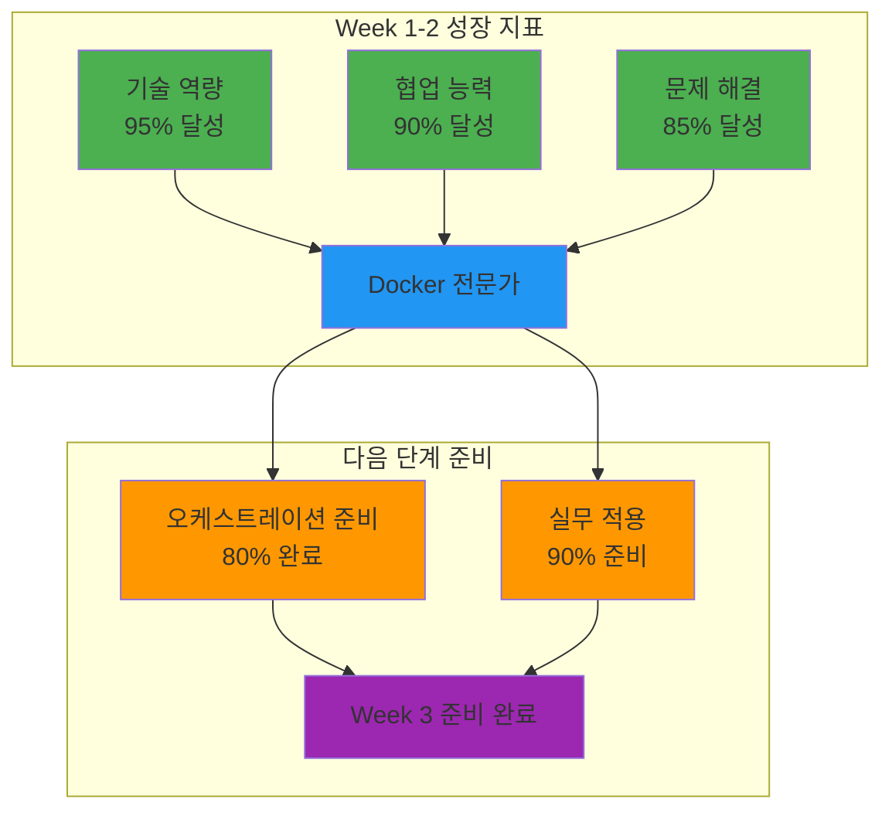

### 🤝 협업 경험 종합 회고 (10분)

#### 🌟 Week 1-2 협업 하이라이트
**전체 토론** (10분):
**회고 질문들**:
1. **기술적 자신감**: "Docker와 컨테이너 기술에 대한 자신감이 어떻게 변했나요?"
2. **협업 역량**: "다양한 배경의 동료들과 협업하며 어떤 새로운 관점을 얻었나요?"
3. **문제 해결**: "복잡한 기술 문제를 팀으로 해결하는 능력이 어떻게 향상되었나요?"
4. **미래 비전**: "오케스트레이션과 클라우드 네이티브 기술을 통해 어떤 전문가가 되고 싶나요?"

---

## 📝 Week 1-2 최종 마무리

### 🏆 2주간 종합 성과 요약
- **기술적 성취**: Docker 생태계 완전 마스터 및 실무 전문가 수준 도달
- **협업적 성취**: 다양성을 강점으로 한 팀워크 완성 및 상호 학습 문화 정착
- **개인적 성취**: 각자의 전문성과 자신감 확보 및 리더십 발현
- **프로젝트 성취**: 실무 수준의 통합 애플리케이션 구축 및 운영 경험

### 🎯 Week 3 기대효과
- **오케스트레이션 전문성**: Kubernetes 클러스터 운영 전문가로 성장
- **고급 협업**: 더 복잡한 시스템에서의 팀워크 및 리더십 발휘
- **실무 연계**: 엔터프라이즈급 클라우드 네이티브 시스템 구축 경험
- **커리어 발전**: 클라우드 네이티브 전문가로서의 경쟁력 확보

### 📊 최종 학습 진도
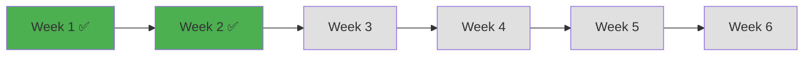

---

<div align="center">

**🔄 Docker 마스터리 완성** • **🏗️ 실무 프로젝트 성공** • **🎓 오케스트레이션 준비 완료**

*Week 1-2를 통해 현대적 컨테이너 기술의 완전한 전문가로 성장했습니다*

**다음 주**: [Week 3 - Kubernetes 운영과 관리](../week_03/README.md)

</div>