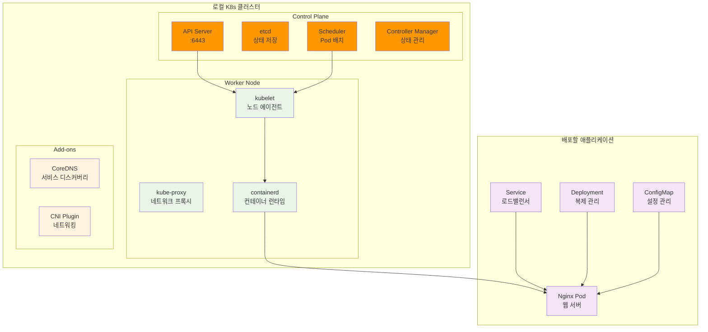
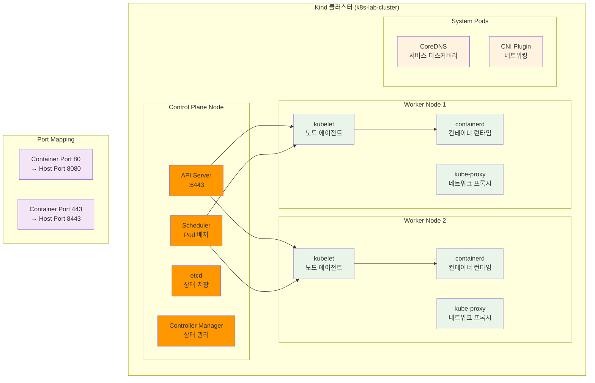
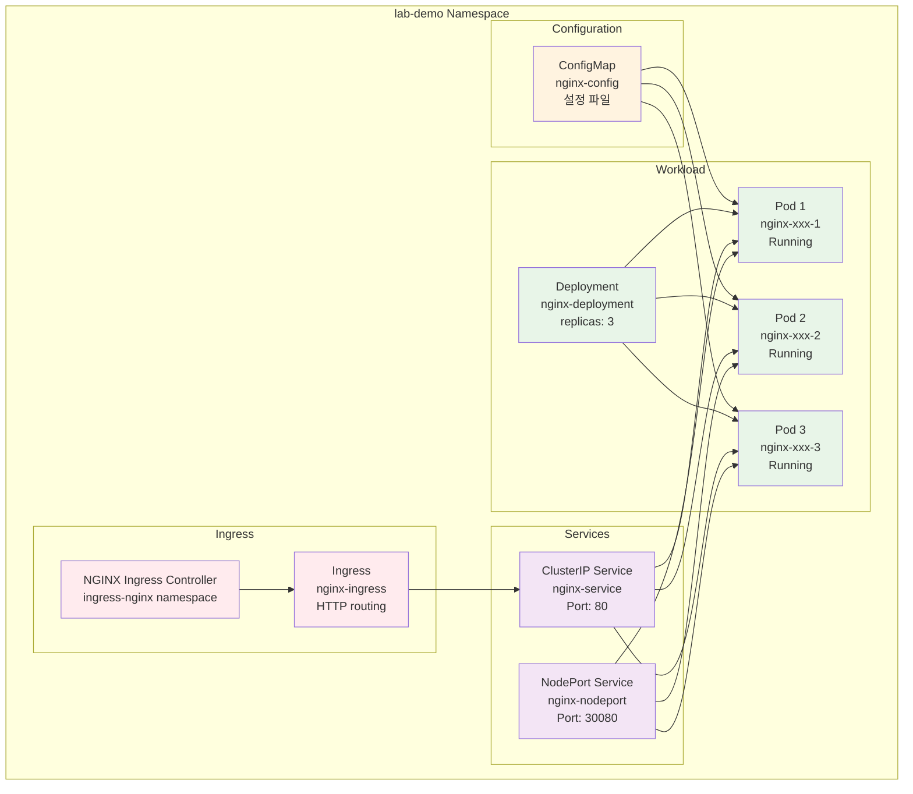
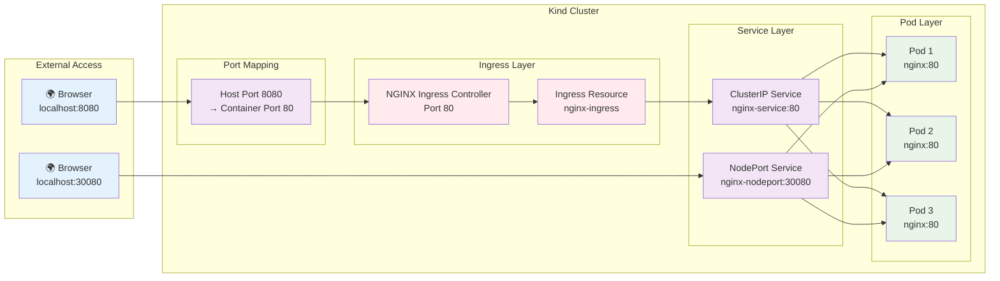
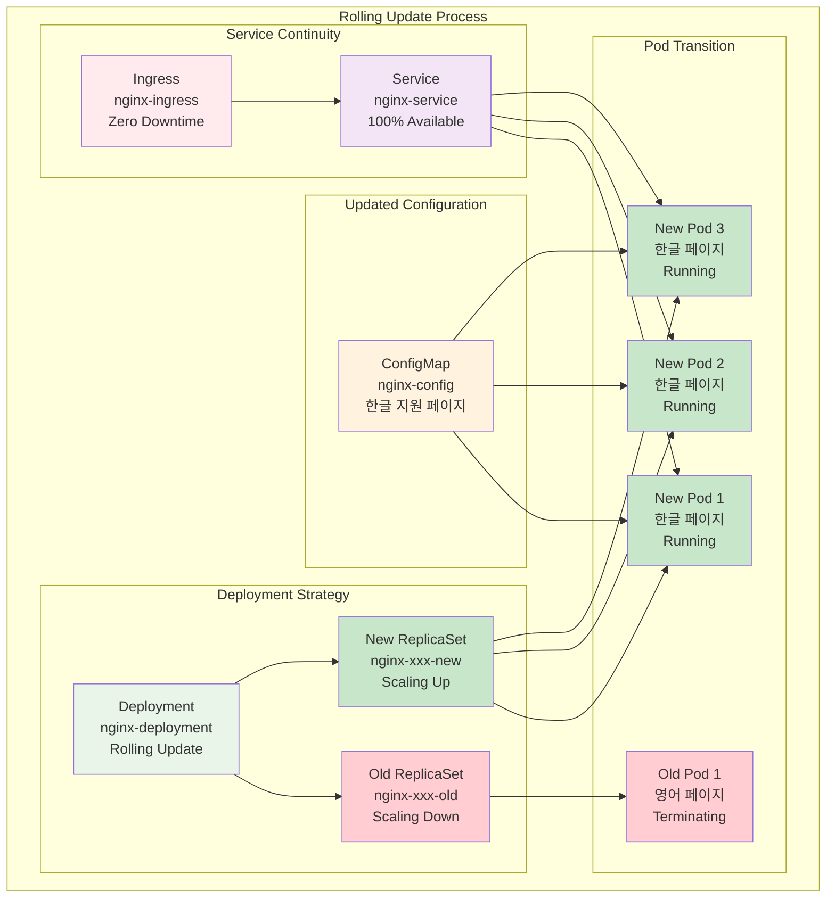

# Week 2 Day 4 Lab 1: K8s 환경 구축 & 기본 배포

<div align="center">

**☸️ K8s 클러스터** • **🚀 기본 배포** • **🔍 환경 체험**

*Kubernetes 환경 구축과 기본 오브젝트 배포 실습*

</div>

---

## 🕘 실습 정보

**시간**: 12:00-12:50 (50분)  
**목표**: 로컬 Kubernetes 클러스터 구축과 기본 오브젝트 배포 경험  
**방식**: 단계별 구축 + 기본 배포 + 동작 확인

---

## 🎯 실습 목표

### 📚 당일 이론 적용
- Session 1-3에서 배운 K8s 개념을 실제 환경에서 체험
- K8s 아키텍처 구성 요소의 실제 동작 확인
- 기본 오브젝트(Pod, Service, Deployment) 배포와 관리

### 🏗️ 구축할 K8s 환경


---

## 📋 실습 준비 (5분)

### 환경 설정
```bash
# 작업 디렉토리 생성
mkdir -p ~/k8s-lab
cd ~/k8s-lab

# 시스템 요구사항 확인
echo "시스템 정보:"
echo "OS: $(uname -a)"
echo "Memory: $(free -h | grep Mem)"
echo "CPU: $(nproc) cores"
echo "Docker: $(docker --version)"
```

### K8s 도구 설치 확인
```bash
# kubectl 설치 확인
if ! command -v kubectl &> /dev/null; then
    echo "kubectl이 설치되지 않았습니다. 설치를 진행합니다..."
    # Windows의 경우
    curl -LO "https://dl.k8s.io/release/v1.28.0/bin/windows/amd64/kubectl.exe"
    # 또는 패키지 매니저 사용
fi

# kind 또는 minikube 설치 확인
if ! command -v kind &> /dev/null && ! command -v minikube &> /dev/null; then
    echo "K8s 클러스터 도구가 필요합니다."
fi
```

---

## 📊 Step별 리소스 생성 현황

## 실습 코드 요약
```
cd lab_scripts/lab1
docker ps
docker stop grafana cadvisor error-test-app prometheus optimized-app-cached
docker rm grafana cadvisor error-test-app prometheus optimized-app-cached
./setup_k8s_cluster.sh
./deploy_basic_objects.sh
./start_port_forward.sh
./deploy_korean_update.sh
./k8s_management_demo.sh
./cleanup.sh
```
---

## 🔧 실습 단계 (40분)

### Step 1: Kubernetes 클러스터 구축 (15분)

#### 📊 Step 1 완료 후 리소스 현황


**✅ Step 1 완료 상태**: Kind 클러스터 구축 완료, 포트 매핑 설정

**🚀 자동화 스크립트 사용**
```bash
# 스크립트 실행 권한 부여
chmod +x ./lab_scripts/lab1/*.sh

# K8s 클러스터 자동 구축
./lab_scripts/lab1/setup_k8s_cluster.sh
```

**📋 스크립트 내용**: [setup_k8s_cluster.sh](./lab_scripts/lab1/setup_k8s_cluster.sh)

**⏱️ 예상 소요 시간**: 3-5분 (이미지 다운로드 포함)

**1-1. 수동 실행 (학습용)**
```bash
# Kind를 사용한 클러스터 생성
cat > kind-config.yaml << 'EOF'
kind: Cluster
apiVersion: kind.x-k8s.io/v1alpha4
name: k8s-lab-cluster
nodes:
- role: control-plane
  kubeadmConfigPatches:
  - |
    kind: InitConfiguration
    nodeRegistration:
      kubeletExtraArgs:
        node-labels: "ingress-ready=true"
  extraPortMappings:
  - containerPort: 80
    hostPort: 8080
    protocol: TCP
  - containerPort: 443
    hostPort: 8443
    protocol: TCP
- role: worker
- role: worker
EOF

# 클러스터 생성
kind create cluster --config=kind-config.yaml

# 클러스터 상태 확인
kubectl cluster-info
kubectl get nodes -o wide
```

**1-2. 클러스터 구성 요소 확인**
```bash
# Control Plane 구성 요소 확인
echo "=== Control Plane 구성 요소 ==="
kubectl get pods -n kube-system

# 노드 상세 정보 확인
echo "=== 노드 정보 ==="
kubectl describe nodes

# 클러스터 리소스 확인
echo "=== 클러스터 리소스 ==="
kubectl get all --all-namespaces

# API 서버 접근 확인
echo "=== API 서버 정보 ==="
kubectl config view --minify
```

### Step 2: 기본 K8s 오브젝트 배포 (15분)

#### 📊 Step 2 완료 후 리소스 현황


**✅ Step 2 완료 상태**: 기본 웹 서비스 배포 완료, Ingress Controller 설치 완료

**🚀 자동화 스크립트 사용**
```bash
# 기본 오브젝트 자동 배포
./lab_scripts/lab1/deploy_basic_objects.sh
```

**📋 스크립트 내용**: [deploy_basic_objects.sh](./lab_scripts/lab1/deploy_basic_objects.sh)

**⏱️ 예상 소요 시간**: 2-3분

**2-1. 수동 실행 (학습용)**
```bash
# 네임스페이스 생성
kubectl create namespace lab-demo

# ConfigMap 생성
cat > configmap.yaml << 'EOF'
apiVersion: v1
kind: ConfigMap
metadata:
  name: nginx-config
  namespace: lab-demo
data:
  nginx.conf: |
    server {
        listen 80;
        server_name localhost;
        
        location / {
            root /usr/share/nginx/html;
            index index.html;
        }
        
        location /health {
            access_log off;
            return 200 "healthy\n";
            add_header Content-Type text/plain;
        }
    }
  index.html: |
    <!DOCTYPE html>
    <html>
    <head>
        <title>K8s Lab Demo</title>
    </head>
    <body>
        <h1>Welcome to Kubernetes Lab!</h1>
        <p>This is running on Pod: <span id="hostname"></span></p>
        <script>
            document.getElementById('hostname').textContent = window.location.hostname;
        </script>
    </body>
    </html>
EOF

kubectl apply -f configmap.yaml

# Deployment 생성
cat > deployment.yaml << 'EOF'
apiVersion: apps/v1
kind: Deployment
metadata:
  name: nginx-deployment
  namespace: lab-demo
  labels:
    app: nginx
spec:
  replicas: 3
  selector:
    matchLabels:
      app: nginx
  template:
    metadata:
      labels:
        app: nginx
    spec:
      containers:
      - name: nginx
        image: nginx:1.21-alpine
        ports:
        - containerPort: 80
        resources:
          requests:
            memory: "64Mi"
            cpu: "250m"
          limits:
            memory: "128Mi"
            cpu: "500m"
        volumeMounts:
        - name: nginx-config
          mountPath: /etc/nginx/conf.d/default.conf
          subPath: nginx.conf
        - name: nginx-html
          mountPath: /usr/share/nginx/html/index.html
          subPath: index.html
        livenessProbe:
          httpGet:
            path: /health
            port: 80
          initialDelaySeconds: 10
          periodSeconds: 10
        readinessProbe:
          httpGet:
            path: /health
            port: 80
          initialDelaySeconds: 5
          periodSeconds: 5
      volumes:
      - name: nginx-config
        configMap:
          name: nginx-config
      - name: nginx-html
        configMap:
          name: nginx-config
EOF

kubectl apply -f deployment.yaml
```

**2-2. Service 생성 및 노출**
```bash
# Service 생성
cat > service.yaml << 'EOF'
apiVersion: v1
kind: Service
metadata:
  name: nginx-service
  namespace: lab-demo
spec:
  selector:
    app: nginx
  ports:
  - protocol: TCP
    port: 80
    targetPort: 80
  type: ClusterIP
EOF

kubectl apply -f service.yaml

# NodePort Service 생성 (외부 접근용)
cat > service-nodeport.yaml << 'EOF'
apiVersion: v1
kind: Service
metadata:
  name: nginx-nodeport
  namespace: lab-demo
spec:
  selector:
    app: nginx
  ports:
  - protocol: TCP
    port: 80
    targetPort: 80
    nodePort: 30080
  type: NodePort
EOF

kubectl apply -f service-nodeport.yaml

# 배포 상태 확인
kubectl get all -n lab-demo
kubectl get pods -n lab-demo -o wide
```

### Step 3: 외부 접근 설정 (5분)

#### 📊 Step 3 완료 후 리소스 현황


**✅ Step 3 완료 상태**: 외부 접근 경로 활성화, 브라우저 접근 가능

**🚀 자동화 스크립트 사용**
```bash
# 외부 접근 설정 (포트 포워딩 + NodePort)
./lab_scripts/lab1/setup_external_access.sh
```

**📋 스크립트 내용**: [setup_external_access.sh](./lab_scripts/lab1/setup_external_access.sh)

**3-1. 수동 실행 (학습용)**
```bash
# 포트 포워딩 설정
kubectl port-forward svc/nginx-service 8080:80 -n lab-demo &
echo "포트 포워딩 시작: http://localhost:8080"

# 연결 테스트
curl http://localhost:8080/health
curl http://localhost:8080

# NodePort 서비스 확인
kubectl get svc nginx-nodeport -n lab-demo
echo "NodePort 접근: http://localhost:30080"
```

### Step 4: 한글 지원 롤링 업데이트 (10분)

#### 📊 Step 4 완료 후 리소스 현황


**✅ Step 4 완료 상태**: 무중단 한글 업데이트 완료, 서비스 가용성 100% 유지

**🚀 자동화 스크립트 사용**
```bash
# 한글 지원 페이지로 롤링 업데이트 + 모니터링
./lab_scripts/lab1/deploy_korean_update.sh
```

**📋 스크립트 내용**: [deploy_korean_update.sh](./lab_scripts/lab1/deploy_korean_update.sh)

**🚀 롤링 업데이트 모니터링**
```bash
# 롤링 업데이트 모니터링 (별도 터미널에서 실행 권장)
./lab_scripts/lab1/monitor_rolling_update.sh
```

**📋 스크립트 내용**: [monitor_rolling_update.sh](./lab_scripts/lab1/monitor_rolling_update.sh)

**4-1. 수동 실행 (학습용)**
```bash
# 한글 지원 ConfigMap 생성
cat > configmap-korean.yaml << 'EOF'
apiVersion: v1
kind: ConfigMap
metadata:
  name: nginx-config
  namespace: lab-demo
data:
  nginx.conf: |
    server {
        listen 80;
        server_name localhost;
        charset utf-8;
        
        location / {
            root /usr/share/nginx/html;
            index index.html;
        }
        
        location /health {
            access_log off;
            return 200 "healthy\n";
            add_header Content-Type text/plain;
        }
        
        location /info {
            access_log off;
            return 200 "서버 정보: Nginx on Kubernetes\n";
            add_header Content-Type "text/plain; charset=utf-8";
        }
    }
  index.html: |
    <!DOCTYPE html>
    <html lang="ko">
    <head>
        <meta charset="UTF-8">
        <title>🚀 Kubernetes 실습 환경</title>
        <style>
            body { font-family: 'Malgun Gothic', sans-serif; margin: 40px; }
            .container { max-width: 800px; margin: 0 auto; }
            .info { background: #f0f8ff; padding: 20px; border-radius: 8px; margin: 20px 0; }
            .status { display: flex; gap: 20px; }
            .metric { flex: 1; text-align: center; background: #fff; padding: 15px; border-radius: 5px; }
        </style>
    </head>
    <body>
EOF

# ConfigMap 업데이트 적용
kubectl apply -f configmap-korean.yaml

# 롤링 업데이트 실행
kubectl rollout restart deployment/nginx-deployment -n lab-demo

# 롤링 업데이트 상태 모니터링
kubectl rollout status deployment/nginx-deployment -n lab-demo
```

**4-2. 롤링 업데이트 모니터링 (학습용)**
```bash
# 실시간 Pod 상태 모니터링 (별도 터미널에서)
watch kubectl get pods -n lab-demo

# 롤아웃 상태 확인
kubectl rollout status deployment/nginx-deployment -n lab-demo

# 서비스 가용성 테스트 (30초간)
for i in {1..30}; do
  if curl -s http://localhost:8080/health > /dev/null; then
    echo "✅ [$i/30] 서비스 정상 - $(date +%H:%M:%S)"
  else
    echo "❌ [$i/30] 서비스 오류 - $(date +%H:%M:%S)"
  fi
  sleep 1
done

# 업데이트 후 상태 확인
kubectl get pods -n lab-demo -o wide
kubectl rollout history deployment/nginx-deployment -n lab-demo
```

### Step 5: K8s 관리 명령어 실습 (15분)

#### 📊 Step 5 완료 후 리소스 현황

```mermaid
graph TB
    subgraph "Management Operations"
        subgraph "Resource Inspection"
            GET[kubectl get<br/>리소스 목록 조회]
            DESCRIBE[kubectl describe<br/>상세 정보 확인]
            LOGS[kubectl logs<br/>로그 확인]
        end
        
        subgraph "Pod Operations"
            EXEC[kubectl exec<br/>컨테이너 내부 접근]
            PORT_FWD[kubectl port-forward<br/>포트 포워딩]
        end
        
        subgraph "Deployment Management"
            SCALE[kubectl scale<br/>스케일링 조절]
            ROLLOUT[kubectl rollout<br/>배포 관리]
            HISTORY[kubectl rollout history<br/>배포 히스토리]
        end
        
        subgraph "Network Testing"
            DNS_TEST[Service Discovery<br/>nslookup nginx-service]
            HTTP_TEST[HTTP Connectivity<br/>wget nginx-service/health]
        end
    end
    
    subgraph "Target Resources"
        CLUSTER[Cluster<br/>k8s-lab-cluster]
        NAMESPACE[Namespace<br/>lab-demo]
        PODS[Pods<br/>nginx-deployment]
        SERVICES[Services<br/>nginx-service]
        INGRESS_RES[Ingress<br/>nginx-ingress]
    end
    
    GET --> CLUSTER
    GET --> NAMESPACE
    GET --> PODS
    GET --> SERVICES
    
    DESCRIBE --> PODS
    DESCRIBE --> SERVICES
    LOGS --> PODS
    EXEC --> PODS
    
    SCALE --> PODS
    ROLLOUT --> PODS
    HISTORY --> PODS
    
    DNS_TEST --> SERVICES
    HTTP_TEST --> SERVICES
    
    style GET fill:#e3f2fd
    style DESCRIBE fill:#e3f2fd
    style LOGS fill:#e3f2fd
    style EXEC fill:#e1f5fe
    style PORT_FWD fill:#e1f5fe
    style SCALE fill:#e8f5e8
    style ROLLOUT fill:#e8f5e8
    style HISTORY fill:#e8f5e8
    style DNS_TEST fill:#fff3e0
    style HTTP_TEST fill:#fff3e0
    style CLUSTER fill:#f3e5f5
    style NAMESPACE fill:#f3e5f5
    style PODS fill:#f3e5f5
    style SERVICES fill:#f3e5f5
    style INGRESS_RES fill:#f3e5f5
```


**✅ Step 5 완료 상태**: K8s 관리 명령어 실습 완료, 운영 관리 기술 습득

**🚀 자동화 스크립트 사용**
```bash
# K8s 관리 명령어 종합 실습
./lab_scripts/lab1/k8s_management_demo.sh
```

**📋 스크립트 내용**: [k8s_management_demo.sh](./lab_scripts/lab1/k8s_management_demo.sh)

**5-1. 클러스터 상태 확인 (학습용)**
```bash
# 클러스터 기본 정보 확인
kubectl cluster-info
kubectl get nodes -o wide
kubectl get namespaces
```

**5-2. Pod 관리 명령어 실습 (학습용)**
```bash
# Pod 목록 및 상세 정보
kubectl get pods -n lab-demo -o wide
kubectl describe pod -l app=nginx -n lab-demo

# Pod 로그 확인
kubectl logs -l app=nginx -n lab-demo --tail=10

# Pod 내부 명령어 실행
POD_NAME=$(kubectl get pods -n lab-demo -l app=nginx -o jsonpath='{.items[0].metadata.name}')
kubectl exec $POD_NAME -n lab-demo -- nginx -v
kubectl exec $POD_NAME -n lab-demo -- cat /etc/nginx/conf.d/default.conf
```

**5-3. Service 및 네트워킹 관리 (학습용)**
```bash
# Service 정보 확인
kubectl get svc -n lab-demo
kubectl describe svc nginx-service -n lab-demo
kubectl get endpoints -n lab-demo

# 서비스 연결 테스트
curl -s http://localhost:8080/health
```

**5-4. Deployment 관리 및 스케일링 (학습용)**
```bash
# Deployment 상태 확인
kubectl get deployment nginx-deployment -n lab-demo -o wide
kubectl describe deployment nginx-deployment -n lab-demo

# 스케일링 실습
echo "현재 Pod 수: $(kubectl get pods -n lab-demo -l app=nginx --no-headers | wc -l)"
kubectl scale deployment nginx-deployment --replicas=5 -n lab-demo
sleep 10
kubectl get pods -n lab-demo -l app=nginx

# 원래 크기로 복원
kubectl scale deployment nginx-deployment --replicas=3 -n lab-demo
sleep 10
kubectl get pods -n lab-demo -l app=nginx
```

**5-5. 롤아웃 관리 (학습용)**
```bash
# 배포 히스토리 및 상태 확인
kubectl rollout history deployment/nginx-deployment -n lab-demo
kubectl rollout status deployment/nginx-deployment -n lab-demo
```

**5-6. ConfigMap 및 리소스 관리 (학습용)**
```bash
# ConfigMap 확인
kubectl get configmap -n lab-demo
kubectl get configmap nginx-config -n lab-demo -o yaml

# 리소스 사용량 확인 (Metrics Server 설치된 경우)
kubectl top nodes 2>/dev/null || echo "Metrics Server 미설치"
kubectl top pods -n lab-demo 2>/dev/null || echo "Pod 메트릭 수집 불가"
```

**5-7. 이벤트 및 디버깅 (학습용)**
```bash
# 클러스터 이벤트 확인
kubectl get events -n lab-demo --sort-by='.lastTimestamp'

# 네트워크 연결 테스트 (임시 Pod 사용)
kubectl run test-pod --image=busybox:1.35 --rm -it --restart=Never -n lab-demo -- sh -c "
echo '=== DNS 해상도 테스트 ==='
nslookup nginx-service
echo '=== HTTP 연결 테스트 ==='
wget -qO- nginx-service/health
"
```

---

## ✅ 실습 체크포인트

### 기본 기능 구현 완료
- [ ] **K8s 클러스터**: 로컬 환경에서 멀티 노드 클러스터 구축
- [ ] **기본 오브젝트**: Pod, Service, Deployment 정상 배포
- [ ] **ConfigMap**: 설정 데이터 외부화 및 마운트
- [ ] **네트워킹**: Service를 통한 Pod 간 통신 확인

### 설정 및 구성 확인
- [ ] **네임스페이스**: 리소스 격리 및 관리
- [ ] **리소스 제한**: CPU/Memory Requests/Limits 설정
- [ ] **헬스 체크**: Liveness/Readiness Probe 동작 확인
- [ ] **외부 접근**: NodePort를 통한 외부 접근 가능

### 동작 테스트 성공

**🚀 자동화 테스트 스크립트 사용**
```bash
# 전체 K8s 환경 종합 테스트
./lab_scripts/lab1/test_k8s_environment.sh
```

**📋 스크립트 내용**: [test_k8s_environment.sh](./lab_scripts/lab1/test_k8s_environment.sh)

**⏱️ 예상 소요 시간**: 3-5분 (20+ 개 테스트 자동 실행)

**수동 테스트 (핵심만)**
```bash
# 1. 클러스터 상태 확인
kubectl get nodes
kubectl get pods --all-namespaces

# 2. 애플리케이션 접근 테스트
curl http://localhost:8080/health
curl http://localhost:8080/info

# 3. 스케일링 테스트
kubectl scale deployment nginx-deployment --replicas=2 -n lab-demo
kubectl get pods -n lab-demo

# 4. 서비스 디스커버리 테스트
kubectl run test-pod --image=busybox:1.35 --rm -it -n lab-demo -- nslookup nginx-service
```

---

## 🔄 실습 마무리 (5분)

### 결과 공유
- **클러스터 구성**: K8s 구성 요소와 동작 원리 체험
- **오브젝트 배포**: 기본 K8s 오브젝트의 실제 동작 확인
- **관리 명령어**: kubectl을 통한 클러스터 관리 경험

### 질문 해결
- **아키텍처 이해**: Control Plane과 Worker Node의 역할
- **오브젝트 관계**: Pod, Service, Deployment 간의 관계
- **네트워킹**: K8s 네트워킹 모델과 서비스 디스커버리

### 다음 연결
- **Lab 2 준비**: 구축한 K8s 환경에서 Docker 앱 마이그레이션
- **Week 3 준비**: K8s 심화 학습을 위한 기본 환경 완성

---

## 🎯 추가 도전 과제 (시간 여유시)

### 고급 기능 체험
```bash
# 1. Ingress Controller 설치
kubectl apply -f https://raw.githubusercontent.com/kubernetes/ingress-nginx/controller-v1.8.1/deploy/static/provider/kind/deploy.yaml

# 2. Ingress 리소스 생성
cat > ingress.yaml << 'EOF'
apiVersion: networking.k8s.io/v1
kind: Ingress
metadata:
  name: nginx-ingress
  namespace: lab-demo
  annotations:
    nginx.ingress.kubernetes.io/rewrite-target: /
spec:
  rules:
  - host: k8s-lab.local
    http:
      paths:
      - path: /
        pathType: Prefix
        backend:
          service:
            name: nginx-service
            port:
              number: 80
EOF

kubectl apply -f ingress.yaml

# 3. PersistentVolume 체험
cat > pv-demo.yaml << 'EOF'
apiVersion: v1
kind: PersistentVolume
metadata:
  name: demo-pv
spec:
  capacity:
    storage: 1Gi
  accessModes:
    - ReadWriteOnce
  persistentVolumeReclaimPolicy: Delete
  storageClassName: manual
  hostPath:
    path: /tmp/k8s-demo

---
apiVersion: v1
kind: PersistentVolumeClaim
metadata:
  name: demo-pvc
  namespace: lab-demo
spec:
  accessModes:
    - ReadWriteOnce
  resources:
    requests:
      storage: 1Gi
  storageClassName: manual
EOF

kubectl apply -f pv-demo.yaml
```

---

<div align="center">

**☸️ K8s 환경 구축 완료!**

**다음**: [Lab 2 - Docker 앱의 K8s 마이그레이션 실습](./lab_2.md)

</div>