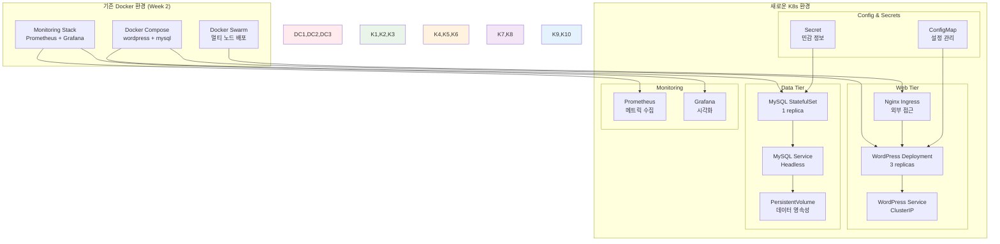

# Week 2 Day 4 Lab 2: Docker 앱의 K8s 마이그레이션 실습

<div align="center">

**🔄 마이그레이션 실습** • **📝 매니페스트 변환** • **🚀 K8s 배포**

*Week 2에서 구축한 Docker 애플리케이션을 Kubernetes로 실제 마이그레이션*

</div>

---

## 🕘 실습 정보

**시간**: 14:00-14:50 (50분)  
**목표**: Week 2에서 구축한 WordPress 시스템을 Kubernetes로 완전 마이그레이션  
**방식**: 단계별 변환 + 매니페스트 작성 + 배포 검증

---

## 🎯 심화 목표

### 🛡️ 고급 기능 구현
- Lab 1에서 구축한 K8s 환경에서 실제 애플리케이션 마이그레이션
- Docker Compose에서 K8s 매니페스트로의 체계적 변환
- 실무 환경에서 사용하는 K8s 베스트 프랙티스 적용
- 마이그레이션 후 성능과 안정성 검증

### 🏗️ 마이그레이션 대상 시스템


---

## 📋 실습 준비 (5분)

### 환경 설정
```bash
# 작업 디렉토리 생성
mkdir -p ~/k8s-migration
cd ~/k8s-migration

# Lab 1에서 구축한 K8s 클러스터 확인
kubectl get nodes
kubectl get namespaces

# 마이그레이션을 위한 네임스페이스 생성
kubectl create namespace wordpress-k8s
kubectl create namespace monitoring-k8s
```

### 마이그레이션 계획 수립
- **Phase 1**: ConfigMap과 Secret 생성 (설정 외부화)
- **Phase 2**: MySQL StatefulSet 배포 (데이터 계층)
- **Phase 3**: WordPress Deployment 배포 (애플리케이션 계층)
- **Phase 4**: Ingress 설정 (외부 접근)
- **Phase 5**: 모니터링 스택 배포 (관측성)

---

## 🔧 심화 구현 (40분)

### Step 1: 설정 및 시크릿 관리 (10분)

**🚀 자동화 스크립트 사용**
```bash
# 스크립트 실행 권한 부여
chmod +x ./lab_scripts/lab2/*.sh

# 설정 및 시크릿 자동 생성
./lab_scripts/lab2/setup_configs_secrets.sh
```

**📋 스크립트 내용**: [setup_configs_secrets.sh](./lab_scripts/lab2/setup_configs_secrets.sh)

**⏱️ 예상 소요 시간**: 1-2분

**1-1. 수동 실행 (학습용)**
```bash
# MySQL 설정을 위한 ConfigMap
cat > mysql-configmap.yaml << 'EOF'
apiVersion: v1
kind: ConfigMap
metadata:
  name: mysql-config
  namespace: wordpress-k8s
data:
  my.cnf: |
    [mysqld]
    bind-address = 0.0.0.0
    port = 3306
    character-set-server = utf8mb4
    collation-server = utf8mb4_unicode_ci
    innodb_buffer_pool_size = 256M
    innodb_log_file_size = 64M
    innodb_flush_log_at_trx_commit = 2
    max_connections = 100
    wait_timeout = 600
    slow_query_log = 1
    long_query_time = 2
EOF

# WordPress 설정을 위한 ConfigMap
cat > wordpress-configmap.yaml << 'EOF'
apiVersion: v1
kind: ConfigMap
metadata:
  name: wordpress-config
  namespace: wordpress-k8s
data:
  WORDPRESS_DB_HOST: "mysql-service:3306"
  WORDPRESS_DB_NAME: "wordpress"
  WORDPRESS_DB_USER: "wpuser"
  php.ini: |
    memory_limit = 256M
    max_execution_time = 300
    max_input_time = 300
    upload_max_filesize = 64M
    post_max_size = 64M
    max_file_uploads = 20
EOF

# 민감한 정보를 위한 Secret
cat > wordpress-secret.yaml << 'EOF'
apiVersion: v1
kind: Secret
metadata:
  name: wordpress-secret
  namespace: wordpress-k8s
type: Opaque
data:
  MYSQL_ROOT_PASSWORD: cm9vdHBhc3N3b3Jk        # rootpassword (base64)
  MYSQL_PASSWORD: d3BwYXNzd29yZA==            # wppassword (base64)
  WORDPRESS_DB_PASSWORD: d3BwYXNzd29yZA==      # wppassword (base64)
EOF

# 설정 적용
kubectl apply -f mysql-configmap.yaml
kubectl apply -f wordpress-configmap.yaml
kubectl apply -f wordpress-secret.yaml

# 생성 확인
kubectl get configmaps -n wordpress-k8s
kubectl get secrets -n wordpress-k8s
```

### Step 2: MySQL StatefulSet 배포 (10분)

**🚀 자동화 스크립트 사용**
```bash
# MySQL StatefulSet 자동 배포
./lab_scripts/lab2/deploy_mysql_statefulset.sh
```

**📋 스크립트 내용**: [deploy_mysql_statefulset.sh](./lab_scripts/lab2/deploy_mysql_statefulset.sh)

**⏱️ 예상 소요 시간**: 3-5분 (이미지 다운로드 + 초기화)

**2-1. 수동 실행 (학습용)**
```bash
# PersistentVolume 생성 (로컬 환경용)
cat > mysql-pv.yaml << 'EOF'
apiVersion: v1
kind: PersistentVolume
metadata:
  name: mysql-pv
spec:
  capacity:
    storage: 10Gi
  accessModes:
    - ReadWriteOnce
  persistentVolumeReclaimPolicy: Retain
  storageClassName: manual
  hostPath:
    path: /tmp/mysql-data
EOF

# MySQL StatefulSet
cat > mysql-statefulset.yaml << 'EOF'
apiVersion: apps/v1
kind: StatefulSet
metadata:
  name: mysql
  namespace: wordpress-k8s
spec:
  serviceName: mysql-service
  replicas: 1
  selector:
    matchLabels:
      app: mysql
  template:
    metadata:
      labels:
        app: mysql
    spec:
      containers:
      - name: mysql
        image: mysql:8.0
        ports:
        - containerPort: 3306
          name: mysql
        env:
        - name: MYSQL_DATABASE
          value: "wordpress"
        - name: MYSQL_USER
          value: "wpuser"
        - name: MYSQL_ROOT_PASSWORD
          valueFrom:
            secretKeyRef:
              name: wordpress-secret
              key: MYSQL_ROOT_PASSWORD
        - name: MYSQL_PASSWORD
          valueFrom:
            secretKeyRef:
              name: wordpress-secret
              key: MYSQL_PASSWORD
        volumeMounts:
        - name: mysql-data
          mountPath: /var/lib/mysql
        - name: mysql-config
          mountPath: /etc/mysql/conf.d/my.cnf
          subPath: my.cnf
        resources:
          requests:
            memory: "512Mi"
            cpu: "500m"
          limits:
            memory: "1Gi"
            cpu: "1000m"
        livenessProbe:
          exec:
            command:
            - mysqladmin
            - ping
            - -h
            - localhost
          initialDelaySeconds: 30
          periodSeconds: 10
        readinessProbe:
          exec:
            command:
            - mysql
            - -h
            - localhost
            - -u
            - root
            - -p$MYSQL_ROOT_PASSWORD
            - -e
            - "SELECT 1"
          initialDelaySeconds: 10
          periodSeconds: 5
      volumes:
      - name: mysql-config
        configMap:
          name: mysql-config
  volumeClaimTemplates:
  - metadata:
      name: mysql-data
    spec:
      accessModes: ["ReadWriteOnce"]
      storageClassName: manual
      resources:
        requests:
          storage: 10Gi
EOF

# MySQL Headless Service
cat > mysql-service.yaml << 'EOF'
apiVersion: v1
kind: Service
metadata:
  name: mysql-service
  namespace: wordpress-k8s
spec:
  selector:
    app: mysql
  ports:
  - port: 3306
    targetPort: 3306
  clusterIP: None  # Headless service for StatefulSet
EOF

# 배포 실행
kubectl apply -f mysql-pv.yaml
kubectl apply -f mysql-statefulset.yaml
kubectl apply -f mysql-service.yaml

# 배포 상태 확인
kubectl get statefulsets -n wordpress-k8s
kubectl get pods -n wordpress-k8s
kubectl get pvc -n wordpress-k8s
```

### Step 3: WordPress Deployment 배포 (10분)

**🚀 자동화 스크립트 사용**
```bash
# WordPress Deployment 자동 배포
./lab_scripts/lab2/deploy_wordpress_deployment.sh
```

**📋 스크립트 내용**: [deploy_wordpress_deployment.sh](./lab_scripts/lab2/deploy_wordpress_deployment.sh)

**⏱️ 예상 소요 시간**: 3-5분 (WordPress 초기화 포함)

**3-1. 수동 실행 (학습용)**
```bash
# WordPress PVC (wp-content용)
cat > wordpress-pvc.yaml << 'EOF'
apiVersion: v1
kind: PersistentVolumeClaim
metadata:
  name: wp-content-pvc
  namespace: wordpress-k8s
spec:
  accessModes:
    - ReadWriteOnce
  resources:
    requests:
      storage: 5Gi
  storageClassName: manual
EOF

# WordPress Deployment
cat > wordpress-deployment.yaml << 'EOF'
apiVersion: apps/v1
kind: Deployment
metadata:
  name: wordpress
  namespace: wordpress-k8s
  labels:
    app: wordpress
spec:
  replicas: 3
  selector:
    matchLabels:
      app: wordpress
  template:
    metadata:
      labels:
        app: wordpress
    spec:
      initContainers:
      - name: wait-for-mysql
        image: busybox:1.35
        command:
        - sh
        - -c
        - |
          until nc -z mysql-service 3306; do
            echo "Waiting for MySQL..."
            sleep 2
          done
          echo "MySQL is ready!"
      containers:
      - name: wordpress
        image: wordpress:latest
        ports:
        - containerPort: 80
        envFrom:
        - configMapRef:
            name: wordpress-config
        - secretRef:
            name: wordpress-secret
        volumeMounts:
        - name: wp-content
          mountPath: /var/www/html/wp-content
        - name: php-config
          mountPath: /usr/local/etc/php/conf.d/custom.ini
          subPath: php.ini
        resources:
          requests:
            memory: "256Mi"
            cpu: "250m"
          limits:
            memory: "512Mi"
            cpu: "500m"
        livenessProbe:
          httpGet:
            path: /wp-admin/install.php
            port: 80
          initialDelaySeconds: 60
          periodSeconds: 30
        readinessProbe:
          httpGet:
            path: /wp-admin/install.php
            port: 80
          initialDelaySeconds: 10
          periodSeconds: 10
      volumes:
      - name: wp-content
        persistentVolumeClaim:
          claimName: wp-content-pvc
      - name: php-config
        configMap:
          name: wordpress-config
EOF

# WordPress Service
cat > wordpress-service.yaml << 'EOF'
apiVersion: v1
kind: Service
metadata:
  name: wordpress-service
  namespace: wordpress-k8s
spec:
  selector:
    app: wordpress
  ports:
  - protocol: TCP
    port: 80
    targetPort: 80
  type: ClusterIP
EOF

# 배포 실행
kubectl apply -f wordpress-pvc.yaml
kubectl apply -f wordpress-deployment.yaml
kubectl apply -f wordpress-service.yaml

# 배포 상태 확인
kubectl get deployments -n wordpress-k8s
kubectl get pods -n wordpress-k8s
kubectl get services -n wordpress-k8s
```

### Step 4: Ingress 및 외부 접근 설정 (10분)

**🚀 자동화 스크립트 사용**
```bash
# Ingress 및 외부 접근 자동 설정
./lab_scripts/lab2/setup_ingress_access.sh
```

**📋 스크립트 내용**: [setup_ingress_access.sh](./lab_scripts/lab2/setup_ingress_access.sh)

**⏱️ 예상 소요 시간**: 3-5분 (Ingress Controller 설치 포함)

**4-1. 수동 실행 (학습용)**
```bash
# Ingress Controller 설치 (NGINX)
kubectl apply -f https://raw.githubusercontent.com/kubernetes/ingress-nginx/controller-v1.8.1/deploy/static/provider/kind/deploy.yaml

# Ingress Controller 준비 대기
kubectl wait --namespace ingress-nginx \
  --for=condition=ready pod \
  --selector=app.kubernetes.io/component=controller \
  --timeout=90s

# WordPress Ingress
cat > wordpress-ingress.yaml << 'EOF'
apiVersion: networking.k8s.io/v1
kind: Ingress
metadata:
  name: wordpress-ingress
  namespace: wordpress-k8s
  annotations:
    nginx.ingress.kubernetes.io/rewrite-target: /
    nginx.ingress.kubernetes.io/ssl-redirect: "false"
spec:
  rules:
  - host: wordpress.local
    http:
      paths:
      - path: /
        pathType: Prefix
        backend:
          service:
            name: wordpress-service
            port:
              number: 80
  - http:  # Default backend for IP access
      paths:
      - path: /
        pathType: Prefix
        backend:
          service:
            name: wordpress-service
            port:
              number: 80
EOF

kubectl apply -f wordpress-ingress.yaml

# 접근 테스트를 위한 포트 포워딩
kubectl port-forward --namespace ingress-nginx service/ingress-nginx-controller 8080:80 &

echo "WordPress 접근 URL:"
echo "- http://localhost:8080"
echo "- http://wordpress.local:8080 (hosts 파일 설정 필요)"
```

---

## ✅ 심화 체크포인트

### 고급 기능 구현
- [ ] **StatefulSet**: MySQL의 상태 유지와 데이터 영속성
- [ ] **ConfigMap/Secret**: 설정과 민감 정보의 분리 관리
- [ ] **InitContainer**: 의존성 관리와 초기화 작업
- [ ] **Ingress**: HTTP 라우팅과 외부 접근 관리

### 실무 환경 연동
- [ ] **리소스 관리**: CPU/Memory Requests/Limits 적절 설정
- [ ] **헬스 체크**: Liveness/Readiness Probe 정상 동작
- [ ] **볼륨 관리**: PV/PVC를 통한 데이터 영속성 보장
- [ ] **네트워킹**: Service와 Ingress를 통한 트래픽 관리

### 성능 최적화
- [ ] **스케일링**: WordPress Pod의 수평 확장
- [ ] **리소스 효율성**: 적절한 리소스 할당과 활용
- [ ] **네트워크 최적화**: Service 타입과 Ingress 설정
- [ ] **스토리지 최적화**: PV 타입과 성능 고려

### 베스트 프랙티스
- [ ] **보안**: Secret을 통한 민감 정보 관리
- [ ] **가용성**: 멀티 Pod 배포와 헬스 체크
- [ ] **관리성**: 네임스페이스와 라벨을 통한 리소스 조직화
- [ ] **모니터링**: 로그와 메트릭 수집 준비

---

## 🎤 결과 발표 및 회고 (5분)

### 시연
- **마이그레이션 완료**: Docker → K8s 전환 성공 시연
- **기능 검증**: WordPress 설치와 기본 기능 동작 확인
- **스케일링**: Pod 수 조정과 로드밸런싱 테스트
- **데이터 영속성**: Pod 재시작 후 데이터 보존 확인

### 기술적 인사이트
- **아키텍처 변화**: Docker Compose → K8s 매니페스트 변환 경험
- **상태 관리**: Stateless vs Stateful 워크로드의 차이점
- **네트워킹**: K8s 네트워킹 모델과 Service 추상화
- **스토리지**: PV/PVC를 통한 데이터 관리 방식

### 베스트 프랙티스
- **설정 관리**: ConfigMap/Secret을 통한 외부화
- **의존성 관리**: InitContainer를 통한 순서 제어
- **리소스 관리**: 적절한 Requests/Limits 설정
- **보안 고려**: 최소 권한 원칙과 네트워크 격리

### 문제 해결 경험
- **배포 이슈**: Pod 시작 실패와 디버깅 방법
- **네트워킹**: Service 연결과 DNS 해결
- **스토리지**: PV/PVC 바인딩 문제 해결
- **성능**: 리소스 부족과 최적화 방법

### 향후 발전 방향
- **Week 3 준비**: K8s 고급 기능 학습 계획
- **실무 적용**: 실제 프로젝트에서의 K8s 도입 전략
- **자동화**: CI/CD 파이프라인과 GitOps 연계
- **모니터링**: Prometheus/Grafana K8s 통합

---

## 🧹 실습 환경 정리

**실습 완료 후 정리**
```bash
# 모든 실습 환경 자동 정리
./lab_scripts/lab2/cleanup.sh
```

**📋 스크립트 내용**: [cleanup.sh](./lab_scripts/lab2/cleanup.sh)

**⏱️ 예상 소요 시간**: 2-3분 (사용자 확인 포함)

---

<div align="center">

**🔄 Docker → K8s 마이그레이션 완료!**

**축하합니다! Week 2 전체 과정을 완주하고 Kubernetes 여정을 시작할 준비가 되었습니다!**

**다음**: [Week 3 - Kubernetes 운영과 관리](../../week_03/README.md)

</div>