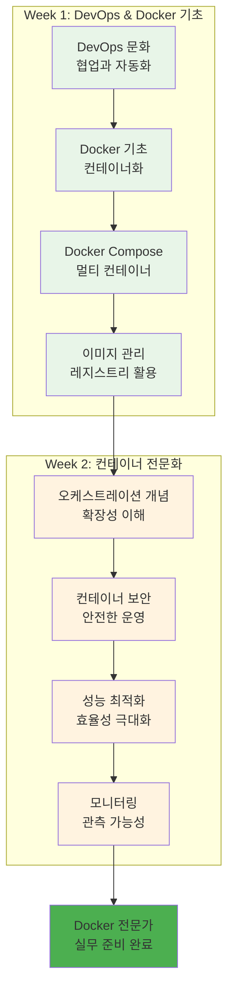
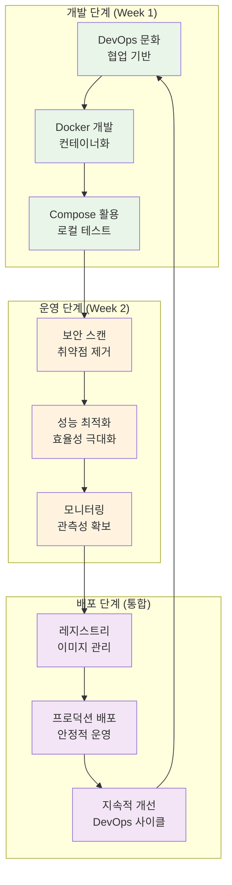
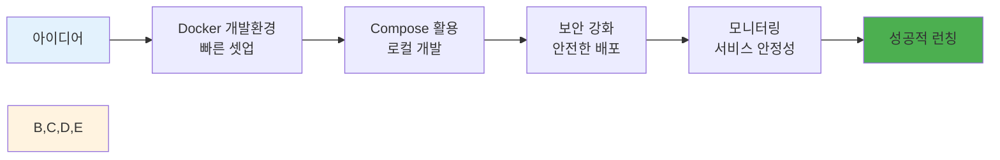
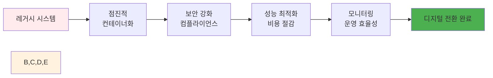
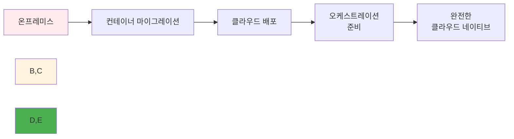

# Week 2 Day 4 Session 1: Week 1-2 핵심 개념 통합 정리

**🔄 통합 정리** • **📚 지식 체계화**
*Week 1-2에서 학습한 모든 개념의 통합적 이해*

---

## 🕘 세션 정보
**시간**: 09:00-09:50 (50분)
**목표**: Week 1-2에서 학습한 모든 개념의 통합적 이해
**방식**: 이론 강의 + 페어 토론

## 🎯 세션 목표
### 📚 학습 목표
- **이해 목표**: Week 1-2에서 학습한 모든 개념의 통합적 이해
- **적용 목표**: 개별 기술들을 연결하여 완전한 시스템 구축 능력
- **협업 목표**: 개별 학습 후 경험 공유 및 질의응답

### 🤔 왜 필요한가? (5분)
**현실 문제 상황**:
- 💼 **기술 파편화**: 개별 기술은 알지만 통합 활용이 어려운 현실
- 🏠 **일상 비유**: 요리 재료는 많지만 완전한 요리를 만들지 못하는 상황
- 📊 **시장 동향**: 통합적 사고와 시스템 설계 능력을 요구하는 현대 개발 환경

## 📖 핵심 개념 (35분)

### 🔍 개념 1: DevOps 문화에서 Docker 마스터리까지의 여정 (12분)
> **정의**: DevOps 철학부터 현대적 컨테이너 기술 완전 활용까지의 기술 진화 과정

**기술 진화 맵**:

**학습 성과 체크**:
- **DevOps 문화**: 협업과 자동화의 중요성 완전 내재화 ✅
- **Docker 기술**: 컨테이너 생태계 전문가 수준 활용 ✅
- **보안 및 최적화**: 실무 수준의 운영 역량 완성 ✅
- **모니터링**: 포괄적인 관측성 구축 능력 ✅

### 🔍 개념 2: 통합 Docker 워크플로우 (12분)
> **정의**: Week 1-2에서 학습한 모든 기술을 통합한 완전한 개발-운영 워크플로우

**통합 워크플로우**:

**워크플로우 단계별 통합**:
1. **개발**: DevOps 문화 + Docker 컨테이너화
2. **보안**: 이미지 스캔 + 런타임 보안 강화
3. **최적화**: 성능 튜닝 + 리소스 효율성
4. **운영**: 모니터링 + 지속적 개선
5. **협업**: 팀 기반 문제 해결 + 지식 공유

### 🔍 개념 3: 실무 적용 시나리오 (11분)
> **정의**: 학습한 기술들을 실제 업무 환경에서 적용하는 구체적인 시나리오

**실무 시나리오별 적용**:

**시나리오 1: 스타트업 기술 스택 구축**

**시나리오 2: 기업 레거시 시스템 현대화**

**시나리오 3: 클라우드 네이티브 전환**

## 💭 함께 생각해보기 (10분)

### 🤝 페어 토론 (5분)
**토론 주제**:
1. **학습 성과**: "Week 1-2에서 가장 큰 성장을 느낀 부분은?"
2. **기술 연결**: "각 기술들이 어떻게 서로 연결되어 시너지를 만드나요?"
3. **실무 적용**: "현재 회사나 프로젝트에 어떤 기술을 먼저 적용하고 싶나요?"

### 🎯 전체 공유 (5분)
- **성장 인식**: 개인별 학습 성과와 성장 포인트
- **통합 이해**: 기술 스택의 통합적 활용 방안

## 🔑 핵심 키워드
- **DevOps Culture**: DevOps 문화
- **Container Orchestration**: 컨테이너 오케스트레이션
- **Security by Design**: 설계 단계부터의 보안
- **Performance Optimization**: 성능 최적화
- **Observability**: 관측성

## 📝 세션 마무리
### ✅ 오늘 세션 성과
- Week 1-2 전체 학습 내용 통합 정리
- 기술 간 연결고리와 시너지 효과 이해
- 실무 적용 시나리오별 활용 방안 습득

### 🎯 다음 세션 준비
- **Session 2**: 실무 Docker 워크플로우
- **연결**: 통합 이해에서 실무 적용으로

---

**다음**: [Session 2 - 실무 Docker 워크플로우](./session_2.md)