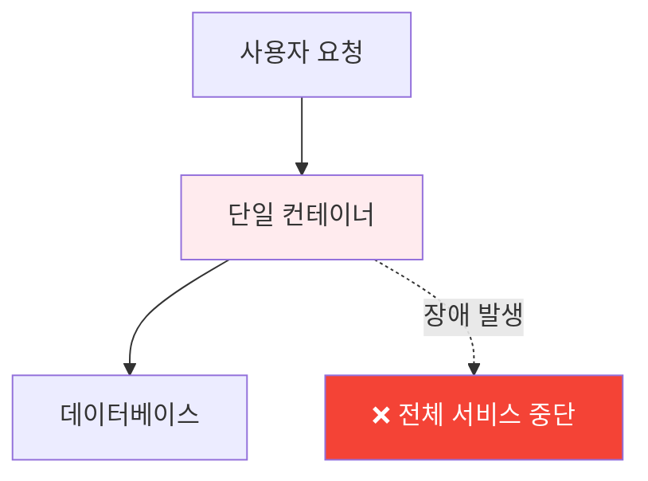
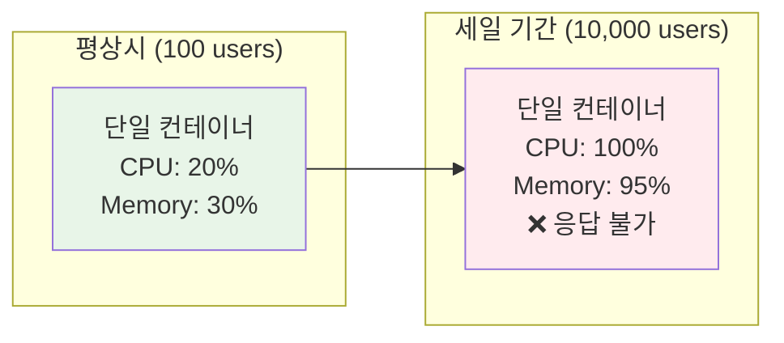
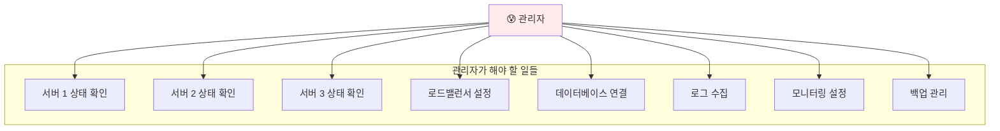

# Week 2 Day 4 Session 1: 단일 컨테이너 운영의 한계점

<div align="center">
**💔 한계 인식** • **🔍 문제 분석**
*단일 컨테이너로는 해결할 수 없는 실무 문제들*
</div>

---

## 🕘 세션 정보
**시간**: 09:00-09:50 (50분)
**목표**: 단일 컨테이너 운영의 한계점 완전 이해
**방식**: 실무 시나리오 중심 학습

## 🎯 세션 목표
### 📚 학습 목표
- **문제 인식**: 단일 컨테이너 운영의 근본적 한계 이해
- **실무 연계**: 실제 운영 환경에서 발생하는 문제 상황 파악
- **해결 동기**: 오케스트레이션이 필요한 이유 완전 공감

### 🤔 왜 필요한가? (5분)
**실무 시나리오**:
```
상황: 온라인 쇼핑몰 운영 중
- 평소 트래픽: 100명/분
- 세일 기간: 10,000명/분 (100배 증가)
- 현재 구성: 단일 웹서버 컨테이너

문제 발생:
1. 서버 과부하로 응답 속도 저하
2. 컨테이너 크래시 발생
3. 수동 재시작 중 서비스 중단
4. 고객 불만과 매출 손실
```

## 📖 핵심 개념 (35분)

### 🔍 개념 1: 고가용성(High Availability) 문제 (12분)

#### 💔 단일 장애점(SPOF) 문제


**실제 문제 상황들**:
- **컨테이너 크래시**: 메모리 부족, 애플리케이션 오류
- **호스트 장애**: 서버 하드웨어 문제, OS 크래시
- **네트워크 문제**: 연결 끊김, 포트 충돌
- **업데이트 다운타임**: 새 버전 배포 시 서비스 중단

#### 🔧 현재 해결 방법의 한계
```bash
# 수동 재시작 - 사람이 직접 해야 함
docker restart my-app

# 백업 서버 준비 - 복잡한 설정
docker run -d --name backup-app my-app:latest

# 로드밸런서 설정 - 수동 관리 필요
nginx.conf 수정 → 재시작 → 테스트
```

### 🔍 개념 2: 확장성(Scalability) 문제 (12분)

#### 📈 트래픽 급증 시나리오


**수동 스케일링의 문제점**:
- **반응 속도**: 문제 인지 → 분석 → 대응까지 시간 소요
- **예측 어려움**: 언제 트래픽이 급증할지 예측 불가
- **리소스 낭비**: 과도한 사전 준비 또는 부족한 대응
- **운영 복잡성**: 여러 인스턴스 수동 관리의 어려움

#### 💰 비용 효율성 문제
```
시나리오 1: 과도한 사전 준비
- 최대 트래픽 대비 10개 서버 상시 운영
- 평상시 90% 리소스 낭비
- 월 비용: $1,000 (실제 필요: $100)

시나리오 2: 부족한 준비
- 평상시 기준 1개 서버 운영
- 트래픽 급증 시 서비스 장애
- 기회 비용: 매출 손실 $10,000
```

### 🔍 개념 3: 운영 복잡성(Operational Complexity) 문제 (11분)

#### 🏗️ 멀티 서버 관리의 어려움


**설정 동기화 문제**:
```bash
# 서버마다 다른 설정 파일
server1: app.conf (version 1.2)
server2: app.conf (version 1.1) ← 업데이트 누락
server3: app.conf (version 1.3) ← 잘못된 버전

# 결과: 서버마다 다른 동작
```

**배포 프로세스의 복잡성**:
```
1. 새 버전 빌드
2. 각 서버에 개별 배포
3. 서버별 재시작 (순차적으로)
4. 헬스체크 수동 확인
5. 문제 발생 시 롤백 (수동)
6. 로드밸런서 설정 업데이트
```

## 💭 함께 생각해보기 (10분)

### 🤝 페어 토론 (5분)
**토론 주제**:
1. **경험 공유**: "지금까지 경험한 시스템 장애나 운영 문제는?"
2. **문제 분석**: "단일 서버/컨테이너 운영에서 가장 큰 어려움은?"
3. **이상적 시스템**: "자동으로 해결되었으면 하는 문제들은?"

**페어 활동 가이드**:
- 👥 **경험 중심**: 실제 겪었던 문제나 들어본 사례
- 🔄 **상호 질문**: "그때 어떻게 해결했나요?"
- 📝 **문제 정리**: 공통으로 나타나는 문제 패턴 파악

### 🎯 전체 공유 (5분)
**공유 내용**:
- **공통 문제**: 여러 팀에서 나타나는 비슷한 문제들
- **해결 시도**: 각자 시도해본 해결 방법들
- **한계 인식**: 현재 방법으로는 해결하기 어려운 부분들

**💡 이해도 체크 질문**:
- ✅ "단일 컨테이너 운영의 3가지 주요 문제를 설명할 수 있나요?"
- ✅ "왜 수동 관리로는 한계가 있는지 이해했나요?"
- ✅ "자동화된 해결책이 필요한 이유에 공감하나요?"

## 🔑 핵심 키워드

### 🆕 새로운 용어
- **SPOF (Single Point of Failure)**: 단일 장애점 - 하나 실패하면 전체 실패
- **고가용성(High Availability)**: 시스템이 지속적으로 운영되는 능력
- **확장성(Scalability)**: 증가하는 부하를 처리할 수 있는 능력
- **운영 복잡성(Operational Complexity)**: 시스템 관리의 어려움 정도

### 🔤 실무 용어
- **다운타임(Downtime)**: 서비스가 중단된 시간
- **트래픽 스파이크(Traffic Spike)**: 갑작스러운 트래픽 급증
- **수동 스케일링(Manual Scaling)**: 사람이 직접 서버 추가/제거
- **설정 드리프트(Configuration Drift)**: 서버별 설정 차이 발생

## 📝 세션 마무리

### ✅ 오늘 세션 성과
- [x] 단일 컨테이너 운영의 3가지 주요 한계점 이해
- [x] 실무에서 발생하는 구체적 문제 상황 파악
- [x] 현재 해결 방법의 한계와 문제점 인식
- [x] 자동화된 해결책의 필요성 공감

### 🎯 다음 세션 준비
**Session 2 연결점**:
- 오늘 확인한 문제들을 해결하는 **오케스트레이션** 개념 학습
- 자동화된 관리, 확장, 복구가 어떻게 가능한지 이해
- Docker Swarm과 Kubernetes가 제공하는 해결책 탐구

**미리 생각해볼 질문**:
- "이런 문제들을 자동으로 해결할 수 있다면?"
- "컨테이너들이 스스로 관리된다면 어떨까?"
- "사람의 개입 없이 장애 복구가 가능하다면?"