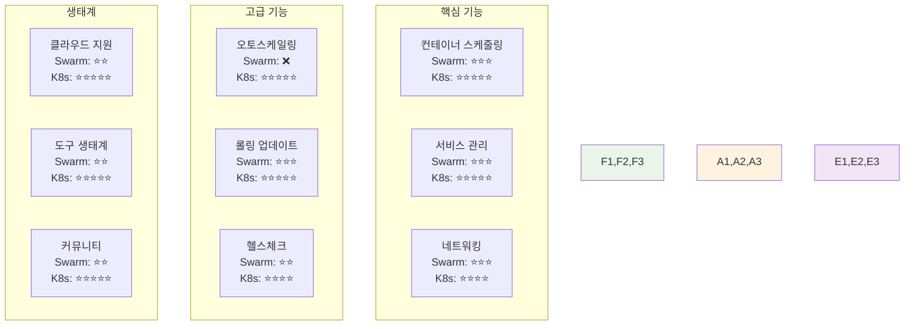

# Week 2 Day 4 Session 1: Docker vs Kubernetes 비교 분석

<div align="center">

**🐳 Docker Swarm** • **☸️ Kubernetes** • **⚖️ 선택 기준**

*오케스트레이션 도구의 특징과 적절한 선택을 위한 비교 분석*

</div>

---

## 🕘 세션 정보

**시간**: 09:00-09:50 (50분)  
**목표**: Docker Swarm과 Kubernetes의 차이점을 이해하고 상황별 선택 기준 습득  
**방식**: 비교 분석 + 실무 사례 + 선택 가이드

---

## 🎯 세션 목표

### 📚 학습 목표
- **이해 목표**: Docker Swarm과 Kubernetes의 아키텍처와 특징 완전 비교
- **적용 목표**: 프로젝트 요구사항에 따른 적절한 오케스트레이션 도구 선택 능력
- **협업 목표**: 팀별 오케스트레이션 전략 수립과 의사결정 경험

### 🤔 왜 필요한가? (5분)

**현실 문제 상황**:
- 💼 **실무 시나리오**: "우리 프로젝트에는 Docker Swarm과 Kubernetes 중 무엇이 적합할까요?"
- 🏠 **일상 비유**: 자전거와 자동차 중 선택하는 것처럼, 목적과 상황에 따른 최적 선택
- 📊 **시장 동향**: 컨테이너 오케스트레이션 도구의 다양화와 선택의 중요성

**학습 전후 비교**:


---

## 📖 핵심 개념 (35분)

### 🔍 개념 1: 아키텍처와 복잡성 비교 (12분)

> **정의**: 컨테이너 오케스트레이션 도구의 구조적 차이와 운영 복잡성 분석

**아키텍처 비교**:


**상세 비교표**:

| 구분 | Docker Swarm | Kubernetes |
|------|--------------|------------|
| **설치 복잡도** | 매우 간단 (`docker swarm init`) | 복잡 (여러 구성요소 설치) |
| **학습 곡선** | 낮음 (Docker 지식 활용) | 높음 (새로운 개념 다수) |
| **클러스터 구성** | Manager/Worker 단순 구조 | Control Plane/Worker 복잡 구조 |
| **네트워킹** | 내장 오버레이 네트워크 | CNI 플러그인 선택 필요 |
| **로드밸런싱** | 내장 라운드로빈 | Ingress Controller 별도 설정 |
| **서비스 디스커버리** | DNS 기반 자동 | DNS + Service 오브젝트 |

**실무 적용 사례**:
- **스타트업**: Docker Swarm으로 빠른 프로토타입 구축
- **중견기업**: Kubernetes로 확장 가능한 플랫폼 구축
- **대기업**: Kubernetes 기반 멀티 클라우드 전략

### 🔍 개념 2: 기능과 생태계 비교 (12분)

> **정의**: 각 오케스트레이션 도구가 제공하는 기능의 범위와 생태계 지원 현황

**기능 비교 매트릭스**:


**세부 기능 비교**:

**Docker Swarm 강점**:
- **간단한 설정**: Docker CLI 명령어로 모든 작업 가능
- **빠른 배포**: 복잡한 설정 없이 즉시 서비스 배포
- **Docker 통합**: Docker Compose 파일 직접 사용 가능
- **내장 보안**: TLS 암호화 자동 적용

**Kubernetes 강점**:
- **풍부한 기능**: ConfigMap, Secret, PV/PVC 등 다양한 오브젝트
- **확장성**: 수천 개 노드까지 확장 가능
- **생태계**: Helm, Istio, Prometheus 등 풍부한 도구
- **클라우드 지원**: 모든 주요 클라우드에서 관리형 서비스 제공

**실제 기업 선택 사례**:
- **GitLab**: Docker Swarm에서 Kubernetes로 마이그레이션
- **Docker Inc**: 자체 제품에서도 Kubernetes 지원 강화
- **CNCF**: Kubernetes를 클라우드 네이티브 표준으로 채택

### 🔍 개념 3: 선택 기준과 마이그레이션 전략 (11분)

> **정의**: 프로젝트 요구사항과 조직 상황에 따른 오케스트레이션 도구 선택 가이드라인

**선택 기준 결정 트리**:


**상황별 선택 가이드**:

**Docker Swarm을 선택해야 하는 경우**:
- 🚀 **빠른 시작**: 프로토타입이나 MVP 개발
- 👥 **소규모 팀**: 5명 이하의 개발팀
- 🎯 **단순한 요구사항**: 기본적인 컨테이너 오케스트레이션만 필요
- 💰 **제한된 리소스**: 학습 시간과 운영 인력이 부족
- 🔧 **Docker 중심**: 기존 Docker 워크플로우 유지 필요

**Kubernetes를 선택해야 하는 경우**:
- 🏢 **엔터프라이즈**: 대규모 프로덕션 환경
- 📈 **확장성**: 수백 개 이상의 서비스 운영 예정
- ☁️ **클라우드 네이티브**: 멀티 클라우드 전략 필요
- 🛠️ **풍부한 기능**: 고급 스케줄링, 오토스케일링 필요
- 🌐 **생태계 활용**: Helm, Istio 등 K8s 생태계 도구 사용

**마이그레이션 전략**:

**Phase 1: 준비 단계**
```yaml
# 현재 상태 분석
assessment:
  - docker_compose_services: 15개
  - swarm_services: 8개
  - data_volumes: 5개
  - custom_networks: 3개

# 마이그레이션 우선순위
priority:
  1. stateless_services    # 웹 서버, API
  2. stateful_services     # 데이터베이스
  3. networking_config     # 서비스 간 통신
  4. storage_migration     # 데이터 마이그레이션
```

**Phase 2: 점진적 전환**
- **하이브리드 운영**: Docker Swarm과 K8s 동시 운영
- **서비스별 이전**: 위험도가 낮은 서비스부터 순차 이전
- **데이터 동기화**: 실시간 데이터 동기화로 무중단 전환
- **트래픽 분할**: 로드밸런서를 통한 점진적 트래픽 이전

**Phase 3: 완전 전환**
- **모니터링 강화**: 성능과 안정성 지속 모니터링
- **롤백 계획**: 문제 발생 시 즉시 롤백 가능한 체계
- **팀 교육**: K8s 운영을 위한 팀 역량 강화
- **문서화**: 새로운 운영 절차와 가이드 문서화

---

## 💭 함께 생각해보기 (10분)

### 🤝 페어 토론 (5분)

**토론 주제**:
1. **프로젝트 선택**: "현재 진행 중인 프로젝트라면 어떤 오케스트레이션 도구를 선택하시겠어요?"
2. **마이그레이션 계획**: "Docker Swarm에서 Kubernetes로 이전한다면 어떤 순서로 진행하시겠어요?"
3. **학습 전략**: "Kubernetes를 효과적으로 학습하기 위한 개인별 전략은?"

**페어 활동 가이드**:
- 👥 **실무 관점**: 실제 프로젝트 상황을 가정한 토론
- 🔄 **의사결정**: 구체적인 선택 기준과 근거 제시
- 📝 **전략 수립**: 학습과 적용을 위한 구체적 계획 수립

### 🎯 전체 공유 (5분)

**인사이트 공유**:
- **선택 경험**: 실제 프로젝트에서의 도구 선택 경험과 결과
- **마이그레이션 아이디어**: 창의적이고 실용적인 전환 전략
- **학습 팁**: 효과적인 Kubernetes 학습 방법

**💡 이해도 체크 질문**:
- ✅ "Docker Swarm과 Kubernetes의 주요 차이점 3가지를 설명할 수 있나요?"
- ✅ "프로젝트 요구사항에 따른 오케스트레이션 도구 선택 기준을 제시할 수 있나요?"
- ✅ "Docker에서 Kubernetes로의 마이그레이션 전략을 수립할 수 있나요?"

---

## 🔑 핵심 키워드

### 🆕 새로운 용어
- **Container Orchestration**: 컨테이너 오케스트레이션, 컨테이너 관리 자동화
- **Control Plane**: Kubernetes의 관리 계층
- **CNI (Container Network Interface)**: 컨테이너 네트워크 인터페이스
- **CRI (Container Runtime Interface)**: 컨테이너 런타임 인터페이스

### 🔤 비교 분석 용어
- **Learning Curve**: 학습 곡선, 기술 습득의 난이도
- **Ecosystem**: 생태계, 관련 도구와 커뮤니티
- **Vendor Lock-in**: 특정 벤더에 종속되는 현상
- **Migration Strategy**: 마이그레이션 전략, 시스템 전환 계획

### 🔤 의사결정 용어
- **Trade-off**: 상충관계, 장단점 균형
- **TCO (Total Cost of Ownership)**: 총 소유 비용
- **ROI (Return on Investment)**: 투자 수익률
- **Risk Assessment**: 위험 평가

---

## 📝 세션 마무리

### ✅ 오늘 세션 성과
- **비교 분석**: Docker Swarm과 Kubernetes의 체계적 비교 완료
- **선택 기준**: 프로젝트 요구사항에 따른 도구 선택 가이드라인 습득
- **마이그레이션**: 단계적 전환 전략과 실무 고려사항 이해

### 🎯 다음 세션 준비
- **Session 2 연결**: 오케스트레이션 비교 → Kubernetes 아키텍처 심화
- **실습 준비**: 오후 실습에서 실제 K8s 환경 구축 경험
- **심화 학습**: K8s 핵심 개념과 구성 요소 상세 학습

### 🔮 실무 적용 계획
- **도구 선택**: 현재 또는 미래 프로젝트의 오케스트레이션 전략 수립
- **학습 계획**: Kubernetes 학습을 위한 개인별 로드맵 작성
- **마이그레이션**: 기존 Docker 환경의 K8s 전환 계획 수립

---

<div align="center">

**☸️ 다음 세션**: [Session 2 - Kubernetes 아키텍처 & 핵심 개념](./session_2.md)

**🛠️ 오후 실습**: [Lab 1 - K8s 환경 구축 & 기본 배포](./lab_1.md)

</div>