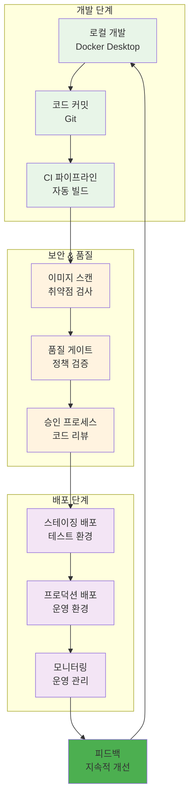
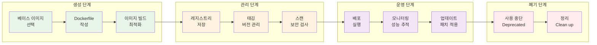
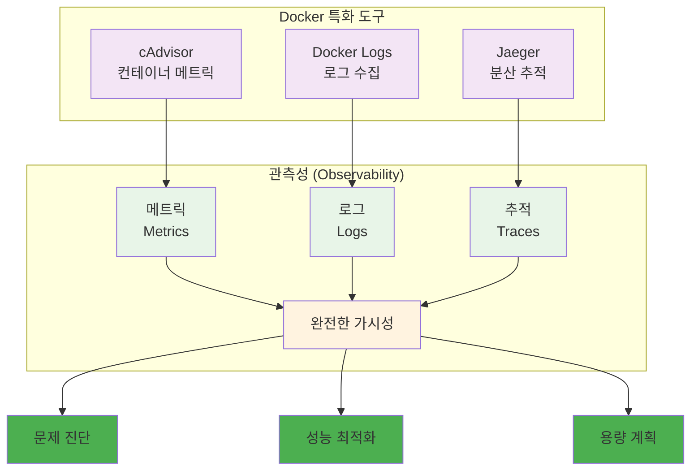

# Week 2 Day 4 Session 2: 실무 Docker 워크플로우와 베스트 프랙티스

<div align="center">
**🏢 실무 워크플로우** • **⚙️ 베스트 프랙티스**
*실제 업무 환경에서 사용되는 Docker 워크플로우 완전 이해*
</div>

---

## 🕘 세션 정보
**시간**: 10:00-10:50 (50분)
**목표**: 실제 업무 환경에서 사용되는 Docker 워크플로우 완전 이해
**방식**: 이론 강의 + 페어 토론

## 🎯 세션 목표
### 📚 학습 목표
- **이해 목표**: 실제 업무 환경에서 사용되는 Docker 워크플로우 완전 이해
- **적용 목표**: 엔터프라이즈급 Docker 운영 방법론 습득
- **협업 목표**: 개별 학습 후 경험 공유 및 질의응답

## 📖 핵심 개념 (35분)

### 🔍 개념 1: 엔터프라이즈 Docker 워크플로우 (12분)
> **정의**: 대규모 조직에서 사용되는 체계적이고 안전한 Docker 운영 프로세스

**엔터프라이즈 워크플로우**:


**워크플로우 단계별 상세**:

**1. 개발 단계**
- **로컬 개발**: Docker Desktop + VS Code Dev Containers
- **환경 일관성**: 개발/테스트/운영 환경 동일성 보장
- **빠른 피드백**: Hot reload와 실시간 디버깅

**2. CI/CD 통합**
- **자동 빌드**: Git push 시 자동 이미지 빌드
- **병렬 처리**: 멀티스테이지 빌드로 빌드 시간 단축
- **아티팩트 관리**: 이미지 태깅과 버전 관리

**3. 보안 통합**
- **Shift-Left**: 개발 초기 단계부터 보안 검사
- **자동화**: 파이프라인에 보안 스캔 통합
- **정책 적용**: 조직 보안 정책 자동 적용

### 🔍 개념 2: Docker 이미지 라이프사이클 관리 (12분)
> **정의**: 이미지 생성부터 폐기까지의 전체 생명주기를 체계적으로 관리하는 방법

**이미지 라이프사이클**:


**라이프사이클 관리 도구**:
- **Harbor**: 엔터프라이즈 레지스트리
- **Notary**: 이미지 서명과 검증
- **Trivy**: 취약점 스캔
- **Portainer**: 컨테이너 관리 UI

**이미지 태깅 전략**:
```bash
# 시맨틱 버저닝
myapp:1.2.3
myapp:1.2
myapp:1
myapp:latest

# Git 기반 태깅
myapp:main-abc123f
myapp:feature-new-ui-def456a

# 환경별 태깅
myapp:1.2.3-dev
myapp:1.2.3-staging
myapp:1.2.3-prod
```

### 🔍 개념 3: 운영 모니터링과 관측성 (11분)
> **정의**: 컨테이너 환경에서의 포괄적인 관측성 확보 방안

**관측성 3요소**:


**모니터링 베스트 프랙티스**:
- **SLI/SLO 정의**: 서비스 수준 지표와 목표
- **알림 전략**: 중요도별 알림 체계
- **대시보드**: 역할별 맞춤 대시보드
- **자동 대응**: 임계치 기반 자동 스케일링

**실무 모니터링 설정**:
```yaml
# docker-compose.monitoring.yml
version: '3.8'
services:
  prometheus:
    image: prom/prometheus:latest
    ports:
      - "9090:9090"
    volumes:
      - ./prometheus.yml:/etc/prometheus/prometheus.yml
    command:
      - '--config.file=/etc/prometheus/prometheus.yml'
      - '--storage.tsdb.retention.time=30d'
      - '--web.enable-lifecycle'
  
  grafana:
    image: grafana/grafana:latest
    ports:
      - "3000:3000"
    environment:
      - GF_SECURITY_ADMIN_PASSWORD=admin
    volumes:
      - grafana-data:/var/lib/grafana
      - ./grafana/provisioning:/etc/grafana/provisioning

volumes:
  grafana-data:
```

## 💭 함께 생각해보기 (15분)

### 🤝 페어 토론 (10분)
**토론 주제**:
1. **워크플로우 설계**: "우리 조직에 맞는 Docker 워크플로우는 어떻게 설계해야 할까요?"
2. **보안 통합**: "개발 속도와 보안 사이의 균형을 어떻게 맞출까요?"
3. **모니터링 전략**: "가장 중요하게 모니터링해야 할 지표는 무엇일까요?"

### 🎯 전체 공유 (5분)
- **실무 적용**: 효과적인 Docker 운영 전략
- **조직 적용**: 팀/조직별 맞춤 워크플로우

## 🔑 핵심 키워드
- **Enterprise Workflow**: 엔터프라이즈 워크플로우
- **Image Lifecycle**: 이미지 라이프사이클
- **Semantic Versioning**: 시맨틱 버저닝
- **Container Registry**: 컨테이너 레지스트리
- **Observability Stack**: 관측성 스택

## 📝 세션 마무리
### ✅ 오늘 세션 성과
- 엔터프라이즈급 Docker 워크플로우 완전 이해
- 이미지 라이프사이클 관리 방법론 습득
- 실무 모니터링 및 관측성 구축 방안 학습

### 🎯 다음 세션 준비
- **Session 3**: 오케스트레이션 준비 & 로드맵
- **연결**: Docker 전문가에서 오케스트레이션으로

---

**다음**: [Session 3 - 오케스트레이션 준비 & 로드맵](./session_3.md)