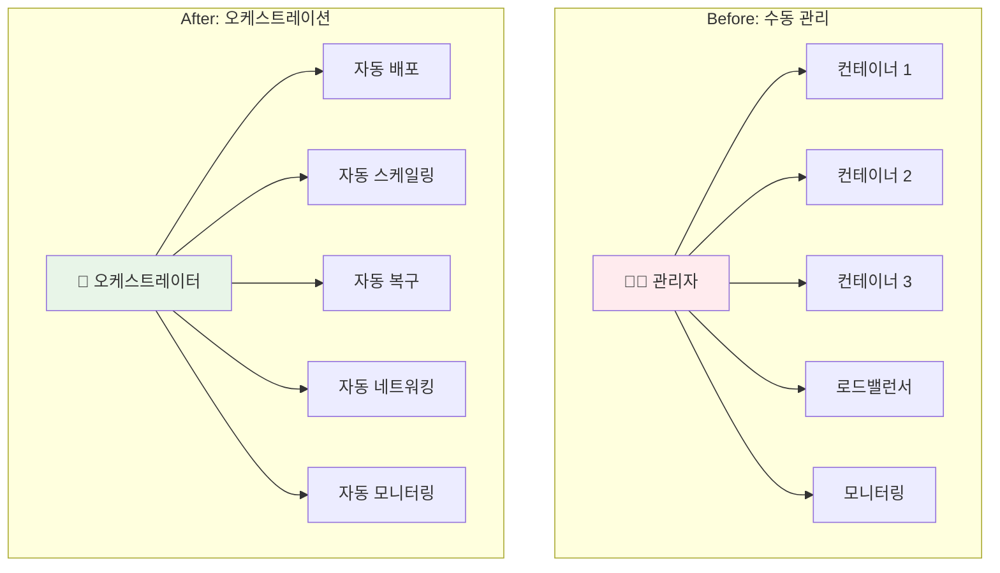
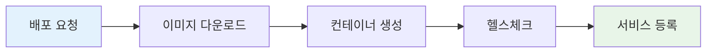
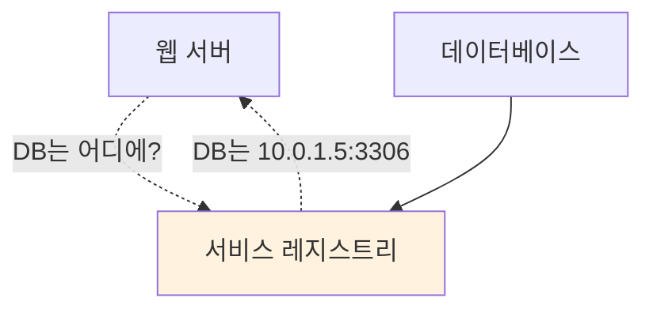
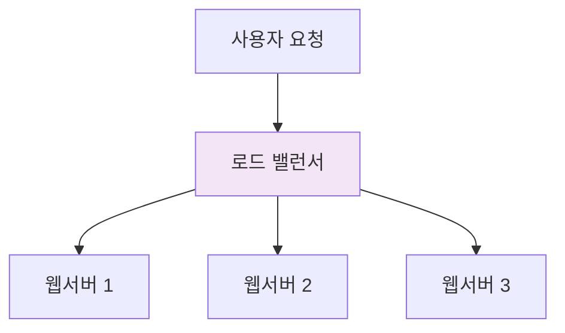
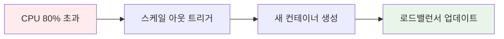
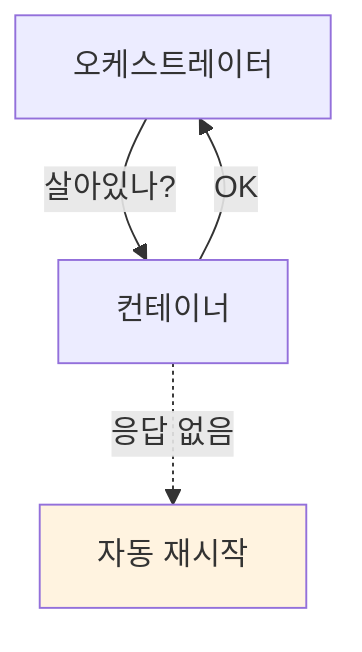
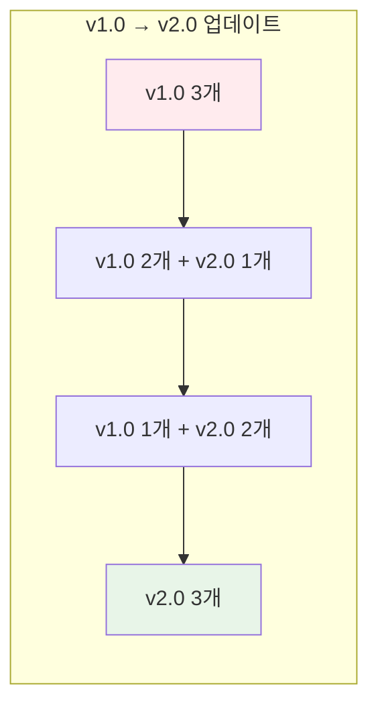
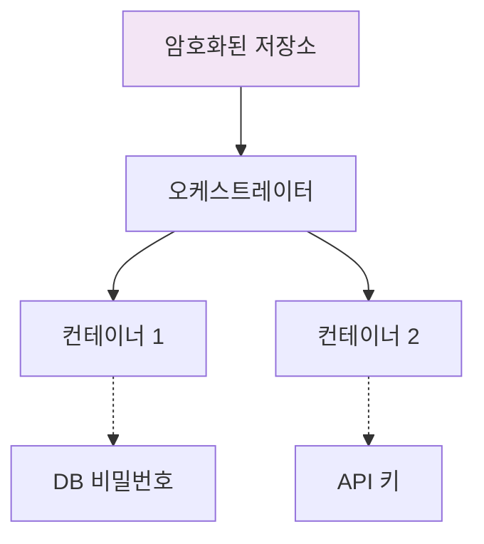
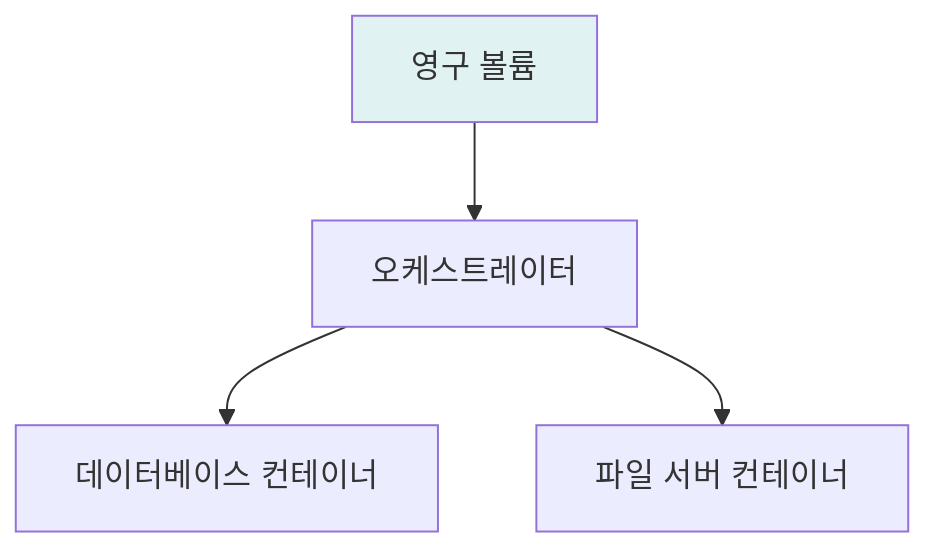
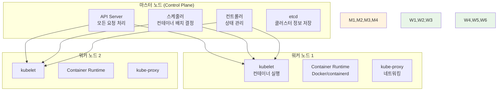

# Week 2 Day 4 Session 2: 오케스트레이션 개념과 핵심 기능

<div align="center">
**🎼 오케스트레이션** • **🤖 자동화**
*컨테이너들의 조화로운 협업을 위한 지휘자*
</div>

---

## 🕘 세션 정보
**시간**: 10:00-10:50 (50분)
**목표**: 오케스트레이션 핵심 개념과 기능 완전 이해
**방식**: 개념 설명 + 시각화 + 실무 사례

## 🎯 세션 목표
### 📚 학습 목표
- **오케스트레이션 정의**: 컨테이너 오케스트레이션의 정확한 개념 이해
- **핵심 기능**: 8가지 핵심 기능과 각각의 역할 파악
- **아키텍처**: 마스터-워커 구조와 동작 원리 이해

### 🤔 왜 필요한가? (5분)
**음악 오케스트라 비유**:
```
🎼 오케스트라 = 컨테이너 오케스트레이션

지휘자 (Orchestrator)
├── 악보 해석 (배포 계획)
├── 연주자 관리 (컨테이너 관리)
├── 템포 조절 (스케일링)
└── 하모니 조율 (서비스 연결)

연주자들 (Containers)
├── 각자의 역할 (마이크로서비스)
├── 협력 연주 (서비스 통신)
├── 실수 시 복구 (자동 재시작)
└── 완벽한 하모니 (전체 시스템)
```

## 📖 핵심 개념 (35분)

### 🔍 개념 1: 오케스트레이션 정의와 철학 (12분)

#### 🎼 오케스트레이션이란?
> **여러 컨테이너를 자동으로 배포, 관리, 확장, 네트워킹하는 기술**



#### 📜 선언적 vs 명령적 관리
**명령적 (Imperative)**:
```bash
# 사람이 단계별로 명령
docker run -d nginx:1.20
docker run -d nginx:1.20
docker run -d nginx:1.20
# 로드밸런서 설정...
# 헬스체크 설정...
```

**선언적 (Declarative)**:
```yaml
# 원하는 상태만 선언
apiVersion: apps/v1
kind: Deployment
metadata:
  name: nginx
spec:
  replicas: 3  # "nginx 3개가 실행되어야 한다"
  selector:
    matchLabels:
      app: nginx
```

### 🔍 개념 2: 8가지 핵심 기능 (12분)

#### 🚀 1. 컨테이너 배포 (Deployment)


#### 🔍 2. 서비스 디스커버리 (Service Discovery)


#### ⚖️ 3. 로드 밸런싱 (Load Balancing)


#### 📈 4. 자동 확장 (Auto Scaling)


#### 💊 5. 헬스 체크 (Health Check)


#### 🔄 6. 롤링 업데이트 (Rolling Update)


#### 🔐 7. 시크릿 관리 (Secret Management)


#### 💾 8. 스토리지 관리 (Storage Management)


### 🔍 개념 3: 오케스트레이션 아키텍처 (11분)

#### 🏗️ 마스터-워커 구조


#### 🔄 동작 원리
```
1. 사용자 요청 → API Server
2. API Server → etcd (상태 저장)
3. 스케줄러 → 최적 노드 선택
4. kubelet → 컨테이너 실행
5. 컨트롤러 → 지속적 상태 감시
6. 문제 발견 → 자동 복구
```

## 💭 함께 생각해보기 (10분)

### 🤝 페어 토론 (5분)
**토론 주제**:
1. **기능 우선순위**: "8가지 기능 중 가장 중요하다고 생각하는 3가지는?"
2. **실무 적용**: "우리 프로젝트에서 가장 필요한 기능은?"
3. **자동화 범위**: "어디까지 자동화되면 좋을까?"

### 🎯 전체 공유 (5분)
**공유 내용**:
- **핵심 기능**: 팀별로 선택한 중요 기능들
- **적용 아이디어**: 실제 프로젝트 적용 방안
- **기대 효과**: 오케스트레이션 도입 시 기대되는 변화

## 🔑 핵심 키워드

### 🆕 새로운 용어
- **오케스트레이션(Orchestration)**: 여러 컨테이너의 자동 관리
- **선언적 관리(Declarative Management)**: 원하는 상태 선언
- **서비스 디스커버리(Service Discovery)**: 서비스 자동 발견
- **롤링 업데이트(Rolling Update)**: 무중단 업데이트

### 🔤 아키텍처 용어
- **마스터 노드(Master Node)**: 클러스터 관리 노드
- **워커 노드(Worker Node)**: 컨테이너 실행 노드
- **API Server**: 모든 요청을 처리하는 중앙 서버
- **스케줄러(Scheduler)**: 컨테이너 배치 결정
- **컨트롤러(Controller)**: 상태 관리 및 복구

## 📝 세션 마무리

### ✅ 오늘 세션 성과
- [x] 오케스트레이션의 정확한 정의와 철학 이해
- [x] 8가지 핵심 기능과 각각의 역할 파악
- [x] 마스터-워커 아키텍처 구조 이해
- [x] 선언적 관리의 개념과 장점 인식

### 🎯 다음 세션 준비
**Session 3 연결점**:
- 오케스트레이션을 구현하는 구체적 도구들 비교
- **Docker Swarm**: 간단하고 Docker 친화적
- **Kubernetes**: 강력하고 업계 표준
- 상황별 최적 도구 선택 기준

**미리 생각해볼 질문**:
- "간단한 시스템 vs 복잡한 시스템, 어떤 도구가 적합할까?"
- "학습 비용 vs 기능 풍부함, 어떤 것을 선택할까?"