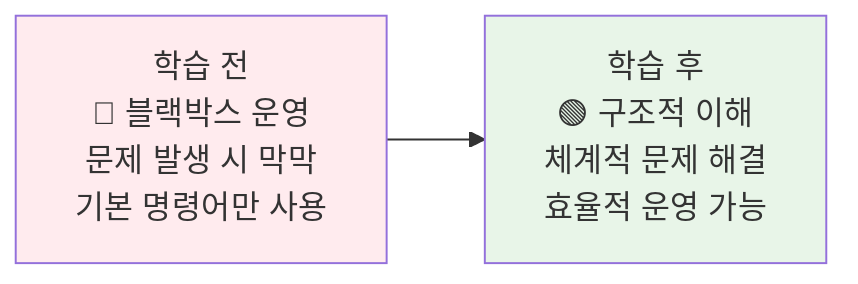
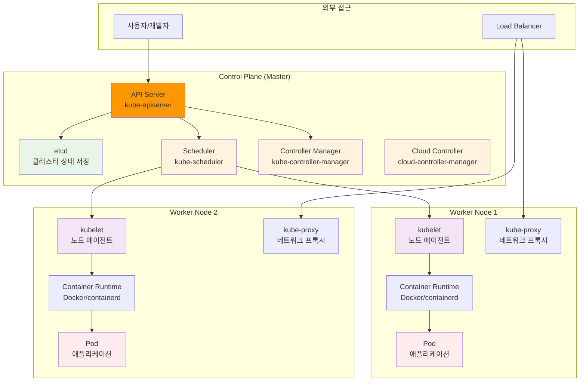
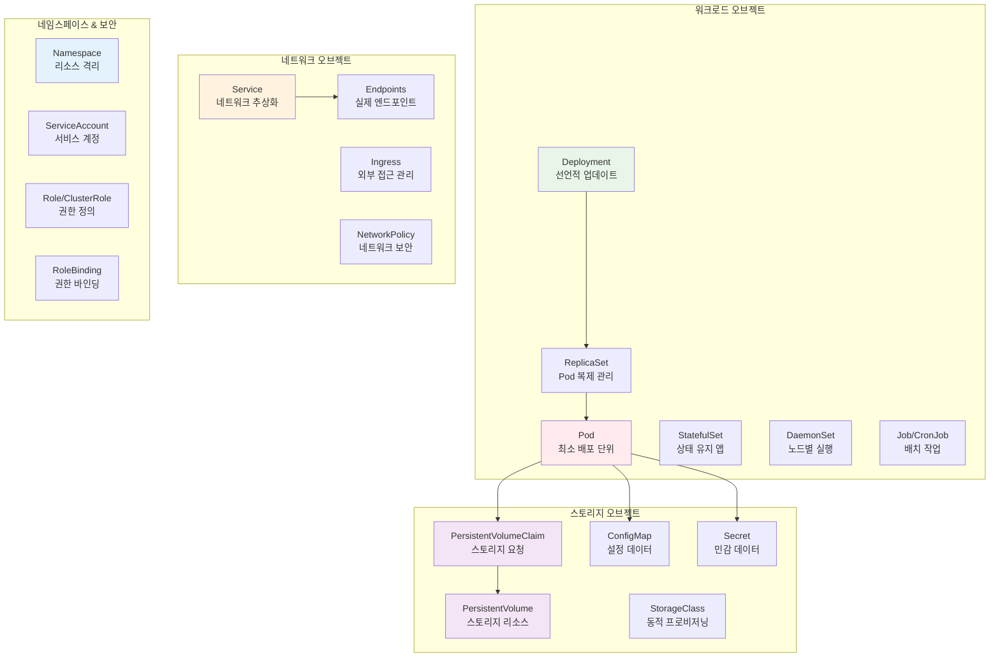
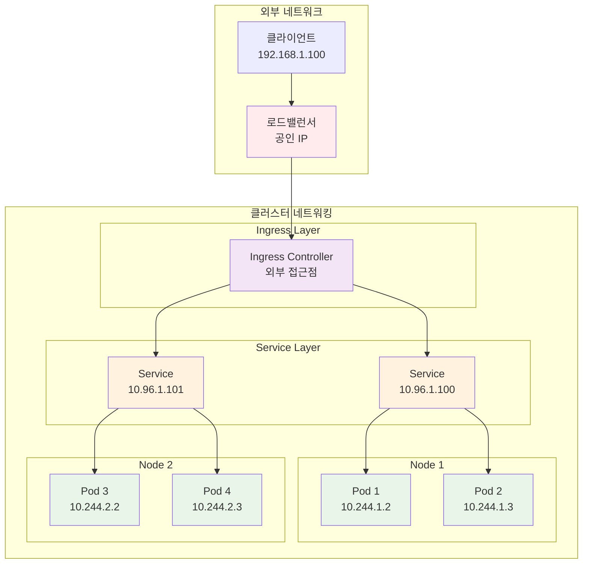
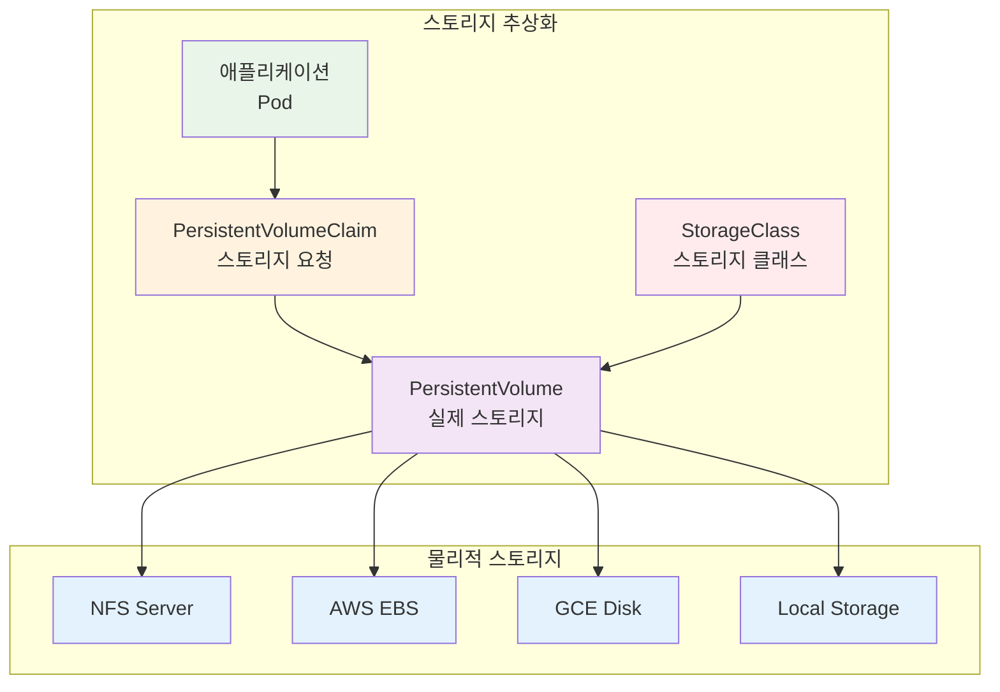

# Week 2 Day 4 Session 2: Kubernetes 아키텍처 & 핵심 개념

<div align="center">

**🏗️ K8s 아키텍처** • **🔧 핵심 구성요소** • **📦 기본 오브젝트**

*Kubernetes 클러스터의 구조와 동작 원리 완전 이해*

</div>

---

## 🕘 세션 정보

**시간**: 10:00-10:50 (50분)  
**목표**: Kubernetes 아키텍처와 핵심 개념을 체계적으로 이해하여 Week 3 학습 기반 구축  
**방식**: 아키텍처 분석 + 구성요소 설명 + 실습 연계

---

## 🎯 세션 목표

### 📚 학습 목표
- **이해 목표**: Kubernetes 클러스터 아키텍처와 각 구성요소의 역할 완전 이해
- **적용 목표**: 기본 K8s 오브젝트의 개념과 사용법 습득
- **협업 목표**: 팀별 K8s 아키텍처 설계와 토론 경험

### 🤔 왜 필요한가? (5분)

**현실 문제 상황**:
- 💼 **실무 시나리오**: "Kubernetes 클러스터에 문제가 생겼는데 어디서부터 확인해야 할까요?"
- 🏠 **일상 비유**: 자동차의 엔진, 변속기, 브레이크 등 각 부품의 역할을 알아야 정비가 가능
- 📊 **시장 동향**: K8s 운영 전문가에 대한 수요 급증과 아키텍처 이해의 중요성

**학습 전후 비교**:


---

## 📖 핵심 개념 (35분)

### 🔍 개념 1: Kubernetes 클러스터 아키텍처 (12분)

> **정의**: Kubernetes 클러스터를 구성하는 Control Plane과 Worker Node의 구조와 상호작용

**전체 클러스터 아키텍처**:


**Control Plane 구성요소 상세**:

**1. API Server (kube-apiserver)**
- **역할**: 모든 K8s 작업의 중앙 진입점
- **기능**: REST API 제공, 인증/인가, 요청 검증
- **특징**: 수평 확장 가능, 상태를 저장하지 않음

**2. etcd**
- **역할**: 클러스터의 모든 상태 정보 저장
- **기능**: 분산 키-값 저장소, 강한 일관성 보장
- **특징**: Raft 알고리즘 기반, 백업과 복구 중요

**3. Scheduler (kube-scheduler)**
- **역할**: Pod를 적절한 노드에 배치
- **기능**: 리소스 요구사항, 제약조건 고려한 스케줄링
- **특징**: 플러그인 아키텍처, 커스텀 스케줄러 가능

**4. Controller Manager**
- **역할**: 다양한 컨트롤러 실행 및 관리
- **기능**: Deployment, ReplicaSet, Service 등 관리
- **특징**: 선언적 상태 유지, 자동 복구

**Worker Node 구성요소 상세**:

**1. kubelet**
- **역할**: 노드의 K8s 에이전트
- **기능**: Pod 생명주기 관리, 컨테이너 상태 모니터링
- **특징**: API Server와 통신, 노드 리소스 관리

**2. kube-proxy**
- **역할**: 네트워크 프록시 및 로드밸런서
- **기능**: Service 추상화 구현, 트래픽 라우팅
- **특징**: iptables/IPVS 기반, 서비스 디스커버리

**3. Container Runtime**
- **역할**: 실제 컨테이너 실행
- **기능**: 이미지 관리, 컨테이너 생명주기
- **특징**: CRI 표준 준수 (Docker, containerd, CRI-O)

### 🔍 개념 2: 핵심 K8s 오브젝트와 리소스 (12분)

> **정의**: Kubernetes에서 애플리케이션을 배포하고 관리하기 위한 기본 추상화 객체들

**K8s 오브젝트 계층 구조**:


**핵심 오브젝트 상세 설명**:

**1. Pod**
```yaml
apiVersion: v1
kind: Pod
metadata:
  name: nginx-pod
  labels:
    app: nginx
spec:
  containers:
  - name: nginx
    image: nginx:1.21
    ports:
    - containerPort: 80
    resources:
      requests:
        memory: "64Mi"
        cpu: "250m"
      limits:
        memory: "128Mi"
        cpu: "500m"
```

**특징**:
- K8s의 최소 배포 단위
- 하나 이상의 컨테이너를 포함
- 동일한 네트워크와 스토리지 공유
- 일시적(ephemeral) 특성

**2. Deployment**
```yaml
apiVersion: apps/v1
kind: Deployment
metadata:
  name: nginx-deployment
spec:
  replicas: 3
  selector:
    matchLabels:
      app: nginx
  template:
    metadata:
      labels:
        app: nginx
    spec:
      containers:
      - name: nginx
        image: nginx:1.21
        ports:
        - containerPort: 80
  strategy:
    type: RollingUpdate
    rollingUpdate:
      maxSurge: 1
      maxUnavailable: 1
```

**특징**:
- 선언적 업데이트 제공
- 롤링 업데이트와 롤백 지원
- ReplicaSet을 통한 Pod 관리
- 상태 없는(stateless) 애플리케이션에 적합

**3. Service**
```yaml
apiVersion: v1
kind: Service
metadata:
  name: nginx-service
spec:
  selector:
    app: nginx
  ports:
  - protocol: TCP
    port: 80
    targetPort: 80
  type: ClusterIP  # ClusterIP, NodePort, LoadBalancer
```

**특징**:
- Pod에 대한 안정적인 네트워크 엔드포인트
- 로드밸런싱과 서비스 디스커버리
- 다양한 서비스 타입 지원
- DNS 기반 이름 해석

### 🔍 개념 3: K8s 네트워킹과 스토리지 모델 (11분)

> **정의**: Kubernetes의 네트워킹 추상화와 스토리지 관리 방식

**네트워킹 모델**:


**네트워킹 핵심 원칙**:
1. **모든 Pod는 고유한 IP를 가짐**
2. **Pod 간 직접 통신 가능** (NAT 없이)
3. **Service를 통한 추상화** (안정적인 엔드포인트)
4. **Ingress를 통한 외부 접근** (HTTP/HTTPS 라우팅)

**스토리지 모델**:


**스토리지 핵심 개념**:

**1. Volume Types**
- **emptyDir**: Pod 생명주기와 동일
- **hostPath**: 호스트 파일시스템 마운트
- **configMap/secret**: 설정과 민감 데이터
- **persistentVolumeClaim**: 영구 스토리지

**2. Persistent Storage**
```yaml
# PersistentVolume
apiVersion: v1
kind: PersistentVolume
metadata:
  name: pv-example
spec:
  capacity:
    storage: 10Gi
  accessModes:
    - ReadWriteOnce
  persistentVolumeReclaimPolicy: Retain
  storageClassName: fast-ssd
  hostPath:
    path: /data/pv-example

---
# PersistentVolumeClaim
apiVersion: v1
kind: PersistentVolumeClaim
metadata:
  name: pvc-example
spec:
  accessModes:
    - ReadWriteOnce
  resources:
    requests:
      storage: 5Gi
  storageClassName: fast-ssd
```

**3. 동적 프로비저닝**
- **StorageClass**: 스토리지 유형 정의
- **자동 생성**: PVC 요청 시 PV 자동 생성
- **클라우드 통합**: AWS EBS, GCE PD 등 자동 연동

---

## 💭 함께 생각해보기 (10분)

### 🤝 페어 토론 (5분)

**토론 주제**:
1. **아키텍처 설계**: "3-tier 웹 애플리케이션을 K8s에 배포한다면 어떤 오브젝트들을 사용하시겠어요?"
2. **문제 해결**: "Pod가 계속 재시작된다면 어떤 구성요소들을 순서대로 확인하시겠어요?"
3. **스토리지 전략**: "데이터베이스를 K8s에서 운영할 때 고려해야 할 스토리지 요소는?"

**페어 활동 가이드**:
- 👥 **아키텍처 스케치**: 간단한 다이어그램으로 설계 아이디어 표현
- 🔄 **문제 해결**: 체계적인 트러블슈팅 순서 정리
- 📝 **설계 원칙**: K8s 베스트 프랙티스 고려사항 정리

### 🎯 전체 공유 (5분)

**인사이트 공유**:
- **설계 아이디어**: 창의적이고 실용적인 K8s 아키텍처 설계
- **문제 해결**: 효과적인 디버깅과 트러블슈팅 방법
- **운영 노하우**: K8s 운영에 도움이 될 만한 팁과 경험

**💡 이해도 체크 질문**:
- ✅ "K8s Control Plane의 각 구성요소 역할을 설명할 수 있나요?"
- ✅ "Pod, Service, Deployment의 관계와 차이점을 설명할 수 있나요?"
- ✅ "K8s 네트워킹과 스토리지 모델의 핵심 원칙을 설명할 수 있나요?"

---

## 🔑 핵심 키워드

### 🆕 새로운 용어
- **Control Plane**: K8s 클러스터의 관리 계층
- **kubelet**: 각 노드의 K8s 에이전트
- **etcd**: 분산 키-값 저장소, 클러스터 상태 저장
- **kube-proxy**: 네트워크 프록시, 서비스 추상화 구현

### 🔤 K8s 오브젝트
- **Pod**: K8s의 최소 배포 단위
- **Deployment**: 선언적 업데이트를 제공하는 워크로드
- **Service**: 네트워크 추상화, 안정적인 엔드포인트
- **PersistentVolume**: 클러스터 수준의 스토리지 리소스

### 🔤 네트워킹 & 스토리지
- **CNI (Container Network Interface)**: 컨테이너 네트워크 표준
- **Ingress**: HTTP/HTTPS 트래픽의 외부 접근 관리
- **StorageClass**: 동적 스토리지 프로비저닝 정의
- **Volume**: Pod에 연결되는 스토리지 추상화

---

## 📝 세션 마무리

### ✅ 오늘 세션 성과
- **아키텍처 이해**: K8s 클러스터의 전체 구조와 구성요소 역할 파악
- **오브젝트 개념**: 핵심 K8s 오브젝트의 특징과 사용법 이해
- **네트워킹/스토리지**: K8s의 네트워크와 스토리지 추상화 모델 학습

### 🎯 다음 세션 준비
- **Session 3 연결**: K8s 아키텍처 → Docker 앱의 K8s 마이그레이션 전략
- **실습 준비**: 오후 실습에서 실제 K8s 클러스터 구축과 기본 배포
- **심화 학습**: 마이그레이션 계획 수립과 매니페스트 작성 방법

### 🔮 Week 3 연결
- **기초 완성**: K8s 아키텍처 이해를 바탕으로 한 심화 학습
- **실습 확장**: 기본 오브젝트에서 고급 워크로드로 확장
- **운영 역량**: 클러스터 운영과 관리 능력 개발

---

<div align="center">

**☸️ 다음 세션**: [Session 3 - Docker 애플리케이션의 K8s 마이그레이션 전략](./session_3.md)

**🛠️ 오후 실습**: [Lab 1 - K8s 환경 구축 & 기본 배포](./lab_1.md)

</div>