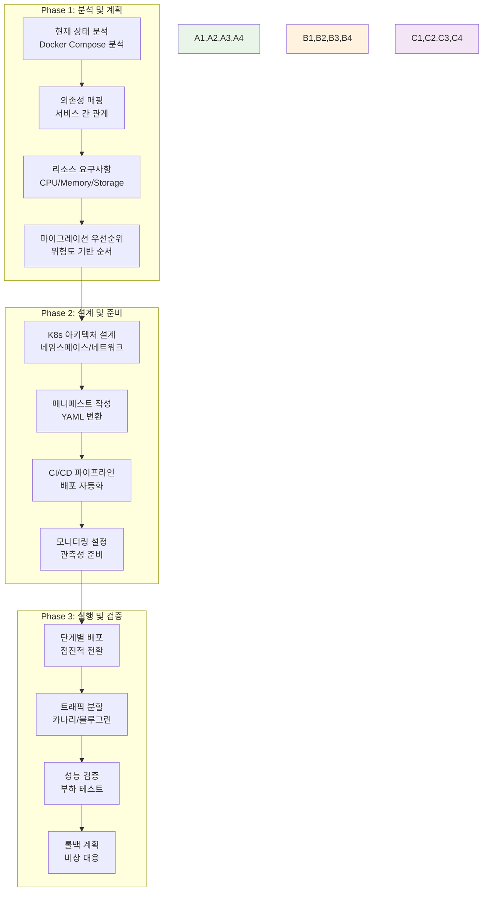
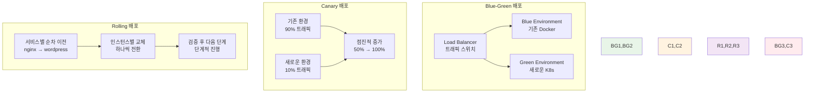

# Week 2 Day 4 Session 3: Docker 애플리케이션의 K8s 마이그레이션 전략

<div align="center">

**🔄 마이그레이션 계획** • **📝 매니페스트 작성** • **🚀 배포 전략**

*Docker 애플리케이션을 Kubernetes로 체계적으로 전환하는 방법론*

</div>

---

## 🕘 세션 정보

**시간**: 11:00-11:50 (50분)  
**목표**: Docker 애플리케이션을 Kubernetes로 마이그레이션하는 체계적 방법론과 실무 전략 습득  
**방식**: 마이그레이션 계획 + 매니페스트 변환 + 배포 전략

---

## 🎯 세션 목표

### 📚 학습 목표
- **이해 목표**: Docker Compose에서 K8s 매니페스트로의 변환 원리와 방법 완전 이해
- **적용 목표**: Week 2에서 구축한 Docker 애플리케이션의 K8s 마이그레이션 계획 수립
- **협업 목표**: 팀별 마이그레이션 전략 수립과 단계별 실행 계획 작성

### 🤔 왜 필요한가? (5분)

**현실 문제 상황**:
- 💼 **실무 시나리오**: "기존 Docker Compose로 운영 중인 서비스를 Kubernetes로 이전해야 해요"
- 🏠 **일상 비유**: 기존 집에서 새 집으로 이사할 때의 체계적인 계획과 준비 과정
- 📊 **시장 동향**: 클라우드 네이티브 전환과 K8s 도입이 필수가 된 현실

**학습 전후 비교**:


---

## 📖 핵심 개념 (35분)

### 🔍 개념 1: 마이그레이션 계획 수립과 분석 (12분)

> **정의**: Docker 애플리케이션의 현재 상태를 분석하고 K8s 전환을 위한 체계적 계획 수립

**마이그레이션 프로세스 전체 흐름**:


**현재 상태 분석 체크리스트**:

**1. 애플리케이션 인벤토리**
```yaml
# 분석 대상 예시 (Week 2에서 구축한 시스템)
services_inventory:
  web_tier:
    - nginx-proxy: "리버스 프록시"
    - wordpress: "웹 애플리케이션"
  
  data_tier:
    - mysql: "데이터베이스"
    - redis: "세션 스토어"
  
  monitoring_tier:
    - prometheus: "메트릭 수집"
    - grafana: "시각화"
    - elasticsearch: "로그 저장"
    - kibana: "로그 분석"

dependencies:
  wordpress:
    - mysql (필수)
    - redis (선택적)
  
  grafana:
    - prometheus (필수)
    - elasticsearch (선택적)

resource_requirements:
  mysql:
    cpu: "1 core"
    memory: "1Gi"
    storage: "10Gi"
    type: "stateful"
  
  wordpress:
    cpu: "500m"
    memory: "512Mi"
    type: "stateless"
    replicas: 3
```

**2. 마이그레이션 우선순위 매트릭스**
| 서비스 | 복잡도 | 의존성 | 중요도 | 우선순위 | 전략 |
|--------|--------|--------|--------|----------|------|
| **nginx-proxy** | 낮음 | 낮음 | 높음 | 1 | 먼저 이전 |
| **wordpress** | 중간 | 중간 | 높음 | 2 | 단계적 이전 |
| **redis** | 낮음 | 낮음 | 중간 | 3 | 독립적 이전 |
| **mysql** | 높음 | 높음 | 높음 | 4 | 신중한 이전 |
| **monitoring** | 중간 | 낮음 | 낮음 | 5 | 마지막 이전 |

**3. 위험 요소 식별**
- **데이터 손실**: MySQL 데이터 마이그레이션
- **서비스 중단**: 트래픽 전환 중 다운타임
- **성능 저하**: K8s 오버헤드로 인한 성능 영향
- **설정 누락**: 환경변수, 시크릿 관리
- **네트워크 이슈**: 서비스 간 통신 문제

### 🔍 개념 2: Docker Compose에서 K8s 매니페스트 변환 (12분)

> **정의**: Docker Compose 파일을 Kubernetes 매니페스트로 변환하는 구체적 방법과 패턴

**변환 매핑 테이블**:
| Docker Compose | Kubernetes | 설명 |
|----------------|------------|------|
| `services` | `Deployment + Service` | 서비스 정의 |
| `image` | `spec.containers.image` | 컨테이너 이미지 |
| `ports` | `Service.spec.ports` | 포트 노출 |
| `volumes` | `PersistentVolumeClaim` | 데이터 영속성 |
| `environment` | `ConfigMap + Secret` | 환경 설정 |
| `depends_on` | `initContainers` | 의존성 관리 |
| `networks` | `NetworkPolicy` | 네트워크 격리 |
| `restart` | `restartPolicy` | 재시작 정책 |

**실제 변환 예시**:

**Docker Compose (기존)**:
```yaml
version: '3.8'
services:
  wordpress:
    image: wordpress:latest
    ports:
      - "8080:80"
    environment:
      WORDPRESS_DB_HOST: mysql:3306
      WORDPRESS_DB_NAME: wordpress
      WORDPRESS_DB_USER: wpuser
      WORDPRESS_DB_PASSWORD: wppassword
    volumes:
      - wp-content:/var/www/html/wp-content
    depends_on:
      - mysql
    restart: unless-stopped

  mysql:
    image: mysql:8.0
    environment:
      MYSQL_ROOT_PASSWORD: rootpassword
      MYSQL_DATABASE: wordpress
      MYSQL_USER: wpuser
      MYSQL_PASSWORD: wppassword
    volumes:
      - mysql-data:/var/lib/mysql
    restart: unless-stopped

volumes:
  wp-content:
  mysql-data:
```

**Kubernetes 매니페스트 (변환 후)**:
```yaml
# ConfigMap for WordPress
apiVersion: v1
kind: ConfigMap
metadata:
  name: wordpress-config
data:
  WORDPRESS_DB_HOST: "mysql-service:3306"
  WORDPRESS_DB_NAME: "wordpress"
  WORDPRESS_DB_USER: "wpuser"

---
# Secret for passwords
apiVersion: v1
kind: Secret
metadata:
  name: wordpress-secret
type: Opaque
data:
  WORDPRESS_DB_PASSWORD: d3BwYXNzd29yZA==  # base64 encoded
  MYSQL_ROOT_PASSWORD: cm9vdHBhc3N3b3Jk    # base64 encoded

---
# PVC for WordPress
apiVersion: v1
kind: PersistentVolumeClaim
metadata:
  name: wp-content-pvc
spec:
  accessModes:
    - ReadWriteOnce
  resources:
    requests:
      storage: 5Gi

---
# WordPress Deployment
apiVersion: apps/v1
kind: Deployment
metadata:
  name: wordpress-deployment
spec:
  replicas: 3
  selector:
    matchLabels:
      app: wordpress
  template:
    metadata:
      labels:
        app: wordpress
    spec:
      initContainers:
      - name: wait-for-mysql
        image: busybox:1.35
        command: ['sh', '-c', 'until nc -z mysql-service 3306; do sleep 1; done']
      containers:
      - name: wordpress
        image: wordpress:latest
        ports:
        - containerPort: 80
        envFrom:
        - configMapRef:
            name: wordpress-config
        - secretRef:
            name: wordpress-secret
        volumeMounts:
        - name: wp-content
          mountPath: /var/www/html/wp-content
        resources:
          requests:
            memory: "256Mi"
            cpu: "250m"
          limits:
            memory: "512Mi"
            cpu: "500m"
        livenessProbe:
          httpGet:
            path: /
            port: 80
          initialDelaySeconds: 30
          periodSeconds: 10
        readinessProbe:
          httpGet:
            path: /
            port: 80
          initialDelaySeconds: 5
          periodSeconds: 5
      volumes:
      - name: wp-content
        persistentVolumeClaim:
          claimName: wp-content-pvc

---
# WordPress Service
apiVersion: v1
kind: Service
metadata:
  name: wordpress-service
spec:
  selector:
    app: wordpress
  ports:
  - protocol: TCP
    port: 80
    targetPort: 80
  type: ClusterIP
```

**변환 시 주요 고려사항**:

**1. 상태 관리**
- **Stateless**: Deployment 사용
- **Stateful**: StatefulSet 사용 (데이터베이스)
- **데이터 영속성**: PVC로 볼륨 관리

**2. 보안 강화**
- **환경변수**: ConfigMap/Secret 분리
- **네트워크**: NetworkPolicy로 트래픽 제한
- **권한**: ServiceAccount와 RBAC 적용

**3. 가용성 향상**
- **Health Check**: Liveness/Readiness Probe
- **리소스 관리**: Requests/Limits 설정
- **업데이트 전략**: RollingUpdate 설정

### 🔍 개념 3: 배포 전략과 트래픽 관리 (11분)

> **정의**: 무중단 서비스를 위한 단계적 배포 전략과 트래픽 전환 방법

**배포 전략 비교**:


**단계별 마이그레이션 실행 계획**:

**Phase 1: 인프라 준비 (1주)**
```yaml
week_1_tasks:
  kubernetes_setup:
    - cluster_installation: "K8s 클러스터 구축"
    - networking_config: "CNI 플러그인 설정"
    - storage_config: "StorageClass 설정"
    - monitoring_setup: "Prometheus/Grafana 설치"
  
  security_config:
    - rbac_setup: "Role-based Access Control"
    - network_policies: "네트워크 보안 정책"
    - secret_management: "시크릿 관리 체계"
  
  ci_cd_pipeline:
    - image_registry: "컨테이너 레지스트리 설정"
    - deployment_pipeline: "자동 배포 파이프라인"
    - rollback_mechanism: "롤백 메커니즘 구축"
```

**Phase 2: 서비스별 이전 (2-3주)**
```yaml
migration_order:
  week_2:
    - service: "nginx-proxy"
      strategy: "blue-green"
      risk: "low"
      rollback_time: "5분"
    
    - service: "redis"
      strategy: "direct-migration"
      risk: "low"
      data_sync: "not_required"
  
  week_3:
    - service: "wordpress"
      strategy: "canary"
      risk: "medium"
      traffic_split: "10% → 50% → 100%"
    
    - service: "monitoring"
      strategy: "parallel-run"
      risk: "low"
      validation: "metrics_comparison"
  
  week_4:
    - service: "mysql"
      strategy: "maintenance-window"
      risk: "high"
      data_migration: "required"
      downtime: "2시간"
```

**트래픽 관리 전략**:

**1. Ingress Controller 활용**
```yaml
apiVersion: networking.k8s.io/v1
kind: Ingress
metadata:
  name: migration-ingress
  annotations:
    nginx.ingress.kubernetes.io/canary: "true"
    nginx.ingress.kubernetes.io/canary-weight: "10"
    nginx.ingress.kubernetes.io/canary-by-header: "X-Canary"
spec:
  rules:
  - host: myapp.example.com
    http:
      paths:
      - path: /
        pathType: Prefix
        backend:
          service:
            name: wordpress-service
            port:
              number: 80
```

**2. 모니터링과 검증**
```yaml
validation_metrics:
  performance:
    - response_time: "< 200ms"
    - error_rate: "< 0.1%"
    - throughput: "> 1000 RPS"
  
  reliability:
    - uptime: "> 99.9%"
    - success_rate: "> 99.5%"
    - recovery_time: "< 30s"
  
  resource_usage:
    - cpu_utilization: "< 70%"
    - memory_usage: "< 80%"
    - storage_iops: "sufficient"
```

**3. 롤백 계획**
```bash
# 자동 롤백 트리거
rollback_conditions:
  - error_rate > 1%
  - response_time > 500ms
  - availability < 99%

# 롤백 실행 스크립트
#!/bin/bash
echo "🚨 롤백 시작"
kubectl patch ingress migration-ingress -p '{"metadata":{"annotations":{"nginx.ingress.kubernetes.io/canary-weight":"0"}}}'
kubectl scale deployment wordpress-deployment --replicas=0
echo "✅ 트래픽이 기존 환경으로 복구되었습니다"
```

---

## 💭 함께 생각해보기 (10분)

### 🤝 페어 토론 (5분)

**토론 주제**:
1. **마이그레이션 계획**: "Week 2에서 구축한 WordPress 시스템을 K8s로 이전한다면 어떤 순서로 진행하시겠어요?"
2. **위험 관리**: "데이터베이스 마이그레이션 시 데이터 손실을 방지하는 방법은?"
3. **성능 검증**: "마이그레이션 후 성능이 저하되었다면 어떻게 원인을 찾고 해결하시겠어요?"

**페어 활동 가이드**:
- 👥 **실무 시나리오**: Week 2 실습 결과물을 기반으로 한 구체적 계획
- 🔄 **단계별 계획**: 위험도와 우선순위를 고려한 체계적 접근
- 📝 **체크리스트**: 각 단계별 검증 항목과 롤백 조건 정리

### 🎯 전체 공유 (5분)

**인사이트 공유**:
- **마이그레이션 전략**: 창의적이고 안전한 전환 방법
- **위험 대응**: 실무에서 활용 가능한 위험 관리 방안
- **성능 최적화**: K8s 환경에서의 성능 튜닝 아이디어

**💡 이해도 체크 질문**:
- ✅ "Docker Compose를 K8s 매니페스트로 변환하는 핵심 원칙을 설명할 수 있나요?"
- ✅ "무중단 마이그레이션을 위한 배포 전략을 수립할 수 있나요?"
- ✅ "마이그레이션 실패 시 롤백 계획을 세울 수 있나요?"

---

## 🔑 핵심 키워드

### 🆕 새로운 용어
- **Migration Strategy**: 마이그레이션 전략, 시스템 전환 방법론
- **Blue-Green Deployment**: 블루-그린 배포, 환경 전환 방식
- **Canary Deployment**: 카나리 배포, 점진적 트래픽 전환
- **Traffic Splitting**: 트래픽 분할, 부하 분산 전환

### 🔤 K8s 마이그레이션 용어
- **Manifest Conversion**: 매니페스트 변환, YAML 파일 전환
- **StatefulSet**: 상태 유지 워크로드, 데이터베이스용
- **InitContainer**: 초기화 컨테이너, 의존성 관리
- **PersistentVolumeClaim**: 영구 볼륨 요청, 데이터 영속성

### 🔤 배포 및 운영
- **Rolling Update**: 롤링 업데이트, 순차적 배포
- **Health Check**: 헬스 체크, 서비스 상태 확인
- **Rollback**: 롤백, 이전 버전으로 복구
- **Ingress Controller**: 인그레스 컨트롤러, 외부 접근 관리

---

## 📝 세션 마무리

### ✅ 오늘 세션 성과
- **마이그레이션 계획**: 체계적인 Docker → K8s 전환 방법론 습득
- **매니페스트 변환**: Docker Compose에서 K8s YAML로의 변환 원리 이해
- **배포 전략**: 무중단 서비스를 위한 다양한 배포 전략과 트래픽 관리 방법

### 🎯 다음 실습 준비
- **Lab 1 연결**: K8s 환경 구축과 기본 배포 실습
- **Lab 2 실습**: Week 2 Docker 애플리케이션의 실제 K8s 마이그레이션
- **실무 적용**: 학습한 마이그레이션 전략을 실제 환경에서 체험

### 🔮 Week 3 완벽 준비
- **기초 지식**: K8s 아키텍처와 마이그레이션 방법론 완성
- **실습 환경**: K8s 클러스터와 기본 애플리케이션 배포 완료
- **심화 학습**: Week 3에서 다룰 고급 K8s 기능의 기반 마련

---

<div align="center">

**🛠️ 다음 실습**: [Lab 1 - K8s 환경 구축 & 기본 배포](./lab_1.md)

**🔄 마이그레이션 실습**: [Lab 2 - Docker 앱의 K8s 마이그레이션 실습](./lab_2.md)

</div>