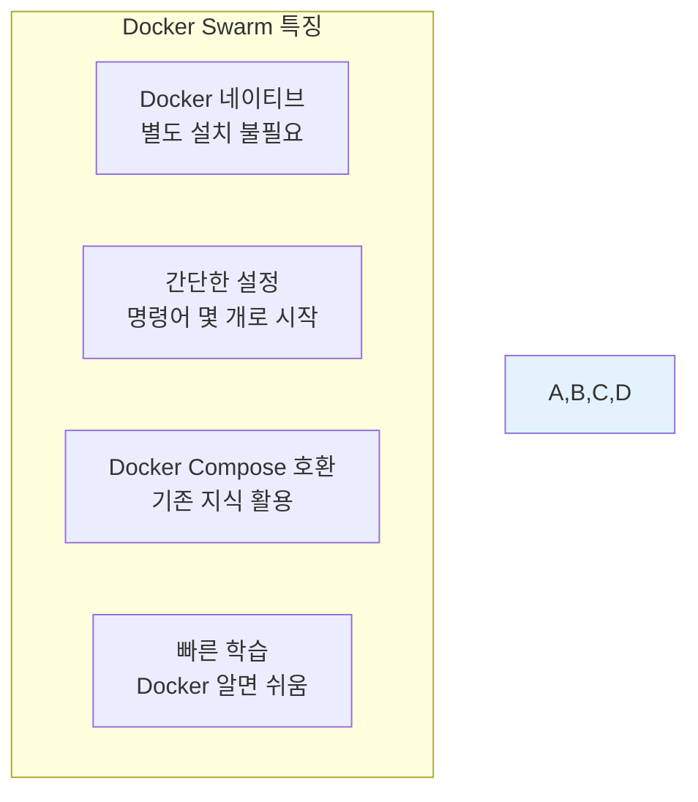
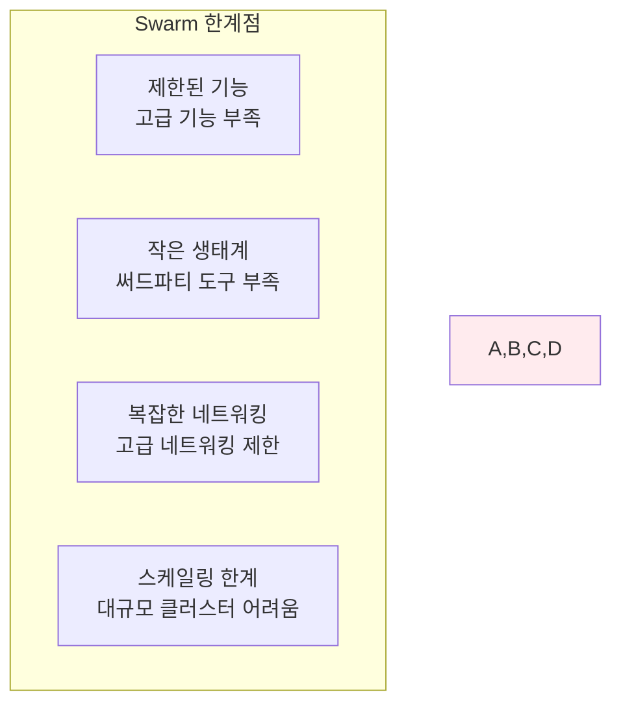
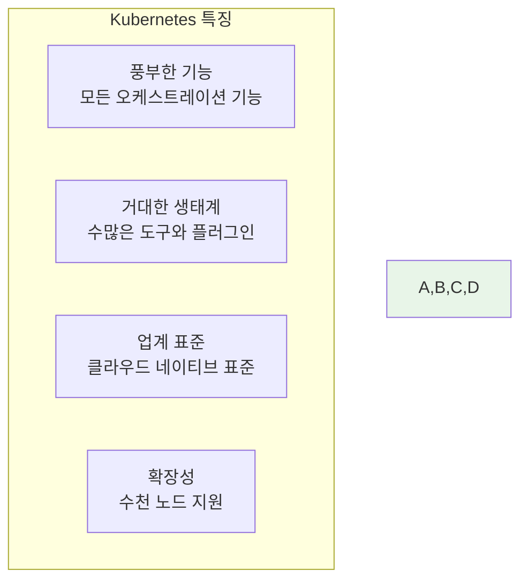
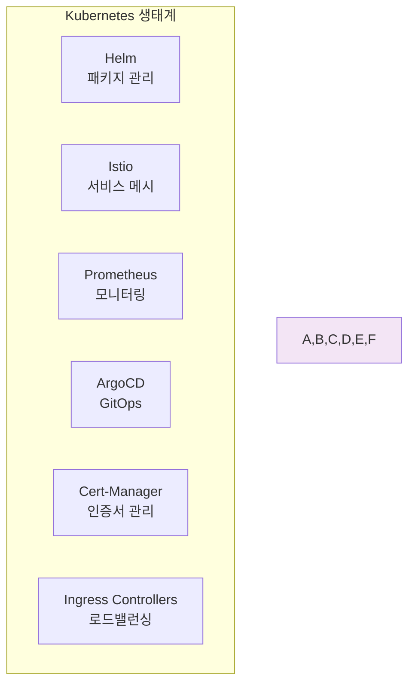
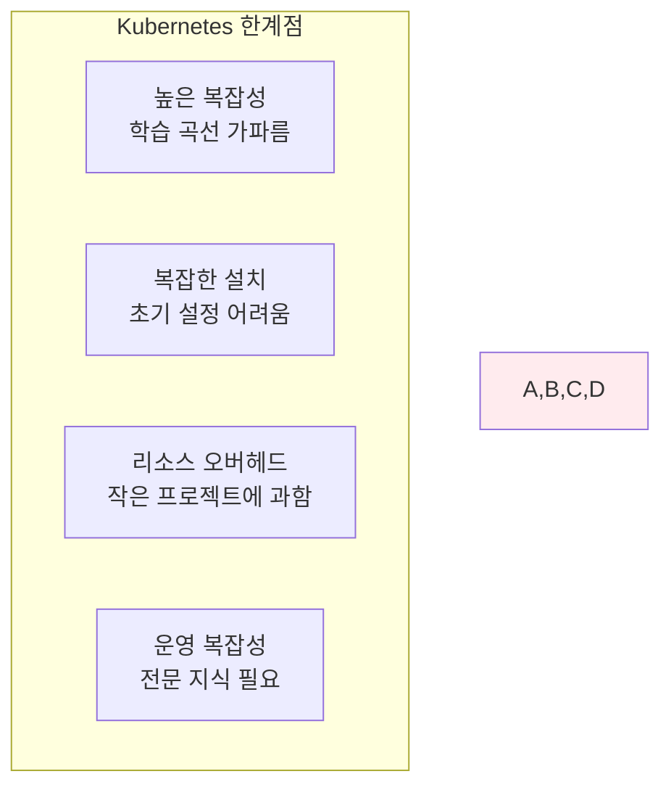
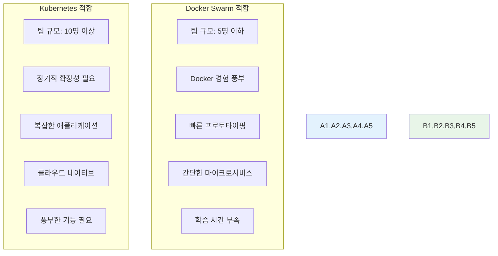
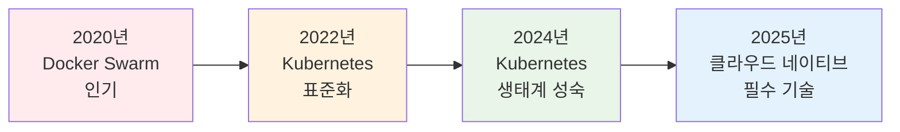

# Week 2 Day 4 Session 3: Docker Swarm vs Kubernetes 비교

<div align="center">
**🐳 Docker Swarm** • **☸️ Kubernetes**
*두 오케스트레이션 도구의 특징과 선택 기준*
</div>

---

## 🕘 세션 정보
**시간**: 11:00-11:50 (50분)
**목표**: 두 오케스트레이션 도구의 차이점과 선택 기준 이해
**방식**: 비교 분석 + 실무 사례 + 선택 가이드

## 🎯 세션 목표
### 📚 학습 목표
- **도구 비교**: Docker Swarm과 Kubernetes의 특징 비교
- **선택 기준**: 상황별 최적 도구 선택 방법 이해
- **미래 전망**: 업계 트렌드와 기술 발전 방향 파악

### 🤔 왜 필요한가? (5분)
**도구 선택의 중요성**:
```
잘못된 선택의 결과:
❌ 과도한 복잡성 → 개발 속도 저하
❌ 기능 부족 → 확장성 한계
❌ 학습 비용 → 팀 생산성 저하
❌ 마이그레이션 비용 → 기술 부채

올바른 선택의 결과:
✅ 적절한 복잡성 → 빠른 개발
✅ 충분한 기능 → 미래 확장성
✅ 합리적 학습 → 팀 성장
✅ 장기적 안정성 → 기술 투자 효과
```

## 📖 핵심 개념 (35분)

### 🔍 개념 1: Docker Swarm 특징 분석 (12분)

#### 🐳 Docker Swarm 개요
> **Docker에 내장된 간단하고 직관적인 오케스트레이션 도구**



#### 🚀 Docker Swarm 장점
**1. 학습 용이성**:
```bash
# 클러스터 초기화 (1분 완료)
docker swarm init

# 워커 노드 추가
docker swarm join --token <token> <manager-ip>

# 서비스 배포
docker service create --replicas 3 nginx
```

**2. Docker Compose 호환성**:
```yaml
# docker-compose.yml 그대로 사용 가능
version: '3.8'
services:
  web:
    image: nginx
    deploy:
      replicas: 3
      update_config:
        parallelism: 1
```

**3. 내장 기능**:
- **로드 밸런싱**: 자동 내장
- **서비스 디스커버리**: DNS 기반 자동
- **롤링 업데이트**: 간단한 설정
- **시크릿 관리**: Docker 시크릿 활용

#### ⚠️ Docker Swarm 한계


### 🔍 개념 2: Kubernetes 특징 분석 (12분)

#### ☸️ Kubernetes 개요
> **Google이 개발한 강력하고 확장 가능한 컨테이너 오케스트레이션 플랫폼**



#### 🚀 Kubernetes 장점
**1. 풍부한 기능**:
```yaml
# 고급 배포 전략
apiVersion: argoproj.io/v1alpha1
kind: Rollout
spec:
  strategy:
    canary:
      steps:
      - setWeight: 20
      - pause: {duration: 10m}
      - setWeight: 50
      - pause: {duration: 10m}
```

**2. 강력한 생태계**:


**3. 클라우드 네이티브**:
- **멀티 클라우드**: AWS, Azure, GCP 모두 지원
- **하이브리드**: 온프레미스 + 클라우드
- **표준화**: CNCF 표준 준수

#### ⚠️ Kubernetes 한계


### 🔍 개념 3: 상황별 선택 가이드 (11분)

#### ⚖️ 상세 비교표
| 구분 | Docker Swarm | Kubernetes |
|------|--------------|------------|
| **학습 곡선** | 🟢 쉬움 (1-2주) | 🔴 어려움 (2-3개월) |
| **설치/설정** | 🟢 매우 간단 | 🔴 복잡함 |
| **기능 범위** | 🟡 기본적 | 🟢 매우 풍부 |
| **생태계** | 🔴 제한적 | 🟢 매우 풍부 |
| **확장성** | 🟡 중간 (수십 노드) | 🟢 매우 높음 (수천 노드) |
| **클라우드 지원** | 🟡 제한적 | 🟢 완전 지원 |
| **커뮤니티** | 🟡 작음 | 🟢 매우 큼 |
| **기업 채택** | 🟡 중소기업 | 🟢 대기업/스타트업 |
| **미래성** | 🔴 제한적 | 🟢 업계 표준 |

#### 🎯 선택 기준 매트릭스


#### 🏢 실무 사례별 선택
**스타트업 (초기 단계)**:
```
상황: 빠른 MVP 개발, 작은 팀, 제한된 시간
선택: Docker Swarm
이유: 빠른 학습, 간단한 배포, 즉시 사용 가능
```

**성장하는 회사 (확장 단계)**:
```
상황: 트래픽 증가, 복잡한 서비스, 안정성 필요
선택: Kubernetes
이유: 확장성, 풍부한 기능, 장기적 안정성
```

**대기업 (엔터프라이즈)**:
```
상황: 복잡한 시스템, 높은 가용성, 컴플라이언스
선택: Kubernetes
이유: 엔터프라이즈 기능, 보안, 거버넌스
```

#### 🔮 미래 전망과 트렌드


**업계 동향**:
- **클라우드 제공업체**: 모두 Kubernetes 기반 서비스 제공
- **기업 채택**: Fortune 500 기업의 80% 이상 Kubernetes 사용
- **개발자 수요**: Kubernetes 스킬 요구 급증
- **도구 생태계**: Kubernetes 중심으로 발전

## 💭 함께 생각해보기 (10분)

### 🤝 페어 토론 (5분)
**토론 주제**:
1. **프로젝트 적용**: "우리 팀 프로젝트에는 어떤 도구가 적합할까?"
2. **학습 전략**: "Kubernetes를 배우려면 어떤 순서로 접근할까?"
3. **미래 계획**: "5년 후 어떤 기술이 더 중요할까?"

### 🎯 전체 공유 (5분)
**공유 내용**:
- **선택 결과**: 팀별 도구 선택과 그 이유
- **학습 계획**: Week 3-4 Kubernetes 학습 전략
- **장기 비전**: 클라우드 네이티브 전문가로의 성장 계획

## 🔑 핵심 키워드

### 🆕 비교 용어
- **학습 곡선(Learning Curve)**: 기술 습득에 필요한 시간과 노력
- **생태계(Ecosystem)**: 도구 주변의 관련 기술과 커뮤니티
- **확장성(Scalability)**: 시스템이 성장할 수 있는 능력
- **오버헤드(Overhead)**: 기본 기능 외 추가로 필요한 리소스

### 🔤 선택 기준 용어
- **MVP (Minimum Viable Product)**: 최소 기능 제품
- **클라우드 네이티브(Cloud Native)**: 클라우드 환경에 최적화된 방식
- **벤더 락인(Vendor Lock-in)**: 특정 업체 기술에 종속되는 상황
- **마이그레이션(Migration)**: 한 시스템에서 다른 시스템으로 이전

## 📝 세션 마무리

### ✅ 오늘 세션 성과
- [x] Docker Swarm과 Kubernetes의 특징 완전 비교
- [x] 상황별 최적 도구 선택 기준 이해
- [x] 업계 트렌드와 미래 전망 파악
- [x] Week 3 Kubernetes 학습 동기 부여

### 🎯 다음 세션 준비
**Session 4 연결점**:
- 이론으로 배운 내용을 **실제 체험**으로 확인
- Docker Swarm 간단 실습으로 오케스트레이션 체감
- Kubernetes 환경 준비로 Week 3 학습 기반 마련

**실습 준비사항**:
- Docker Swarm 명령어 체험 준비
- Kubernetes 설치 환경 확인
- 팀별 역할 분담 논의