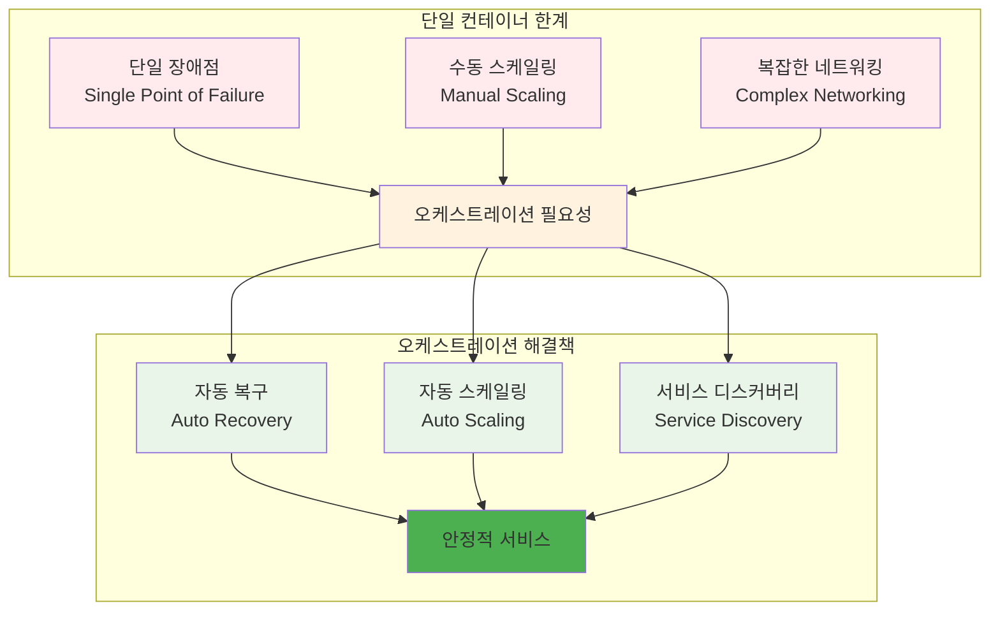
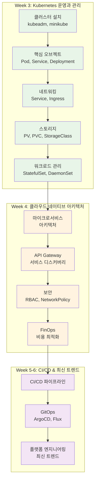
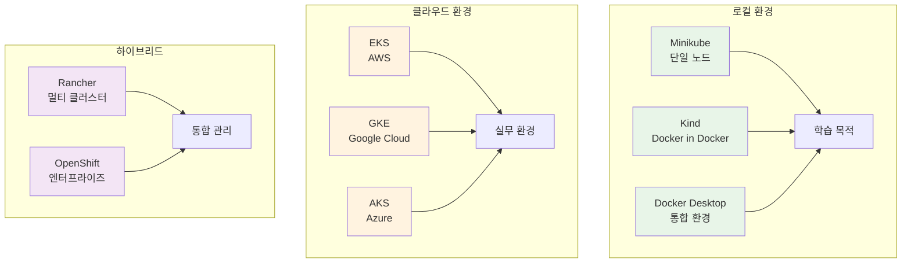
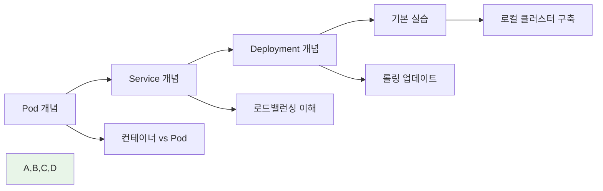
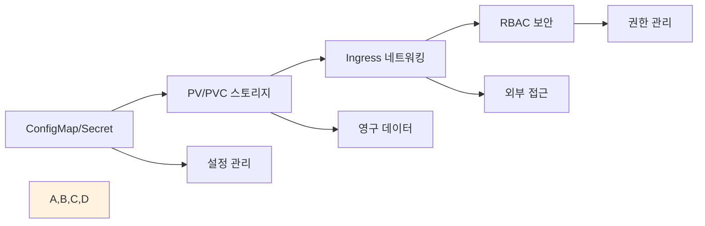
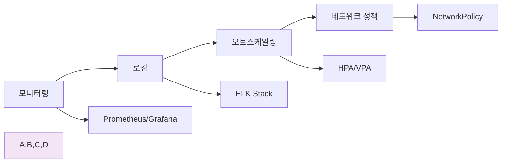

# Week 2 Day 4 Session 3: 오케스트레이션 준비와 학습 로드맵

<div align="center">
**🚀 오케스트레이션 준비** • **🗺️ 학습 로드맵**
*Docker 기반에서 오케스트레이션으로의 자연스러운 전환 이해*
</div>

---

## 🕘 세션 정보
**시간**: 11:00-11:50 (50분)
**목표**: Docker 기반에서 오케스트레이션으로의 자연스러운 전환 이해
**방식**: 이론 강의 + 페어 토론

## 🎯 세션 목표
### 📚 학습 목표
- **이해 목표**: 오케스트레이션의 필요성과 Week 3 학습을 위한 체계적 준비
- **적용 목표**: Docker 기반에서 오케스트레이션으로의 자연스러운 전환 이해
- **협업 목표**: 개별 학습 후 경험 공유 및 질의응답

## 📖 핵심 개념 (35분)

### 🔍 개념 1: 오케스트레이션의 필요성 (12분)
> **정의**: 단일 컨테이너에서 다중 컨테이너 관리로의 자연스러운 진화 과정

**확장성 문제와 해결책**:


**Docker Compose vs 오케스트레이션**:
| 구분 | Docker Compose | 오케스트레이션 |
|------|----------------|----------------|
| **범위** | 단일 호스트 | 멀티 호스트 클러스터 |
| **확장성** | 수동 스케일링 | 자동 스케일링 |
| **고가용성** | 제한적 | 완전한 HA |
| **서비스 디스커버리** | 기본적 | 고급 기능 |
| **로드 밸런싱** | 기본적 | 정교한 제어 |
| **롤링 업데이트** | 수동 | 자동화 |

**실제 문제 시나리오**:
- **트래픽 급증**: 갑작스런 사용자 증가로 인한 서버 과부하
- **서버 장애**: 하드웨어 문제로 인한 서비스 중단
- **배포 복잡성**: 여러 서버에 동시 배포의 어려움
- **리소스 낭비**: 비효율적인 리소스 사용

### 🔍 개념 2: Week 3 학습 로드맵 (12분)
> **정의**: Docker 전문가에서 클라우드 네이티브 전문가로의 학습 경로

**학습 단계별 로드맵**:


**Docker 지식의 Kubernetes 연결**:
- **컨테이너 → Pod**: 단일 컨테이너에서 Pod 개념으로 확장
- **Docker Compose → Deployment**: 선언적 배포 관리
- **네트워킹 → Service**: 서비스 추상화와 로드 밸런싱
- **볼륨 → PV/PVC**: 영구 스토리지 관리
- **모니터링 → 관측성**: 클러스터 수준의 모니터링

### 🔍 개념 3: 실습 환경과 도구 준비 (11분)
> **정의**: Week 3 학습을 위한 최적의 실습 환경과 필수 도구들

**실습 환경 옵션**:


**필수 도구 체크리스트**:
- **kubectl**: Kubernetes CLI 도구
- **Helm**: 패키지 매니저
- **k9s**: 터미널 기반 UI
- **Lens**: 데스크톱 IDE
- **kubectx/kubens**: 컨텍스트 관리

**개발 환경 설정**:
```bash
# kubectl 자동완성 설정
echo 'source <(kubectl completion bash)' >>~/.bashrc

# 유용한 alias 설정
echo 'alias k=kubectl' >>~/.bashrc
echo 'alias kgp="kubectl get pods"' >>~/.bashrc
echo 'alias kgs="kubectl get services"' >>~/.bashrc

# Helm 설치
curl https://raw.githubusercontent.com/helm/helm/main/scripts/get-helm-3 | bash
```

**학습 전략**:
- **점진적 학습**: Docker → Docker Swarm → Kubernetes
- **실습 중심**: 이론보다는 hands-on 경험 우선
- **문제 해결**: 실제 문제 상황을 통한 학습
- **커뮤니티**: CNCF 커뮤니티 참여

**Kubernetes 학습 로드맵 상세**:

**1단계: 기초 개념 (Week 3 Day 1-2)**


**2단계: 심화 기능 (Week 3 Day 3-5)**


**3단계: 운영 및 관리 (Week 4)**


**실무 프로젝트 예시**:

**프로젝트 1: 마이크로서비스 애플리케이션**
```yaml
# 전체 애플리케이션 아키텍처
apiVersion: v1
kind: Namespace
metadata:
  name: microservices-demo
---
# 데이터베이스 서비스
apiVersion: apps/v1
kind: Deployment
metadata:
  name: database
  namespace: microservices-demo
spec:
  replicas: 1
  selector:
    matchLabels:
      app: database
  template:
    metadata:
      labels:
        app: database
    spec:
      containers:
      - name: postgres
        image: postgres:13
        env:
        - name: POSTGRES_DB
          value: "microservices"
        - name: POSTGRES_USER
          valueFrom:
            secretKeyRef:
              name: db-secret
              key: username
        - name: POSTGRES_PASSWORD
          valueFrom:
            secretKeyRef:
              name: db-secret
              key: password
        ports:
        - containerPort: 5432
        volumeMounts:
        - name: postgres-storage
          mountPath: /var/lib/postgresql/data
      volumes:
      - name: postgres-storage
        persistentVolumeClaim:
          claimName: postgres-pvc
---
# API 서비스
apiVersion: apps/v1
kind: Deployment
metadata:
  name: api-service
  namespace: microservices-demo
spec:
  replicas: 3
  selector:
    matchLabels:
      app: api-service
  template:
    metadata:
      labels:
        app: api-service
    spec:
      containers:
      - name: api
        image: myregistry.com/api-service:v1.0
        ports:
        - containerPort: 8080
        env:
        - name: DATABASE_URL
          valueFrom:
            configMapKeyRef:
              name: app-config
              key: database_url
        resources:
          requests:
            memory: "256Mi"
            cpu: "250m"
          limits:
            memory: "512Mi"
            cpu: "500m"
        livenessProbe:
          httpGet:
            path: /health
            port: 8080
          initialDelaySeconds: 30
          periodSeconds: 10
        readinessProbe:
          httpGet:
            path: /ready
            port: 8080
          initialDelaySeconds: 5
          periodSeconds: 5
---
# 프론트엔드 서비스
apiVersion: apps/v1
kind: Deployment
metadata:
  name: frontend
  namespace: microservices-demo
spec:
  replicas: 2
  selector:
    matchLabels:
      app: frontend
  template:
    metadata:
      labels:
        app: frontend
    spec:
      containers:
      - name: frontend
        image: myregistry.com/frontend:v1.0
        ports:
        - containerPort: 80
        resources:
          requests:
            memory: "128Mi"
            cpu: "100m"
          limits:
            memory: "256Mi"
            cpu: "200m"
```

**프로젝트 2: CI/CD 파이프라인 통합**
```yaml
# GitHub Actions 워크플로우
name: Deploy to Kubernetes

on:
  push:
    branches: [ main ]
  pull_request:
    branches: [ main ]

jobs:
  build-and-deploy:
    runs-on: ubuntu-latest
    
    steps:
    - uses: actions/checkout@v3
    
    - name: Set up Docker Buildx
      uses: docker/setup-buildx-action@v2
    
    - name: Login to Container Registry
      uses: docker/login-action@v2
      with:
        registry: myregistry.com
        username: ${{ secrets.REGISTRY_USERNAME }}
        password: ${{ secrets.REGISTRY_PASSWORD }}
    
    - name: Build and push Docker image
      uses: docker/build-push-action@v4
      with:
        context: .
        push: true
        tags: |
          myregistry.com/myapp:${{ github.sha }}
          myregistry.com/myapp:latest
        cache-from: type=gha
        cache-to: type=gha,mode=max
    
    - name: Security scan
      run: |
        docker run --rm -v /var/run/docker.sock:/var/run/docker.sock \
          aquasec/trivy image --severity HIGH,CRITICAL \
          myregistry.com/myapp:${{ github.sha }}
    
    - name: Set up kubectl
      uses: azure/setup-kubectl@v3
      with:
        version: 'v1.28.0'
    
    - name: Configure kubectl
      run: |
        echo "${{ secrets.KUBECONFIG }}" | base64 -d > kubeconfig
        export KUBECONFIG=kubeconfig
    
    - name: Deploy to Kubernetes
      run: |
        export KUBECONFIG=kubeconfig
        kubectl set image deployment/myapp \
          container=myregistry.com/myapp:${{ github.sha }} \
          -n production
        kubectl rollout status deployment/myapp -n production --timeout=300s
    
    - name: Run integration tests
      run: |
        # 통합 테스트 실행
        npm run test:integration
    
    - name: Notify deployment status
      if: always()
      uses: 8398a7/action-slack@v3
      with:
        status: ${{ job.status }}
        channel: '#deployments'
        webhook_url: ${{ secrets.SLACK_WEBHOOK }}
```

## 💭 함께 생각해보기 (15분)

### 🤝 페어 토론 (10분)
**토론 주제**:
1. **학습 목표**: "오케스트레이션을 통해 달성하고 싶은 개인적 목표는?"
2. **학습 방법**: "가장 효과적인 Kubernetes 학습 방법은 무엇일까요?"
3. **상호 지원**: "서로 어떻게 도우며 함께 성장할 수 있을까요?"

### 🎯 전체 공유 (5분)
- **학습 계획**: 개인별 맞춤 학습 로드맵
- **상호 지원**: 팀 학습과 멘토링 계획

## 🔑 핵심 키워드
- **Container Orchestration**: 컨테이너 오케스트레이션
- **High Availability**: 고가용성
- **Auto Scaling**: 자동 스케일링
- **Service Discovery**: 서비스 디스커버리
- **Cloud Native**: 클라우드 네이티브

## 📝 세션 마무리
### ✅ 오늘 세션 성과
- 오케스트레이션의 필요성과 가치 완전 이해
- Week 3 Kubernetes 학습을 위한 체계적 준비 완료
- 개인별 학습 로드맵과 상호 지원 계획 수립

### 🎯 다음 세션 준비
- **통합 프로젝트**: Week 1-2 전체 기술 스택 활용
- **연결**: 이론에서 실무 프로젝트로의 전환

---

**다음**: [Week 1-2 통합 마스터 프로젝트](../README.md#통합-프로젝트)