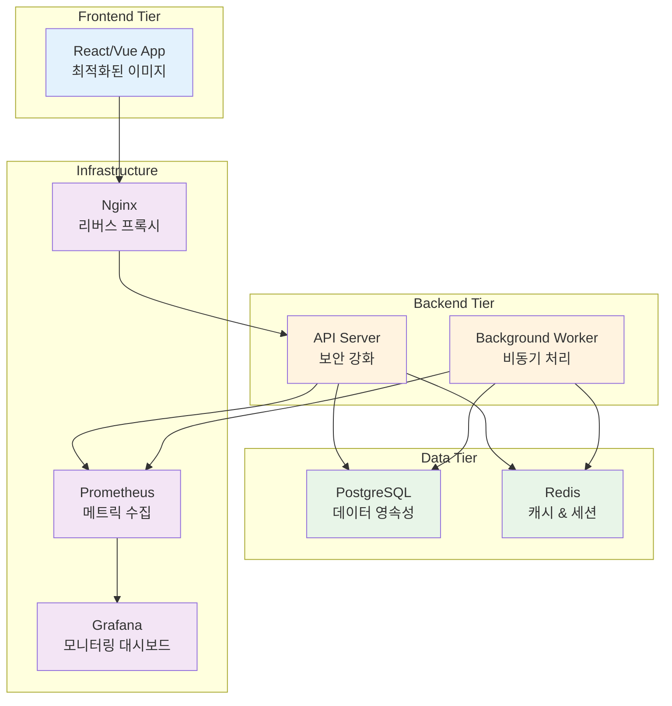

# Week 2 Day 4 Session 4: Week 1-2 통합 마스터 프로젝트

<div align="center">
**🛠️ 통합 프로젝트** • **🏗️ 실무급 시스템** • **🎓 Docker 마스터리**
*Week 1-2 모든 기술을 활용한 완전한 실무급 애플리케이션 구축*
</div>

---

## 🕘 세션 정보
**시간**: 13:00-17:30 (4.5시간)
**목표**: Week 1-2 모든 기술을 활용한 완전한 실무급 애플리케이션 구축
**방식**: 팀 기반 통합 프로젝트

## 🎯 프로젝트 목표
### 📚 최종 통합 목표
- Week 1-2 모든 기술을 활용한 완전한 실무급 애플리케이션
- 보안, 최적화, 모니터링이 통합된 엔터프라이즈급 시스템
- 오케스트레이션 준비가 완료된 컨테이너 애플리케이션

---

## 📋 프로젝트 요구사항

### 🏗️ 아키텍처 요구사항


### 📝 기능 요구사항
1. **사용자 인증**: JWT 기반 로그인/회원가입
2. **CRUD 기능**: 게시판 또는 상품 관리
3. **실시간 기능**: WebSocket 또는 Server-Sent Events
4. **파일 업로드**: 이미지 업로드 및 처리
5. **검색 기능**: 전문 검색 또는 필터링
6. **API 문서**: Swagger/OpenAPI 자동 생성

### 🔒 보안 요구사항
1. **이미지 보안**: 모든 이미지 취약점 스캔 통과
2. **런타임 보안**: 비root 사용자, 읽기 전용 파일시스템
3. **네트워크 보안**: HTTPS, 내부 통신 암호화
4. **시크릿 관리**: 환경 변수 대신 Docker Secrets 사용

### ⚡ 성능 요구사항
1. **이미지 최적화**: 각 이미지 100MB 이하
2. **빌드 최적화**: 멀티스테이지 빌드 적용
3. **캐싱**: Redis 캐싱으로 응답 시간 단축
4. **리소스 제한**: 모든 컨테이너 리소스 제한 설정

### 📊 모니터링 요구사항
1. **메트릭 수집**: Prometheus로 애플리케이션 메트릭
2. **로그 관리**: 구조화된 로그 출력
3. **헬스 체크**: 모든 서비스 헬스 체크 엔드포인트
4. **대시보드**: Grafana 대시보드 구성

---

## 🚀 Phase 1: 팀 구성 및 아키텍처 설계 (30분)

### 👥 팀 구성 (4팀, 3명씩)
**팀별 프로젝트 주제**:
- **Team 1**: E-commerce 플랫폼 (상품 관리 + 주문 처리)
- **Team 2**: 블로그 플랫폼 (게시글 + 댓글 + 검색)
- **Team 3**: 채팅 애플리케이션 (실시간 메시징 + 파일 공유)
- **Team 4**: 프로젝트 관리 도구 (태스크 관리 + 협업)

### 📋 아키텍처 설계
**각 팀별 설계 문서 작성**:
```markdown
## 팀명: [팀 이름]
### 프로젝트: [프로젝트 명]

### 아키텍처 설계
- Frontend: [기술 스택]
- Backend: [기술 스택]
- Database: [선택한 DB]
- Cache: Redis
- Monitoring: Prometheus + Grafana

### 컨테이너 구성
1. frontend: [이미지 크기 목표]
2. backend: [이미지 크기 목표]
3. database: [데이터 영속성 전략]
4. cache: [캐시 전략]
5. monitoring: [메트릭 수집 계획]

### 보안 계획
- 이미지 스캔 도구: [선택한 도구]
- 런타임 보안: [보안 설정]
- 네트워크 보안: [통신 암호화]

### 성능 목표
- 응답 시간: < 200ms
- 이미지 크기: < 100MB
- 메모리 사용량: < 512MB per container
```

---

## 🌟 Phase 2: 통합 개발 및 구현 (180분)

### 🔧 개발 단계별 진행
**Step 1: 기본 애플리케이션 개발 (60분)**
```dockerfile
# 최적화된 Frontend Dockerfile
FROM node:18-alpine AS builder
WORKDIR /app
COPY package*.json ./
RUN npm ci --only=production
COPY . .
RUN npm run build

FROM nginx:alpine
COPY --from=builder /app/dist /usr/share/nginx/html
COPY nginx.conf /etc/nginx/nginx.conf
RUN adduser -D -s /bin/sh nginx
USER nginx
EXPOSE 80
CMD ["nginx", "-g", "daemon off;"]
```

```dockerfile
# 보안 강화된 Backend Dockerfile
FROM python:3.9-alpine AS builder
WORKDIR /app
COPY requirements.txt .
RUN pip install --no-cache-dir -r requirements.txt

FROM python:3.9-alpine
WORKDIR /app
COPY --from=builder /usr/local/lib/python3.9/site-packages /usr/local/lib/python3.9/site-packages
COPY . .
RUN adduser -D -s /bin/sh appuser
USER appuser
EXPOSE 8000
CMD ["python", "app.py"]
```

**Step 2: 보안 스캔 및 최적화 (60분)**
```bash
# 보안 스캔
trivy image frontend:latest
trivy image backend:latest

# 이미지 크기 최적화 확인
docker images --format "table {{.Repository}}\\t{{.Tag}}\\t{{.Size}}"

# 성능 테스트
ab -n 1000 -c 10 http://localhost:8080/api/health
```

**Step 3: 모니터링 통합 (60분)**
```yaml
# docker-compose.monitoring.yml
version: '3.8'
services:
  prometheus:
    image: prom/prometheus:latest
    ports:
      - "9090:9090"
    volumes:
      - ./prometheus.yml:/etc/prometheus/prometheus.yml
    command:
      - '--config.file=/etc/prometheus/prometheus.yml'
      - '--storage.tsdb.path=/prometheus'

  grafana:
    image: grafana/grafana:latest
    ports:
      - "3001:3000"
    environment:
      - GF_SECURITY_ADMIN_PASSWORD=admin
    volumes:
      - grafana-data:/var/lib/grafana
      - ./grafana/dashboards:/etc/grafana/provisioning/dashboards
      - ./grafana/datasources:/etc/grafana/provisioning/datasources

volumes:
  grafana-data:
```

---

## 🏆 Phase 3: 오케스트레이션 준비 및 배포 테스트 (60분)

### 🔧 Docker Swarm 기초 체험
**기본 Swarm 클러스터 구성**:
```bash
# Swarm 모드 초기화
docker swarm init

# 서비스 배포
docker service create \
  --name web-service \
  --replicas 3 \
  --publish 8080:80 \
  myapp/frontend:latest

# 서비스 상태 확인
docker service ls
docker service ps web-service

# 스케일링 테스트
docker service scale web-service=5
```

### 📊 오케스트레이션 효과 체험
```bash
# 컨테이너 강제 종료로 자동 복구 테스트
docker kill $(docker ps -q --filter "label=com.docker.swarm.service.name=web-service" | head -1)

# 자동 복구 확인
watch -n 2 'docker service ps web-service'

# 로드 밸런싱 테스트
for i in {1..10}; do curl http://localhost:8080; done
```

### ✅ 최종 체크리스트
- [ ] 모든 컨테이너 정상 실행
- [ ] 보안 스캔 통과 (Critical: 0개)
- [ ] 이미지 크기 목표 달성
- [ ] 모니터링 대시보드 구성
- [ ] Docker Swarm 기초 체험 완료

---

## 🎤 최종 발표 및 데모 (50분)

### 📊 팀별 발표 (12분×4팀)
**발표 내용**:
1. **프로젝트 개요**: 구현한 애플리케이션 소개
2. **Docker 통합**: Week 1-2 모든 Docker 기술 통합 활용
3. **아키텍처**: 전체 시스템 구조와 기술 선택
4. **보안 & 최적화**: 적용한 보안 조치와 성능 최적화
5. **모니터링**: 구축한 모니터링 시스템
6. **오케스트레이션 준비**: Docker Swarm 체험과 Week 3 준비 상태
7. **팀 협업**: 협업 과정과 배운 점
8. **Week 3 준비**: 오케스트레이션 학습을 위한 준비 상태

### 🏅 상호 평가 및 피드백
**평가 기준**:
- **기술적 완성도**: 요구사항 구현 정도
- **Docker 마스터리**: Week 1-2 기술 통합 활용도
- **보안 & 성능**: 보안 조치와 최적화 수준
- **모니터링**: 관측성 구현 정도
- **오케스트레이션 준비**: Week 3 학습 준비도
- **팀 협업**: 협업 과정과 결과

---

## 📝 프로젝트 마무리

### ✅ 프로젝트 성과
- [ ] Week 1-2 모든 기술 스택 완전 통합 활용
- [ ] 실무급 애플리케이션 구축 완료
- [ ] 보안-성능-모니터링 통합 시스템 구현
- [ ] Docker Swarm을 통한 오케스트레이션 기초 체험
- [ ] 팀 협업을 통한 실무 경험 축적
- [ ] Week 3 Kubernetes 학습 준비 완료

### 🎯 Week 3 준비사항
- **기술적 준비**: Docker 전문가 수준 달성
- **개념적 준비**: 오케스트레이션 필요성 완전 이해
- **협업 준비**: 팀 기반 학습 및 프로젝트 경험
- **도구 준비**: Kubernetes 학습 환경 구축

---

**다음**: [Week 3 - Kubernetes 운영과 관리](../../week_03/README.md)