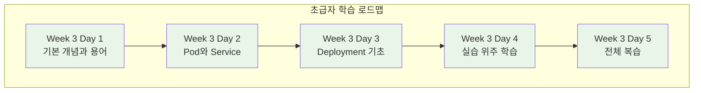
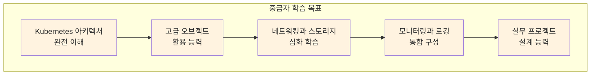
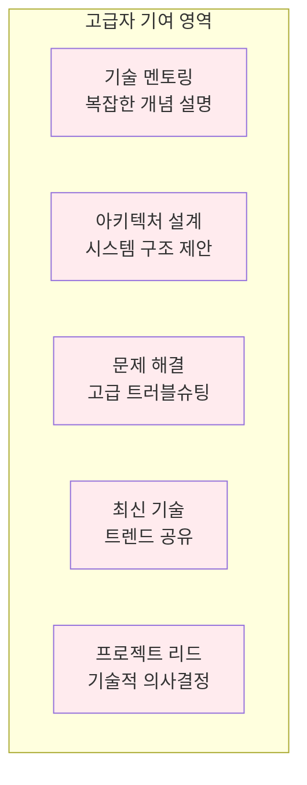

# Week 2 Day 4 Session 5: Kubernetes 학습 준비 멘토링

<div align="center">
**🎯 개별 멘토링** • **☸️ Kubernetes 준비**
*Week 3 성공적 학습을 위한 개인별 맞춤 지원*
</div>

---

## 🕘 세션 정보
**시간**: 16:15-18:00 (105분)
**목표**: Week 3 Kubernetes 학습 성공을 위한 개별 준비
**방식**: 레벨별 그룹 멘토링 + 개별 상담

## 🎯 세션 목표
### 📚 핵심 목표
- **준비 상태 점검**: Kubernetes 학습을 위한 개인별 준비도 확인
- **불안감 해소**: 복잡한 Kubernetes에 대한 걱정과 두려움 해결
- **학습 전략**: 개인 수준에 맞는 Kubernetes 학습 로드맵 수립
- **동기 부여**: Week 3 학습에 대한 자신감과 기대감 증진

### 🤝 협업 목표
- **팀 역할**: Week 3에서의 개인별 역할과 기여 방안 논의
- **상호 지원**: 어려운 부분에서 서로 도울 수 있는 방법 계획
- **멘토링 체계**: 고급자-중급자-초급자 간 멘토링 관계 구축

---

## 👥 레벨별 그룹 멘토링 (75분)

### 🟢 초급자 그룹 멘토링 (25분)
**참여자**: Docker 기초 학습 중인 학생들
**목표**: Kubernetes 학습에 대한 자신감 확보

#### 🎯 주요 논의 사항
**1. 불안감 해소 (10분)**
```
공통 걱정사항:
😰 "Kubernetes가 너무 복잡해 보여요"
😰 "명령어가 너무 많아서 외울 수 있을까요?"
😰 "다른 사람들을 따라갈 수 있을까요?"
😰 "실무에서 정말 사용할 수 있을까요?"

해결 방안:
✅ 단계별 학습: 한 번에 모든 것을 배우지 않아도 됨
✅ 실습 중심: 이론보다는 직접 해보며 자연스럽게 습득
✅ 팀 지원: 혼자가 아닌 팀과 함께 학습
✅ 실무 연계: 실제 사용하는 기능부터 우선 학습
```

**2. 학습 전략 수립 (10분)**


**3. 지원 방안 논의 (5분)**
- **추가 자료**: 기본 개념 정리 노트, 명령어 치트시트
- **실습 지원**: 단계별 상세 가이드, 오류 해결 방법
- **멘토 배정**: 중급자/고급자와의 페어링
- **질문 환경**: 언제든 편하게 질문할 수 있는 분위기

### 🟡 중급자 그룹 멘토링 (25분)
**참여자**: Docker 경험이 있는 학생들
**목표**: 리더십 역할 준비와 심화 학습 계획

#### 🎯 주요 논의 사항
**1. 리더십 역할 준비 (10분)**
```
기대 역할:
👨🏫 초급자 멘토링: 기본 개념 설명과 실습 지원
🏗️ 프로젝트 리더: 팀 프로젝트에서 기술적 리더십
🔍 문제 해결: 복잡한 문제 상황에서 해결책 모색
📢 지식 공유: 학습한 내용을 팀에 공유

준비 방법:
✅ 설명 기법: 복잡한 개념을 쉽게 설명하는 방법 연습
✅ 실습 지원: 초급자가 막힐 때 도움 주는 방법
✅ 프로젝트 관리: 팀 프로젝트 진행 방법 학습
✅ 커뮤니케이션: 효과적인 팀 소통 방법
```

**2. 심화 학습 계획 (10분)**


**3. 멘토링 방법 논의 (5분)**
- **페어 프로그래밍**: 초급자와 함께 실습하며 자연스럽게 지도
- **설명 연습**: 복잡한 개념을 단순하게 설명하는 기법
- **문제 해결**: 초급자가 막힐 때 힌트 제공 방법
- **격려 방법**: 어려워하는 동료에게 동기부여 하는 방법

### 🔴 고급자 그룹 멘토링 (25분)
**참여자**: 컨테이너 경험이 풍부한 학생들
**목표**: 전문성 강화와 팀 전체 성장 기여

#### 🎯 주요 논의 사항
**1. 전문성 강화 계획 (15분)**
```
고급 학습 목표:
🏗️ 클러스터 아키텍처: 프로덕션 수준의 클러스터 설계
🔒 보안과 거버넌스: 엔터프라이즈 보안 정책 구현
📊 성능 최적화: 리소스 효율성과 성능 튜닝
🔧 운영 자동화: CI/CD와 GitOps 통합
🌐 멀티 클라우드: 다양한 클라우드 환경 대응

학습 방법:
✅ 공식 문서: Kubernetes 공식 문서 심화 학습
✅ 오픈소스: CNCF 프로젝트 분석과 기여
✅ 실무 사례: 대기업 Kubernetes 도입 사례 연구
✅ 커뮤니티: 기술 컨퍼런스와 밋업 참여
```

**2. 팀 기여 방안 (10분)**


---

## 🎯 개별 상담 (30분)

### 📋 개별 상담 진행 방식
**시간 배분**: 학생 1명당 2-3분 집중 상담
**상담 내용**: 개인별 맞춤 조언과 격려

#### 🟢 초급자 개별 상담 포인트
```
상담 주제:
1. 현재 학습 상태와 이해도 점검
2. Week 3 학습에 대한 구체적 걱정사항
3. 개인 학습 스타일에 맞는 접근 방법
4. 팀에서 기여할 수 있는 부분 발견

격려 메시지:
💪 "Docker를 이해했다면 Kubernetes도 충분히 가능해요"
🎯 "완벽하지 않아도 괜찮아요, 함께 배워가면 됩니다"
🤝 "팀원들이 모두 도와줄 거예요, 혼자가 아니에요"
🚀 "실무에서는 기본 기능만 알아도 충분히 활용 가능해요"
```

#### 🟡 중급자 개별 상담 포인트
```
상담 주제:
1. 리더십 역할에 대한 부담감과 기대감
2. 심화 학습 목표와 개인 관심 분야
3. 초급자 멘토링에 대한 준비와 방법
4. Week 3에서 도전하고 싶은 고급 기능

성장 방향:
📈 "기술적 깊이와 리더십을 동시에 개발하는 기회"
🎓 "가르치면서 더 깊이 이해하게 될 거예요"
🌟 "팀의 기술적 리더로 성장할 수 있는 시간"
🔥 "실무에서 바로 활용할 수 있는 고급 스킬 습득"
```

#### 🔴 고급자 개별 상담 포인트
```
상담 주제:
1. 전문성 강화를 위한 구체적 학습 계획
2. 팀 전체 성장에 기여할 수 있는 방안
3. 개인 커리어 발전과 연계한 학습 목표
4. 오픈소스 기여나 커뮤니티 활동 계획

전문가 도전:
🏆 "업계 전문가 수준의 깊이 있는 학습 기회"
🌍 "오픈소스 커뮤니티에 기여할 수 있는 실력 개발"
🎯 "실무에서 아키텍처를 설계할 수 있는 역량"
💡 "새로운 기술 트렌드를 선도할 수 있는 인사이트"
```

---

## 📚 Week 3 학습 자료 안내

### 📖 레벨별 추천 자료
#### 🟢 초급자용 자료
```
필수 자료:
📚 Kubernetes 기본 개념 정리 노트
📋 kubectl 명령어 치트시트
🎥 Kubernetes 기초 동영상 강의
📝 실습 단계별 가이드

추가 자료:
🌐 Kubernetes 공식 튜토리얼
📖 "Kubernetes Up & Running" (기초 부분)
🎯 온라인 실습 환경 (Katacoda, Play with K8s)
```

#### 🟡 중급자용 자료
```
핵심 자료:
📚 Kubernetes 아키텍처 심화 가이드
🔧 고급 오브젝트 활용 방법
📊 모니터링과 로깅 통합 가이드
🏗️ 실무 프로젝트 설계 패턴

심화 자료:
📖 "Kubernetes in Action"
🎯 CNCF 프로젝트 분석 자료
🌐 Kubernetes 공식 문서 (고급 섹션)
```

#### 🔴 고급자용 자료
```
전문 자료:
🏗️ 프로덕션 클러스터 설계 가이드
🔒 Kubernetes 보안 베스트 프랙티스
📈 성능 최적화 및 튜닝 가이드
🔄 GitOps와 CI/CD 통합 방법

최신 자료:
📰 CNCF 최신 프로젝트 동향
🎤 KubeCon 컨퍼런스 발표 자료
📚 Kubernetes 소스코드 분석
🌟 오픈소스 기여 가이드
```

---

## 🎯 Week 3 성공 전략

### 📋 일일 학습 체크리스트
```
매일 확인할 사항:
□ 오늘 배운 핵심 개념 3가지 정리
□ 실습에서 어려웠던 부분과 해결 방법 기록
□ 팀원들과 학습 내용 공유
□ 다음 날 학습 준비사항 확인
□ 개인 학습 목표 달성도 점검
```

### 🤝 팀 협업 전략
```
팀 활동 방법:
🔄 매일 15분 스탠드업: 학습 진도와 어려운 점 공유
💬 실시간 질의응답: Slack/Discord 채널 활용
👥 페어 프로그래밍: 어려운 실습은 함께 해결
📚 지식 공유: 각자 학습한 내용을 팀에 공유
🎯 주간 회고: 일주일 학습 성과와 개선점 논의
```

### 🏆 성공 지표
```
Week 3 목표 달성 기준:
✅ 기본 Kubernetes 개념 80% 이상 이해
✅ kubectl 기본 명령어 자유자재로 사용
✅ 간단한 애플리케이션 배포 및 관리 가능
✅ 팀 프로젝트에서 역할 성공적 수행
✅ Week 4 심화 학습 준비 완료
```

---

## 📝 세션 마무리

### ✅ 오늘 멘토링 성과
- [x] 개인별 Kubernetes 학습 준비 상태 점검 완료
- [x] Week 3 학습에 대한 불안감 해소 및 동기 부여
- [x] 레벨별 맞춤 학습 전략과 자료 제공
- [x] 팀 내 역할 분담과 상호 지원 방안 수립

### 🎯 Week 3 Day 1 준비
**내일 준비사항**:
- Kubernetes 기본 환경 최종 점검
- 개인 학습 목표 재확인
- 팀 협업 도구 설정 (Slack, 공유 문서 등)
- 긍정적 마인드셋으로 새로운 도전 준비

**기대 효과**:
- Week 3 첫날부터 자신감 있게 학습 참여
- 팀원들과의 효과적 협업으로 시너지 창출
- 개인 수준에 맞는 최적화된 학습 경험
- Kubernetes 전문가로의 성장 기반 마련

---

<div align="center">

**🎯 개별 맞춤 지원** • **☸️ Kubernetes 정복 준비** • **🚀 Week 3 성공 출발**

*모든 학생이 자신만의 속도로 Kubernetes 전문가가 되는 여정*

</div>